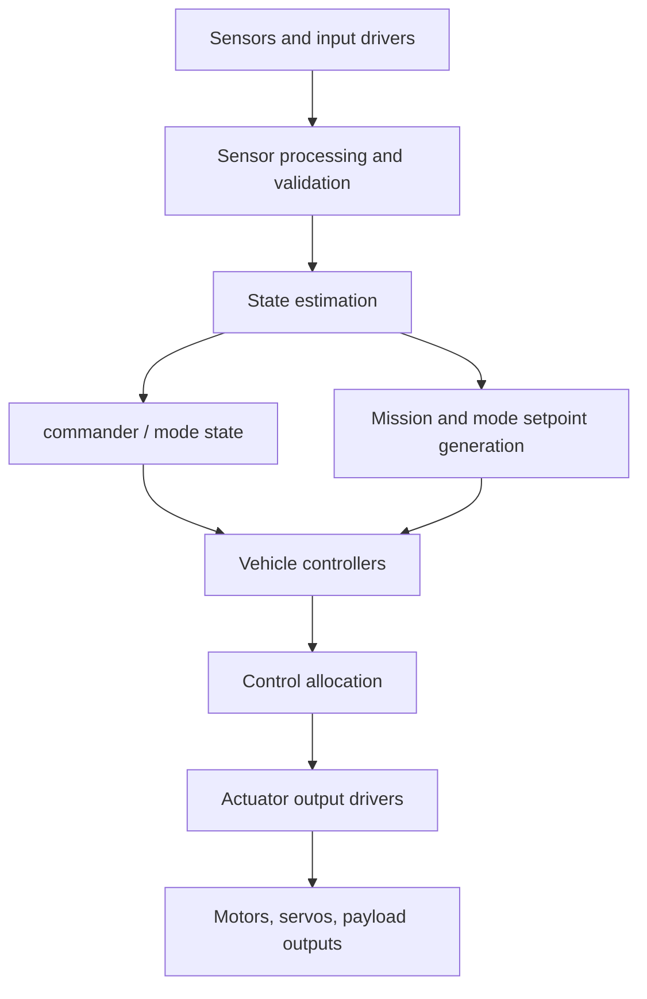
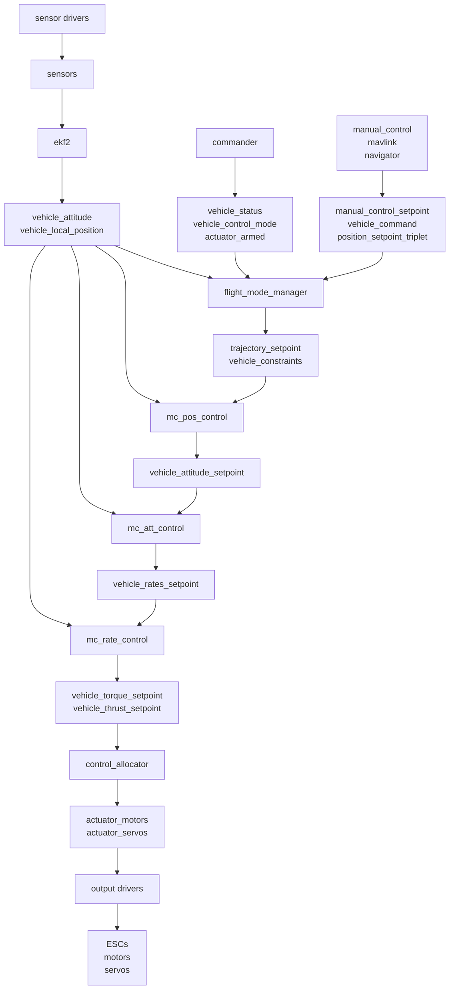
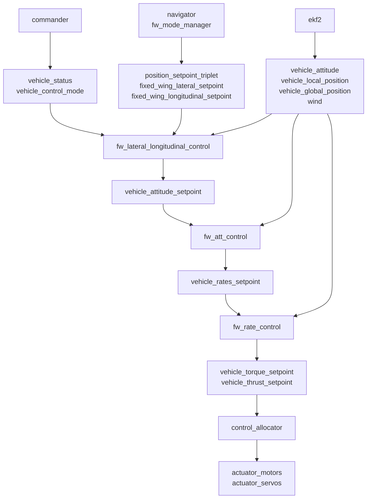

# PX4 Flight Controller Software Architecture

This document describes the PX4 flight controller software architecture as it is organized in this repository, with NuttX treated as one platform component. It focuses on the PX4 modules in [`src/modules`](https://github.com/PX4/PX4-Autopilot/tree/main/src/modules), the data they exchange, and the runtime shape of the flight-control pipeline.

For the broader system view, see [PX4 System Architecture](../concept/px4_systems_architecture.md). For the existing high-level flight-stack overview, see [PX4 Flight Stack Architecture](../concept/architecture.md).

## Scope

This page treats NuttX as the board platform layer. It does not describe NuttX internals, device-driver implementation details, scheduler internals, or board bring-up beyond the interface that PX4 uses.

The architecture discussed here is the flight-controller firmware running on an embedded board:

- NuttX provides the platform services: task/thread scheduling, work queues, timers, device files, storage, and board I/O.
- PX4 provides the application framework, uORB publish/subscribe middleware, parameters, logging, startup scripts, drivers, estimators, mode managers, controllers, and communications bridges.
- Modules in `src/modules` are independently startable PX4 components. They share one address space on NuttX and communicate primarily through uORB topics.

## Component View

At a high level, PX4 is a reactive data-flow system:

Side-channel modules such as `mavlink`, `uxrce_dds_client`, `logger`, `dataman`, `events`, and `load_mon` observe or command this path without owning the inner control loops.

## NuttX Platform Boundary

NuttX is the runtime platform for most embedded PX4 flight controllers. PX4 depends on it for:

- Starting PX4 commands as tasks.
- Running work queues for cooperative scheduled modules.
- Providing device and storage interfaces used by board drivers and logging.
- Providing a shell environment for the PX4 startup scripts and runtime commands.

PX4 modules are built into firmware according to board configuration files such as [`boards/px4/fmu-v6x/default.px4board`](https://github.com/PX4/PX4-Autopilot/blob/main/boards/px4/fmu-v6x/default.px4board). These files select modules and drivers with `CONFIG_MODULES_*`, `CONFIG_DRIVERS_*`, and `CONFIG_SYSTEMCMDS_*` options.

Startup is controlled by shell scripts under [`ROMFS/px4fmu_common/init.d`](https://github.com/PX4/PX4-Autopilot/tree/main/ROMFS/px4fmu_common/init.d). The main NuttX startup script is [`rcS`](https://github.com/PX4/PX4-Autopilot/blob/main/ROMFS/px4fmu_common/init.d/rcS). It loads parameters, applies board and airframe configuration, starts the core services, starts drivers, and starts selected modules.

## Runtime Model

Each module is a PX4 command with a common shape:

- It is declared by a local `CMakeLists.txt` using `px4_add_module()`.
- It usually supports `start`, `stop`, and `status`.
- It may run as a dedicated task or as a work item on a shared work queue.
- It usually derives from common PX4 helpers such as `ModuleBase`, `ModuleParams`, `ScheduledWorkItem`, or `WorkItem`.
- It reads parameters through the PX4 parameter system and receives `parameter_update` when values change.
- It exchanges runtime data with other modules through uORB topics.

Dedicated tasks are useful for blocking I/O or long-running loops. Work-queue modules are useful for high-rate, low-latency processing that can run cooperatively without blocking.

## uORB Data Bus

uORB is PX4's internal publish/subscribe data bus. Message definitions live in [`msg`](https://github.com/PX4/PX4-Autopilot/tree/main/msg) and [`msg/versioned`](https://github.com/PX4/PX4-Autopilot/tree/main/msg/versioned), and the build generates C/C++ topic headers from them.

Most topics are "latest-value" streams. A subscriber typically only needs the newest value, for example the current attitude or the current vehicle status. Some command-like topics use an explicit queue length so short bursts are not dropped.

Common uORB patterns:

- `uORB::Publication<T>` publishes one topic instance.
- `uORB::PublicationMulti<T>` publishes one of several instances of the same topic type, often used for multiple sensors or estimators.
- `uORB::Subscription` reads a topic.
- `uORB::SubscriptionCallbackWorkItem` wakes a work item when a topic updates.
- Multi-topic message definitions use the same struct for several topic names, for example `vehicle_control_mode` and `config_control_setpoints`.

Every normal message includes a `timestamp` in microseconds since system start. Sensor-derived and estimator-derived topics often also include `timestamp_sample`, which records when the original physical sample was taken.

## Core Data Flow

The main flight-control data flow is:

1. Drivers publish raw or normalized sensor topics such as `sensor_accel`, `sensor_gyro`, `sensor_mag`, `sensor_baro`, `sensor_gps`, `distance_sensor`, `input_rc`, and battery or power topics.
2. `sensors` validates and combines selected sensor data into topics such as `sensor_combined`, `sensor_selection`, `vehicle_imu`, `vehicle_acceleration`, `vehicle_angular_velocity`, `vehicle_magnetometer`, `vehicle_air_data`, and `vehicle_gps_position`.
3. `ekf2` consumes the validated sensor streams and publishes vehicle state, including `vehicle_attitude`, `vehicle_local_position`, `vehicle_global_position`, `vehicle_odometry`, `wind`, estimator status, estimator innovations, and sensor bias topics.
4. `commander` owns arming state, flight mode state, safety state, and failsafe state. It publishes `vehicle_status`, `vehicle_control_mode`, `actuator_armed`, and command acknowledgements.
5. `navigator`, `flight_mode_manager`, and `fw_mode_manager` generate mission and mode setpoints such as `position_setpoint_triplet`, `trajectory_setpoint`, fixed-wing lateral and longitudinal setpoints, constraints, and mode-completion signals.
6. Vehicle controllers consume state and setpoints and generate lower-level setpoints:
   - Multicopter position control publishes `vehicle_attitude_setpoint` and `vehicle_local_position_setpoint`.
   - Multicopter attitude control publishes `vehicle_rates_setpoint`.
   - Multicopter rate control publishes `vehicle_torque_setpoint` and `vehicle_thrust_setpoint`.
   - Fixed-wing control modules publish attitude, rate, torque, and thrust setpoints appropriate for fixed-wing control.
7. `vtol_att_control` selects and blends multicopter and fixed-wing virtual control paths during VTOL transitions.
8. `control_allocator` maps vehicle torque/thrust setpoints to actuator-level topics, mainly `actuator_motors`, `actuator_servos`, and `actuator_servos_trim`.
9. Output drivers such as PWM, DShot, UAVCAN/DroneCAN, or simulator outputs consume actuator topics and drive hardware or simulated actuators.
10. `logger`, `mavlink`, `uxrce_dds_client`, and `zenoh` observe or bridge selected topics for logs, ground stations, companion computers, ROS 2, or other middleware.

## Key Data Types

The most important data contracts are uORB messages:

| Topic or message | Owner or main publisher | Role |
| - | - | - |
| `sensor_combined` | `sensors` | Combined gyro and accelerometer data in SI units. |
| `vehicle_imu` | sensor pipeline | IMU delta-angle and delta-velocity data for estimators and high-rate consumers. |
| `vehicle_angular_velocity` | sensor pipeline | Bias-corrected body angular rate used by rate controllers. |
| `vehicle_acceleration` | sensor pipeline | Bias-corrected body acceleration. |
| `vehicle_attitude` | `ekf2` | Estimated attitude quaternion from body FRD to earth NED. |
| `vehicle_local_position` | `ekf2` | Estimated local NED position, velocity, acceleration, validity flags, and reset counters. |
| `vehicle_global_position` | `ekf2` | Estimated WGS84 global position. |
| `vehicle_status` | `commander` | Arming state, navigation state, failsafe flags, vehicle type, and system identity. |
| `vehicle_control_mode` | `commander` | Which control loops are currently enabled: manual, auto, offboard, position, velocity, attitude, rates, allocation, and termination. |
| `vehicle_command` | MAVLink, commander, navigator, manual control, other modules | Command bus for arm, mode changes, mission actions, calibration, actuator tests, and other actions. |
| `vehicle_command_ack` | command handlers | Result of command processing. |
| `manual_control_setpoint` | `manual_control` | Normalized pilot stick and manual control data. |
| `offboard_control_mode` | MAVLink or companion bridges | Declares what offboard setpoint dimensions are controlled. |
| `position_setpoint_triplet` | `navigator` | Previous, current, and next mission/navigation position setpoints. |
| `trajectory_setpoint` | `flight_mode_manager` and offboard sources | Local NED position, velocity, acceleration, yaw, and yaw-rate setpoint for position control. |
| `vehicle_attitude_setpoint` | position or fixed-wing controllers | Desired attitude and thrust setpoint. |
| `vehicle_rates_setpoint` | attitude controllers | Desired body angular rates. |
| `vehicle_torque_setpoint` | rate controllers | Normalized torque demand for control allocation. |
| `vehicle_thrust_setpoint` | rate or position controllers | Normalized thrust demand for control allocation. |
| `actuator_motors` | `control_allocator` | Normalized motor commands consumed by ESC/output drivers. |
| `actuator_servos` | `control_allocator` | Normalized servo commands consumed by output drivers. |

## Module Groups in `src/modules`

### System State and Safety

`commander` is the central state-machine module. It handles arming and disarming, mode switching, health and arming checks, home position handling, calibration commands, safety switch state, and failsafe behavior. It subscribes to command, manual-control, telemetry, power, land-detector, offboard, mission, and VTOL status topics. It publishes `vehicle_status`, `vehicle_control_mode`, `actuator_armed`, `vehicle_command_ack`, and selected internal `vehicle_command` messages.

`land_detector` determines whether the vehicle is landed, maybe landed, freefalling, or in ground contact. The result is consumed by `commander`, estimators, and controllers so arming logic, takeoff logic, landing behavior, and controller integrators can react correctly.

`events` publishes user-visible events, LEDs, and status display updates. It is part of the operator-facing status path rather than the core control loop.

`load_mon`, `task_watchdog`, `time_persistor`, and `hardfault_stream` provide platform health monitoring, watchdog support, persistent time handling, and fault-log streaming.

### Sensor Processing and Vehicle State

`sensors` is the main sensor aggregation and validation module. It consumes lower-level driver topics and publishes selected, calibrated, and synchronized sensor topics for estimators and controllers. It also maintains sensor selection and sensor health data.

`ekf2` is the primary attitude and position estimator. It consumes IMU, magnetometer, barometer, GNSS, airspeed, optical-flow, distance-sensor, external-vision, and auxiliary aiding topics. It publishes estimated attitude, local/global position, odometry, wind, estimator status, innovations, biases, and aiding-source diagnostics.

`airspeed_selector` validates and selects airspeed estimates from one or more airspeed sources. It publishes `airspeed_validated` and wind-estimation diagnostics used by fixed-wing estimation and control.

`attitude_estimator_q` and `local_position_estimator` are alternative estimator modules. They are not the normal primary path on current full PX4 builds where `ekf2` is enabled.

`mag_bias_estimator`, `gyro_calibration`, `gyro_fft`, `temperature_compensation`, and `mc_hover_thrust_estimator` are supporting estimation, calibration, or compensation modules. They improve sensor interpretation or controller feed-forward but do not replace the main state estimator.

### Manual Control and RC Input

`manual_control` normalizes and selects manual input sources and publishes `manual_control_setpoint`. It can also publish action requests and vehicle commands for switch/button gestures such as mode changes, arming, landing gear, or other pilot actions.

`rc_update` updates RC-related calibration and mapping data from `input_rc`, parameters, and manual-control configuration. It feeds the manual-control path rather than directly owning flight modes.

### Mission and Mode Management

`navigator` owns autonomous navigation behaviors such as missions, loiter, return-to-launch, takeoff, landing, geofence checks, and some traffic or safety navigation decisions. It consumes vehicle position, vehicle status, home position, mission data, vehicle commands, and telemetry state. It publishes `position_setpoint_triplet`, `mission_result`, `geofence_result`, `navigator_status`, `vehicle_roi`, `mode_completed`, and command acknowledgements.

`flight_mode_manager` owns multicopter flight tasks. It selects a `FlightTask` based on the active navigation state and publishes `trajectory_setpoint`, `vehicle_constraints`, and landing-gear commands. The actual tasks live below `src/modules/flight_mode_manager/tasks`.

`fw_mode_manager` owns fixed-wing mode-specific setpoint generation. It produces fixed-wing lateral and longitudinal setpoints and controller configuration topics for the fixed-wing control chain.

### Controllers

`mc_pos_control` is the multicopter position controller. It consumes `trajectory_setpoint`, local position, vehicle constraints, hover-thrust estimates, land-detected state, and control mode. It publishes `vehicle_attitude_setpoint`, `vehicle_local_position_setpoint`, and takeoff status.

`mc_att_control` is the multicopter attitude controller. It consumes attitude setpoints, estimated attitude, manual inputs, land-detected state, control mode, vehicle status, and hover-thrust estimates. It publishes `vehicle_rates_setpoint`.

`mc_rate_control` is the multicopter body-rate controller. It consumes angular velocity, rates setpoints, control mode, battery status, allocator status, and vehicle status. It publishes `vehicle_torque_setpoint`, `vehicle_thrust_setpoint`, `actuator_controls_status`, and rate-controller status.

`fw_lateral_longitudinal_control` computes fixed-wing attitude and throttle setpoints from lateral and longitudinal guidance setpoints, local position, air data, airspeed, wind, and vehicle status. It publishes `vehicle_attitude_setpoint`, TECS status, flight-phase estimation, and fixed-wing lateral status.

`fw_att_control` is the fixed-wing attitude controller. It turns fixed-wing attitude setpoints and estimated attitude into rate setpoints and lower-level control demands.

`fw_rate_control` is the fixed-wing rate controller. It closes the fixed-wing body-rate loop and publishes torque/thrust setpoints for allocation.

`vtol_att_control` manages VTOL-specific control selection and transitions. It bridges multicopter and fixed-wing virtual setpoint topics and publishes the active VTOL vehicle status.

Specialized controller modules include `airship_att_control`, `uuv_att_control`, `uuv_pos_control`, `spacecraft`, `rover_ackermann`, `rover_differential`, and `rover_mecanum`. They follow the same uORB pattern but implement control pipelines for other vehicle types.

### Control Allocation and Actuation

`control_allocator` maps abstract torque and thrust setpoints into concrete motor and servo commands. It consumes `vehicle_torque_setpoint`, `vehicle_thrust_setpoint`, vehicle status, control mode, failure-detector status, and allocator parameters. It publishes `actuator_motors`, `actuator_servos`, `actuator_servos_trim`, and `control_allocator_status`.

Output drivers are mostly under `src/drivers`, not `src/modules`. They consume actuator topics and map them to board outputs such as PWM, DShot, DroneCAN/UAVCAN ESCs, or simulation outputs. The allocator therefore separates vehicle-control laws from hardware output mapping.

`px4iofirmware` is firmware for the PX4IO co-processor on boards that use one. It is closely related to actuation and safety I/O, but it is not a normal high-level flight-control module.

### Communications and External Interfaces

`mavlink` bridges uORB to MAVLink links for ground stations, telemetry radios, companion computers, cameras, gimbals, and other MAVLink components. It converts incoming MAVLink commands and setpoints into uORB topics such as `vehicle_command`, mission updates, offboard setpoints, and manual-control inputs. It also streams selected uORB state topics back out as MAVLink messages.

`uxrce_dds_client` exposes selected uORB topics through the uXRCE-DDS bridge for ROS 2 and DDS-based companion applications. The set of bridged topics is configured by [`src/modules/uxrce_dds_client/dds_topics.yaml`](https://github.com/PX4/PX4-Autopilot/blob/main/src/modules/uxrce_dds_client/dds_topics.yaml).

`zenoh` is another bridge module for publishing and subscribing PX4 data over Zenoh.

`muorb` supports multi-uORB routing for systems that need uORB messages across processing domains.

### Persistence, Logging, and Replay

`dataman` is a small persistent database used for missions, geofences, mission state, and related structured data. On NuttX it can use board or SD-card storage depending on board configuration.

`logger` records selected uORB topics, performance data, parameters, and metadata to ULog files. It observes the system and is not in the control loop, but it is critical for flight review and debugging.

`replay` replays logged uORB data into selected modules, especially estimator replay. It is a development and debugging module.

### Power, Payload, and Vehicle-Specific Support

`battery_status` converts ADC or smart-battery data into `battery_status` topics and battery warnings. `esc_battery` estimates battery information from ESC telemetry. `internal_combustion_engine_control` supports combustion-engine control/status data.

`gimbal`, `camera_feedback`, and `payload_deliverer` implement payload-related control paths and publish or consume camera, gimbal, gripper, and payload topics.

`landing_target_estimator` and `vision_target_estimator` process target and vision information for precision landing or target estimation.

Simulation modules under `src/modules/simulation` replace real hardware or external simulators with simulated sensor and actuator data for SITL, HIL, or simulation-in-hardware workflows. They keep the same uORB interfaces as the real system where possible.

## Data Ownership Rules

PX4 has many publishers and subscribers, but the architecture remains understandable if each topic is treated as a contract with a small number of owners:

- Drivers own raw hardware observations.
- `sensors` owns selected and validated sensor streams.
- `ekf2` owns estimated vehicle state.
- `commander` owns arming, mode, and safety state.
- `navigator` owns mission/navigation setpoint triplets and mission results.
- Mode managers own mode-specific setpoints.
- Controllers own progressively lower-level control setpoints.
- `control_allocator` owns actuator-level setpoints.
- Output drivers own physical output timing and protocol details.
- Bridges own protocol conversion, not internal state authority.

This ownership matters because most modules should not directly call into each other. A module changes system behavior by publishing a topic or by handling a topic it subscribes to.

## Data Timing

PX4 separates sample time from publication time:

- `timestamp` records when the message was published or updated in PX4 time.
- `timestamp_sample` records when the physical or logical sample used to compute the message was taken.

Controllers usually run when their triggering input updates. For example, rate control is driven from angular-rate updates, while position control is driven from local-position updates. This keeps latency low and avoids unnecessary polling.

Different loops run at different rates:

- IMU and angular-rate paths are high-rate.
- Attitude and rate control are high-rate.
- Position control and estimation run at moderate rates.
- Mission navigation, health monitoring, telemetry, and logging run at lower or configured rates.

The `uorb top` command can inspect topic update rates at runtime.

## Typical Multicopter Control Path

The multicopter path is the clearest example of the layered architecture:

Manual modes, autonomous modes, and offboard modes differ mainly in which module publishes the setpoints and which `vehicle_control_mode` flags are enabled. The lower control pipeline remains largely the same.

## Typical Fixed-Wing Control Path

The fixed-wing path shares the same state-estimation and system-state modules, but the guidance and controller chain differs:

`airspeed_selector` and air-data topics are more central in fixed-wing control than in multicopter control because airspeed affects lift, throttle, and longitudinal control.

## VTOL Control Path

VTOL vehicles include both multicopter and fixed-wing control paths. During transitions, `vtol_att_control` uses VTOL state, transition state, airspeed, attitude, and virtual setpoint topics to choose or blend the active control path. The allocator still receives abstract thrust and torque demands, then produces actuator-level outputs for the configured geometry.

## External Data Paths

MAVLink, DDS, and Zenoh bridge external systems to uORB:

- Ground stations use MAVLink for commands, mission upload/download, telemetry, parameters, log streaming, and status.
- Companion computers may use MAVLink, uXRCE-DDS/ROS 2, or Zenoh to send offboard setpoints, receive state, or command payloads.
- External systems generally do not call controllers directly. They publish commands or setpoints into uORB through a bridge, and PX4's normal mode, safety, and control logic decides whether those inputs are accepted.

This is why offboard control uses topics such as `offboard_control_mode`, `trajectory_setpoint`, `vehicle_command`, and command acknowledgements rather than bypassing `commander` and the controllers.

## Practical Debugging Map

Useful runtime commands on a NuttX target:

| Command | Purpose |
| - | - |
| `top` | Show running tasks. Work-queue items show through their work-queue task, not as separate tasks. |
| `work_queue status` | Show active scheduled work items. |
| `uorb top` | Show topic publication rates, subscriber counts, lost messages, and queue size. |
| `listener <topic> [count]` | Print current topic data. |
| `<module> status` | Print module-specific status. |
| `param show <name>` | Inspect parameter values that influence module behavior. |

When debugging a control issue, walk the data path in order:

1. Check raw and validated sensor topics.
2. Check estimator outputs and estimator status.
3. Check `vehicle_status`, `vehicle_control_mode`, and `vehicle_land_detected`.
4. Check setpoint topics from navigator or mode managers.
5. Check controller outputs.
6. Check `control_allocator_status`, `actuator_motors`, and `actuator_servos`.
7. Check output-driver status and hardware wiring/configuration.

## Source Map

Important source locations:

| Path | Contents |
| - | - |
| [`src/modules`](https://github.com/PX4/PX4-Autopilot/tree/main/src/modules) | Flight-stack, system, communication, logging, and support modules. |
| [`src/drivers`](https://github.com/PX4/PX4-Autopilot/tree/main/src/drivers) | Hardware and protocol drivers. |
| [`src/lib`](https://github.com/PX4/PX4-Autopilot/tree/main/src/lib) | Shared control, math, mixer, parameter, and utility libraries. |
| [`msg`](https://github.com/PX4/PX4-Autopilot/tree/main/msg) | uORB message definitions. |
| [`msg/versioned`](https://github.com/PX4/PX4-Autopilot/tree/main/msg/versioned) | Versioned uORB messages used by bridges and compatibility-sensitive APIs. |
| [`ROMFS/px4fmu_common/init.d`](https://github.com/PX4/PX4-Autopilot/tree/main/ROMFS/px4fmu_common/init.d) | NuttX startup and airframe scripts. |
| [`boards`](https://github.com/PX4/PX4-Autopilot/tree/main/boards) | Board build configuration, including selected NuttX modules and drivers. |
| [`platforms/nuttx`](https://github.com/PX4/PX4-Autopilot/tree/main/platforms/nuttx) | NuttX platform integration. |
