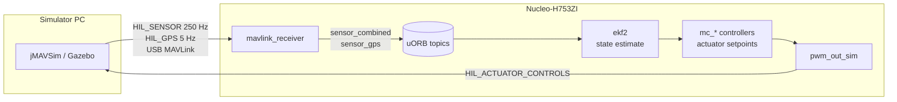
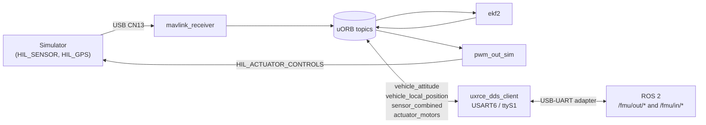

# ST Nucleo-H753ZI PX4 Board Support

Minimal PX4 board support for the [ST Nucleo-H753ZI](https://www.st.com/en/evaluation-tools/nucleo-h753zi.html) development board. The board has no real sensors, so it is configured for **Hardware-In-the-Loop Simulation (HILS)** by default.

## Hardware

| Property | Value |
|---|---|
| MCU | STM32H753ZI (Cortex-M7) |
| Clock | 400 MHz (8 MHz HSE from ST-LINK MCO → PLL M=2/N=200/P=2) |
| Flash | 2 MB (app at `0x08020000`, bootloader at `0x08000000`) |
| SRAM | 1 MB |
| Package | 144-pin LQFP |
| Console | USART3 on PD8/PD9 (ST-LINK virtual COM, 57600 baud) |
| USB | OTG-FS on PA11/PA12, VBUS sense on PA9 |

### LEDs

| Label | Pin | Color | Polarity |
|---|---|---|---|
| LD1 | PB0 | Green | Active **HIGH** (pushpull) |
| LD2 | PE1 | Blue | Active **HIGH** (pushpull) |
| LD3 | PB14 | Red | Active **HIGH** (pushpull) |

> Most PX4 boards use active-LOW open-drain LEDs. The Nucleo LEDs are active-HIGH pushpull — `led.c` writes `state` directly without inversion.

### Serial Ports

The STM32H7 NuttX driver assigns `/dev/ttySx` in numeric USART order (with `CONFIG_STM32H7_SERIAL_DISABLE_REORDERING=y`). Only the two UARTs below are enabled.

| NuttX device | USART | Pins | Connector | Baud | PX4 role |
|---|---|---|---|---|---|
| `/dev/ttyS0` | USART3 | PD8 (TX) / PD9 (RX) | **CN1 — ST-LINK virtual COM** | 57 600 | NSH console / `CONSOLE` |
| `/dev/ttyS1` | USART6 | PG14 (TX) / PG9 (RX) | **CN10 — Arduino header** | 57 600 | `TEL1` (MAVLink telemetry) |
| `/dev/ttyACM0` | USB OTG-FS | PA11 (DM) / PA12 (DP) | **CN13 — User USB** | USB bulk | MAVLink / HIL (auto-started by `cdcacm_autostart`) |

**For HILS:** connect your simulator PC to **CN13 (User USB)**. The board appears as `/dev/ttyACM0` on Linux. `cdcacm_autostart` detects the USB connection and starts `mavlink` on that device automatically. CN1 (ST-LINK) stays free as the NSH debug console.

**TEL1 (`/dev/ttyS1`)** is available on the Arduino CN10 header (pins D0/D1) for a second MAVLink link or RC input if needed.

### Shell Prompts

Two shell prompts are visible depending on how you connect — both run the same NuttX Shell (NSH) binary:

| Prompt | How to reach it | Transport |
|---|---|---|
| `nsh>` | USART3 → ST-LINK → CN1 (USB serial) | Direct serial; available from first boot, before PX4 starts |
| `psh>` | QGroundControl MAVLink Console → CN13 → `mavlink` module | NSH spawned inside the `mavlink` module via pipes; QGC labels it `psh>` (PX4 SHell) |

`nsh>` is always available — even during boot, before the PX4 application initialises. Use it for low-level debugging and boot-time diagnostics.

`psh>` only appears once the `mavlink` module is running and QGC has connected via CN13. It shares the USB link with MAVLink telemetry. Use it for in-flight PX4 commands without a separate serial adapter.

In the HILS setup both are active simultaneously: `nsh>` on CN1 and `psh>` inside QGC connected to CN13.

### Other Peripherals

| Bus | Pins | Connector |
|---|---|---|
| SPI3 | PB3/PB4/PB5 (SCK/MISO/MOSI) | Arduino shield CN7 (D3/D12/D11) |
| I2C1 | PB8/PB9 (SCL/SDA) | Arduino shield CN7 (D15/D14) |

No external sensors are wired by default.

---

## Build Targets

```bash
# Application firmware
make st_nucleo-h753zi_default

# Bootloader
make st_nucleo-h753zi_bootloader
```

---

## Flashing

### Step 1 — Flash the bootloader (once)

The firmware is linked at `0x08020000`, so the PX4 bootloader must occupy the first 128 KB sector (`0x08000000`).

```bash
# Via OpenOCD (ST-LINK on-board)
openocd -f interface/stlink.cfg -f target/stm32h7x.cfg \
  -c "program build/st_nucleo-h753zi_bootloader/st_nucleo-h753zi_bootloader.bin \
      0x08000000 verify reset exit"
```

If you keep a pre-built bootloader binary locally, flash that binary at `0x08000000`.

### Step 2 — Flash firmware via USB

After the bootloader is running, update firmware over USB:

```bash
make st_nucleo-h753zi_default upload
```

The board appears as `/dev/ttyACM0` (Linux) or `COMx` (Windows).

---

## HILS Setup (Hardware-In-the-Loop Simulation)

The board has no real sensors. `SYS_HITL=1` is set as the default parameter, which activates classical MAVLink HIL mode on every boot.

For the complete board-specific HITL parameter set, see [Nucleo-H753ZI HITL Configuration and Parameters](docs/hitl_configuration.md).
For the estimator-side architecture and signal flow, see [PX4 EKF2 Architecture and Data Flow for Nucleo-H753ZI HITL](docs/ekf2_architecture.html).

### What happens at boot with `SYS_HITL=1`

The common startup script (`rcS`) automatically:

1. Starts `sensors -h` — sensor framework in HIL mode (no hardware polling)
2. Sets `GPS_1_CONFIG=0` — disables real GPS driver
3. Starts `commander -h` — commander with relaxed HIL preflight checks
4. Starts `pwm_out_sim -m hil` — virtual actuator output; echoes actuator commands back to the simulator via MAVLink `HIL_ACTUATOR_CONTROLS`

### Modules included in `default.px4board`

| Module | Purpose |
|---|---|
| `ekf2` | State estimation (attitude + position) from HIL sensor data |
| `mc_att_control` | Multicopter attitude control |
| `mc_rate_control` | Multicopter rate control |
| `mc_pos_control` | Multicopter position control |
| `mc_hover_thrust_estimator` | Hover thrust estimation |
| `control_allocator` | Motor mixing |
| `pwm_out_sim` | Virtual actuator output for HIL |
| `mavlink` | MAVLink over USB CDC-ACM (GCS + HIL messages) |
| `commander`, `navigator`, `sensors`, … | Standard flight stack |

### MAVLink HIL message flow



### Compatible Simulators

Three simulators support classical MAVLink HIL over a serial/USB connection.

#### jMAVSim (recommended for getting started)

Lightweight Java multirotor simulator. Lowest setup overhead.

Connect a USB cable to **CN13 (User USB)** — _not_ the ST-LINK CN1 port. The board enumerates as `/dev/ttyACM0` on Linux (or `COMx` on Windows).

```bash
./Tools/simulation/jmavsim/jmavsim_run.sh \
    -q -s -d /dev/ttyACM0 -b 921600 -r 250
```

jMAVSim sends `HIL_SENSOR` at 250 Hz and `HIL_GPS` at 5 Hz, and receives `HIL_ACTUATOR_CONTROLS` to animate the simulated vehicle.

#### Gazebo Classic

Full 3D simulator with physics, wind, and sensor noise models. HITL-specific SDF models are `iris_hitl.sdf` (quadcopter) and `standard_vtol_hitl.sdf`.

In the MAVLink plugin config, set:
```xml
<hil_mode>1</hil_mode>
<serialDevice>/dev/ttyACM0</serialDevice>
<baudRate>921600</baudRate>
```

Gazebo runs at real-time factor 1.0 and sends sensor data at 250 Hz matching the PX4 HIL expectation.

#### FlightGear

Community alternative for fixed-wing and weather simulation. A bridge process connects FlightGear's UDP generic protocol to a serial MAVLink stream aimed at `/dev/ttyACM0`. Useful for testing fixed-wing aerodynamics at higher fidelity than jMAVSim.

---

### What You Can Test with HILS

#### Control loops

| Test | Modules exercised |
|---|---|
| Attitude stabilization (roll/pitch/yaw hold) | `ekf2`, `mc_att_control`, `mc_rate_control` |
| Position hold / loiter | `ekf2`, `mc_pos_control`, `navigator` |
| Velocity tracking | `mc_pos_control`, `control_allocator` |
| Hover thrust estimation | `mc_hover_thrust_estimator` |
| Landing detection | `land_detector` |

#### Mission and navigation

- Waypoint missions uploaded via QGC — `navigator` processes them, controllers track each leg
- Return-to-launch (RTL)
- Takeoff and land commands

#### Estimator validation

`ekf2` runs fully on-hardware processing the simulated `HIL_SENSOR` and `HIL_GPS` streams. You can observe the estimator's attitude, velocity, and position outputs against the simulator ground truth to verify EKF tuning parameters behave correctly on the actual MCU at 400 MHz.

#### Parameter tuning

PID gains in `mc_att_control`, `mc_rate_control`, and `mc_pos_control` run on real flight-controller hardware. Tune them against the simulated plant and the same values carry directly to real hardware with real sensors.

#### Preflight and safety logic

`commander -h` runs with relaxed preflight checks (no sensor health required), but arming logic, failsafes, and mode transitions all execute normally — useful for validating state machine behaviour.

---

### HIL Mode Comparison

| | `SYS_HITL=1` — Classical MAVLink HIL | `SYS_HITL=2` — Simulator-In-Hardware (SIH) |
|---|---|---|
| Physics engine | External simulator (Gazebo / jMAVSim) | Runs on-chip (no PC needed) |
| Sensor data source | `HIL_SENSOR` / `HIL_GPS` over USB | Internal uORB — `sensor_baro_sim`, `sensor_gps_sim`, etc. |
| 3D visualisation | Yes (Gazebo / jMAVSim window) | Headless by default; pipe state to QGC for basic view |
| Vehicle types | Quadcopter, Standard VTOL (Gazebo) | Quad, Hex, Fixed-wing, VTOL, Tailsitter, Rover |
| External PC required | Yes | No |
| USB link stability matters | Yes — sensor stream drops cause EKF divergence | No |
| Setup complexity | Higher | Lower — set parameter, reboot |
| Best for | Realistic sensor noise, wind, multi-vehicle | Quick control-loop testing without a PC |

This board defaults to `SYS_HITL=1`. To try SIH, set `SYS_HITL=2` and reboot — `rcS` will start `simulator_sih` plus the sim sensor drivers instead of waiting for MAVLink sensor messages.

### QGroundControl HIL mode

1. Open QGroundControl → **Vehicle Setup → Safety**
2. Set **HITL Enabled** (writes `SYS_HITL=1`, already the default on this board)
3. Connect CN13 (User USB) to the PC running QGC — the MAVLink Console (`psh>`) and telemetry share the same link
4. Launch your simulator (jMAVSim or Gazebo) targeting `/dev/ttyACM0`

---

## Additional Communication Interfaces

This section answers whether extra UARTs are needed for profiling, ROS2, and uORB-based HILS. The short answer: **no additional hardware is required** — the two enabled UARTs plus USB OTG-FS cover all use cases.

### 1 — OS / App Profiling & Tracing

| Method | Interface | Notes |
|---|---|---|
| `top`, `perf`, `work_queue` | Existing `nsh>` on USART3/ttyS0 | stdout — no extra port |
| SEGGER SystemView (task-switch traces) | **SWD / RTT** — ST-LINK CN1 | RTT is a memory-mapped ring buffer; the debugger reads it over the existing SWD lines, no UART consumed |
| Arm ITM / SWO stimulus trace | **PB3 (TRACESWO)** → ST-LINK CN1 | Arduino CN7 D3 pin; ST-Link v3 on the Nucleo captures SWO natively |

**SEGGER SystemView** is the most capable option. It hooks into `CONFIG_SCHED_INSTRUMENTATION_EXTERNAL` (already enabled in the defconfig) and streams task-switch events, IRQ entry/exit, and scheduler notes over RTT at negligible CPU overhead. No UART is needed — connect J-Link or use the on-board ST-Link.

To enable SystemView, add to `nuttx-config/nsh/defconfig`:
```
CONFIG_SEGGER_RTT=y
CONFIG_SCHED_INSTRUMENTATION_NOTE=y
CONFIG_NOTE_SYSVIEW=y
```

### 2 — ROS2 Connection (uXRCE-DDS)

uXRCE-DDS requires a **dedicated serial UART at 921600 baud** — it cannot share a port with MAVLink. In this board's HILS layout MAVLink HIL already occupies `ttyACM0` (USB). **USART6 → `ttyS1`** (already enabled, Arduino CN10 pins D0/D1) is the natural second port.

```
┌─────────────────────┐          USB-UART adapter
│  Nucleo-H753ZI      │  PG14(TX)──────────────────►  PC
│  USART6 / ttyS1     │  PG9 (RX)◄──────────────────  running
│  921600 baud        │                                MicroXRCE-DDS Agent
└─────────────────────┘
```

**PC side** — install and run the Micro XRCE-DDS Agent:
```bash
# Install (Ubuntu)
pip install micro-xrce-dds-agent

# Run against the USB-UART adapter
MicroXRCEAgent serial --dev /dev/ttyUSB0 -b 921600
```

**Firmware side** — add to `default.px4board`:
```
CONFIG_MODULES_UXRCE_DDS_CLIENT=y
```

Then start the client at boot by adding to `init/rc.board_extras` (create if missing):
```sh
uxrce_dds_client start -t serial -d /dev/ttyS1 -b 921600
```

**Topics available to ROS2** (defined in `src/modules/uxrce_dds_client/dds_topics.yaml`):

| Direction | Topic | Type |
|---|---|---|
| PX4 → ROS2 | `/fmu/out/vehicle_attitude` | `VehicleAttitude` |
| PX4 → ROS2 | `/fmu/out/vehicle_local_position` | `VehicleLocalPosition` |
| PX4 → ROS2 | `/fmu/out/vehicle_odometry` | `VehicleOdometry` |
| PX4 → ROS2 | `/fmu/out/sensor_combined` | `SensorCombined` |
| ROS2 → PX4 | `/fmu/in/vehicle_attitude_setpoint` | `VehicleAttitudeSetpoint` |
| ROS2 → PX4 | `/fmu/in/actuator_motors` | `ActuatorMotors` |
| ROS2 → PX4 | `/fmu/in/distance_sensor` | `DistanceSensor` |

### 3 — uORB pub/sub for HILS

No new interface is needed — the existing HILS paths already cover injection and observation.

**Sensor data injection (simulator → PX4 uORB):**
MAVLink `HIL_SENSOR` and `HIL_GPS` messages arrive on `ttyACM0` and are converted by `mavlink_receiver` into uORB publications (`sensor_combined`, `sensor_gps`, etc.). This is the only supported path for simulated sensor injection — there is no mechanism to write directly to sensor uORB topics from ROS2.

**State observation (PX4 uORB → ROS2):**
uXRCE-DDS on `ttyS1` bridges the EKF2 outputs (`vehicle_attitude`, `vehicle_local_position`, `vehicle_odometry`) and the EKF-processed sensor data (`sensor_combined`) out to ROS2 topics in real time. This lets ROS2 nodes observe the full estimator state while the HIL simulation runs.

**Combined HILS + ROS2 layout:**



### Interface Summary

| Use case | Physical interface | NuttX device | Extra hardware? |
|---|---|---|---|
| NSH console / perf / top | USART3 → ST-LINK CN1 | `ttyS0` | No |
| SEGGER SystemView traces | SWD → ST-LINK CN1 | RTT (no ttyS) | No |
| Arm ITM / SWO | PB3 → ST-LINK CN1 | SWO (no ttyS) | No |
| MAVLink HIL (simulator) | USB OTG-FS → CN13 | `ttyACM0` | No |
| ROS2 / uXRCE-DDS | USART6 → CN10 D0/D1 | `ttyS1` | USB-UART adapter on PC |
| QGC / MAVLink console | USB OTG-FS → CN13 | `ttyACM0` | Shared with HIL |

---

## Parameter Defaults (`rc.board_defaults`)

| Parameter | Value | Reason |
|---|---|---|
| `SYS_HITL` | 1 | No real sensors — HILS mode always |
| `SYS_AUTOSTART` | 1001 | Generic quadrotor HIL airframe |
| `SYS_HAS_MAG` | 1 | HIL magnetometer is expected from MAVLink for heading initialization |
| `SYS_HAS_BARO` | 1 | HIL barometer is expected from MAVLink |
| `SYS_HAS_GPS` | 1 | HIL GPS is expected from MAVLink |
| `EKF2_GPS_CTRL` | 7 | Fuse HIL GPS position and velocity |
| `EKF2_HGT_REF` | 1 | Use GPS as the EKF height reference |
| `EKF2_BARO_CTRL` | 1 | Keep HIL barometer fusion enabled |
| `EKF2_MAG_TYPE` | 6 | Use the HIL magnetometer for initial heading only |
| `EKF2_MAG_CHECK` | 0 | Skip magnetic field strength/inclination checks for simulator data |
| `SENS_IMU_MODE` | 0 | Use the EKF selector path for IMU handling |
| `EKF2_MULTI_IMU` | 3 | Match PX4 MAVLink simulator EKF defaults |
| `COM_RC_IN_MODE` | 4 | Ignore RC input for this bench HITL setup |
| `CBRK_SUPPLY_CHK` | 894281 | No battery monitoring hardware |
| `SYS_USB_AUTO` | 2 | Start MAVLink automatically on USB CDC |

---

## Key Implementation Notes

### Active-HIGH LEDs (`src/led.c`)

```c
// Active HIGH: write state directly — no !state inversion
static void phy_set_led(int led, bool state)
{
    stm32_gpiowrite(g_ledmap[led], state);
}
```

PX4 LED constants: `LED_BLUE=0`, `LED_RED=1`, `LED_GREEN=3` (index 2 unused). `g_ledmap[]` is size 4 with a zero guard at index 2.

### Clock configuration (`nuttx-config/include/board.h`)

HSE is the 8 MHz MCO output from the ST-LINK chip (not a crystal). The `STM32_BOARD_USEHSE_BYPASS` macro is **not** used; `STM32_BOARD_USEHSE` is used instead.

```
PLL1: HSE(8 MHz) / PLLM(2) * PLLN(200) / PLLP(2) = 400 MHz SYSCLK
HCLK = SYSCLK / 2 = 200 MHz
PCLK1/2/3/4 = HCLK / 2 = 100 MHz
```

### Flash parameter storage (`src/board_config.h`)

No external FRAM/EEPROM. Parameters are stored in the last 128 KB sector of internal flash Bank 2:

| Sector | Address | Size |
|---|---|---|
| 15 | `0x081E0000` | 128 KB |

For the planned migration from raw flashfs parameters to LittleFS-backed file
parameters, see [Nucleo-H753ZI LittleFS Parameter Storage Migration](littlefs_ref/littlefs_parameter_migration.html).

### Bootloader compatibility (`src/hw_config.h`)

| Setting | Value | Note |
|---|---|---|
| `BOARD_TYPE` | 1210 | Matches `firmware.prototype` `board_id` |
| `BOARD_LED_ON` | 1 | Active-HIGH (most boards use 0) |
| `BOARD_LED_OFF` | 0 | |
| `APP_LOAD_ADDRESS` | `0x08020000` | Must match firmware linker script |
| `OSC_FREQ` | 8 | 8 MHz HSE |
