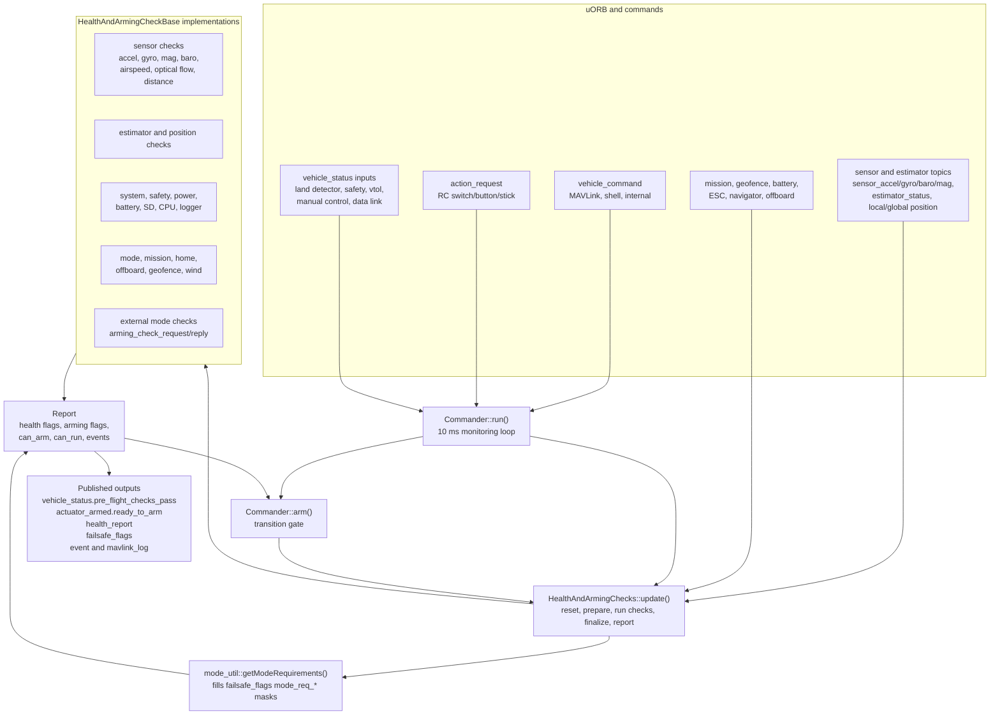
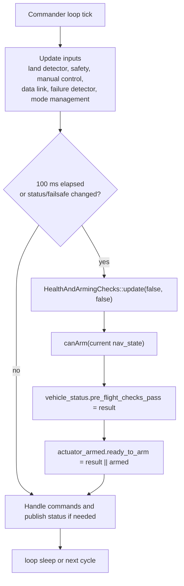
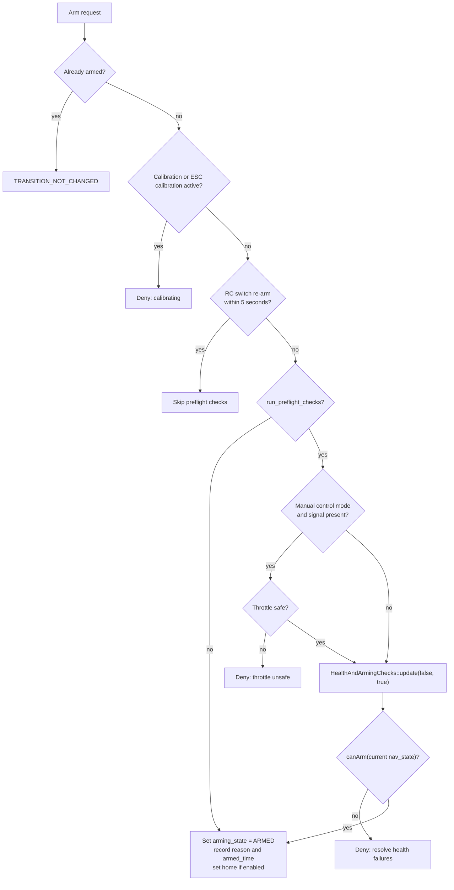
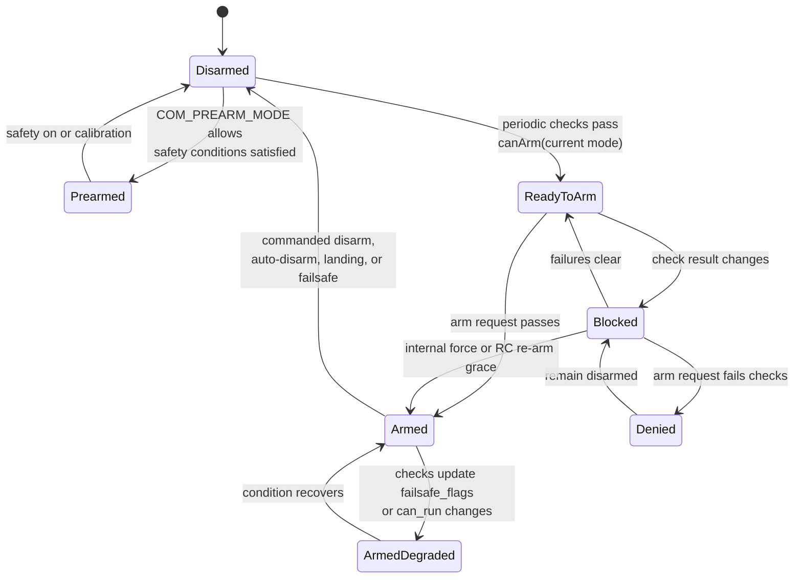

# PX4 Commander Preflight and Arming Checks

This document explains how PX4 commander decides whether the vehicle is ready
to arm, with notes specific to the ST Nucleo-H753ZI HITL target. The reviewed
implementation is under `src/modules/commander`, mainly:

| Area | Source |
|---|---|
| Arm/disarm transition | `src/modules/commander/Commander.cpp` |
| Commander object wiring | `src/modules/commander/Commander.hpp` |
| Health and arming framework | `src/modules/commander/HealthAndArmingChecks/*` |
| Mode requirement masks | `src/modules/commander/ModeUtil/mode_requirements.cpp` |
| Nucleo board defaults | `boards/st/nucleo-h753zi/default.px4board`, `boards/st/nucleo-h753zi/init/rc.board_defaults` |

## Summary

Commander uses two layers before arming:

1. `Commander::arm()` performs direct transition gates: already armed,
   calibration in progress, short RC re-arm grace, manual throttle position,
   and then a call into the health-and-arming framework.
2. `HealthAndArmingChecks::update()` runs all registered checks, accumulates
   `can_arm` and `can_run` mode bitmasks in `Report`, publishes
   `health_report` and `failsafe_flags`, and emits events/MAVLink log text when
   failures change or checks are explicitly requested.

The actual final arm decision is:

```cpp
_health_and_arming_checks.update(false, true);
if (!_health_and_arming_checks.canArm(_vehicle_status.nav_state)) {
    return TRANSITION_DENIED;
}
```

`canArm(nav_state)` is mode-specific. A failure may block all modes, only the
current mode group, or no mode at all while still reporting a warning.

## Runtime Architecture



## Periodic Preflight Check Flow

Commander continuously updates readiness while disarmed and armed. In the main
loop it runs health-and-arming checks at 10 Hz, or immediately when vehicle
status or failsafe-relevant state changes. The result updates
`vehicle_status.pre_flight_checks_pass`; later in the loop commander publishes
`actuator_armed.ready_to_arm = pre_flight_checks_pass || isArmed()`.

`commander check` sends `VEHICLE_CMD_RUN_PREARM_CHECKS`, which forces reporting
from the same framework and then prints the current
`vehicle_status.pre_flight_checks_pass` value.



## Arm Request Activity

All common arm inputs converge on `Commander::arm()`:

- `commander arm` sends `VEHICLE_CMD_COMPONENT_ARM_DISARM`.
- MAVLink `VEHICLE_CMD_COMPONENT_ARM_DISARM` is handled in
  `Commander::handle_command()`.
- RC stick/switch/button actions arrive as `action_request` and are handled by
  `Commander::executeActionRequest()`.
- `commander takeoff` first requests takeoff mode, then sends an arm command.



Throttle safety is checked only when manual control is enabled and the manual
control signal is not already lost:

| Vehicle/control condition | Safe manual throttle range |
|---|---|
| Rover | Absolute throttle below `0.2`, meaning near center/stop |
| Climb-rate modes such as Altitude/Position Control | Throttle <= `0.2`, meaning at or below center |
| Manual/Stabilized/Acro on multicopter/fixed-wing | Throttle < `-0.8`, meaning low thrust |

Forced arming is implemented by `VEHICLE_CMD_COMPONENT_ARM_DISARM` param2
`21196`, but checks are skipped only when `Commander::arm()` receives
`run_preflight_checks = false`. In this implementation that path is used for
non-external forced commands and for the short RC-switch re-arm grace period.

## Logical Arming State Machine

The firmware arming enum is basically disarmed or armed; `prearmed` and
`ready_to_arm` are separate `actuator_armed` flags. The diagram below is a
logical view of the readiness and transition behavior.



## Arm Request Sequence

```mermaid
sequenceDiagram
    participant User as Shell/GCS/RC
    participant Cmd as vehicle_command or action_request
    participant Commander as Commander
    participant HAC as HealthAndArmingChecks
    participant Checks as Check classes
    participant Report as Report
    participant Pub as uORB/events

    User->>Cmd: arm, takeoff, switch, or button
    Cmd->>Commander: handle_command() or executeActionRequest()
    Commander->>Commander: direct gates<br/>calibration, re-arm grace, throttle
    alt checks enabled
        Commander->>HAC: update(false, true)
        HAC->>Report: reset(); prepare(vehicle_type)
        Report->>Report: getModeRequirements()<br/>initialize mode_req_* masks
        HAC->>Checks: checkAndReport(context, report)
        Checks->>Report: healthFailure(), armingCheckFailure(),<br/>clearCanRunBits(), failsafeFlags()
        HAC->>Report: finalize(); report(false)
        Report->>Pub: event summaries and individual events
        HAC->>Pub: health_report and failsafe_flags
        Commander->>HAC: canArm(nav_state)
    end
    alt can arm
        Commander->>Pub: vehicle_status ARMED,<br/>actuator_armed.armed true
        Commander-->>Cmd: ACCEPTED
    else denied
        Commander->>Pub: negative tune and arm denied event
        Commander-->>Cmd: TEMPORARILY_REJECTED
    end
```

## How the Framework Produces a Decision

`HealthAndArmingChecks::update()` follows this order:

1. `Report::reset()` clears the current results and starts a new result slot.
2. `Report::prepare(vehicle_type)` fills the `failsafe_flags.mode_req_*`
   bitmasks for the current vehicle type.
3. Each check class runs `checkAndReport(context, reporter)`.
4. Checks call `reporter.healthFailure()` for health faults or
   `reporter.armingCheckFailure()` for arming-only faults.
5. These calls set health/arming component flags and clear relevant `can_arm`
   mode bits. `NavModes::None` reports a warning without blocking arming.
6. Checks can also clear `can_run` bits. That prevents mode switches while
   armed and can feed failsafe behavior.
7. `Report::finalize()` marks the result valid and detects changes versus the
   previous run.
8. `Report::report()` rate-limits user-visible events, publishes summary
   events, and then each collected event.
9. `HealthAndArmingChecks` publishes `health_report` when reporting happened
   and publishes `failsafe_flags` every 500 ms or whenever results change.

`canArm(nav_state)` returns true only if the current report is valid and the
`can_arm` bit for the current navigation state is still set.

## Mode Requirements

Mode requirements are generated before the individual checks run. They are
stored in `failsafe_flags.mode_req_*` masks and consumed mostly by
`ModeChecks`.

Important mode patterns:

| Navigation mode group | Key requirements |
|---|---|
| Manual | Manual control signal |
| Acro | Angular velocity and manual control |
| Stabilized | Angular velocity, attitude, manual control |
| Altitude Control / Altitude Cruise | Angular velocity, attitude, local altitude, manual control |
| Position Control / Position Slow | Angular velocity, attitude, local altitude, relaxed local position, manual control |
| Auto Mission / Auto Loiter | Angular velocity, attitude, local altitude, local/global position; mission mode also needs a valid mission |
| Auto RTL | Angular velocity, attitude, local altitude, local/global position, home position; also marked as preventing arming |
| Offboard | Angular velocity, attitude, and a valid offboard control signal |
| Auto Takeoff | Angular velocity, attitude, local altitude; rotary-wing also needs local position |
| Auto Land, Follow Target, Precision Land, Orbit, Descend, Termination | Marked as modes that prevent arming |

The current mode matters. A vehicle can be healthy enough to arm in one mode but
blocked in another. For example, on this Nucleo HITL setup `COM_RC_IN_MODE=4`
intentionally disables manual input, so manual-control modes cannot arm until a
different mode is selected.

## Check Catalog

The table is organized by effect. "All modes" means the check clears all
`can_arm` bits. "Mode-dependent" means it usually clears only the modes whose
requirements depend on the failed condition. "Warning/health" means it can emit
events or health flags without necessarily blocking arming.

| Check class | Main inputs | Typical blocking behavior |
|---|---|---|
| `ArmPermissionChecks` | `COM_ARMABLE` | All modes when the vehicle is configured not armable. |
| `SystemChecks` | `actuator_armed`, USB, safety, VTOL state, arm authorization | All modes for termination/kill, unsafe USB, safety button not pressed, VTOL transition/fixed-wing state, and failed arm authorization. If `COM_ARM_WO_GPS=0`, also requires global and home position before arming. |
| `ModeChecks` | `failsafe_flags.mode_req_*` and validity flags from earlier checks | Mode-dependent. It turns invalid attitude, angular velocity, local/global position, local altitude, mission, home, manual control, offboard, and external-mode flags into `can_arm` and `can_run` failures. |
| `EstimatorChecks` | EKF selector/status/flags, local/global position, attitude, angular velocity, GPS | Sets validity flags for attitude, angular velocity, local/global position, local altitude, and velocity. Also blocks for unstable preflight innovations, missing EKF data, high accel/gyro bias, heading problems, magnetometer faults, and GPS quality depending on `COM_ARM_WO_GPS`. |
| `AccelerometerChecks` / `GyroChecks` | `sensor_accel`, `sensor_gyro`, calibration params, estimator device IDs | All modes for missing/stale required sensors or invalid calibration. Calibration is accepted automatically in HIL. |
| `BaroChecks` | `sensor_baro`, `SYS_HAS_BARO`, estimator device IDs | All modes for missing/stale required barometer when barometer is expected. |
| `MagnetometerChecks` | `sensor_mag`, `sensor_preflight_mag`, `SYS_HAS_MAG`, calibration, estimator status | All modes for required compass missing/stale/uncalibrated/faulted or insufficient enabled compasses. Also checks compass inconsistency when enabled. Calibration is accepted in HIL. |
| `ImuConsistencyChecks` | `sensors_status_imu`, `COM_ARM_IMU_ACC`, `COM_ARM_IMU_GYR` | All modes before arming if accel or gyro inconsistency exceeds thresholds. |
| `AirspeedChecks` | `airspeed_validated`, `SYS_HAS_NUM_ASPD`, `FW_AIRSPD_MAX` | Fixed-wing/VTOL only. Missing/invalid airspeed is a health failure if airspeed sensors are required. Too-high pre-arm airspeed reports a warning without blocking because it uses `NavModes::None`. |
| `DistanceSensorChecks` / `OpticalFlowCheck` | distance sensor and optical flow topics, `SYS_HAS_NUM_DIST`, `SYS_HAS_NUM_OF` | All modes when configured mandatory sensors are missing or stale. |
| `BatteryChecks` | `battery_status`, `rtl_time_estimate`, `COM_ARM_BAT_MIN`, `CBRK_SUPPLY_CHK` | All modes for missing required battery, unhealthy batteries, configured low battery threshold, critical/emergency battery, and low remaining flight time. Disabled when the supply circuit breaker is active. |
| `PowerChecks` | `system_power`, `vehicle_status.power_input_valid`, `COM_POWER_COUNT`, `CBRK_SUPPLY_CHK` | All modes for missing/invalid power, bad avionics rail, redundancy failure, or overcurrent. Disabled in HITL and by the supply circuit breaker. |
| `EscChecks` | `esc_status`, `actuator_motors`, ESC/motor failure params | All modes for required ESC telemetry missing/offline/faulted and in-flight ESC/motor failures. Publishes motor failure masks into failsafe flags. |
| `ManualControlChecks` | `manual_control_switches` | All modes before arming if RTL switch, kill switch, or landing gear switch is in an unsafe position. |
| `RcAndDataLinkChecks` | `manual_control_setpoint`, `vehicle_status.gcs_connection_lost`, `NAV_DLL_ACT` | Sets manual-control and GCS-loss flags. Manual-control loss is mode-dependent through `ModeChecks`; GCS loss can block all modes if `NAV_DLL_ACT` requires it. |
| `MissionChecks` | `mission_result` | All modes for navigator-reported mission failure. Missing mission is mode-dependent through `ModeChecks`, and `COM_ARM_MIS_REQ` can make it global. |
| `HomePositionChecks` | `home_position` | Sets the home-position-invalid flag; `ModeChecks` blocks modes that require home. |
| `OffboardChecks` | `offboard_control_mode`, estimator validity flags, `COM_OF_LOSS_T` | Offboard mode only. Requires recent offboard setpoints and the estimator states required by the selected offboard control type. |
| `GeofenceChecks` | `geofence_result`, home validity | All modes for active geofence violations when an action is configured, and for geofence RTL without valid home. |
| `RallyPointChecks` | `rtl_status`, `RTL_TYPE` | All modes when `RTL_TYPE=5` requires safe points and none are available. |
| `NavigatorChecks` | `navigator_status` | All modes for specific navigator failures such as waypoint above maximum height. |
| `FailureDetectorChecks` | `failure_detector_status` | All modes for roll, pitch, altitude, external ATS failure, or imbalanced propeller failure. |
| `VtolChecks` | `vtol_vehicle_status` | All modes for VTOL fixed-wing system failure. |
| `WindChecks` / `FlightTimeChecks` | `wind`, `vehicle_status.takeoff_time`, wind/flight-time params | All modes for configured high wind action above warning or exceeded maximum flight time. These flags also clear `can_run` bits for wind/flight-time-compliance modes. |
| `OpenDroneIDChecks` / `TrafficAvoidanceChecks` / `ParachuteChecks` | `vehicle_status` subsystem-present/healthy flags and COM params | Configurable. Can be warning-only or all-mode blocking depending on `COM_ARM_ODID`, `COM_ARM_TRAFF`, and `COM_PARACHUTE`. |
| `CpuResourceChecks` / `SdCardChecks` / `LoggerChecks` / `CompanionComputerChecks` | CPU/RAM load, storage, logger, companion status | CPU/RAM and crash dump failures can block all modes. Missing SD card is reported but non-blocking. Logger is health presence only. Companion temperature is warning-only. |
| `ExternalChecks` | `arming_check_request`, `arming_check_reply`, registered external modes | External mode or all-mode blocking depending on registration. Unresponsive or unavailable external modes clear their arming/running bits. |
| `GnssRedundancyChecks` | multi-instance GPS, `SYS_HAS_NUM_GNSS`, `COM_GNSSLOSS_ACT` | Warning or all-mode blocking for required GNSS receivers missing/fix lost or receiver divergence, depending on configured GNSS count and loss action. |

## Nucleo-H753ZI HITL Implications

The Nucleo-H753ZI board enables `CONFIG_MODULES_COMMANDER=y` and is configured
for classical MAVLink HITL. It has no onboard flight sensors in the default
setup, so arming depends on simulator-fed uORB topics and EKF readiness.

Important defaults from `boards/st/nucleo-h753zi/init/rc.board_defaults`:

| Default | Effect on arming checks |
|---|---|
| `SYS_HITL=1` | Puts commander/sensor checks into HIL-aware behavior. Accel, gyro, and mag calibration checks accept HIL data as calibrated. |
| `SYS_HAS_MAG=1`, `SYS_HAS_BARO=1`, `SYS_HAS_GPS=1` | Commander expects simulated magnetometer, barometer, and GPS data. Missing or stale HIL data can still fail checks. |
| `COM_ARM_WO_GPS=1` | GPS quality failures become warnings instead of direct all-mode arming denial, but selected modes can still require valid local/global position estimates. |
| `COM_ARM_MAG_STR=0` | Disables the EKF magnetic field strength arming rejection. |
| `CBRK_SUPPLY_CHK=894281` | Disables battery supply and power-module checks, appropriate because there is no real power module. |
| `CBRK_IO_SAFETY=220127` | Disables the IO safety requirement for simulated outputs. |
| `COM_RC_IN_MODE=4` | Manual control is intentionally ignored. Modes that require manual control, such as Manual, Stabilized, Altitude, and Position, will not be armable. Use an autonomous mode such as Hold/`auto:loiter`. |
| `COM_DISARM_PRFLT=-1` | Disables automatic pre-takeoff disarm while waiting for simulator commands. |
| `CONFIG_BOARD_NO_SDCARD=y` | Avoids the missing FMU SD card warning on this board. Crash-dump checks only apply when storage exists. |

For this board, a normal HITL arming path is:

```sh
commander mode auto:loiter
commander check
commander arm
```

If `commander check` fails, inspect the mode and these topics first:

```sh
listener vehicle_status 1
listener actuator_armed 1
listener failsafe_flags 1
listener health_report 1
listener sensor_accel 1
listener sensor_gyro 1
listener sensor_mag 1
listener vehicle_air_data 1
listener vehicle_gps_position 1
listener vehicle_local_position 1
listener estimator_status_flags 1
```

## Practical Debugging Rules

- Check the selected navigation mode first. `canArm()` is evaluated against the
  current `vehicle_status.nav_state`, not a generic vehicle readiness state.
- A message can be warning-only. In code, `NavModes::None` means the event is
  shown but does not clear a `can_arm` bit.
- `health_report.can_arm_mode_flags` and `can_run_mode_flags` are the most
  direct machine-readable view of the result.
- `failsafe_flags` explains why `ModeChecks` cleared mode bits. Look at
  `*_invalid`, `*_lost`, and `mode_req_*` fields together.
- On Nucleo HITL, stale simulator data usually looks like missing accel/gyro,
  no valid barometer, no valid local/global position, no heading reference, or
  no offboard/manual signal depending on the selected mode.
