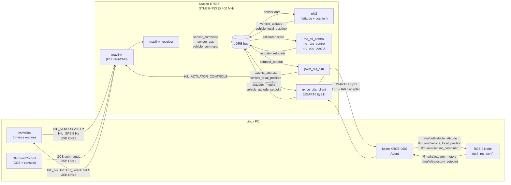
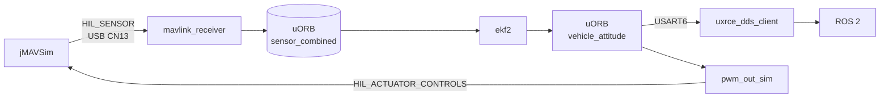

# HILS, ROS2, and uORB Communication Setup

Step-by-step guide for Hardware-In-the-Loop Simulation (HILS) with the ST Nucleo-H753ZI, including ROS2 integration via uXRCE-DDS and uORB pub/sub verification.

For the board defaults and HITL parameter table, see [Nucleo-H753ZI HITL Configuration and Parameters](hitl_configuration.md).

---

## System Architecture



---

## Physical Connections

```
┌──────────────────────────────────────────────────────────┐
│  Nucleo-H753ZI                                           │
│                                                          │
│  CN1 (ST-LINK USB)  ──── USB ──────────────────────────► Linux PC /dev/ttyACM0 (or ttyACM1)
│    USART3/ttyS0           NSH console (57600 baud)       │
│                                                          │
│  CN13 (User USB)    ──── USB ──────────────────────────► Linux PC /dev/ttyACM0 (or ttyACM1)
│    USB-OTG / ttyACM0      MAVLink + HIL sensor stream    │
│                                                          │
│  CN10 Arduino D0 (PG9  RX) ─┐                           │
│  CN10 Arduino D1 (PG14 TX) ─┤── USB-UART adapter ─────► Linux PC /dev/ttyUSB0
│  GND                       ─┘   USART6/ttyS1 921600      Micro XRCE-DDS Agent
└──────────────────────────────────────────────────────────┘
```

**Required hardware:**
- ST Nucleo-H753ZI with PX4 bootloader + application flashed
- Two USB cables (one for CN1, one for CN13)
- USB-to-UART adapter (3.3 V logic: e.g. CP2102, FT232, CH340) for ROS2/uXRCE-DDS

**CN10 Arduino header pin assignments for USART6:**

| Arduino label | Nucleo pin | USART6 signal | Connect to adapter |
|---|---|---|---|
| D0 | PG9 | RX | adapter TX |
| D1 | PG14 | TX | adapter RX |
| GND | GND | GND | adapter GND |

---

## Part 1 — Classical HIL Simulation

### 1.1 Firmware configuration

The board defaults to `SYS_HITL=1`. Verify or set it:

```bash
# On nsh> (CN1 serial console, 57600 baud)
param set SYS_HITL 1
param save
reboot
```

After reboot with `SYS_HITL=1`, the startup script automatically:
- Starts `sensors -h` (sensor framework in HIL mode, no hardware polling)
- Starts `commander -h` (relaxed preflight checks)
- Starts `pwm_out_sim -m hil` (virtual actuators)
- Starts `mavlink` on `/dev/ttyACM0` for HIL + GCS traffic

### 1.2 Verify boot state

Connect to the NSH console (CN1):

```bash
picocom -b 57600 /dev/ttyACM0   # adjust port as seen on your PC for ST-Link
```

At the `nsh>` prompt:

```
nsh> mavlink status
instance #0:
  device: /dev/ttyACM0
  baudrate: 0 (USB)
  mode: Normal
  ...
```

```
nsh> pwm_out_sim status
Running, mode: HIL
```

### 1.3 Connect jMAVSim

Connect **CN13 (User USB)** to the Linux PC. The board enumerates as a CDC-ACM port (typically `/dev/ttyACM0` or `/dev/ttyACM1` — check `dmesg | tail` after plugging in).

Build jMAVSim (requires Java 11+):

```bash
git clone https://github.com/PX4/jMAVSim.git
cd jMAVSim
ant
```

Run targeting the Nucleo's USB port:

```bash
./Tools/simulation/jmavsim/jmavsim_run.sh \
    -q -s -d /dev/ttyACM1 -b 921600 -r 250
```

jMAVSim sends `HIL_SENSOR` at 250 Hz and `HIL_GPS` at 5 Hz. In the `nsh>` console:

```
nsh> listener sensor_combined
```

You should see sensor values updating at 250 Hz from the simulator.

### 1.4 Connect QGroundControl

Open QGC and connect to the same USB port the board is on. QGC auto-detects the MAVLink heartbeat. Navigate to **Analyze Tools → MAVLink Console** to get the `psh>` prompt while the HIL simulation is running.

### 1.5 Arm and fly (jMAVSim)

From QGC or MAVLink Console:

```
psh> commander arm
psh> commander takeoff
```

Or from the jMAVSim GUI press **T** to take off.

Observe EKF output:

```
nsh> listener vehicle_local_position
nsh> listener vehicle_attitude
```

---

## Part 2 — ROS2 via uXRCE-DDS

### 2.1 Firmware: enable the uXRCE-DDS client

Add to `boards/st/nucleo-h753zi/default.px4board`:

```
CONFIG_MODULES_UXRCE_DDS_CLIENT=y
```

Rebuild and flash:

```bash
make st_nucleo-h753zi_default
make st_nucleo-h753zi_default upload
```

### 2.2 Firmware: start the client at boot

Create `boards/st/nucleo-h753zi/init/rc.board_extras` (if it does not exist):

```sh
#!/bin/sh
# Start uXRCE-DDS client on USART6/ttyS1 at 921600 baud
uxrce_dds_client start -t serial -d /dev/ttyS1 -b 921600
```

Rebuild and flash again after adding this file.

Verify the client is running after boot:

```
nsh> uxrce_dds_client status
Running
  Transport: serial
  Device: /dev/ttyS1
  Baudrate: 921600
```

### 2.3 PC side: install ROS2 and the Micro XRCE-DDS Agent

Tested on Ubuntu 22.04 with ROS2 Humble.

```bash
# Install ROS2 Humble (if not already installed)
# https://docs.ros.org/en/humble/Installation.html

# Install Micro XRCE-DDS Agent
sudo apt install ros-humble-micro-ros-agent
# or from source:
pip install micro-xrce-dds-agent
```

### 2.4 PC side: install px4_msgs and px4_ros_com

```bash
mkdir -p ~/ros2_px4_ws/src
cd ~/ros2_px4_ws/src

git clone https://github.com/PX4/px4_msgs.git
git clone https://github.com/PX4/px4_ros_com.git

cd ~/ros2_px4_ws
source /opt/ros/humble/setup.bash
colcon build
source install/setup.bash
```

### 2.5 Run the Micro XRCE-DDS Agent

Connect the USB-UART adapter (USART6/CN10) to the Linux PC. Identify the port:

```bash
dmesg | grep ttyUSB
# example: [ 1234.5] usb 1-3: cp210x converter now attached to ttyUSB0
```

Start the agent:

```bash
MicroXRCEAgent serial --dev /dev/ttyUSB0 -b 921600
```

Expected output when the board connects:

```
[1234567] Serial agent initialization... OK
[1234568] Create session: 0x01 (client_key: 0x00000001)
[1234569] Create publisher id: 1, participant id: 1
[1234570] Create subscriber id: 2, participant id: 1
...
```

---

## Part 3 — Testing uORB ↔ ROS2 Communications

All tests assume the agent is running and the board is connected.

### 3.1 List available topics

On the Linux PC:

```bash
source ~/ros2_px4_ws/install/setup.bash
ros2 topic list
```

Expected output includes:

```
/fmu/out/vehicle_attitude
/fmu/out/vehicle_local_position
/fmu/out/vehicle_odometry
/fmu/out/sensor_combined
/fmu/out/vehicle_status
/fmu/in/vehicle_attitude_setpoint
/fmu/in/actuator_motors
/fmu/in/offboard_control_mode
/fmu/in/trajectory_setpoint
```

### 3.2 Test PX4 → ROS2 (outbound uORB topics)

**Vehicle attitude** (quaternion from EKF2):

```bash
ros2 topic echo /fmu/out/vehicle_attitude
```

Expected with HIL running and vehicle armed:
```yaml
---
timestamp: 1234567890
q: [0.9998, 0.001, 0.002, 0.003]
delta_q_reset: [1.0, 0.0, 0.0, 0.0]
quat_reset_counter: 0
---
```

**Local position** (NED frame, metres):

```bash
ros2 topic echo /fmu/out/vehicle_local_position
```

**Check publish rate** (should be ~50 Hz for attitude, ~10 Hz for position):

```bash
ros2 topic hz /fmu/out/vehicle_attitude
ros2 topic hz /fmu/out/vehicle_local_position
```

**Sensor data** (raw IMU from HIL_SENSOR — confirms the HIL stream is flowing):

```bash
ros2 topic echo /fmu/out/sensor_combined
```

### 3.3 Test ROS2 → PX4 (inbound uORB topics)

**Prerequisite:** put the vehicle in Offboard mode.

From `nsh>` or QGC MAVLink Console:

```
psh> commander mode offboard
```

**Send an attitude setpoint:**

```bash
ros2 topic pub --once /fmu/in/vehicle_attitude_setpoint \
  px4_msgs/msg/VehicleAttitudeSetpoint \
  "{timestamp: 0, roll_body: 0.0, pitch_body: 0.1, yaw_body: 0.0,
    thrust_body: [0.0, 0.0, -0.5]}"
```

Verify on the board:

```
nsh> listener vehicle_attitude_setpoint
```

**Send motor commands directly:**

```bash
ros2 topic pub /fmu/in/actuator_motors \
  px4_msgs/msg/ActuatorMotors \
  "{timestamp: 0, control: [0.5, 0.5, 0.5, 0.5, 0.0, 0.0, 0.0, 0.0,
                             0.0, 0.0, 0.0, 0.0]}" --rate 50
```

Verify on the board:

```
nsh> listener actuator_motors
```

### 3.4 Verify end-to-end round-trip (HIL + ROS2 simultaneously)

With jMAVSim running on CN13 and the XRCE-DDS agent on the USB-UART adapter, all three systems run simultaneously:



Monitor all three streams at once:

**Terminal 1 — board NSH console:**
```
nsh> listener vehicle_attitude -r 10
```

**Terminal 2 — ROS2 topic:**
```bash
ros2 topic hz /fmu/out/vehicle_attitude
```

**Terminal 3 — jMAVSim window** (observe the vehicle responding to EKF-computed attitude)

If all three show consistent, updating data, the full HIL + uORB + ROS2 chain is working.

### 3.5 uORB diagnostics on the board

Check which uORB topics are active and their publish rates:

```
nsh> uorb top
```

Check a specific topic's publish count and subscriber list:

```
nsh> uorb status -t vehicle_attitude
```

Check the uXRCE-DDS client's internal counters (shows how many messages have been bridged):

```
nsh> uxrce_dds_client status
```

---

## Part 4 — Troubleshooting

### No `/fmu/out/...` topics on ROS2

1. Confirm the agent sees the board: agent log should show `Create session`.
2. Confirm client is running: `nsh> uxrce_dds_client status` shows `Running`.
3. Check the baud rate matches on both sides (921600 on board and agent).
4. Verify wiring: TX of board (PG14) → RX of adapter; RX of board (PG9) → TX of adapter.

### `HIL_SENSOR` not received by board

1. Confirm `SYS_HITL=1` and the mavlink module is running: `nsh> mavlink status`.
2. Confirm jMAVSim is connected to the correct port (`/dev/ttyACM?` for CN13, not CN1).
3. Check `nsh> listener sensor_combined` for updating values.

### EKF2 diverges / attitude invalid

1. jMAVSim must be in physical contact with the board via the same time base. Restarting jMAVSim without rebooting the board causes a timestamp discontinuity — reboot both.
2. `HIL_SENSOR` must arrive at ≥ 100 Hz. Check `ros2 topic hz /fmu/out/sensor_combined` — if it drops below 100 Hz, the USB link is bottlenecked.

### uXRCE-DDS client restarts repeatedly

USART6 is not shared with any other module, but verify no other module is using `ttyS1`:

```
nsh> mavlink status    # should show ttyACM0, not ttyS1
nsh> ps               # look for any task holding ttyS1
```

### USB port numbering

After plugging in both CN1 and CN13, the OS assigns port numbers in plug order. Run `dmesg | grep tty` after each plug to confirm which port is which. Typically:
- CN1 (ST-Link) → `/dev/ttyACM0` (virtual COM for USART3 console)
- CN13 (User USB) → `/dev/ttyACM1` (PX4 MAVLink / upload)

---

## Reference: Port Summary

| Port | Physical | Linux device | Purpose |
|---|---|---|---|
| NSH console | USART3 → CN1 (ST-Link) | `/dev/ttyACM0` (or ttyACM1) | Debug shell, 57600 baud |
| MAVLink / HIL | USB OTG-FS → CN13 | `/dev/ttyACM0` (or ttyACM1) | jMAVSim, QGC, firmware upload |
| ROS2 / DDS | USART6 → CN10 D0/D1 → USB-UART | `/dev/ttyUSB0` | Micro XRCE-DDS Agent, 921600 baud |
