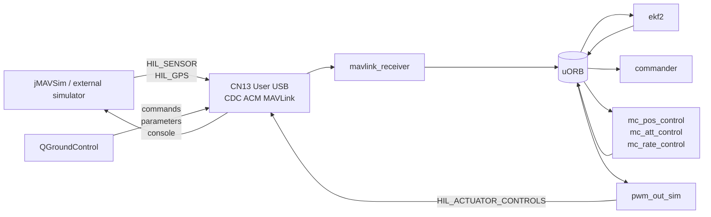

# Nucleo-H753ZI HITL Configuration and Parameters

This page records the Hardware-In-the-Loop configuration used by the ST Nucleo-H753ZI PX4 board support. The board has no real flight sensors or SD card, so the default configuration is a classical MAVLink HITL setup with parameters stored in internal flash.

## Configuration Summary



The active configuration is:

- `SYS_HITL=1` for classical MAVLink HITL.
- `SYS_AUTOSTART=1001` for the generic quadrotor airframe.
- HIL sensor input arrives through MAVLink on CN13 User USB.
- `pwm_out_sim` returns actuator commands to the simulator as `HIL_ACTUATOR_CONTROLS`.
- No SD card is required.
- PX4 parameters are saved in the last internal flash sector.
- Board defaults use `param set-default`, so saved flash parameters override these defaults until reset.

## Build-Time Board Options

The relevant build-time options are in `boards/st/nucleo-h753zi/default.px4board`.

| Option | Value | Purpose |
|---|---:|---|
| `CONFIG_BOARD_NO_SDCARD` | `y` | Board does not depend on a microSD card. |
| `CONFIG_DRIVERS_CDCACM_AUTOSTART` | `y` | Starts USB CDC ACM automatically on CN13. |
| `CONFIG_MODULES_MAVLINK` | `y` | Provides MAVLink for QGC and HITL messages. |
| `CONFIG_MODULES_SENSORS` | `y` | Runs the PX4 sensor pipeline in HIL mode. |
| `CONFIG_MODULES_EKF2` | `y` | Estimates attitude and position from HIL sensor data. |
| `CONFIG_MODULES_COMMANDER` | `y` | Handles arming, modes, health checks, and failsafes. |
| `CONFIG_MODULES_NAVIGATOR` | `y` | Provides Hold, Takeoff, Mission, RTL, and related modes. |
| `CONFIG_MODULES_FLIGHT_MODE_MANAGER` | `y` | Generates multicopter mode setpoints. |
| `CONFIG_MODULES_MC_POS_CONTROL` | `y` | Multicopter position controller. |
| `CONFIG_MODULES_MC_ATT_CONTROL` | `y` | Multicopter attitude controller. |
| `CONFIG_MODULES_MC_RATE_CONTROL` | `y` | Multicopter rate controller. |
| `CONFIG_MODULES_CONTROL_ALLOCATOR` | `y` | Maps torque/thrust to actuator topics. |
| `CONFIG_MODULES_SIMULATION_PWM_OUT_SIM` | `y` | Sends simulated actuator output back to the simulator. |
| `CONFIG_MODULES_SIMULATION_BATTERY_SIMULATOR` | `y` | Provides simulated battery status. |
| `CONFIG_SYSTEMCMDS_PARAM` | `y` | Enables parameter inspection and updates from NSH. |
| `CONFIG_SYSTEMCMDS_TOPIC_LISTENER` | `y` | Enables `listener` for uORB topic debugging. |
| `CONFIG_SYSTEMCMDS_UORB` | `y` | Enables `uorb status` and `uorb top`. |

## Flash Parameter Storage

The board has no SD card, FRAM, or EEPROM. Parameters are stored in internal flash.

| Sector | Address | Size | Use |
|---:|---:|---:|---|
| 15 | `0x081E0000` | 128 KiB | PX4 parameter storage |

The application image is constrained so it does not overlap this sector.

## Board Default Parameters

These defaults are applied by `boards/st/nucleo-h753zi/init/rc.board_defaults`.

### HITL Mode and Airframe

| Parameter | Default | Reason |
|---|---:|---|
| `SYS_AUTOSTART` | `1001` | Generic quadrotor airframe for jMAVSim/Gazebo HITL. |
| `SYS_HITL` | `1` | Classical MAVLink HITL mode. |

### Sensor Presence

| Parameter | Default | Reason |
|---|---:|---|
| `SYS_HAS_MAG` | `1` | The board has no physical magnetometer, but HIL provides a simulated magnetometer over MAVLink for heading initialization. |
| `SYS_HAS_BARO` | `1` | HIL barometer data is expected from MAVLink. |
| `SYS_HAS_GPS` | `1` | HIL GPS data is expected from MAVLink. |

### EKF2 Aiding

| Parameter | Default | Reason |
|---|---:|---|
| `EKF2_GPS_CTRL` | `7` | Fuse GPS position and velocity from HIL GPS. |
| `EKF2_HGT_REF` | `1` | Use GPS as the height reference. |
| `EKF2_BARO_CTRL` | `1` | Keep HIL barometer fusion enabled. |
| `EKF2_MAG_TYPE` | `6` | Use the HIL magnetometer only to initialize heading. |
| `EKF2_MAG_CHECK` | `0` | Skip magnetic field strength/inclination checks for simulated magnetometer data. |
| `EKF2_EV_CTRL` | `0` | Disable external-vision aiding by default. |
| `SENS_IMU_MODE` | `0` | Use the EKF selector path for IMU handling, matching PX4's MAVLink simulator defaults. |
| `EKF2_MULTI_IMU` | `3` | Match the MAVLink simulator default maximum number of EKF IMU instances. |

### GPS Acceptance Relaxation

| Parameter | Default | Reason |
|---|---:|---|
| `EKF2_REQ_EPH` | `100.0` | Avoid rejecting simulator GPS during startup transients. |
| `EKF2_REQ_EPV` | `100.0` | Avoid rejecting simulator GPS during startup transients. |
| `EKF2_REQ_HDRIFT` | `100.0` | Relax horizontal drift acceptance for simulator startup. |
| `EKF2_REQ_VDRIFT` | `100.0` | Relax vertical drift acceptance for simulator startup. |
| `EKF2_DELAY_MAX` | `300.0` | Allow larger sensor delay alignment window for HITL timing. |

### Arming and I/O

| Parameter | Default | Reason |
|---|---:|---|
| `COM_ARM_WO_GPS` | `1` | Permit arming with a warning if GPS readiness is still settling. |
| `COM_ARM_MAG_STR` | `0` | Disable magnetic field strength arming rejection. |
| `CBRK_SUPPLY_CHK` | `894281` | Disable power-supply checks; no real power module exists. |
| `CBRK_IO_SAFETY` | `220127` | Disable IO safety requirement for simulated outputs. |
| `COM_RC_IN_MODE` | `4` | Ignore manual control sources; this HITL setup is driven by QGC/autonomous modes. |
| `COM_DISARM_PRFLT` | `-1` | Disable pre-takeoff auto-disarm while waiting for simulator commands. |

### USB MAVLink

| Parameter | Default | Reason |
|---|---:|---|
| `GPS_1_CONFIG` | `0` | Do not start the physical GPS driver on CN13 USB. HIL GPS arrives through MAVLink. |
| `GPS_2_CONFIG` | `0` | Keep CN13 USB free for HITL MAVLink. |
| `RC_PORT_CONFIG` | `0` | Do not start RC input on CN13 USB. Manual control is ignored by `COM_RC_IN_MODE=4`. |
| `MAV_0_CONFIG` | `0` | Do not start generated serial MAVLink on CN13 before `cdcacm_autostart`. |
| `MAV_1_CONFIG` | `0` | Keep CN13 USB owned by `cdcacm_autostart`. |
| `MAV_2_CONFIG` | `0` | Keep CN13 USB owned by `cdcacm_autostart`. |
| `SYS_USB_AUTO` | `2` | Automatically start MAVLink on USB. |
| `USB_MAV_MODE` | `2` | Use USB MAVLink mode suitable for GCS/HITL traffic. |

## Parameters That Should Stay at PX4 Defaults

These are not forced by `rc.board_defaults`, but they matter for this no-sensor HITL workflow.

| Parameter | Expected value | Reason |
|---|---:|---|
| `NAV_DLL_ACT` | `0` | Do not deny arming because QGC is not connected yet. |
| `COM_ARM_ODID` | `0` | Do not require Open Drone ID hardware. |
| `BAT1_SOURCE` | `0` | Battery source parameter exists; battery checks are bypassed by `CBRK_SUPPLY_CHK`. |

If any of these were changed during testing, restore them:

```sh
param set NAV_DLL_ACT 0
param set COM_ARM_ODID 0
param set BAT1_SOURCE 0
param save
```

## Applying Defaults on a Board With Saved Flash Parameters

`rc.board_defaults` uses `param set-default`, not `param set`. This is intentional: user-saved parameters in flash are preserved across reboot.

If the board has old saved values and you want the board defaults to take effect again, reset only the affected parameters:

```sh
param reset SYS_AUTOSTART SYS_HITL SYS_HAS_MAG SYS_HAS_BARO SYS_HAS_GPS
param reset EKF2_GPS_CTRL EKF2_HGT_REF EKF2_BARO_CTRL EKF2_MAG_TYPE EKF2_MAG_CHECK EKF2_EV_CTRL
param reset SENS_IMU_MODE EKF2_MULTI_IMU
param reset EKF2_REQ_EPH EKF2_REQ_EPV EKF2_REQ_HDRIFT EKF2_REQ_VDRIFT EKF2_DELAY_MAX
param reset COM_ARM_WO_GPS COM_ARM_MAG_STR CBRK_SUPPLY_CHK CBRK_IO_SAFETY COM_RC_IN_MODE COM_DISARM_PRFLT
param reset GPS_1_CONFIG GPS_2_CONFIG RC_PORT_CONFIG MAV_0_CONFIG MAV_1_CONFIG MAV_2_CONFIG
param reset SYS_USB_AUTO USB_MAV_MODE
param save
reboot
```

Use `param reset_all` only if you intentionally want to wipe all saved parameters.

## jMAVSim HITL Command

Connect CN13 User USB to the simulator PC. Do not use CN1 ST-LINK for HITL traffic.

From the PX4 repository root:

```sh
./Tools/simulation/jmavsim/jmavsim_run.sh \
    -q -s -d /dev/ttyACM1 -b 921600 -r 250
```

Replace `/dev/ttyACM1` with the device assigned to CN13 on your host. The `-q` option forwards MAVLink to QGroundControl over UDP, and `-s` enables SDK forwarding.

## Arming Workflow

Because `COM_RC_IN_MODE=4` disables manual stick input, do not arm in Manual, Stabilized, Altitude, or Position mode. Those modes require manual control.

Use Hold mode in QGroundControl, or use NSH:

```sh
commander mode auto:loiter
commander check
commander arm
```

To make the simulated vehicle take off:

```sh
commander takeoff
```

## Runtime Checks

After jMAVSim is running, these checks should update with fresh timestamps:

```sh
mavlink status
pwm_out_sim status
listener sensor_accel 1
listener sensor_gyro 1
listener vehicle_gps_position 1
listener vehicle_air_data 1
listener estimator_status_flags 1
listener failsafe_flags 1
commander check
```

Expected health state before arming:

- `sensor_accel` and `sensor_gyro` have `SIMULATION` device IDs.
- `vehicle_gps_position` has `fix_type: 3` and valid velocity.
- `vehicle_air_data` is published from a simulated barometer.
- `estimator_status_flags` has attitude, yaw, GPS position, and height alignment.
- `commander check` reports `Preflight check: OK` after switching to `auto:loiter`.

## QGroundControl Notes

QGroundControl can configure the same parameters from **Vehicle Setup > Parameters**.

Use these QGC settings for normal HITL operation:

| QGC action | PX4 effect |
|---|---|
| Set `COM_DISARM_PRFLT=-1` | Prevents auto-disarm while waiting for simulator takeoff. |
| Select Hold mode before arming | Maps to PX4 `auto:loiter`, which does not require manual stick input. |
| Use the Arm button | Sends MAVLink arm command to `commander`. |
| Use Takeoff | Sends MAVLink takeoff command to `navigator`/`commander`. |

If QGC reports a missing parameter such as `BAT1_SOURCE`, verify from NSH:

```sh
param show -a BAT1_SOURCE
```

If the parameter is present on NSH, the issue is a QGC parameter-cache or parameter-download problem, not a missing firmware parameter.
