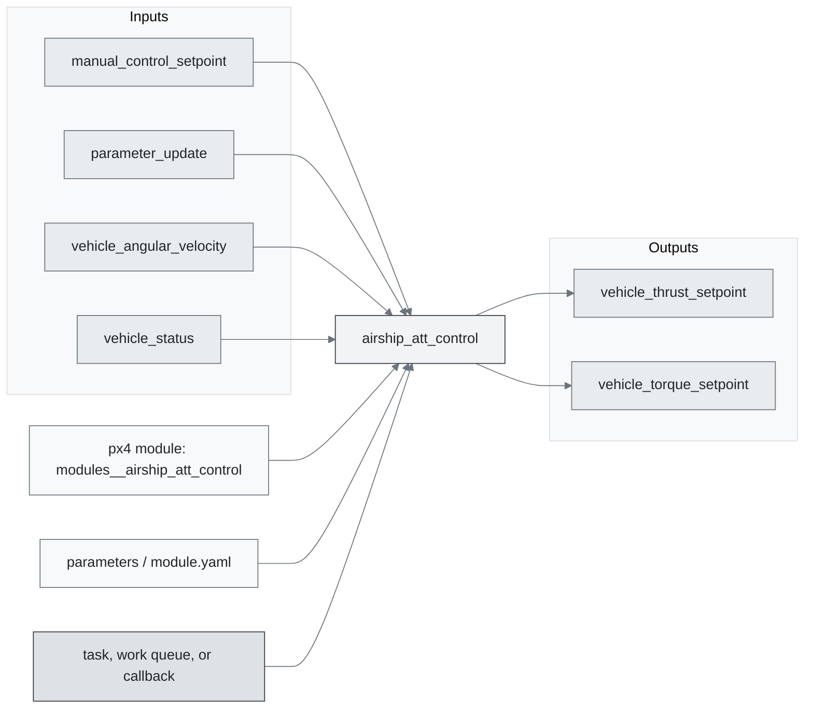
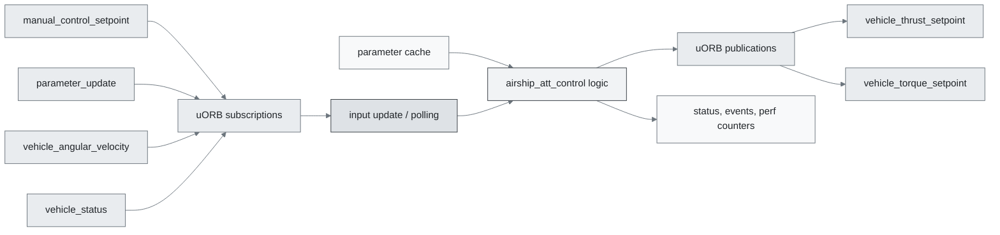
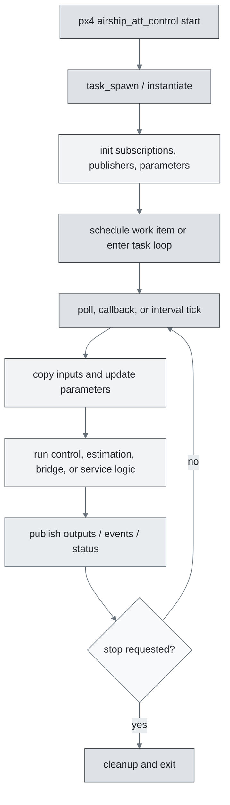
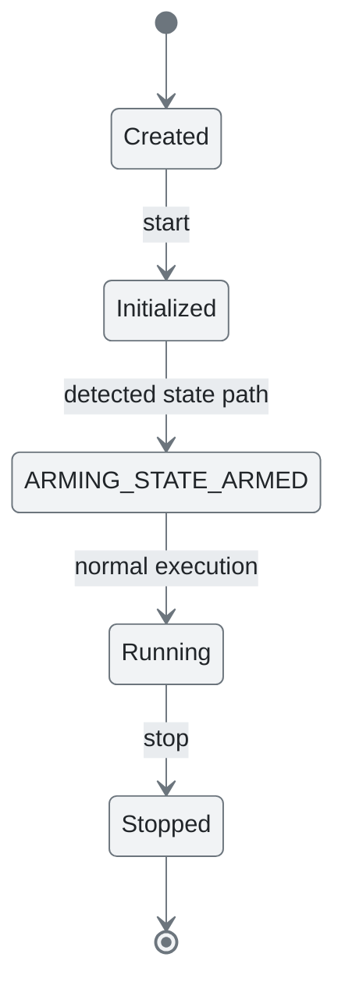
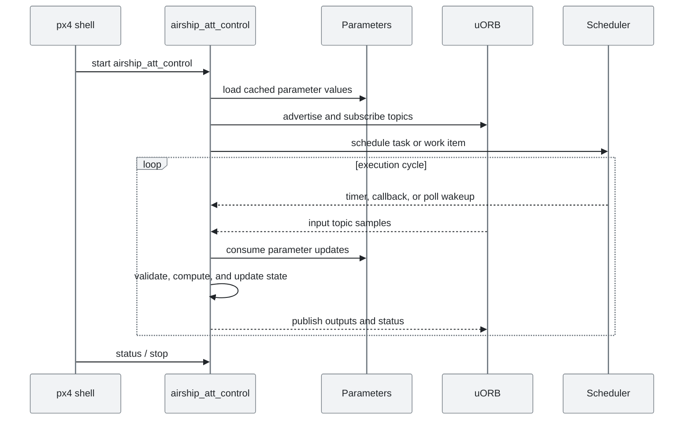
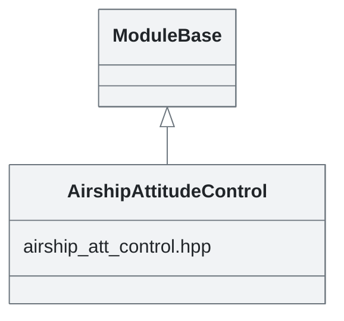

# PX4 Module Architecture: `airship_att_control`

- Source: `src/modules/airship_att_control`
- Build target: `modules__airship_att_control`
- Runtime main: `airship_att_control`
- Build kind: `px4 module`
- Mermaid palette: `mist` grey tone

This implements the airship attitude and rate controller. Ideally it would take attitude setpoints (`vehicle_attitude_setpoint`) or rate setpoints (in acro mode via `manual_control_setpoint` topic) as inputs and outputs actuator control messages. Currently it is feeding the `manual_control_setpoint` topic directly to the actuators. To reduce control latency, the module directly polls on the gyro topic published by the IMU driver.

## Description of Module

Controls airship attitude and converts attitude or rate demands into actuator-facing control outputs.

### Primary Responsibilities

- Convert selected state estimates and setpoints into downstream control or actuator-facing setpoints.
- Consume runtime inputs from uORB topics such as `manual_control_setpoint`, `parameter_update`, `vehicle_angular_velocity`, `vehicle_status`.
- Publish outputs or status topics such as `vehicle_thrust_setpoint`, `vehicle_torque_setpoint`.
- Implement the main behavior in classes such as `AirshipAttitudeControl`.

### Runtime Behavior

- Runs work-queue callbacks on queue configurations such as `rate_ctrl`.
- Uses uORB callback registration so new topic data can schedule execution.

## Background Theory

Airship attitude control is represented as attitude-error feedback that maps the desired orientation into body-rate or torque-style setpoints.

```text
q_err = inverse(q_body) * q_sp
e_att = sign(q_err.w) * q_err.xyz
rate_sp = K_att * e_att + rate_ff
torque_sp = K_rate * (rate_sp - rate_body) + D * (d/dt)(rate_sp - rate_body)
```

These equations are the study-level form of the algorithm. The implementation applies PX4-specific saturation, validity checks, parameter updates, and frame conventions around these core relationships.

### Main Interfaces

| Area | Details |
| --- | --- |
| Primary inputs | `manual_control_setpoint`, `parameter_update`, `vehicle_angular_velocity`, `vehicle_status` |
| Primary outputs | `vehicle_thrust_setpoint`, `vehicle_torque_setpoint` |
| Referenced topics | `manual_control_setpoint`, `parameter_update`, `vehicle_angular_velocity`, `vehicle_status`, `vehicle_thrust_setpoint`, `vehicle_torque_setpoint` |
| Parameters/config | none detected |
| Key classes | `AirshipAttitudeControl` |

### Files

| File | Why it matters |
| --- | --- |
| airship_att_control_main.cpp | Entry point, start command, or module lifecycle code |
| CMakeLists.txt | Build, parameter, or module configuration |
| airship_att_control.hpp | Defines `AirshipAttitudeControl` class |

## Architecture Overview

This page is generated from the module source tree and shows the stable architecture surfaces: build entry point, scheduling shape, uORB data interfaces, parameter/configuration surfaces, and C++ types found in the module.



## Build and Entry Points

| Field | Value |
| --- | --- |
| Module path | src/modules/airship_att_control |
| Build kind | px4 module |
| Build target | modules__airship_att_control |
| Runtime main | airship_att_control |
| Stack main | Not specified |
| Module config | Not specified |
| Detected sources | 1 |
| Detected headers | 1 |
| Detected configs | 1 |

### CMake Dependencies

- `px4_work_queue`

### Nested Module Targets

- No nested module targets detected.

## Data Flow



### uORB Topics

| Topic | Detected direction |
| --- | --- |
| manual_control_setpoint | subscribed |
| parameter_update | subscribed |
| vehicle_angular_velocity | subscribed |
| vehicle_status | subscribed |
| vehicle_thrust_setpoint | published |
| vehicle_torque_setpoint | published |

## Execution Flow



The common PX4 module lifecycle is command entry, object construction or task spawn, parameter loading, topic setup, scheduled execution, publication, status reporting, and stop/cleanup. Modules that use `ModuleBase`, `ScheduledWorkItem`, polling loops, or bridge callbacks still fit this lifecycle with different scheduling triggers.

## State Machine



### Detected State-Like Symbols

- `ARMING_STATE_ARMED`

## Sequence Diagram



## Class Diagram



### Detected Classes

| Class | Base | File |
| --- | --- | --- |
| AirshipAttitudeControl | ModuleBase | airship_att_control.hpp |

### Detected Enums

- No enums detected.

## Parameters and Configuration

- No parameters detected.

## Source Map

| File | Kind |
| --- | --- |
| CMakeLists.txt | build |
| airship_att_control.hpp | header |
| airship_att_control_main.cpp | source |

## Review Notes

- The diagrams are generated from static source inventory and should be used as a study map, not as a formal proof of every runtime branch.
- Topic direction is inferred from nearby source context such as `Subscription`, `Publication`, `orb_subscribe`, and `publish` usage.
- When a module has no explicit state enum, the state diagram shows the standard PX4 module lifecycle.
