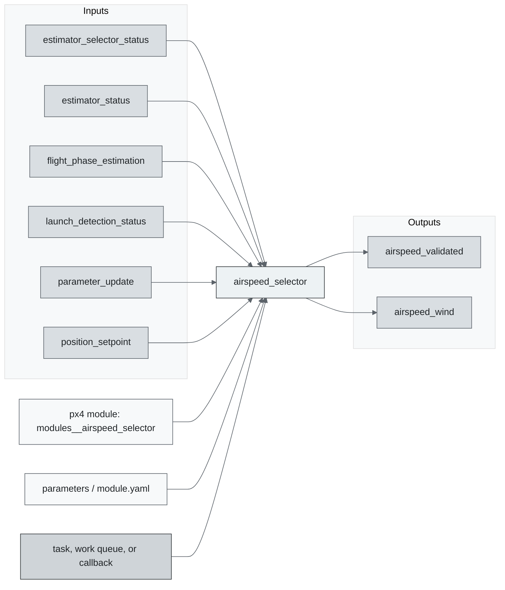
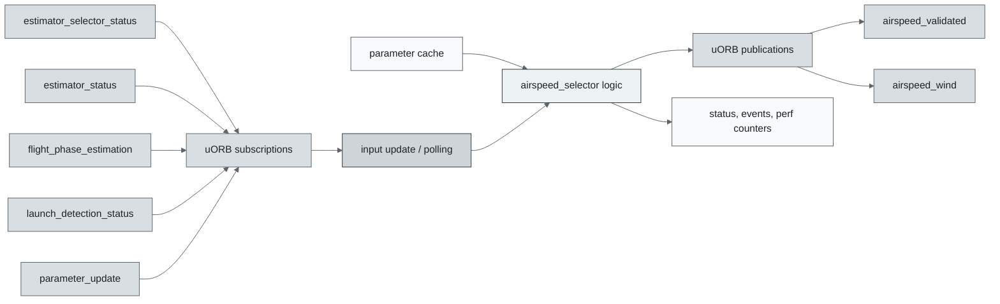
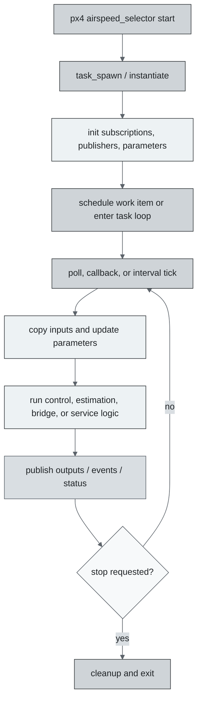
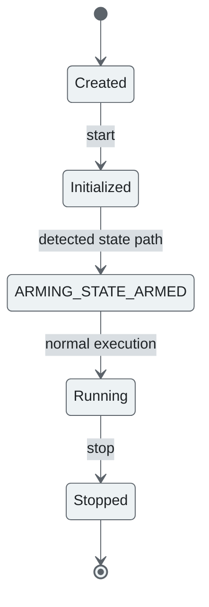
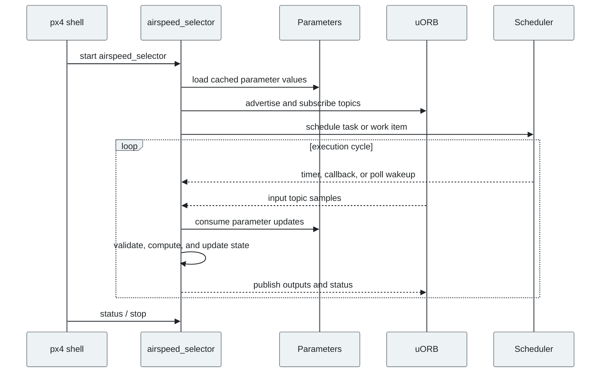
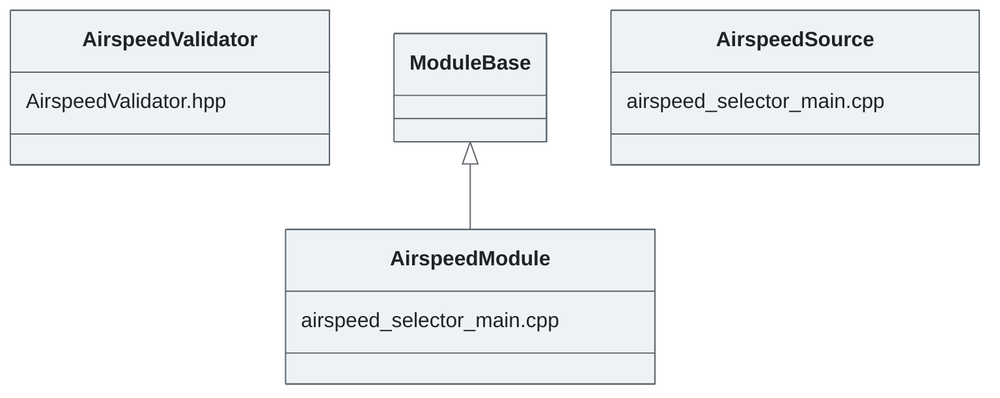

# PX4 Module Architecture: `airspeed_selector`

- Source: `src/modules/airspeed_selector`
- Build target: `modules__airspeed_selector`
- Runtime main: `airspeed_selector`
- Build kind: `px4 module`
- Mermaid palette: `graphite` grey tone

This module provides a single airspeed_validated topic, containing indicated (IAS), calibrated (CAS), true airspeed (TAS) and the information if the estimation currently is invalid and if based sensor readings or on groundspeed minus windspeed. Supporting the input of multiple "raw" airspeed inputs, this module automatically switches to a valid sensor in case of failure detection. For failure detection as well as for the estimation of a scale factor from IAS to CAS, it runs several wind estimators and also publishe

## Description of Module

Selects, validates, and publishes the airspeed estimate that downstream fixed-wing control and navigation use.

### Primary Responsibilities

- Consume runtime inputs from uORB topics such as `estimator_selector_status`, `estimator_status`, `flight_phase_estimation`, `launch_detection_status`, `parameter_update`, `position_setpoint`, `tecs_status`, `vehicle_acceleration`, ... 6 more.
- Publish outputs or status topics such as `airspeed_validated`, `airspeed_wind`.
- Use module configuration from `airspeed_selector_params.yaml`.
- Implement the main behavior in classes such as `AirspeedValidator`, `AirspeedModule`, `AirspeedSource`.

### Runtime Behavior

- Runs work-queue callbacks on queue configurations such as `nav_and_controllers`.
- Uses explicit work-item scheduling through immediate, delayed, or interval scheduling calls.

## Background Theory

The selector uses measurement validation and consistency checks. The mathematical idea is to score each airspeed source by health, timeout, and innovation before selecting the best valid source.

```text
innovation_i = v_i - v_reference
test_ratio_i = innovation_i^2 / innovation_variance_i
valid_i = finite(v_i) and fresh_i and test_ratio_i < gate^2
selected = argmin_i(test_ratio_i) over valid_i
```

These equations are the study-level form of the algorithm. The implementation applies PX4-specific saturation, validity checks, parameter updates, and frame conventions around these core relationships.

### Main Interfaces

| Area | Details |
| --- | --- |
| Primary inputs | `estimator_selector_status`, `estimator_status`, `flight_phase_estimation`, `launch_detection_status`, `parameter_update`, `position_setpoint`, `tecs_status`, `vehicle_acceleration`, `vehicle_air_data`, `vehicle_attitude`, ... 4 more |
| Primary outputs | `airspeed_validated`, `airspeed_wind` |
| Referenced topics | `airspeed`, `airspeed_validated`, `airspeed_wind`, `estimator_selector_status`, `estimator_status`, `flight_phase_estimation`, `launch_detection_status`, `mavlink_log`, `parameter_update`, `position_setpoint`, ... 8 more |
| Parameters/config | airspeed_selector_params.yaml |
| Key classes | `AirspeedValidator`, `AirspeedModule`, `AirspeedSource` |

### Files

| File | Why it matters |
| --- | --- |
| airspeed_selector_main.cpp | Entry point, start command, or module lifecycle code |
| CMakeLists.txt | Build, parameter, or module configuration |
| airspeed_selector_params.yaml | Build, parameter, or module configuration |
| AirspeedValidator.hpp | Defines `AirspeedValidator` class |

## Architecture Overview

This page is generated from the module source tree and shows the stable architecture surfaces: build entry point, scheduling shape, uORB data interfaces, parameter/configuration surfaces, and C++ types found in the module.



## Build and Entry Points

| Field | Value |
| --- | --- |
| Module path | src/modules/airspeed_selector |
| Build kind | px4 module |
| Build target | modules__airspeed_selector |
| Runtime main | airspeed_selector |
| Stack main | Not specified |
| Module config | airspeed_selector_params.yaml |
| Detected sources | 2 |
| Detected headers | 1 |
| Detected configs | 2 |

### CMake Dependencies

- `wind_estimator`

### Nested Module Targets

- No nested module targets detected.

## Data Flow



### uORB Topics

| Topic | Detected direction |
| --- | --- |
| airspeed | referenced |
| airspeed_validated | published |
| airspeed_wind | published |
| estimator_selector_status | subscribed |
| estimator_status | subscribed |
| flight_phase_estimation | subscribed |
| launch_detection_status | subscribed |
| mavlink_log | referenced |
| parameter_update | subscribed |
| position_setpoint | subscribed |
| tecs_status | subscribed |
| vehicle_acceleration | subscribed |
| vehicle_air_data | subscribed |
| vehicle_attitude | subscribed |
| vehicle_land_detected | subscribed |
| vehicle_local_position | subscribed |
| vehicle_rates_setpoint | subscribed |
| vehicle_status | subscribed |

## Execution Flow



The common PX4 module lifecycle is command entry, object construction or task spawn, parameter loading, topic setup, scheduled execution, publication, status reporting, and stop/cleanup. Modules that use `ModuleBase`, `ScheduledWorkItem`, polling loops, or bridge callbacks still fit this lifecycle with different scheduling triggers.

## State Machine



### Detected State-Like Symbols

- `ARMING_STATE_ARMED`

## Sequence Diagram



## Class Diagram



### Detected Classes

| Class | Base | File |
| --- | --- | --- |
| AirspeedValidator |  | AirspeedValidator.hpp |
| AirspeedModule | ModuleBase | airspeed_selector_main.cpp |
| AirspeedSource |  | airspeed_selector_main.cpp |

### Detected Enums

- `AirspeedSource`
- `CheckTypeBits`

## Parameters and Configuration

- No parameters detected.

## Source Map

| File | Kind |
| --- | --- |
| AirspeedValidator.cpp | source |
| AirspeedValidator.hpp | header |
| CMakeLists.txt | build |
| airspeed_selector_main.cpp | source |
| airspeed_selector_params.yaml | config |

## Review Notes

- The diagrams are generated from static source inventory and should be used as a study map, not as a formal proof of every runtime branch.
- Topic direction is inferred from nearby source context such as `Subscription`, `Publication`, `orb_subscribe`, and `publish` usage.
- When a module has no explicit state enum, the state diagram shows the standard PX4 module lifecycle.
