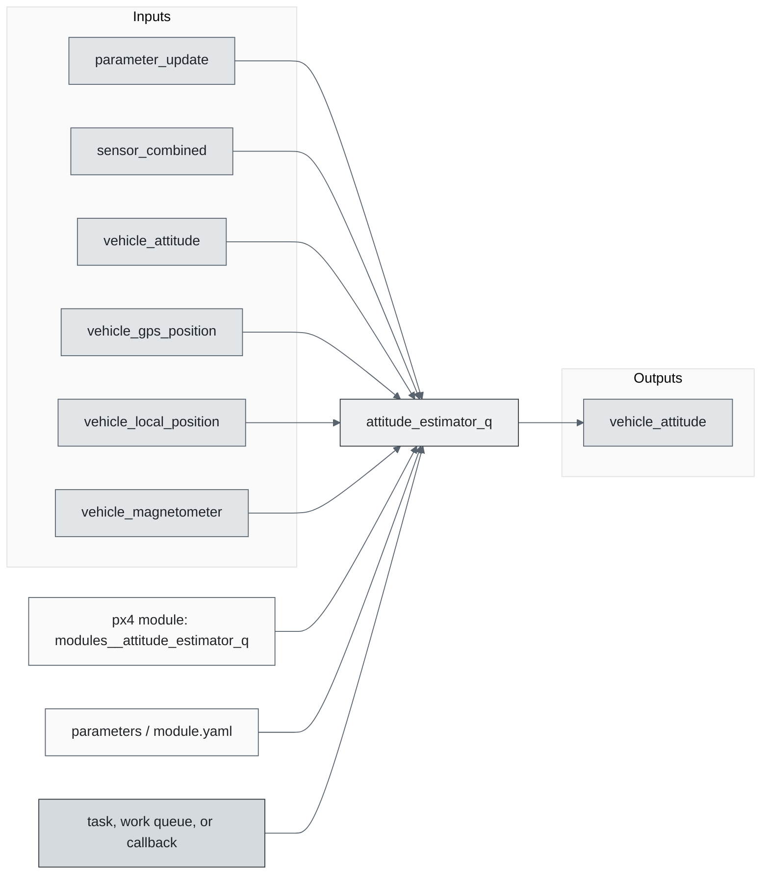
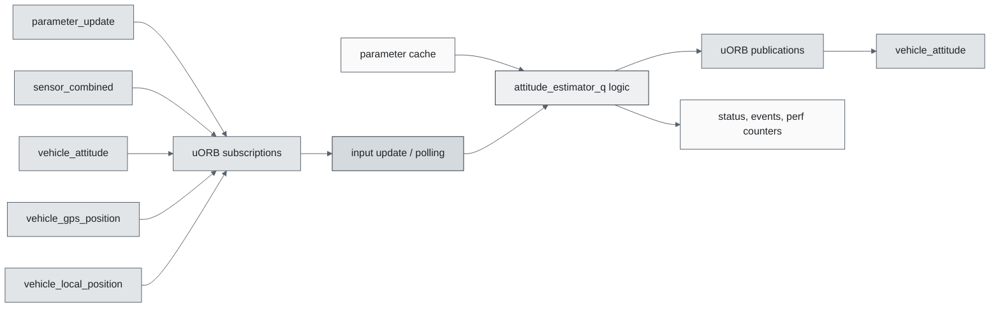
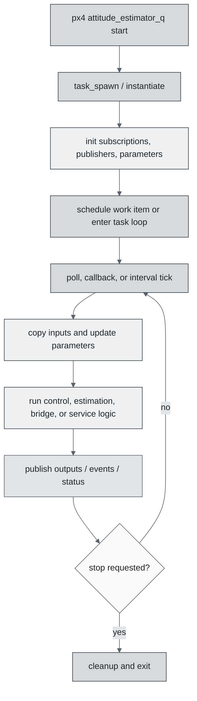
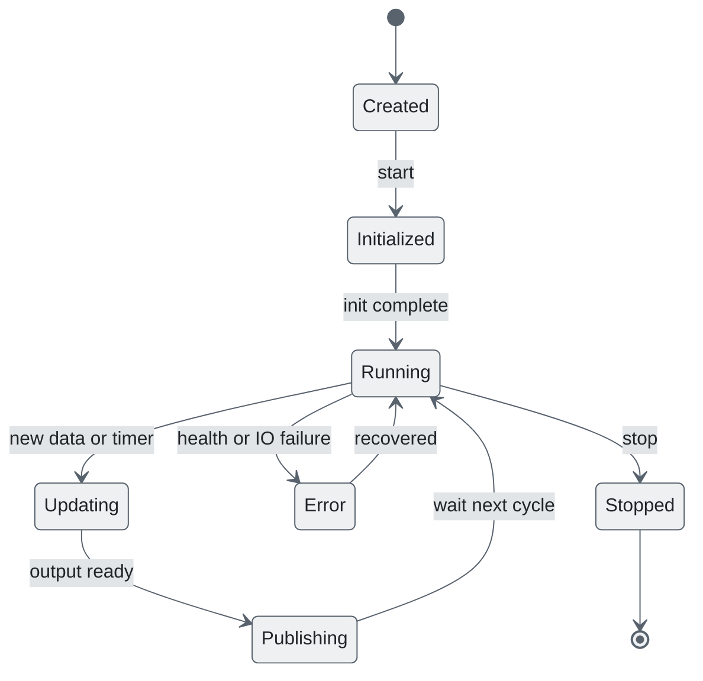
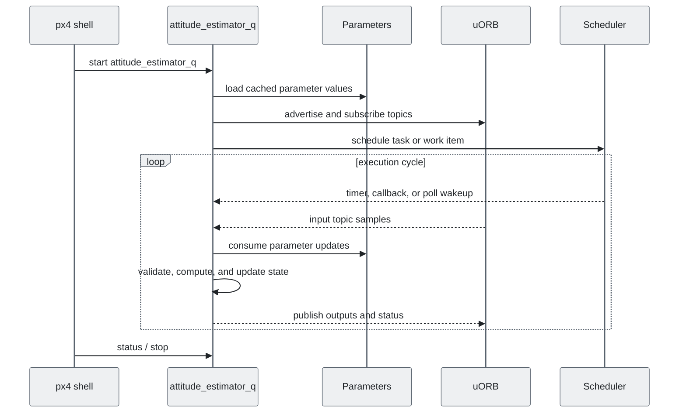
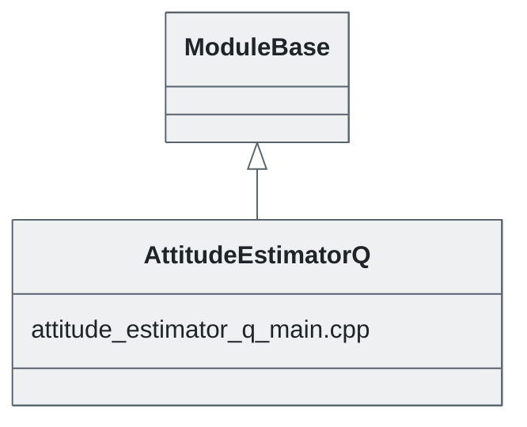

# PX4 Module Architecture: `attitude_estimator_q`

- Source: `src/modules/attitude_estimator_q`
- Build target: `modules__attitude_estimator_q`
- Runtime main: `attitude_estimator_q`
- Build kind: `px4 module`
- Mermaid palette: `slate` grey tone

Attitude estimator q.

## Description of Module

Provides a lightweight quaternion attitude estimator using IMU and aiding data.

### Primary Responsibilities

- Fuse, filter, or validate measurements into estimated state outputs for other modules.
- Consume runtime inputs from uORB topics such as `parameter_update`, `sensor_combined`, `vehicle_attitude`, `vehicle_gps_position`, `vehicle_local_position`, `vehicle_magnetometer`, `vehicle_mocap_odometry`, `vehicle_visual_odometry`.
- Publish outputs or status topics such as `vehicle_attitude`.
- Use module configuration from `attitude_estimator_q_params.yaml`.
- Implement the main behavior in classes such as `AttitudeEstimatorQ`.

### Runtime Behavior

- Runs work-queue callbacks on queue configurations such as `nav_and_controllers`.
- Uses uORB callback registration so new topic data can schedule execution.

## Background Theory

This module is a quaternion complementary attitude estimator. Gyro integration predicts attitude, while accelerometer, magnetometer, or external heading corrections slowly pull the quaternion back to observed gravity/heading.

```text
q_pred = q[k-1] * exp(0.5 * (omega - bias) * dt)
e_acc = normalize(accel_body) x gravity_body_pred
e_mag = heading_measured - heading_pred
omega_corr = omega + w_acc*e_acc + w_mag*e_mag
bias[k] = bias[k-1] - w_bias * e_acc * dt
q[k] = normalize(q[k-1] * exp(0.5 * omega_corr * dt))
```

These equations are the study-level form of the algorithm. The implementation applies PX4-specific saturation, validity checks, parameter updates, and frame conventions around these core relationships.

### Main Interfaces

| Area | Details |
| --- | --- |
| Primary inputs | `parameter_update`, `sensor_combined`, `vehicle_attitude`, `vehicle_gps_position`, `vehicle_local_position`, `vehicle_magnetometer`, `vehicle_mocap_odometry`, `vehicle_visual_odometry` |
| Primary outputs | `vehicle_attitude` |
| Referenced topics | `parameter_update`, `sensor_combined`, `sensor_gps`, `vehicle_attitude`, `vehicle_gps_position`, `vehicle_local_position`, `vehicle_magnetometer`, `vehicle_mocap_odometry`, `vehicle_odometry`, `vehicle_visual_odometry` |
| Parameters/config | attitude_estimator_q_params.yaml |
| Key classes | `AttitudeEstimatorQ` |

### Files

| File | Why it matters |
| --- | --- |
| attitude_estimator_q_main.cpp | Entry point, start command, or module lifecycle code |
| CMakeLists.txt | Build, parameter, or module configuration |
| attitude_estimator_q_params.yaml | Build, parameter, or module configuration |

## Architecture Overview

This page is generated from the module source tree and shows the stable architecture surfaces: build entry point, scheduling shape, uORB data interfaces, parameter/configuration surfaces, and C++ types found in the module.



## Build and Entry Points

| Field | Value |
| --- | --- |
| Module path | src/modules/attitude_estimator_q |
| Build kind | px4 module |
| Build target | modules__attitude_estimator_q |
| Runtime main | attitude_estimator_q |
| Stack main | Not specified |
| Module config | attitude_estimator_q_params.yaml |
| Detected sources | 1 |
| Detected headers | 0 |
| Detected configs | 2 |

### CMake Dependencies

- `world_magnetic_model`

### Nested Module Targets

- No nested module targets detected.

## Data Flow



### uORB Topics

| Topic | Detected direction |
| --- | --- |
| parameter_update | subscribed |
| sensor_combined | subscribed |
| sensor_gps | referenced |
| vehicle_attitude | subscribed, published |
| vehicle_gps_position | subscribed |
| vehicle_local_position | subscribed |
| vehicle_magnetometer | subscribed |
| vehicle_mocap_odometry | subscribed |
| vehicle_odometry | referenced |
| vehicle_visual_odometry | subscribed |

## Execution Flow



The common PX4 module lifecycle is command entry, object construction or task spawn, parameter loading, topic setup, scheduled execution, publication, status reporting, and stop/cleanup. Modules that use `ModuleBase`, `ScheduledWorkItem`, polling loops, or bridge callbacks still fit this lifecycle with different scheduling triggers.

## State Machine



### Detected State-Like Symbols

- No state-like symbols detected.

## Sequence Diagram



## Class Diagram



### Detected Classes

| Class | Base | File |
| --- | --- | --- |
| AttitudeEstimatorQ | ModuleBase | attitude_estimator_q_main.cpp |

### Detected Enums

- No enums detected.

## Parameters and Configuration

- No parameters detected.

## Source Map

| File | Kind |
| --- | --- |
| CMakeLists.txt | build |
| attitude_estimator_q_main.cpp | source |
| attitude_estimator_q_params.yaml | config |

## Review Notes

- The diagrams are generated from static source inventory and should be used as a study map, not as a formal proof of every runtime branch.
- Topic direction is inferred from nearby source context such as `Subscription`, `Publication`, `orb_subscribe`, and `publish` usage.
- When a module has no explicit state enum, the state diagram shows the standard PX4 module lifecycle.
