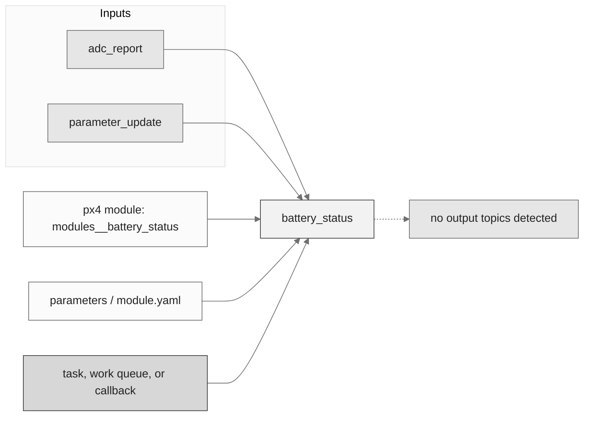
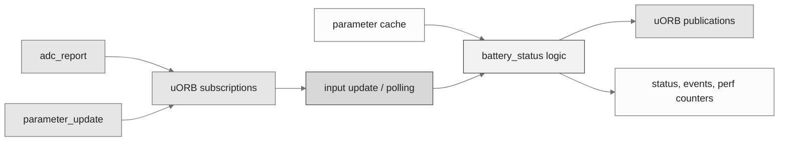
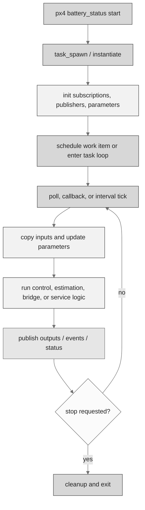
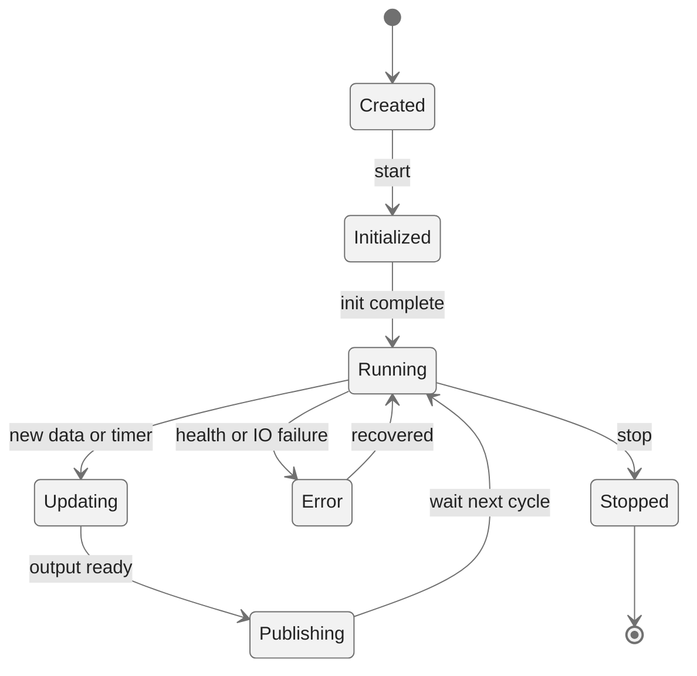
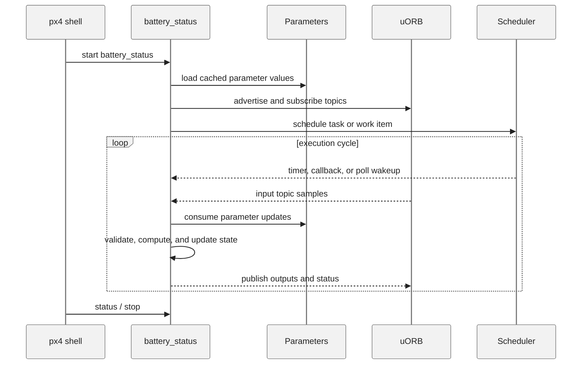
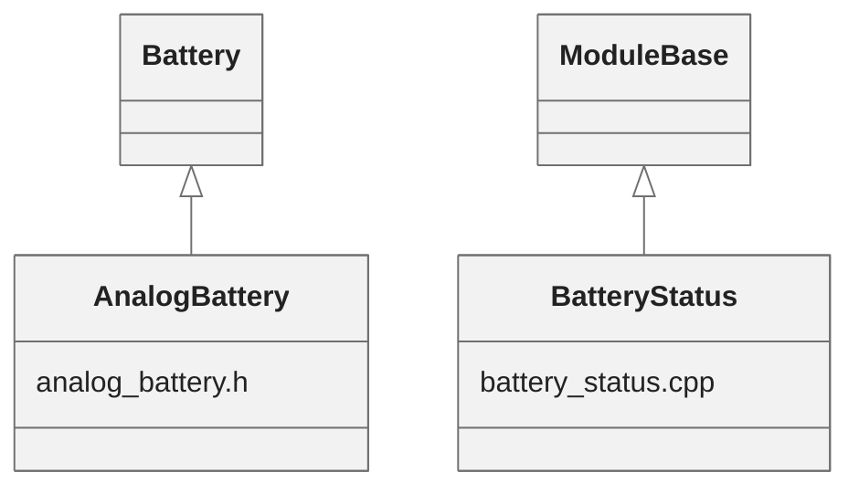

# PX4 Module Architecture: `battery_status`

- Source: `src/modules/battery_status`
- Build target: `modules__battery_status`
- Runtime main: `battery_status`
- Build kind: `px4 module`
- Mermaid palette: `ash` grey tone

Architecture notes for the battery_status module.

## Architecture Overview

This page is generated from the module source tree and shows the stable architecture surfaces: build entry point, scheduling shape, uORB data interfaces, parameter/configuration surfaces, and C++ types found in the module.

## Build and Entry Points

| Field | Value |
| --- | --- |
| Module path | src/modules/battery_status |
| Build kind | px4 module |
| Build target | modules__battery_status |
| Runtime main | battery_status |
| Stack main | Not specified |
| Module config | module.yaml |
| Detected sources | 2 |
| Detected headers | 1 |
| Detected configs | 3 |

### CMake Dependencies

- `battery`
- `conversion`
- `drivers__device`
- `mathlib`

### Nested Module Targets

- No nested module targets detected.

## Data Flow

### uORB Topics

| Topic | Detected direction |
| --- | --- |
| adc_report | subscribed |
| parameter_update | subscribed |

## Execution Flow

The common PX4 module lifecycle is command entry, object construction or task spawn, parameter loading, topic setup, scheduled execution, publication, status reporting, and stop/cleanup. Modules that use `ModuleBase`, `ScheduledWorkItem`, polling loops, or bridge callbacks still fit this lifecycle with different scheduling triggers.

## State Machine

### Detected State-Like Symbols

- No state-like symbols detected.

## Sequence Diagram

## Class Diagram

### Detected Classes

| Class | Base | File |
| --- | --- | --- |
| AnalogBattery | Battery | analog_battery.h |
| BatteryStatus | ModuleBase | battery_status.cpp |

### Detected Enums

- No enums detected.

## Parameters and Configuration

- No parameters detected.

## Source Map

| File | Kind |
| --- | --- |
| CMakeLists.txt | build |
| analog_battery.cpp | source |
| analog_battery.h | header |
| analog_battery_params_common.yaml | config |
| battery_status.cpp | source |
| module.yaml | config |

## Review Notes

- The diagrams are generated from static source inventory and should be used as a study map, not as a formal proof of every runtime branch.
- Topic direction is inferred from nearby source context such as `Subscription`, `Publication`, `orb_subscribe`, and `publish` usage.
- When a module has no explicit state enum, the state diagram shows the standard PX4 module lifecycle.
