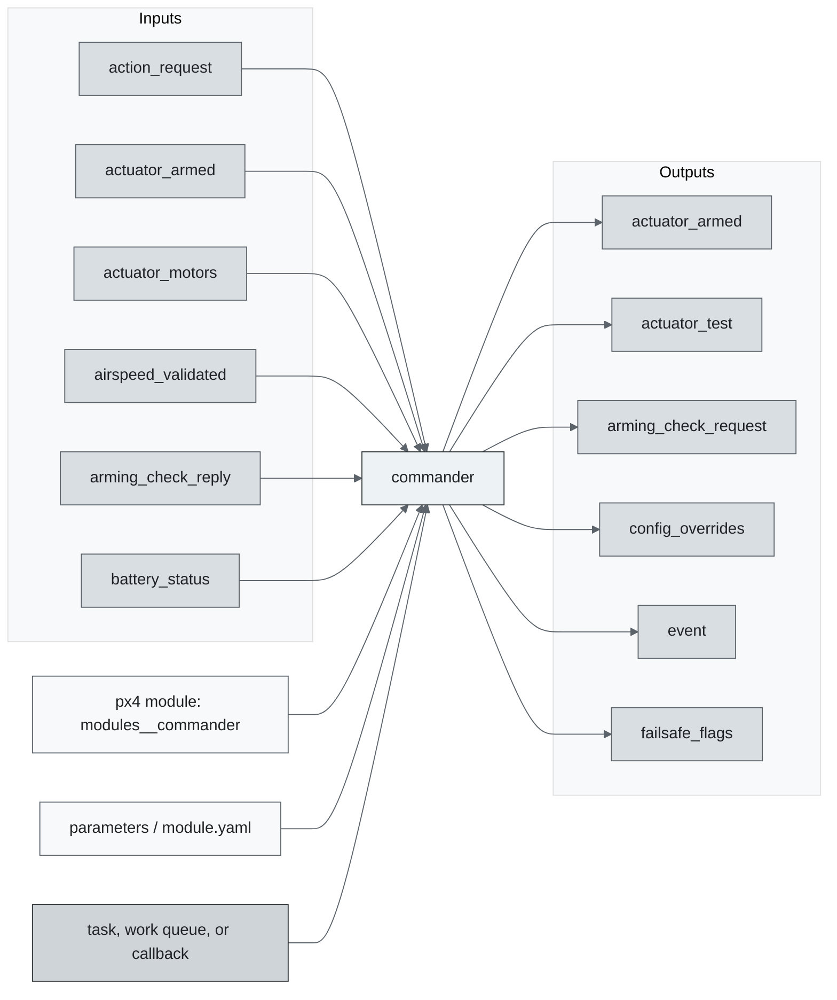
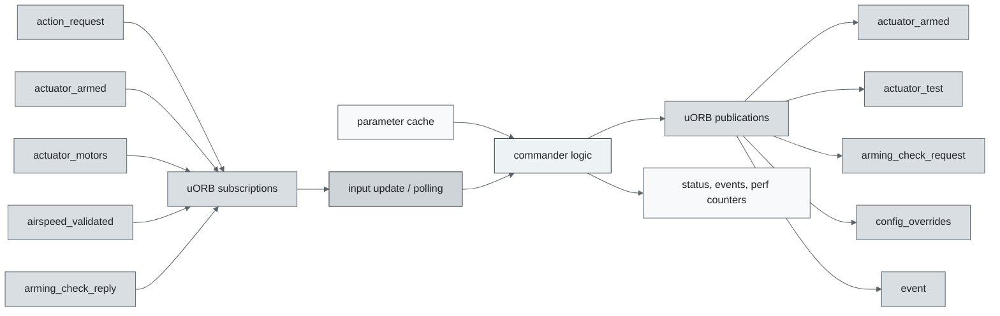
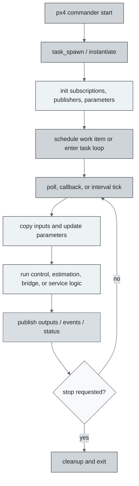
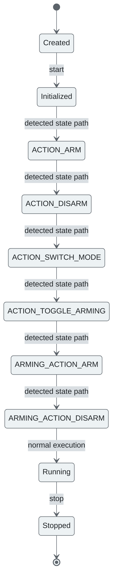
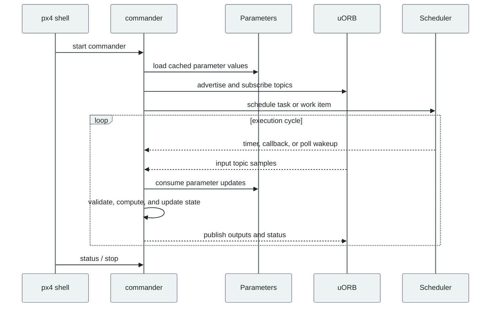

# PX4 Module Architecture: `commander`

- Source: `src/modules/commander`
- Build target: `modules__commander`
- Runtime main: `commander`
- Build kind: `px4 module`
- Mermaid palette: `graphite` grey tone

Architecture notes for the Commander module.

## Architecture Overview

This page is generated from the module source tree and shows the stable architecture surfaces: build entry point, scheduling shape, uORB data interfaces, parameter/configuration surfaces, and C++ types found in the module.

## Build and Entry Points

| Field | Value |
| --- | --- |
| Module path | src/modules/commander |
| Build kind | px4 module |
| Build target | modules__commander |
| Runtime main | commander |
| Stack main | Not specified |
| Module config | module.yaml |
| Detected sources | 72 |
| Detected headers | 69 |
| Detected configs | 12 |

### CMake Dependencies

- `ArmAuthorization`
- `circuit_breaker`
- `failsafe`
- `failure_detector`
- `geo`
- `health_and_arming_checks`
- `hysteresis`
- `mode_util`
- `MulticopterThrowLaunch`
- `sensor_calibration`
- `world_magnetic_model`
- `atmosphere`

### Nested Module Targets

- No nested module targets detected.

## Data Flow

### uORB Topics

| Topic | Detected direction |
| --- | --- |
| action_request | subscribed |
| actuator_armed | subscribed, published |
| actuator_motors | subscribed |
| actuator_test | published |
| airspeed | referenced |
| airspeed_validated | subscribed |
| arming_check_reply | subscribed |
| arming_check_request | published |
| battery_status | subscribed |
| button_event | referenced |
| config_control_setpoints | subscribed |
| config_overrides | published |
| config_overrides_request | subscribed |
| cpuload | subscribed |
| differential_pressure | subscribed |
| distance_sensor | referenced |
| esc_status | subscribed |
| estimator_selector_status | subscribed |
| estimator_sensor_bias | subscribed |
| estimator_status | subscribed |
| estimator_status_flags | subscribed |
| event | subscribed, published |
| failsafe_flags | published |
| failure_detector_status | subscribed, published |
| geofence_result | subscribed |
| health_report | published |
| home_position | subscribed, published |
| input_rc | referenced |
| iridiumsbd_status | subscribed |
| led_control | published |
| logger_status | referenced |
| mag_worker_data | published |
| manual_control_setpoint | subscribed |
| manual_control_switches | subscribed |
| mavlink_log | referenced |
| mission_result | subscribed |
| navigator_status | subscribed |
| offboard_control_mode | subscribed |
| onboard_computer_status | subscribed |
| parameter_update | subscribed |
| power_button_state | subscribed, published |
| pwm_input | subscribed |
| register_ext_component_reply | published |
| register_ext_component_request | subscribed |
| rtl_status | subscribed |
| rtl_time_estimate | subscribed |
| sensor_accel | subscribed |
| sensor_baro | referenced |
| ... 30 more topics | omitted |

## Execution Flow

The common PX4 module lifecycle is command entry, object construction or task spawn, parameter loading, topic setup, scheduled execution, publication, status reporting, and stop/cleanup. Modules that use `ModuleBase`, `ScheduledWorkItem`, polling loops, or bridge callbacks still fit this lifecycle with different scheduling triggers.

## State Machine

### Detected State-Like Symbols

- `ACTION_ARM`
- `ACTION_DISARM`
- `ACTION_SWITCH_MODE`
- `ACTION_TOGGLE_ARMING`
- `ARMING_ACTION_ARM`
- `ARMING_ACTION_DISARM`
- `ARMING_STATE_ARMED`
- `ARMING_STATE_DISARMED`
- `ARM_AUTH_METHOD_ARM_REQ`
- `ARM_AUTH_METHOD_TWO_ARM_REQ`
- `ARM_DISARM`
- `ARM_DISARM_REASON_COMMAND_EXTERNAL`
- `ARM_DISARM_REASON_COMMAND_INTERNAL`
- `ARM_DISARM_REASON_FAILSAFE`
- `ARM_DISARM_REASON_KILL_SWITCH`
- `ARM_DISARM_REASON_LANDING`
- `ARM_DISARM_REASON_MISSION_START`
- `ARM_DISARM_REASON_PREFLIGHT_INACTION`
- `ARM_DISARM_REASON_RC_BUTTON`
- `ARM_DISARM_REASON_RC_SWITCH`
- `ARM_DISARM_REASON_STICK_GESTURE`
- `AUTO_MODE_BIT`
- `BOARD_ARMED_LED_OFF`
- `BOARD_ARMED_LED_ON`
- `BOARD_ARMED_STATE_LED_OFF`
- `BOARD_ARMED_STATE_LED_TOGGLE`
- `CBRK_VTOLARMING`
- `CBRK_VTOLARMING_KEY`
- `CHECK_FAILSAFE`
- `COMPONENT_MODE_EXECUTOR_START`
- `COM_ARMABLE`
- `COM_ARM_AUTH_ID`
- `COM_ARM_AUTH_MET`
- `COM_ARM_AUTH_REQ`
- `COM_ARM_AUTH_TO`
- `COM_ARM_BAT_MIN`
- `COM_ARM_CHK_ESCS`
- `COM_ARM_HFLT_CHK`
- `COM_ARM_IMU_ACC`
- `COM_ARM_IMU_GYR`
- ... 129 more

## Sequence Diagram

## Class Diagram

```mermaid
%%{init: {"theme":"base","themeVariables":{"primaryColor":"#edf2f4","secondaryColor":"#d9dee2","tertiaryColor":"#f7f9fa","primaryBorderColor":"#5c636a","primaryTextColor":"#1f2326","lineColor":"#5c636a","fontFamily":"Inter, Arial, sans-serif"}}}%%
classDiagram
  class Commander
  Commander : Commander.hpp
  class ModuleBase
  ModuleBase <|-- Commander
  class PrearmedMode
  PrearmedMode : Commander.hpp
  class RcOverrideBits
  RcOverrideBits : Commander.hpp
  class HealthAndArmingChecks
  HealthAndArmingChecks : HealthAndArmingChecks/Common.hpp
  class NavModes
  NavModes : HealthAndArmingChecks/Common.hpp
  class HealthComponentIndex
  HealthComponentIndex : HealthAndArmingChecks/Common.hpp
  class Context
  Context : HealthAndArmingChecks/Common.hpp
  class Report
  Report : HealthAndArmingChecks/Common.hpp
  class ExternalChecks
  ExternalChecks : HealthAndArmingChecks/Common.hpp
  class HealthAndArmingCheckBase
  HealthAndArmingCheckBase : HealthAndArmingChecks/Common.hpp
  class HealthAndArmingChecks_10
  HealthAndArmingChecks_10 : HealthAndArmingChecks/HealthAndArmingChecks.hpp
  class ModuleParams
  ModuleParams <|-- HealthAndArmingChecks_10
  class ReporterTest
  ReporterTest : HealthAndArmingChecks/HealthAndArmingChecksTest.cpp
  class AccelerometerChecks
  AccelerometerChecks : HealthAndArmingChecks/checks/accelerometerCheck.hpp
  class HealthAndArmingCheckBase
  HealthAndArmingCheckBase <|-- AccelerometerChecks
  class AirspeedChecks
  AirspeedChecks : HealthAndArmingChecks/checks/airspeedCheck.hpp
  class HealthAndArmingCheckBase
  HealthAndArmingCheckBase <|-- AirspeedChecks
  class ArmPermissionChecks
  ArmPermissionChecks : HealthAndArmingChecks/checks/armPermissionCheck.hpp
  class HealthAndArmingCheckBase
  HealthAndArmingCheckBase <|-- ArmPermissionChecks
  class BaroChecks
  BaroChecks : HealthAndArmingChecks/checks/baroCheck.hpp
  class HealthAndArmingCheckBase
  HealthAndArmingCheckBase <|-- BaroChecks
```

### Detected Classes

| Class | Base | File |
| --- | --- | --- |
| Commander | ModuleBase | Commander.hpp |
| PrearmedMode |  | Commander.hpp |
| RcOverrideBits |  | Commander.hpp |
| HealthAndArmingChecks |  | HealthAndArmingChecks/Common.hpp |
| NavModes |  | HealthAndArmingChecks/Common.hpp |
| HealthComponentIndex |  | HealthAndArmingChecks/Common.hpp |
| Context |  | HealthAndArmingChecks/Common.hpp |
| Report |  | HealthAndArmingChecks/Common.hpp |
| ExternalChecks |  | HealthAndArmingChecks/Common.hpp |
| HealthAndArmingCheckBase |  | HealthAndArmingChecks/Common.hpp |
| HealthAndArmingChecks | ModuleParams | HealthAndArmingChecks/HealthAndArmingChecks.hpp |
| ReporterTest |  | HealthAndArmingChecks/HealthAndArmingChecksTest.cpp |
| AccelerometerChecks | HealthAndArmingCheckBase | HealthAndArmingChecks/checks/accelerometerCheck.hpp |
| AirspeedChecks | HealthAndArmingCheckBase | HealthAndArmingChecks/checks/airspeedCheck.hpp |
| ArmPermissionChecks | HealthAndArmingCheckBase | HealthAndArmingChecks/checks/armPermissionCheck.hpp |
| BaroChecks | HealthAndArmingCheckBase | HealthAndArmingChecks/checks/baroCheck.hpp |
| BatteryChecks | HealthAndArmingCheckBase | HealthAndArmingChecks/checks/batteryCheck.hpp |
| CompanionComputerChecks | HealthAndArmingCheckBase | HealthAndArmingChecks/checks/companionComputerCheck.hpp |
| CpuResourceChecks | HealthAndArmingCheckBase | HealthAndArmingChecks/checks/cpuResourceCheck.hpp |
| DistanceSensorChecks | HealthAndArmingCheckBase | HealthAndArmingChecks/checks/distanceSensorChecks.hpp |
| EscChecks | HealthAndArmingCheckBase | HealthAndArmingChecks/checks/escCheck.hpp |
| EstimatorChecks | HealthAndArmingCheckBase | HealthAndArmingChecks/checks/estimatorCheck.hpp |
| GnssArmingCheck |  | HealthAndArmingChecks/checks/estimatorCheck.hpp |
| ExternalChecks | HealthAndArmingCheckBase | HealthAndArmingChecks/checks/externalChecks.hpp |
| ... 71 more |  |  |

### Detected Enums

- `Action`
- `Cause`
- `ClearCondition`
- `FactoryCalibrationMode`
- `GnssArmingCheck`
- `LinkLossExceptionBits`
- `LowBatteryAction`
- `ModeChangeSource`
- `NavModes`
- `PX4_CUSTOM_MAIN_MODE`
- `PX4_CUSTOM_SUB_MODE_AUTO`
- `PX4_CUSTOM_SUB_MODE_POSCTL`
- `PrearmedMode`
- `RcInMode`
- `RcOverrideBits`
- `Request`
- `Rotation`
- `STATUS`
- `State`
- `ThrowLaunchState`
- `UserTakeoverAllowed`
- `VEHICLE_MODE_FLAG`
- `actuator_failure_failsafe_mode`
- `arm_auth_methods`
- `calibrate_return`
- `command_after_high_wind_failsafe`
- `command_after_pos_low_failsafe`
- `command_after_quadchute`
- `command_after_remaining_flight_time_low`
- `detect_orientation_return`
- `gcs_connection_loss_failsafe_mode`
- `geofence_violation_action`
- ... 6 more

## Parameters and Configuration

- No parameters detected.

## Source Map

| File | Kind |
| --- | --- |
| Arming/ArmAuthorization/ArmAuthorization.cpp | source |
| Arming/ArmAuthorization/ArmAuthorization.h | header |
| Arming/ArmAuthorization/CMakeLists.txt | build |
| Arming/CMakeLists.txt | build |
| CMakeLists.txt | build |
| Commander.cpp | source |
| Commander.hpp | header |
| HealthAndArmingChecks/CMakeLists.txt | build |
| HealthAndArmingChecks/Common.cpp | source |
| HealthAndArmingChecks/Common.hpp | header |
| HealthAndArmingChecks/HealthAndArmingChecks.cpp | source |
| HealthAndArmingChecks/HealthAndArmingChecks.hpp | header |
| HealthAndArmingChecks/HealthAndArmingChecksTest.cpp | source |
| HealthAndArmingChecks/checks/accelerometerCheck.cpp | source |
| HealthAndArmingChecks/checks/accelerometerCheck.hpp | header |
| HealthAndArmingChecks/checks/airspeedCheck.cpp | source |
| HealthAndArmingChecks/checks/airspeedCheck.hpp | header |
| HealthAndArmingChecks/checks/armPermissionCheck.cpp | source |
| HealthAndArmingChecks/checks/armPermissionCheck.hpp | header |
| HealthAndArmingChecks/checks/baroCheck.cpp | source |
| HealthAndArmingChecks/checks/baroCheck.hpp | header |
| HealthAndArmingChecks/checks/batteryCheck.cpp | source |
| HealthAndArmingChecks/checks/batteryCheck.hpp | header |
| HealthAndArmingChecks/checks/companionComputerCheck.cpp | source |
| HealthAndArmingChecks/checks/companionComputerCheck.hpp | header |
| HealthAndArmingChecks/checks/cpuResourceCheck.cpp | source |
| HealthAndArmingChecks/checks/cpuResourceCheck.hpp | header |
| HealthAndArmingChecks/checks/distanceSensorChecks.cpp | source |
| HealthAndArmingChecks/checks/distanceSensorChecks.hpp | header |
| HealthAndArmingChecks/checks/escCheck.cpp | source |
| HealthAndArmingChecks/checks/escCheck.hpp | header |
| HealthAndArmingChecks/checks/estimatorCheck.cpp | source |
| HealthAndArmingChecks/checks/estimatorCheck.hpp | header |
| HealthAndArmingChecks/checks/externalChecks.cpp | source |
| HealthAndArmingChecks/checks/externalChecks.hpp | header |
| HealthAndArmingChecks/checks/failureDetectorCheck.cpp | source |
| HealthAndArmingChecks/checks/failureDetectorCheck.hpp | header |
| HealthAndArmingChecks/checks/flightTimeCheck.cpp | source |
| HealthAndArmingChecks/checks/flightTimeCheck.hpp | header |
| HealthAndArmingChecks/checks/geofenceCheck.cpp | source |
| ... 113 more files | omitted |

## Review Notes

- The diagrams are generated from static source inventory and should be used as a study map, not as a formal proof of every runtime branch.
- Topic direction is inferred from nearby source context such as `Subscription`, `Publication`, `orb_subscribe`, and `publish` usage.
- When a module has no explicit state enum, the state diagram shows the standard PX4 module lifecycle.
