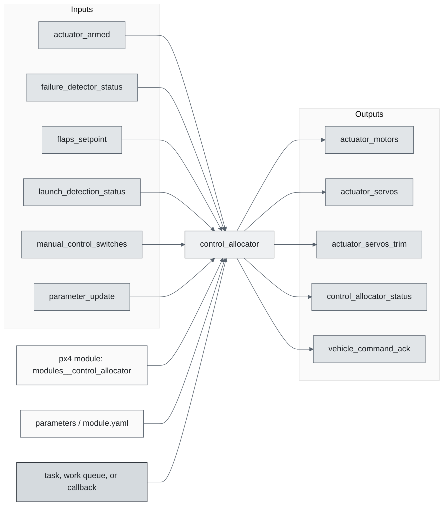
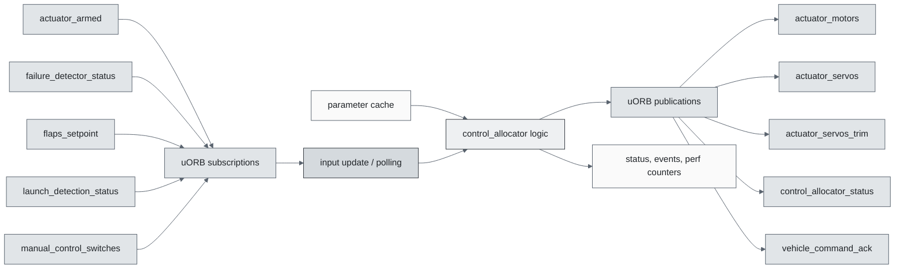
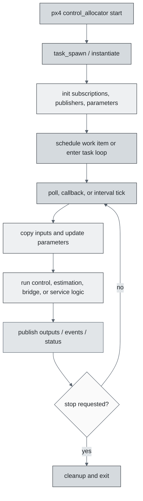
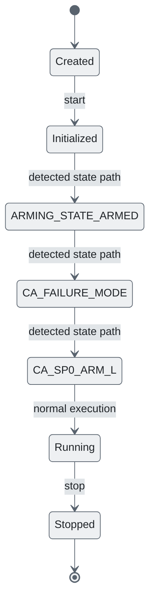
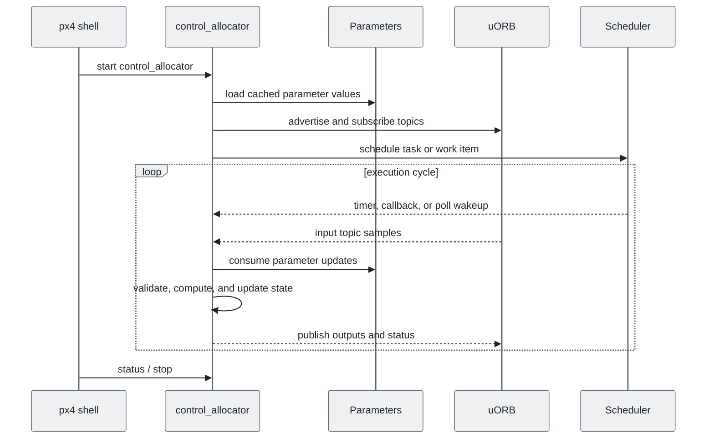

# PX4 Module Architecture: `control_allocator`

- Source: `src/modules/control_allocator`
- Build target: `modules__control_allocator`
- Runtime main: `control_allocator`
- Build kind: `px4 module`
- Mermaid palette: `slate` grey tone

Architecture notes for the Control Allocation module.

## Architecture Overview

This page is generated from the module source tree and shows the stable architecture surfaces: build entry point, scheduling shape, uORB data interfaces, parameter/configuration surfaces, and C++ types found in the module.

## Build and Entry Points

| Field | Value |
| --- | --- |
| Module path | src/modules/control_allocator |
| Build kind | px4 module |
| Build target | modules__control_allocator |
| Runtime main | control_allocator |
| Stack main | 3000 |
| Module config | module.yaml |
| Detected sources | 19 |
| Detected headers | 17 |
| Detected configs | 3 |

### CMake Dependencies

- `mathlib`
- `ActuatorEffectiveness`
- `VehicleActuatorEffectiveness`
- `ControlAllocation`
- `px4_work_queue`
- `SlewRate`

### Nested Module Targets

- No nested module targets detected.

## Data Flow

### uORB Topics

| Topic | Detected direction |
| --- | --- |
| actuator_armed | subscribed |
| actuator_motors | published |
| actuator_servos | published |
| actuator_servos_trim | published |
| control_allocator_status | published |
| failure_detector_status | subscribed |
| flaps_setpoint | subscribed |
| launch_detection_status | subscribed |
| manual_control_switches | subscribed |
| normalized_unsigned_setpoint | referenced |
| parameter_update | subscribed |
| rpm | subscribed |
| spoilers_setpoint | subscribed |
| tiltrotor_extra_controls | subscribed |
| vehicle_command | subscribed |
| vehicle_command_ack | published |
| vehicle_control_mode | subscribed |
| vehicle_land_detected | subscribed |
| vehicle_status | subscribed |
| vehicle_thrust_setpoint | subscribed |
| vehicle_torque_setpoint | subscribed |

## Execution Flow

The common PX4 module lifecycle is command entry, object construction or task spawn, parameter loading, topic setup, scheduled execution, publication, status reporting, and stop/cleanup. Modules that use `ModuleBase`, `ScheduledWorkItem`, polling loops, or bridge callbacks still fit this lifecycle with different scheduling triggers.

## State Machine

### Detected State-Like Symbols

- `ARMING_STATE_ARMED`
- `CA_FAILURE_MODE`
- `CA_SP0_ARM_L`

## Sequence Diagram

## Class Diagram

```mermaid
%%{init: {"theme":"base","themeVariables":{"primaryColor":"#eef0f2","secondaryColor":"#e1e5e8","tertiaryColor":"#fafafa","primaryBorderColor":"#59636e","primaryTextColor":"#202428","lineColor":"#59636e","fontFamily":"Inter, Arial, sans-serif"}}}%%
classDiagram
  class ActuatorGroupPreflightCheck
  ActuatorGroupPreflightCheck : ActuatorGroupPreflightCheck.hpp
  class ControlAllocator
  ControlAllocator : ControlAllocator.hpp
  class ModuleBase
  ModuleBase <|-- ControlAllocator
  class EffectivenessSource
  EffectivenessSource : ControlAllocator.hpp
  class FailureMode
  FailureMode : ControlAllocator.hpp
  class providing
  providing : ControlAllocator.hpp
  class ActuatorEffectivenessControlSurfaces
  ActuatorEffectivenessControlSurfaces : VehicleActuatorEffectiveness/ActuatorEffectivenessC...
  class ModuleParams
  ModuleParams <|-- ActuatorEffectivenessControlSurfaces
  class Type
  Type : VehicleActuatorEffectiveness/ActuatorEffectivenessC...
  class ActuatorEffectivenessCustom
  ActuatorEffectivenessCustom : VehicleActuatorEffectiveness/ActuatorEffectivenessC...
  class ModuleParams
  ModuleParams <|-- ActuatorEffectivenessCustom
  class ActuatorEffectivenessFixedWing
  ActuatorEffectivenessFixedWing : VehicleActuatorEffectiveness/ActuatorEffectivenessF...
  class ModuleParams
  ModuleParams <|-- ActuatorEffectivenessFixedWing
  class ActuatorEffectivenessHelicopter
  ActuatorEffectivenessHelicopter : VehicleActuatorEffectiveness/ActuatorEffectivenessH...
  class ModuleParams
  ModuleParams <|-- ActuatorEffectivenessHelicopter
  class ActuatorEffectivenessHelicopterCoaxial
  ActuatorEffectivenessHelicopterCoaxial : VehicleActuatorEffectiveness/ActuatorEffectivenessH...
  class ModuleParams
  ModuleParams <|-- ActuatorEffectivenessHelicopterCoaxial
  class ActuatorEffectivenessMCTilt
  ActuatorEffectivenessMCTilt : VehicleActuatorEffectiveness/ActuatorEffectivenessM...
  class ModuleParams
  ModuleParams <|-- ActuatorEffectivenessMCTilt
  class ActuatorEffectivenessMultirotor
  ActuatorEffectivenessMultirotor : VehicleActuatorEffectiveness/ActuatorEffectivenessM...
  class ModuleParams
  ModuleParams <|-- ActuatorEffectivenessMultirotor
  class ActuatorEffectivenessTilts
  ActuatorEffectivenessTilts : VehicleActuatorEffectiveness/ActuatorEffectivenessR...
  class ActuatorEffectivenessRotors
  ActuatorEffectivenessRotors : VehicleActuatorEffectiveness/ActuatorEffectivenessR...
  class ModuleParams
  ModuleParams <|-- ActuatorEffectivenessRotors
  class AxisConfiguration
  AxisConfiguration : VehicleActuatorEffectiveness/ActuatorEffectivenessR...
```

### Detected Classes

| Class | Base | File |
| --- | --- | --- |
| ActuatorGroupPreflightCheck |  | ActuatorGroupPreflightCheck.hpp |
| ControlAllocator | ModuleBase | ControlAllocator.hpp |
| EffectivenessSource |  | ControlAllocator.hpp |
| FailureMode |  | ControlAllocator.hpp |
| providing |  | ControlAllocator.hpp |
| ActuatorEffectivenessControlSurfaces | ModuleParams | VehicleActuatorEffectiveness/ActuatorEffectivenessControlSurfaces.hpp |
| Type |  | VehicleActuatorEffectiveness/ActuatorEffectivenessControlSurfaces.hpp |
| ActuatorEffectivenessCustom | ModuleParams | VehicleActuatorEffectiveness/ActuatorEffectivenessCustom.hpp |
| ActuatorEffectivenessFixedWing | ModuleParams | VehicleActuatorEffectiveness/ActuatorEffectivenessFixedWing.hpp |
| ActuatorEffectivenessHelicopter | ModuleParams | VehicleActuatorEffectiveness/ActuatorEffectivenessHelicopter.hpp |
| ActuatorEffectivenessHelicopterCoaxial | ModuleParams | VehicleActuatorEffectiveness/ActuatorEffectivenessHelicopterCoaxial.hpp |
| ActuatorEffectivenessMCTilt | ModuleParams | VehicleActuatorEffectiveness/ActuatorEffectivenessMCTilt.hpp |
| ActuatorEffectivenessMultirotor | ModuleParams | VehicleActuatorEffectiveness/ActuatorEffectivenessMultirotor.hpp |
| ActuatorEffectivenessTilts |  | VehicleActuatorEffectiveness/ActuatorEffectivenessRotors.hpp |
| ActuatorEffectivenessRotors | ModuleParams | VehicleActuatorEffectiveness/ActuatorEffectivenessRotors.hpp |
| AxisConfiguration |  | VehicleActuatorEffectiveness/ActuatorEffectivenessRotors.hpp |
| ActuatorEffectivenessSpacecraft | ModuleParams | VehicleActuatorEffectiveness/ActuatorEffectivenessSpacecraft.hpp |
| ActuatorEffectivenessStandardVTOL | ModuleParams | VehicleActuatorEffectiveness/ActuatorEffectivenessStandardVTOL.hpp |
| ActuatorEffectivenessTailsitterVTOL | ModuleParams | VehicleActuatorEffectiveness/ActuatorEffectivenessTailsitterVTOL.hpp |
| ActuatorEffectivenessTiltrotorVTOL | ModuleParams | VehicleActuatorEffectiveness/ActuatorEffectivenessTiltrotorVTOL.hpp |
| ActuatorEffectivenessTilts | ModuleParams | VehicleActuatorEffectiveness/ActuatorEffectivenessTilts.hpp |
| Control |  | VehicleActuatorEffectiveness/ActuatorEffectivenessTilts.hpp |
| TiltDirection |  | VehicleActuatorEffectiveness/ActuatorEffectivenessTilts.hpp |
| ActuatorEffectivenessUUV | ModuleParams | VehicleActuatorEffectiveness/ActuatorEffectivenessUUV.hpp |
| ... 1 more |  |  |

### Detected Enums

- `AxisConfiguration`
- `Control`
- `EffectivenessSource`
- `FailureMode`
- `TiltDirection`
- `Type`

## Parameters and Configuration

- `CA_AIRFRAME`
- `CA_CS_LAUN_LK`
- `CA_FAILURE_MODE`
- `CA_HELI_RPM_I`
- `CA_HELI_RPM_P`
- `CA_HELI_RPM_SP`
- `CA_HELI_YAW_CCW`
- `CA_HELI_YAW_CP_O`
- `CA_HELI_YAW_CP_S`
- `CA_HELI_YAW_TH_S`
- `CA_ICE_PERIOD`
- `CA_MAX_SVO_THROW`
- `CA_METHOD`
- `CA_ROTOR_COUNT`
- `CA_R_REV`
- `CA_SP0_COUNT`
- `CA_SV_CS_COUNT`
- `CA_SV_FLAP_SLEW`
- `CA_SV_TL_COUNT`
- `COM_SPOOLUP_TIME`
- `DEFAULT`
- `NOTE`
- `VT_ELEV_MC_LOCK`

## Source Map

| File | Kind |
| --- | --- |
| ActuatorGroupPreflightCheck.cpp | source |
| ActuatorGroupPreflightCheck.hpp | header |
| CMakeLists.txt | build |
| ControlAllocator.cpp | source |
| ControlAllocator.hpp | header |
| VehicleActuatorEffectiveness/ActuatorEffectivenessControlSurfaces.cpp | source |
| VehicleActuatorEffectiveness/ActuatorEffectivenessControlSurfaces.hpp | header |
| VehicleActuatorEffectiveness/ActuatorEffectivenessCustom.cpp | source |
| VehicleActuatorEffectiveness/ActuatorEffectivenessCustom.hpp | header |
| VehicleActuatorEffectiveness/ActuatorEffectivenessFixedWing.cpp | source |
| VehicleActuatorEffectiveness/ActuatorEffectivenessFixedWing.hpp | header |
| VehicleActuatorEffectiveness/ActuatorEffectivenessHelicopter.cpp | source |
| VehicleActuatorEffectiveness/ActuatorEffectivenessHelicopter.hpp | header |
| VehicleActuatorEffectiveness/ActuatorEffectivenessHelicopterCoaxial.cpp | source |
| VehicleActuatorEffectiveness/ActuatorEffectivenessHelicopterCoaxial.hpp | header |
| VehicleActuatorEffectiveness/ActuatorEffectivenessHelicopterTest.cpp | source |
| VehicleActuatorEffectiveness/ActuatorEffectivenessMCTilt.cpp | source |
| VehicleActuatorEffectiveness/ActuatorEffectivenessMCTilt.hpp | header |
| VehicleActuatorEffectiveness/ActuatorEffectivenessMultirotor.cpp | source |
| VehicleActuatorEffectiveness/ActuatorEffectivenessMultirotor.hpp | header |
| VehicleActuatorEffectiveness/ActuatorEffectivenessRotors.cpp | source |
| VehicleActuatorEffectiveness/ActuatorEffectivenessRotors.hpp | header |
| VehicleActuatorEffectiveness/ActuatorEffectivenessRotorsTest.cpp | source |
| VehicleActuatorEffectiveness/ActuatorEffectivenessSpacecraft.cpp | source |
| VehicleActuatorEffectiveness/ActuatorEffectivenessSpacecraft.hpp | header |
| VehicleActuatorEffectiveness/ActuatorEffectivenessStandardVTOL.cpp | source |
| VehicleActuatorEffectiveness/ActuatorEffectivenessStandardVTOL.hpp | header |
| VehicleActuatorEffectiveness/ActuatorEffectivenessTailsitterVTOL.cpp | source |
| VehicleActuatorEffectiveness/ActuatorEffectivenessTailsitterVTOL.hpp | header |
| VehicleActuatorEffectiveness/ActuatorEffectivenessTiltrotorVTOL.cpp | source |
| VehicleActuatorEffectiveness/ActuatorEffectivenessTiltrotorVTOL.hpp | header |
| VehicleActuatorEffectiveness/ActuatorEffectivenessTilts.cpp | source |
| VehicleActuatorEffectiveness/ActuatorEffectivenessTilts.hpp | header |
| VehicleActuatorEffectiveness/ActuatorEffectivenessUUV.cpp | source |
| VehicleActuatorEffectiveness/ActuatorEffectivenessUUV.hpp | header |
| VehicleActuatorEffectiveness/CMakeLists.txt | build |
| VehicleActuatorEffectiveness/RpmControl.cpp | source |
| VehicleActuatorEffectiveness/RpmControl.hpp | header |
| module.yaml | config |

## Review Notes

- The diagrams are generated from static source inventory and should be used as a study map, not as a formal proof of every runtime branch.
- Topic direction is inferred from nearby source context such as `Subscription`, `Publication`, `orb_subscribe`, and `publish` usage.
- When a module has no explicit state enum, the state diagram shows the standard PX4 module lifecycle.
