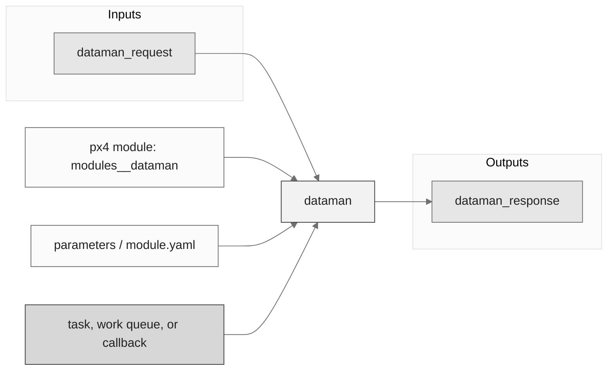
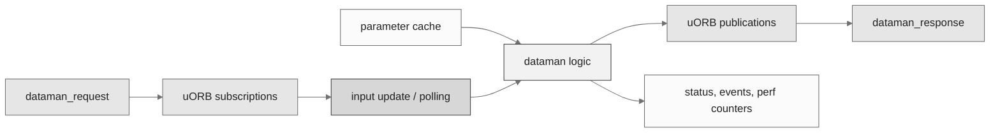
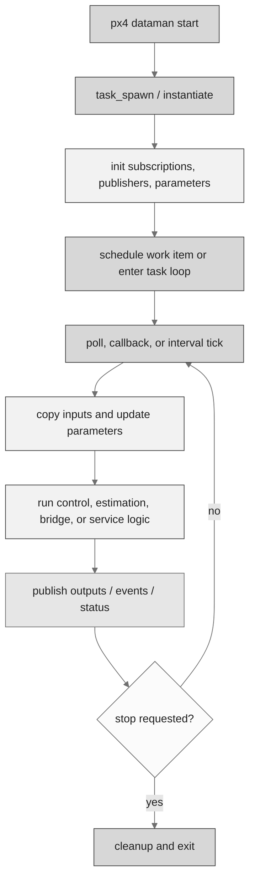
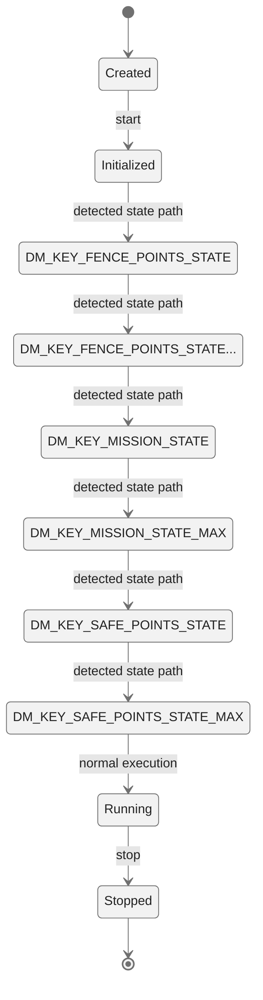
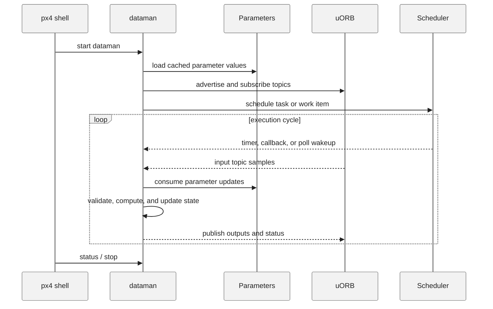
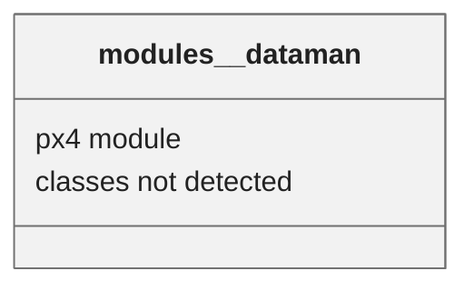

# PX4 Module Architecture: `dataman`

- Source: `src/modules/dataman`
- Build target: `modules__dataman`
- Runtime main: `dataman`
- Build kind: `px4 module`
- Mermaid palette: `ash` grey tone

Module to provide persistent storage for the rest of the system in form of a simple database through a C API. Multiple backends are supported depending on the board: - a file (eg. on the SD card) - RAM (this is obviously not persistent) It is used to store structured data of different types: mission waypoints, mission state and geofence polygons. Each type has a specific type and a fixed maximum amount of storage items, so that fast random access is possible. Reading and writing a single item is always atomic.

## Description of Module

Provides persistent storage services for mission, geofence, rally point, and other structured data records.

### Primary Responsibilities

- Provide persistence, replay, or data-recording services used by other PX4 modules.
- Consume runtime inputs from uORB topics such as `dataman_request`.
- Publish outputs or status topics such as `dataman_response`.
- Use module configuration from `parameters.yaml`.
- Implement behavior mostly in C/C++ source functions rather than detected C++ classes.

### Runtime Behavior

- Creates a dedicated PX4 task/thread with `px4_task_spawn_cmd()`.
- Waits on file descriptors or uORB subscriptions with `px4_poll()`.

## Background Theory

No dedicated mathematical model was identified in the generated source scan. This module is best understood through its PX4 state handling, uORB message flow, scheduling, and configuration surfaces described below.

### Main Interfaces

| Area | Details |
| --- | --- |
| Primary inputs | `dataman_request` |
| Primary outputs | `dataman_response` |
| Referenced topics | `dataman_request`, `dataman_response`, `mission` |
| Parameters/config | parameters.yaml |
| Key classes | none detected |

### Files

| File | Why it matters |
| --- | --- |
| dataman.cpp | Entry point, start command, or module lifecycle code |
| CMakeLists.txt | Build, parameter, or module configuration |
| parameters.yaml | Build, parameter, or module configuration |

## Architecture Overview

This page is generated from the module source tree and shows the stable architecture surfaces: build entry point, scheduling shape, uORB data interfaces, parameter/configuration surfaces, and C++ types found in the module.

## Build and Entry Points

| Field | Value |
| --- | --- |
| Module path | src/modules/dataman |
| Build kind | px4 module |
| Build target | modules__dataman |
| Runtime main | dataman |
| Stack main | Not specified |
| Module config | parameters.yaml |
| Detected sources | 1 |
| Detected headers | 1 |
| Detected configs | 2 |

### CMake Dependencies

- No explicit CMake dependencies detected.

### Nested Module Targets

- No nested module targets detected.

## Data Flow

### uORB Topics

| Topic | Detected direction |
| --- | --- |
| dataman_request | subscribed |
| dataman_response | published |
| mission | referenced |

## Execution Flow

The common PX4 module lifecycle is command entry, object construction or task spawn, parameter loading, topic setup, scheduled execution, publication, status reporting, and stop/cleanup. Modules that use `ModuleBase`, `ScheduledWorkItem`, polling loops, or bridge callbacks still fit this lifecycle with different scheduling triggers.

## State Machine

### Detected State-Like Symbols

- `DM_KEY_FENCE_POINTS_STATE`
- `DM_KEY_FENCE_POINTS_STATE_MAX`
- `DM_KEY_MISSION_STATE`
- `DM_KEY_MISSION_STATE_MAX`
- `DM_KEY_SAFE_POINTS_STATE`
- `DM_KEY_SAFE_POINTS_STATE_MAX`
- `MISSION_FENCE_POINT_STATE_SIZE`
- `MISSION_SAFE_POINT_STATE_SIZE`
- `PX4_O_MODE_666`

## Sequence Diagram

## Class Diagram

### Detected Classes

| Class | Base | File |
| --- | --- | --- |
| None detected. | None detected. | None detected. |

### Detected Enums

- No enums detected.

## Parameters and Configuration

- No parameters detected.

## Source Map

| File | Kind |
| --- | --- |
| CMakeLists.txt | build |
| dataman.cpp | source |
| dataman.h | header |
| parameters.yaml | config |

## Review Notes

- The diagrams are generated from static source inventory and should be used as a study map, not as a formal proof of every runtime branch.
- Topic direction is inferred from nearby source context such as `Subscription`, `Publication`, `orb_subscribe`, and `publish` usage.
- When a module has no explicit state enum, the state diagram shows the standard PX4 module lifecycle.
