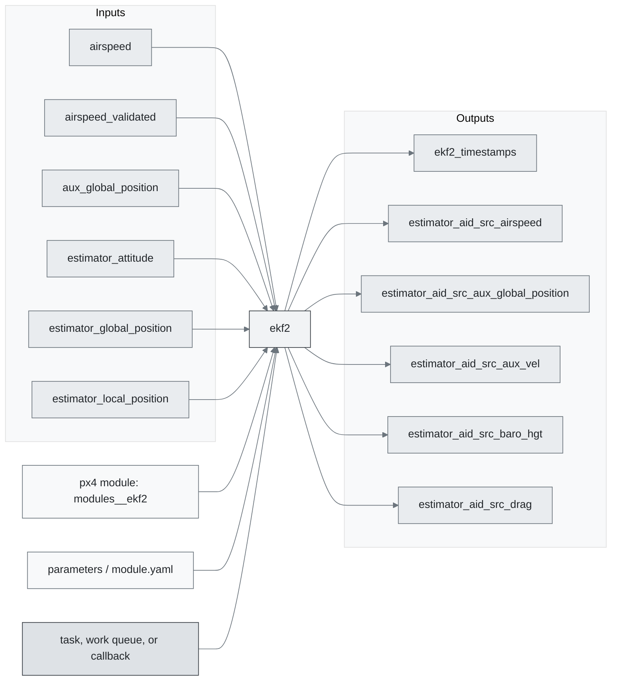
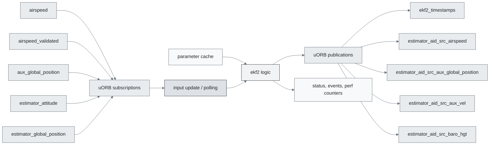
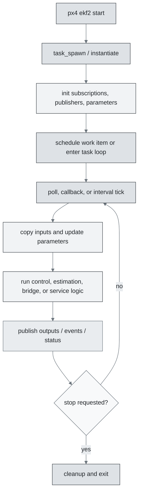
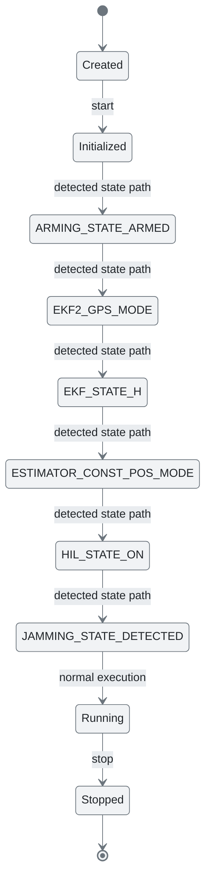
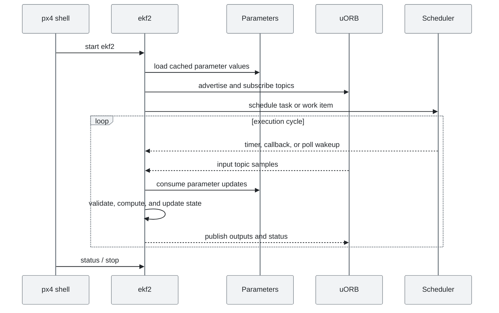

# PX4 Module Architecture: `ekf2`

- Source: `src/modules/ekf2`
- Build target: `modules__ekf2`
- Runtime main: `ekf2`
- Build kind: `px4 module`
- Mermaid palette: `mist` grey tone

Architecture notes for the ekf2 module.

## Architecture Overview

This page is generated from the module source tree and shows the stable architecture surfaces: build entry point, scheduling shape, uORB data interfaces, parameter/configuration surfaces, and C++ types found in the module.

## Build and Entry Points

| Field | Value |
| --- | --- |
| Module path | src/modules/ekf2 |
| Build kind | px4 module |
| Build target | modules__ekf2 |
| Runtime main | ekf2 |
| Stack main | Not specified |
| Module config | module.yaml |
| Detected sources | 47 |
| Detected headers | 49 |
| Detected configs | 26 |

### CMake Dependencies

- `geo`
- `hysteresis`
- `perf`
- `px4_work_queue`
- `world_magnetic_model`
- `${EKF_LIBS}`
- `lat_lon_alt`
- `bias_estimator`
- `output_predictor`
- `UNITY_BUILD`

### Nested Module Targets

- No nested module targets detected.

## Data Flow

### uORB Topics

| Topic | Detected direction |
| --- | --- |
| airspeed | subscribed |
| airspeed_validated | subscribed |
| aux_global_position | subscribed |
| distance_sensor | referenced |
| ekf2_timestamps | published |
| estimator_aid_source1d | referenced |
| estimator_aid_source2d | referenced |
| estimator_aid_source3d | referenced |
| estimator_aid_src_airspeed | published |
| estimator_aid_src_aux_global_position | published |
| estimator_aid_src_aux_vel | published |
| estimator_aid_src_baro_hgt | published |
| estimator_aid_src_drag | published |
| estimator_aid_src_ev_hgt | published |
| estimator_aid_src_ev_pos | published |
| estimator_aid_src_ev_vel | published |
| estimator_aid_src_ev_yaw | published |
| estimator_aid_src_fake_hgt | published |
| estimator_aid_src_fake_pos | published |
| estimator_aid_src_gnss_hgt | published |
| estimator_aid_src_gnss_pos | published |
| estimator_aid_src_gnss_vel | published |
| estimator_aid_src_gnss_yaw | published |
| estimator_aid_src_gravity | published |
| estimator_aid_src_mag | published |
| estimator_aid_src_optical_flow | published |
| estimator_aid_src_ranging_beacon | published |
| estimator_aid_src_rng_hgt | published |
| estimator_aid_src_sideslip | published |
| estimator_attitude | subscribed, published |
| estimator_baro_bias | published |
| estimator_bias | referenced |
| estimator_bias3d | referenced |
| estimator_ev_pos_bias | published |
| estimator_event_flags | published |
| estimator_fusion_control | published |
| estimator_global_position | subscribed, published |
| estimator_gnss_hgt_bias | published |
| estimator_gps_status | published |
| estimator_innovation_test_ratios | published |
| estimator_innovation_variances | published |
| estimator_innovations | published |
| estimator_local_position | subscribed, published |
| estimator_odometry | subscribed, published |
| estimator_optical_flow_vel | published |
| estimator_selector_status | published |
| estimator_sensor_bias | published |
| estimator_states | published |
| ... 28 more topics | omitted |

## Execution Flow

The common PX4 module lifecycle is command entry, object construction or task spawn, parameter loading, topic setup, scheduled execution, publication, status reporting, and stop/cleanup. Modules that use `ModuleBase`, `ScheduledWorkItem`, polling loops, or bridge callbacks still fit this lifecycle with different scheduling triggers.

## State Machine

### Detected State-Like Symbols

- `ARMING_STATE_ARMED`
- `EKF2_GPS_MODE`
- `EKF_STATE_H`
- `ESTIMATOR_CONST_POS_MODE`
- `HIL_STATE_ON`
- `JAMMING_STATE_DETECTED`
- `N_MODELS_EKFGSF`
- `SENS_IMU_MODE`
- `SENS_MAG_MODE`
- `SPOOFING_STATE_DETECTED`

## Sequence Diagram

## Class Diagram

```mermaid
%%{init: {"theme":"base","themeVariables":{"primaryColor":"#f1f3f5","secondaryColor":"#e9ecef","tertiaryColor":"#f8f9fa","primaryBorderColor":"#6c757d","primaryTextColor":"#212529","lineColor":"#6c757d","fontFamily":"Inter, Arial, sans-serif"}}}%%
classDiagram
  class Ekf
  Ekf : EKF/aid_sources/EstimatorAidSource.hpp
  class EstimatorAidSource
  EstimatorAidSource : EKF/aid_sources/EstimatorAidSource.hpp
  class ZeroGyroUpdate
  ZeroGyroUpdate : EKF/aid_sources/ZeroGyroUpdate.hpp
  class EstimatorAidSource
  EstimatorAidSource <|-- ZeroGyroUpdate
  class ZeroVelocityUpdate
  ZeroVelocityUpdate : EKF/aid_sources/ZeroVelocityUpdate.hpp
  class EstimatorAidSource
  EstimatorAidSource <|-- ZeroVelocityUpdate
  class Ekf_4
  Ekf_4 : EKF/aid_sources/aux_global_position/aux_global_posi...
  class AuxGlobalPosition
  AuxGlobalPosition : EKF/aid_sources/aux_global_position/aux_global_posi...
  class ModuleParams
  ModuleParams <|-- AuxGlobalPosition
  class Ekf_6
  Ekf_6 : EKF/aid_sources/aux_global_position/aux_global_posi...
  class AgpSource
  AgpSource : EKF/aid_sources/aux_global_position/aux_global_posi...
  class Ctrl
  Ctrl : EKF/aid_sources/aux_global_position/aux_global_posi...
  class Mode
  Mode : EKF/aid_sources/aux_global_position/aux_global_posi...
  class State
  State : EKF/aid_sources/aux_global_position/aux_global_posi...
  class ExternalVisionVel
  ExternalVisionVel : EKF/aid_sources/external_vision/ev_vel.h
  class EvVelBodyFrameFrd
  EvVelBodyFrameFrd : EKF/aid_sources/external_vision/ev_vel.h
  class ExternalVisionVel
  ExternalVisionVel <|-- EvVelBodyFrameFrd
  class EvVelLocalFrameNed
  EvVelLocalFrameNed : EKF/aid_sources/external_vision/ev_vel.h
  class ExternalVisionVel
  ExternalVisionVel <|-- EvVelLocalFrameNed
  class EvVelLocalFrameFrd
  EvVelLocalFrameFrd : EKF/aid_sources/external_vision/ev_vel.h
  class ExternalVisionVel
  ExternalVisionVel <|-- EvVelLocalFrameFrd
  class GnssChecks
  GnssChecks : EKF/aid_sources/gnss/gnss_checks.hpp
```

### Detected Classes

| Class | Base | File |
| --- | --- | --- |
| Ekf |  | EKF/aid_sources/EstimatorAidSource.hpp |
| EstimatorAidSource |  | EKF/aid_sources/EstimatorAidSource.hpp |
| ZeroGyroUpdate | EstimatorAidSource | EKF/aid_sources/ZeroGyroUpdate.hpp |
| ZeroVelocityUpdate | EstimatorAidSource | EKF/aid_sources/ZeroVelocityUpdate.hpp |
| Ekf |  | EKF/aid_sources/aux_global_position/aux_global_position.hpp |
| AuxGlobalPosition | ModuleParams | EKF/aid_sources/aux_global_position/aux_global_position.hpp |
| Ekf |  | EKF/aid_sources/aux_global_position/aux_global_position_control.hpp |
| AgpSource |  | EKF/aid_sources/aux_global_position/aux_global_position_control.hpp |
| Ctrl |  | EKF/aid_sources/aux_global_position/aux_global_position_control.hpp |
| Mode |  | EKF/aid_sources/aux_global_position/aux_global_position_control.hpp |
| State |  | EKF/aid_sources/aux_global_position/aux_global_position_control.hpp |
| ExternalVisionVel |  | EKF/aid_sources/external_vision/ev_vel.h |
| EvVelBodyFrameFrd | ExternalVisionVel | EKF/aid_sources/external_vision/ev_vel.h |
| EvVelLocalFrameNed | ExternalVisionVel | EKF/aid_sources/external_vision/ev_vel.h |
| EvVelLocalFrameFrd | ExternalVisionVel | EKF/aid_sources/external_vision/ev_vel.h |
| GnssChecks |  | EKF/aid_sources/gnss/gnss_checks.hpp |
| GnssChecksMask |  | EKF/aid_sources/gnss/gnss_checks.hpp |
| RangeFinderConsistencyCheck |  | EKF/aid_sources/range_finder/range_finder_consistency_check.hpp |
| containing |  | EKF/aid_sources/range_finder/sensor_range_finder.hpp |
| SensorRangeFinder |  | EKF/aid_sources/range_finder/sensor_range_finder.hpp |
| BiasEstimator |  | EKF/bias_estimator/bias_estimator.hpp |
| HeightBiasEstimator | BiasEstimator | EKF/bias_estimator/height_bias_estimator.hpp |
| PositionBiasEstimator |  | EKF/bias_estimator/position_bias_estimator.hpp |
| PositionFrame |  | EKF/common.h |
| ... 27 more |  |  |

### Detected Enums

- `Ctrl`
- `EvCtrl`
- `FlowGyroSource`
- `GeoDeclinationMask`
- `GnssChecksMask`
- `GnssCtrl`
- `GnssMode`
- `HeightSensor`
- `ImuCtrl`
- `Likelihood`
- `MagCheckMask`
- `MagFuseType`
- `Mode`
- `PositionFrame`
- `PositionSensor`
- `ReferenceType`
- `RngCtrl`
- `SensEn`
- `State`
- `TerrainFusionMask`
- `VelocityFrame`

## Parameters and Configuration

- No parameters detected.

## Source Map

| File | Kind |
| --- | --- |
| CMakeLists.txt | build |
| EKF/CMakeLists.txt | build |
| EKF/aid_sources/EstimatorAidSource.hpp | header |
| EKF/aid_sources/ZeroGyroUpdate.cpp | source |
| EKF/aid_sources/ZeroGyroUpdate.hpp | header |
| EKF/aid_sources/ZeroVelocityUpdate.cpp | source |
| EKF/aid_sources/ZeroVelocityUpdate.hpp | header |
| EKF/aid_sources/airspeed/airspeed_fusion.cpp | source |
| EKF/aid_sources/aux_global_position/aux_global_position.cpp | source |
| EKF/aid_sources/aux_global_position/aux_global_position.hpp | header |
| EKF/aid_sources/aux_global_position/aux_global_position_control.cpp | source |
| EKF/aid_sources/aux_global_position/aux_global_position_control.hpp | header |
| EKF/aid_sources/auxvel/auxvel_fusion.cpp | source |
| EKF/aid_sources/barometer/baro_height_control.cpp | source |
| EKF/aid_sources/drag/drag_fusion.cpp | source |
| EKF/aid_sources/external_vision/ev_control.cpp | source |
| EKF/aid_sources/external_vision/ev_height_control.cpp | source |
| EKF/aid_sources/external_vision/ev_pos_control.cpp | source |
| EKF/aid_sources/external_vision/ev_vel.h | header |
| EKF/aid_sources/external_vision/ev_vel_control.cpp | source |
| EKF/aid_sources/external_vision/ev_yaw_control.cpp | source |
| EKF/aid_sources/fake_height_control.cpp | source |
| EKF/aid_sources/fake_pos_control.cpp | source |
| EKF/aid_sources/gnss/gnss_checks.cpp | source |
| EKF/aid_sources/gnss/gnss_checks.hpp | header |
| EKF/aid_sources/gnss/gnss_height_control.cpp | source |
| EKF/aid_sources/gnss/gnss_yaw_control.cpp | source |
| EKF/aid_sources/gnss/gps_control.cpp | source |
| EKF/aid_sources/gravity/gravity_fusion.cpp | source |
| EKF/aid_sources/magnetometer/mag_control.cpp | source |
| EKF/aid_sources/magnetometer/mag_fusion.cpp | source |
| EKF/aid_sources/optical_flow/optical_flow_control.cpp | source |
| EKF/aid_sources/optical_flow/optical_flow_fusion.cpp | source |
| EKF/aid_sources/range_finder/range_finder_consistency_check.cpp | source |
| EKF/aid_sources/range_finder/range_finder_consistency_check.hpp | header |
| EKF/aid_sources/range_finder/range_height_control.cpp | source |
| EKF/aid_sources/range_finder/range_height_fusion.cpp | source |
| EKF/aid_sources/range_finder/sensor_range_finder.cpp | source |
| EKF/aid_sources/range_finder/sensor_range_finder.hpp | header |
| EKF/aid_sources/ranging_beacon/ranging_beacon_control.cpp | source |
| ... 82 more files | omitted |

## Review Notes

- The diagrams are generated from static source inventory and should be used as a study map, not as a formal proof of every runtime branch.
- Topic direction is inferred from nearby source context such as `Subscription`, `Publication`, `orb_subscribe`, and `publish` usage.
- When a module has no explicit state enum, the state diagram shows the standard PX4 module lifecycle.
