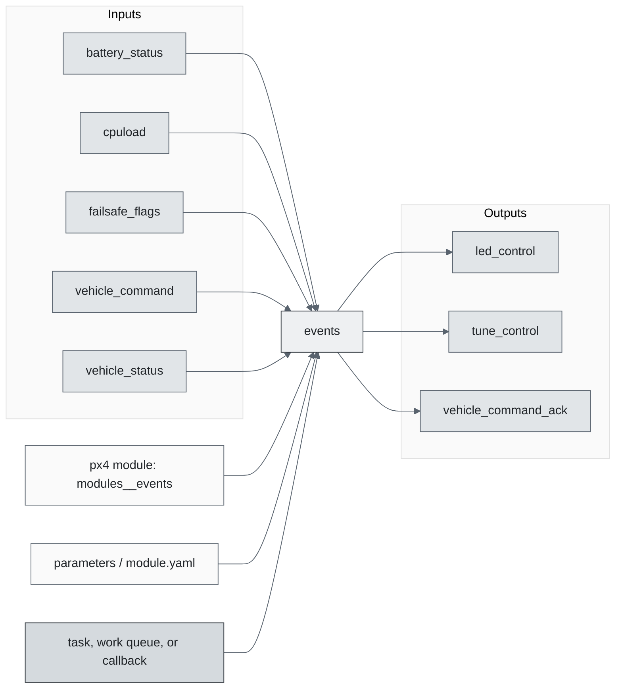
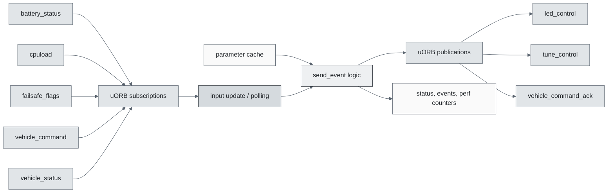
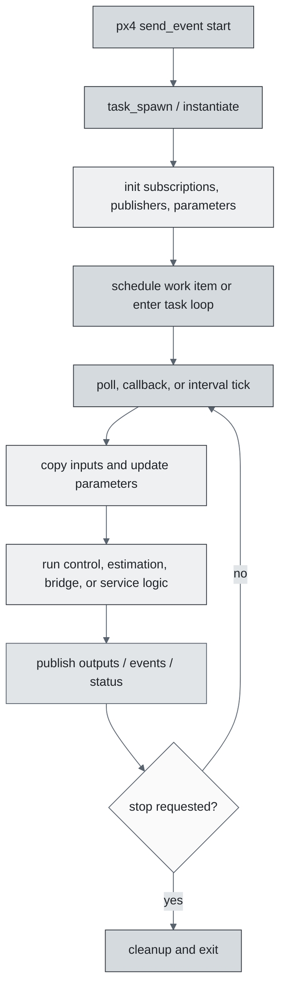
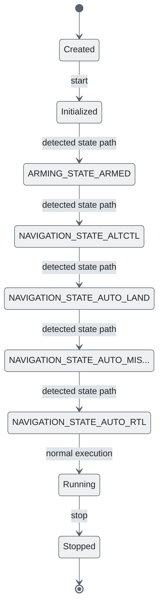
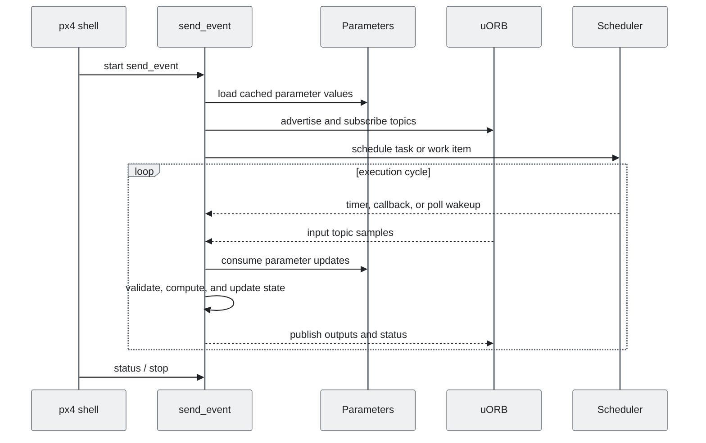
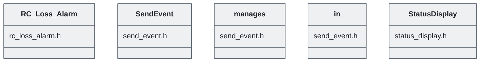

# PX4 Module Architecture: `events`

- Source: `src/modules/events`
- Build target: `modules__events`
- Runtime main: `send_event`
- Build kind: `px4 module`
- Mermaid palette: `slate` grey tone

Source-derived architecture notes for this PX4 module directory.

## Architecture Overview

This page is generated from the module source tree and shows the stable architecture surfaces: build entry point, scheduling shape, uORB data interfaces, parameter/configuration surfaces, and C++ types found in the module.

## Build and Entry Points

| Field | Value |
| --- | --- |
| Module path | src/modules/events |
| Build kind | px4 module |
| Build target | modules__events |
| Runtime main | send_event |
| Stack main | Not specified |
| Module config | events_params.yaml |
| Detected sources | 4 |
| Detected headers | 3 |
| Detected configs | 2 |

### CMake Dependencies

- No explicit CMake dependencies detected.

### Nested Module Targets

- No nested module targets detected.

## Data Flow

### uORB Topics

| Topic | Detected direction |
| --- | --- |
| battery_status | subscribed |
| cpuload | subscribed |
| failsafe_flags | subscribed |
| led_control | published |
| tune_control | published |
| vehicle_command | subscribed |
| vehicle_command_ack | published |
| vehicle_status | subscribed |

## Execution Flow

The common PX4 module lifecycle is command entry, object construction or task spawn, parameter loading, topic setup, scheduled execution, publication, status reporting, and stop/cleanup. Modules that use `ModuleBase`, `ScheduledWorkItem`, polling loops, or bridge callbacks still fit this lifecycle with different scheduling triggers.

## State Machine

### Detected State-Like Symbols

- `ARMING_STATE_ARMED`
- `NAVIGATION_STATE_ALTCTL`
- `NAVIGATION_STATE_AUTO_LAND`
- `NAVIGATION_STATE_AUTO_MISSION`
- `NAVIGATION_STATE_AUTO_RTL`

## Sequence Diagram

## Class Diagram

### Detected Classes

| Class | Base | File |
| --- | --- | --- |
| RC_Loss_Alarm |  | rc_loss_alarm.h |
| SendEvent |  | send_event.h |
| manages |  | send_event.h |
| in |  | send_event.h |
| StatusDisplay |  | status_display.h |

### Detected Enums

- No enums detected.

## Parameters and Configuration

- No parameters detected.

## Source Map

| File | Kind |
| --- | --- |
| CMakeLists.txt | build |
| events_params.yaml | config |
| rc_loss_alarm.cpp | source |
| rc_loss_alarm.h | header |
| send_event.cpp | source |
| send_event.h | header |
| set_leds.cpp | source |
| status_display.cpp | source |
| status_display.h | header |

## Review Notes

- The diagrams are generated from static source inventory and should be used as a study map, not as a formal proof of every runtime branch.
- Topic direction is inferred from nearby source context such as `Subscription`, `Publication`, `orb_subscribe`, and `publish` usage.
- When a module has no explicit state enum, the state diagram shows the standard PX4 module lifecycle.
