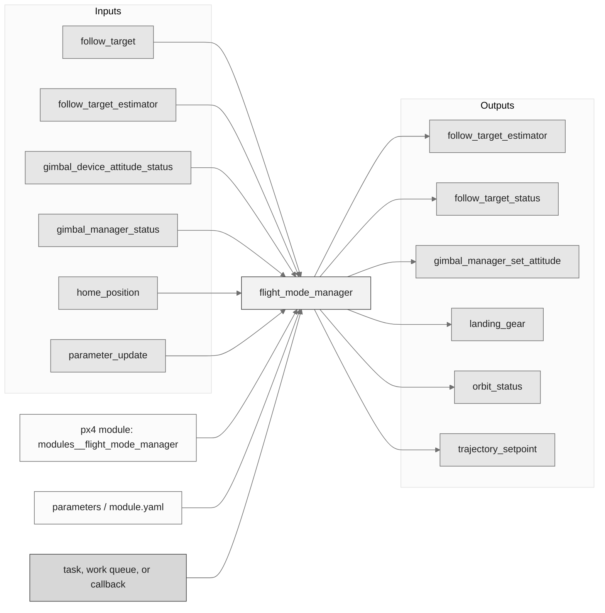
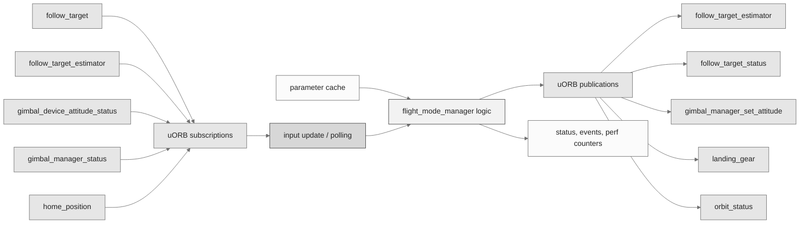
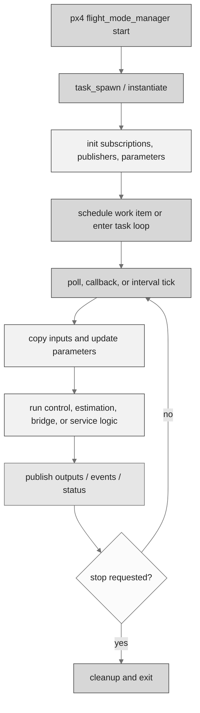
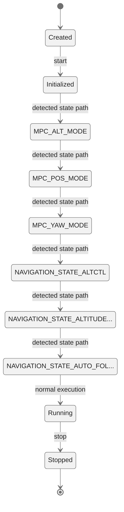
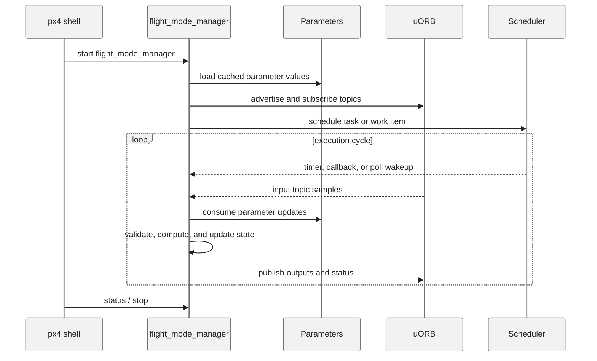

# PX4 Module Architecture: `flight_mode_manager`

- Source: `src/modules/flight_mode_manager`
- Build target: `modules__flight_mode_manager`
- Runtime main: `flight_mode_manager`
- Build kind: `px4 module`
- Mermaid palette: `ash` grey tone

This implements the setpoint generation for all modes. It takes the current mode state of the vehicle as input and outputs setpoints for controllers.

## Description of Module

Selects and runs multicopter flight-mode tasks that generate trajectory and control setpoints.

### Primary Responsibilities

- Coordinate higher-level vehicle behavior rather than directly driving actuators.
- Consume runtime inputs from uORB topics such as `follow_target`, `follow_target_estimator`, `gimbal_device_attitude_status`, `gimbal_manager_status`, `home_position`, `parameter_update`, `position_setpoint_triplet`, `prec_land_status`, ... 9 more.
- Publish outputs or status topics such as `follow_target_estimator`, `follow_target_status`, `gimbal_manager_set_attitude`, `landing_gear`, `orbit_status`, `trajectory_setpoint`, `vehicle_command`, `vehicle_constraints`.
- Use module configuration files such as `tasks/AutoFollowTarget/follow_target_params.yaml`, `tasks/ManualAccelerationSlow/flight_task_acceleration_slow_params.yaml`, `tasks/Orbit/flight_task_orbit_params.yaml`.
- Implement the main behavior in classes such as `FlightTaskError`, `FlightModeManager`, `FlightTaskAltitudeCruise`, `WaypointType`, `yaw_mode`, `FlightTaskAuto`, ... 20 more.

### Runtime Behavior

- Runs work-queue callbacks on queue configurations such as `nav_and_controllers`.
- Uses uORB callback registration so new topic data can schedule execution.
- Uses explicit work-item scheduling through immediate, delayed, or interval scheduling calls.

## Background Theory

No dedicated mathematical model was identified in the generated source scan. This module is best understood through its PX4 state handling, uORB message flow, scheduling, and configuration surfaces described below.

### Main Interfaces

| Area | Details |
| --- | --- |
| Primary inputs | `follow_target`, `follow_target_estimator`, `gimbal_device_attitude_status`, `gimbal_manager_status`, `home_position`, `parameter_update`, `position_setpoint_triplet`, `prec_land_status`, `takeoff_status`, `vehicle_attitude_setpoint`, ... 7 more |
| Primary outputs | `follow_target_estimator`, `follow_target_status`, `gimbal_manager_set_attitude`, `landing_gear`, `orbit_status`, `trajectory_setpoint`, `vehicle_command`, `vehicle_constraints` |
| Referenced topics | `follow_target`, `follow_target_estimator`, `follow_target_status`, `gimbal_device_attitude_status`, `gimbal_manager_set_attitude`, `gimbal_manager_status`, `home_position`, `landing_gear`, `manual_control_setpoint`, `orbit_status`, ... 16 more |
| Parameters/config | `tasks/AutoFollowTarget/follow_target_params.yaml`, `tasks/ManualAccelerationSlow/flight_task_acceleration_slow_params.yaml`, `tasks/Orbit/flight_task_orbit_params.yaml` |
| Key classes | `FlightTaskError`, `FlightModeManager`, `FlightTaskAltitudeCruise`, `WaypointType`, `yaw_mode`, `FlightTaskAuto`, `as`, `to`, `FlightTask`, `FlightTaskAutoFollowTarget`, ... 16 more |

### Files

| File | Why it matters |
| --- | --- |
| FlightModeManager.cpp | Entry point, start command, or module lifecycle code |
| tasks/AutoFollowTarget/follow_target_estimator/TargetEstimator.cpp | Work-item callback or main runtime update path |
| CMakeLists.txt | Build, parameter, or module configuration |
| tasks/AltitudeCruise/CMakeLists.txt | Build, parameter, or module configuration |
| tasks/Auto/CMakeLists.txt | Build, parameter, or module configuration |
| tasks/AutoFollowTarget/CMakeLists.txt | Build, parameter, or module configuration |
| tasks/AutoFollowTarget/follow_target_estimator/CMakeLists.txt | Build, parameter, or module configuration |
| FlightModeManager.hpp | Defines `FlightTaskError` class |

## Architecture Overview

This page is generated from the module source tree and shows the stable architecture surfaces: build entry point, scheduling shape, uORB data interfaces, parameter/configuration surfaces, and C++ types found in the module.

## Build and Entry Points

| Field | Value |
| --- | --- |
| Module path | src/modules/flight_mode_manager |
| Build kind | px4 module |
| Build target | modules__flight_mode_manager |
| Runtime main | flight_mode_manager |
| Stack main | Not specified |
| Module config | Not specified |
| Detected sources | 19 |
| Detected headers | 18 |
| Detected configs | 20 |

### CMake Dependencies

- `px4_work_queue`
- `WeatherVane`
- `flighttasks_generated`

### Nested Module Targets

- No nested module targets detected.

## Data Flow

### uORB Topics

| Topic | Detected direction |
| --- | --- |
| follow_target | subscribed |
| follow_target_estimator | subscribed, published |
| follow_target_status | published |
| gimbal_device_attitude_status | subscribed |
| gimbal_manager_set_attitude | published |
| gimbal_manager_status | subscribed |
| home_position | subscribed |
| landing_gear | published |
| manual_control_setpoint | referenced |
| orbit_status | published |
| parameter_update | subscribed |
| position_setpoint | referenced |
| position_setpoint_triplet | subscribed |
| prec_land_status | subscribed |
| takeoff_status | subscribed |
| trajectory_setpoint | published |
| vehicle_attitude | referenced |
| vehicle_attitude_setpoint | subscribed |
| vehicle_command | subscribed, published |
| vehicle_constraints | published |
| vehicle_control_mode | subscribed |
| vehicle_land_detected | subscribed |
| vehicle_local_position | subscribed |
| vehicle_local_position_setpoint | subscribed |
| vehicle_status | subscribed |
| velocity_limits | subscribed |

## Execution Flow

The common PX4 module lifecycle is command entry, object construction or task spawn, parameter loading, topic setup, scheduled execution, publication, status reporting, and stop/cleanup. Modules that use `ModuleBase`, `ScheduledWorkItem`, polling loops, or bridge callbacks still fit this lifecycle with different scheduling triggers.

## State Machine

### Detected State-Like Symbols

- `MPC_ALT_MODE`
- `MPC_POS_MODE`
- `MPC_YAW_MODE`
- `NAVIGATION_STATE_ALTCTL`
- `NAVIGATION_STATE_ALTITUDE_CRUISE`
- `NAVIGATION_STATE_AUTO_FOLLOW_TARGET`
- `NAVIGATION_STATE_DESCEND`
- `NAVIGATION_STATE_EXTERNAL1`
- `NAVIGATION_STATE_EXTERNAL8`
- `NAVIGATION_STATE_ORBIT`
- `NAVIGATION_STATE_POSCTL`
- `NAVIGATION_STATE_POSITION_SLOW`
- `PREC_LAND_STATE_DONE`
- `PREC_LAND_STATE_STOPPED`
- `TAKEOFF_STATE_FLIGHT`
- `TAKEOFF_STATE_RAMPUP`
- `TAKEOFF_STATE_UNINITIALIZED`

## Sequence Diagram

## Class Diagram

```mermaid
%%{init: {"theme":"base","themeVariables":{"primaryColor":"#f2f2f2","secondaryColor":"#e6e6e6","tertiaryColor":"#fbfbfb","primaryBorderColor":"#707070","primaryTextColor":"#222222","lineColor":"#707070","fontFamily":"Inter, Arial, sans-serif"}}}%%
classDiagram
  class FlightTaskError
  FlightTaskError : FlightModeManager.hpp
  class FlightModeManager
  FlightModeManager : FlightModeManager.hpp
  class ModuleBase
  ModuleBase <|-- FlightModeManager
  class FlightTaskAltitudeCruise
  FlightTaskAltitudeCruise : tasks/AltitudeCruise/FlightTaskAltitudeCruise.hpp
  class FlightTaskManualAltitudeSmoothVel
  FlightTaskManualAltitudeSmoothVel <|-- FlightTaskAltitudeCruise
  class WaypointType
  WaypointType : tasks/Auto/FlightTaskAuto.hpp
  class yaw_mode
  yaw_mode : tasks/Auto/FlightTaskAuto.hpp
  class FlightTaskAuto
  FlightTaskAuto : tasks/Auto/FlightTaskAuto.hpp
  class FlightTask
  FlightTask <|-- FlightTaskAuto
  class as
  as : tasks/AutoFollowTarget/FlightTaskAutoFollowTarget.cpp
  class to
  to : tasks/AutoFollowTarget/FlightTaskAutoFollowTarget.cpp
  class FlightTask
  FlightTask : tasks/AutoFollowTarget/FlightTaskAutoFollowTarget.cpp
  class FlightTaskAutoFollowTarget
  FlightTaskAutoFollowTarget : tasks/AutoFollowTarget/FlightTaskAutoFollowTarget.hpp
  class FlightTask
  FlightTask <|-- FlightTaskAutoFollowTarget
  class TargetEstimator
  TargetEstimator : tasks/AutoFollowTarget/follow_target_estimator/Targ...
  class ModuleParams
  ModuleParams <|-- TargetEstimator
  class FlightTaskDescend
  FlightTaskDescend : tasks/Descend/FlightTaskDescend.hpp
  class FlightTask
  FlightTask <|-- FlightTaskDescend
  class FlightTaskFailsafe
  FlightTaskFailsafe : tasks/Failsafe/FlightTaskFailsafe.hpp
  class FlightTask
  FlightTask <|-- FlightTaskFailsafe
  class FlightTask_13
  FlightTask_13 : tasks/FlightTask/FlightTask.hpp
  class ModuleParams
  ModuleParams <|-- FlightTask_13
  class FlightTaskManualAcceleration
  FlightTaskManualAcceleration : tasks/ManualAcceleration/FlightTaskManualAccelerati...
  class FlightTaskManualAltitudeSmoothVel
  FlightTaskManualAltitudeSmoothVel <|-- FlightTaskManualAcceleration
  class FlightTaskManualAccelerationSlow
  FlightTaskManualAccelerationSlow : tasks/ManualAccelerationSlow/FlightTaskManualAccele...
  class FlightTaskManualAcceleration
  FlightTaskManualAcceleration <|-- FlightTaskManualAccelerationSlow
```

### Detected Classes

| Class | Base | File |
| --- | --- | --- |
| FlightTaskError |  | FlightModeManager.hpp |
| FlightModeManager | ModuleBase | FlightModeManager.hpp |
| FlightTaskAltitudeCruise | FlightTaskManualAltitudeSmoothVel | tasks/AltitudeCruise/FlightTaskAltitudeCruise.hpp |
| WaypointType |  | tasks/Auto/FlightTaskAuto.hpp |
| yaw_mode |  | tasks/Auto/FlightTaskAuto.hpp |
| FlightTaskAuto | FlightTask | tasks/Auto/FlightTaskAuto.hpp |
| as |  | tasks/AutoFollowTarget/FlightTaskAutoFollowTarget.cpp |
| to |  | tasks/AutoFollowTarget/FlightTaskAutoFollowTarget.cpp |
| FlightTask |  | tasks/AutoFollowTarget/FlightTaskAutoFollowTarget.cpp |
| FlightTaskAutoFollowTarget | FlightTask | tasks/AutoFollowTarget/FlightTaskAutoFollowTarget.hpp |
| TargetEstimator | ModuleParams | tasks/AutoFollowTarget/follow_target_estimator/TargetEstimator.hpp |
| FlightTaskDescend | FlightTask | tasks/Descend/FlightTaskDescend.hpp |
| FlightTaskFailsafe | FlightTask | tasks/Failsafe/FlightTaskFailsafe.hpp |
| FlightTask | ModuleParams | tasks/FlightTask/FlightTask.hpp |
| FlightTaskManualAcceleration | FlightTaskManualAltitudeSmoothVel | tasks/ManualAcceleration/FlightTaskManualAcceleration.hpp |
| FlightTaskManualAccelerationSlow | FlightTaskManualAcceleration | tasks/ManualAccelerationSlow/FlightTaskManualAccelerationSlow.hpp |
| FlightTaskManualAltitude | FlightTask | tasks/ManualAltitude/FlightTaskManualAltitude.hpp |
| define |  | tasks/ManualAltitude/FlightTaskManualAltitude.hpp |
| drove |  | tasks/ManualAltitudeSmoothVel/FlightTaskManualAltitudeSmoothVel.cpp |
| FlightTaskManualAltitudeSmoothVel | FlightTaskManualAltitude | tasks/ManualAltitudeSmoothVel/FlightTaskManualAltitudeSmoothVel.hpp |
| FlightTaskManualPosition | FlightTaskManualAltitude | tasks/ManualPosition/FlightTaskManualPosition.hpp |
| FlightTaskOrbit | FlightTaskManualAltitudeSmoothVel | tasks/Orbit/FlightTaskOrbit.hpp |
| FlightTaskTransition | FlightTask | tasks/Transition/FlightTaskTransition.hpp |
| Gimbal | ModuleParams | tasks/Utility/Gimbal.hpp |
| ... 2 more |  |  |

### Detected Enums

- `FlightTaskError`
- `WaypointType`
- `has`
- `kFollowAltitudeMode`
- `yaw_mode`

## Parameters and Configuration

- No parameters detected.

## Source Map

| File | Kind |
| --- | --- |
| CMakeLists.txt | build |
| FlightModeManager.cpp | source |
| FlightModeManager.hpp | header |
| tasks/AltitudeCruise/CMakeLists.txt | build |
| tasks/AltitudeCruise/FlightTaskAltitudeCruise.cpp | source |
| tasks/AltitudeCruise/FlightTaskAltitudeCruise.hpp | header |
| tasks/Auto/CMakeLists.txt | build |
| tasks/Auto/FlightTaskAuto.cpp | source |
| tasks/Auto/FlightTaskAuto.hpp | header |
| tasks/AutoFollowTarget/CMakeLists.txt | build |
| tasks/AutoFollowTarget/FlightTaskAutoFollowTarget.cpp | source |
| tasks/AutoFollowTarget/FlightTaskAutoFollowTarget.hpp | header |
| tasks/AutoFollowTarget/follow_target_estimator/CMakeLists.txt | build |
| tasks/AutoFollowTarget/follow_target_estimator/TargetEstimator.cpp | source |
| tasks/AutoFollowTarget/follow_target_estimator/TargetEstimator.hpp | header |
| tasks/AutoFollowTarget/follow_target_params.yaml | config |
| tasks/CMakeLists.txt | build |
| tasks/Descend/CMakeLists.txt | build |
| tasks/Descend/FlightTaskDescend.cpp | source |
| tasks/Descend/FlightTaskDescend.hpp | header |
| tasks/Failsafe/CMakeLists.txt | build |
| tasks/Failsafe/FlightTaskFailsafe.cpp | source |
| tasks/Failsafe/FlightTaskFailsafe.hpp | header |
| tasks/FlightTask/CMakeLists.txt | build |
| tasks/FlightTask/FlightTask.cpp | source |
| tasks/FlightTask/FlightTask.hpp | header |
| tasks/ManualAcceleration/CMakeLists.txt | build |
| tasks/ManualAcceleration/FlightTaskManualAcceleration.cpp | source |
| tasks/ManualAcceleration/FlightTaskManualAcceleration.hpp | header |
| tasks/ManualAccelerationSlow/CMakeLists.txt | build |
| tasks/ManualAccelerationSlow/FlightTaskManualAccelerationSlow.cpp | source |
| tasks/ManualAccelerationSlow/FlightTaskManualAccelerationSlow.hpp | header |
| tasks/ManualAccelerationSlow/flight_task_acceleration_slow_params.yaml | config |
| tasks/ManualAltitude/CMakeLists.txt | build |
| tasks/ManualAltitude/FlightTaskManualAltitude.cpp | source |
| tasks/ManualAltitude/FlightTaskManualAltitude.hpp | header |
| tasks/ManualAltitudeSmoothVel/CMakeLists.txt | build |
| tasks/ManualAltitudeSmoothVel/FlightTaskManualAltitudeSmoothVel.cpp | source |
| tasks/ManualAltitudeSmoothVel/FlightTaskManualAltitudeSmoothVel.hpp | header |
| tasks/ManualPosition/CMakeLists.txt | build |
| ... 17 more files | omitted |

## Review Notes

- The diagrams are generated from static source inventory and should be used as a study map, not as a formal proof of every runtime branch.
- Topic direction is inferred from nearby source context such as `Subscription`, `Publication`, `orb_subscribe`, and `publish` usage.
- When a module has no explicit state enum, the state diagram shows the standard PX4 module lifecycle.
