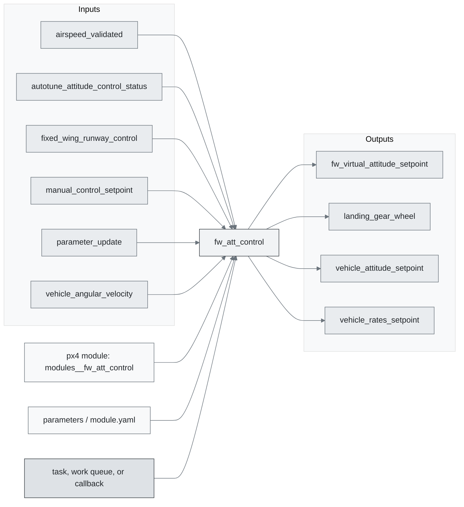
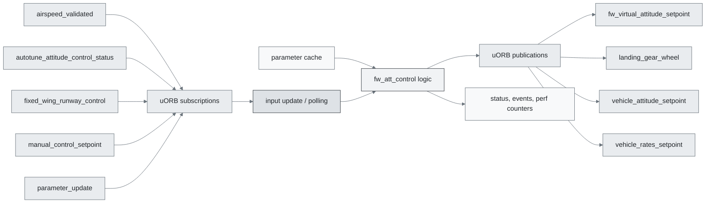
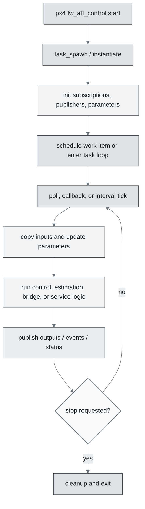
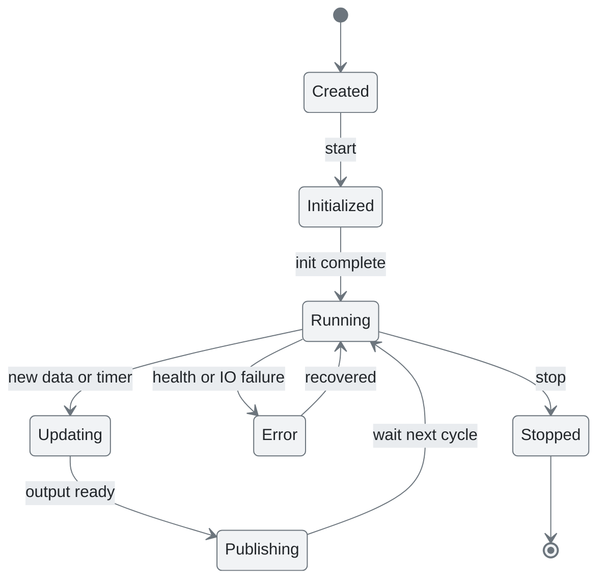
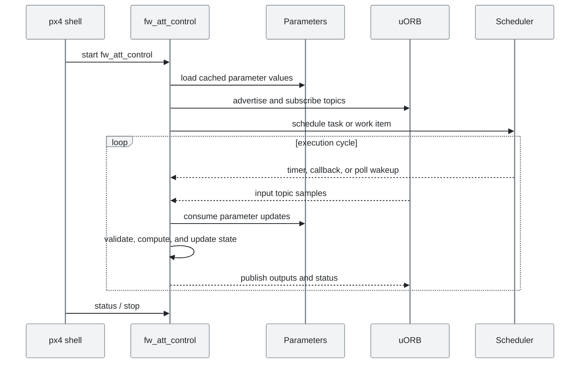
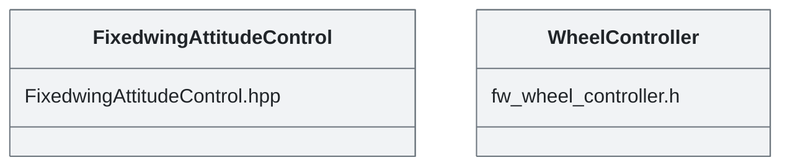

# PX4 Module Architecture: `fw_att_control`

- Source: `src/modules/fw_att_control`
- Build target: `modules__fw_att_control`
- Runtime main: `fw_att_control`
- Build kind: `px4 module`
- Mermaid palette: `mist` grey tone

fw_att_control is the fixed wing attitude controller.

## Description of Module

Runs fixed-wing attitude control and produces fixed-wing torque or actuator control demands.

### Primary Responsibilities

- Convert selected state estimates and setpoints into downstream control or actuator-facing setpoints.
- Consume runtime inputs from uORB topics such as `airspeed_validated`, `autotune_attitude_control_status`, `fixed_wing_runway_control`, `manual_control_setpoint`, `parameter_update`, `vehicle_angular_velocity`, `vehicle_attitude`, `vehicle_attitude_setpoint`, ... 4 more.
- Publish outputs or status topics such as `fw_virtual_attitude_setpoint`, `landing_gear_wheel`, `vehicle_attitude_setpoint`, `vehicle_rates_setpoint`.
- Use module configuration from `fw_att_control_params.yaml`.
- Implement the main behavior in classes such as `FixedwingAttitudeControl`, `WheelController`.

### Runtime Behavior

- Runs work-queue callbacks on queue configurations such as `nav_and_controllers`.
- Uses uORB callback registration so new topic data can schedule execution.
- Uses explicit work-item scheduling through immediate, delayed, or interval scheduling calls.

## Background Theory

Fixed-wing attitude control converts attitude error into body-rate setpoints. The downstream rate controller then tracks those rates with control-surface torque commands.

```text
roll_error = wrap(roll_sp - roll)
pitch_error = wrap(pitch_sp - pitch)
yaw_coordination ~= g / max(airspeed, eps) * tan(roll_sp)
roll_rate_sp = K_roll * roll_error + roll_rate_ff
pitch_rate_sp = K_pitch * pitch_error + pitch_rate_ff
yaw_rate_sp = yaw_coordination
```

These equations are the study-level form of the algorithm. The implementation applies PX4-specific saturation, validity checks, parameter updates, and frame conventions around these core relationships.

### Main Interfaces

| Area | Details |
| --- | --- |
| Primary inputs | `airspeed_validated`, `autotune_attitude_control_status`, `fixed_wing_runway_control`, `manual_control_setpoint`, `parameter_update`, `vehicle_angular_velocity`, `vehicle_attitude`, `vehicle_attitude_setpoint`, `vehicle_control_mode`, `vehicle_land_detected`, ... 2 more |
| Primary outputs | `fw_virtual_attitude_setpoint`, `landing_gear_wheel`, `vehicle_attitude_setpoint`, `vehicle_rates_setpoint` |
| Referenced topics | `airspeed_validated`, `autotune_attitude_control_status`, `fixed_wing_runway_control`, `fw_virtual_attitude_setpoint`, `landing_gear_wheel`, `manual_control_setpoint`, `parameter_update`, `vehicle_angular_velocity`, `vehicle_attitude`, `vehicle_attitude_setpoint`, ... 5 more |
| Parameters/config | fw_att_control_params.yaml |
| Key classes | `FixedwingAttitudeControl`, `WheelController` |

### Files

| File | Why it matters |
| --- | --- |
| FixedwingAttitudeControl.cpp | Entry point, start command, or module lifecycle code |
| CMakeLists.txt | Build, parameter, or module configuration |
| fw_att_control_params.yaml | Build, parameter, or module configuration |
| FixedwingAttitudeControl.hpp | Defines `FixedwingAttitudeControl` class |
| fw_wheel_controller.h | Defines `WheelController` class |

## Architecture Overview

This page is generated from the module source tree and shows the stable architecture surfaces: build entry point, scheduling shape, uORB data interfaces, parameter/configuration surfaces, and C++ types found in the module.



## Build and Entry Points

| Field | Value |
| --- | --- |
| Module path | src/modules/fw_att_control |
| Build kind | px4 module |
| Build target | modules__fw_att_control |
| Runtime main | fw_att_control |
| Stack main | Not specified |
| Module config | fw_att_control_params.yaml |
| Detected sources | 3 |
| Detected headers | 2 |
| Detected configs | 2 |

### CMake Dependencies

- `px4_work_queue`

### Nested Module Targets

- No nested module targets detected.

## Data Flow



### uORB Topics

| Topic | Detected direction |
| --- | --- |
| airspeed_validated | subscribed |
| autotune_attitude_control_status | subscribed |
| fixed_wing_runway_control | subscribed |
| fw_virtual_attitude_setpoint | published |
| landing_gear_wheel | published |
| manual_control_setpoint | subscribed |
| parameter_update | subscribed |
| vehicle_angular_velocity | subscribed |
| vehicle_attitude | subscribed |
| vehicle_attitude_setpoint | subscribed, published |
| vehicle_control_mode | subscribed |
| vehicle_land_detected | subscribed |
| vehicle_local_position | subscribed |
| vehicle_rates_setpoint | published |
| vehicle_status | subscribed |

## Execution Flow



The common PX4 module lifecycle is command entry, object construction or task spawn, parameter loading, topic setup, scheduled execution, publication, status reporting, and stop/cleanup. Modules that use `ModuleBase`, `ScheduledWorkItem`, polling loops, or bridge callbacks still fit this lifecycle with different scheduling triggers.

## State Machine



### Detected State-Like Symbols

- No state-like symbols detected.

## Sequence Diagram



## Class Diagram



### Detected Classes

| Class | Base | File |
| --- | --- | --- |
| FixedwingAttitudeControl |  | FixedwingAttitudeControl.hpp |
| WheelController |  | fw_wheel_controller.h |

### Detected Enums

- No enums detected.

## Parameters and Configuration

- No parameters detected.

## Source Map

| File | Kind |
| --- | --- |
| CMakeLists.txt | build |
| FixedwingAttitudeControl.cpp | source |
| FixedwingAttitudeControl.hpp | header |
| FixedwingAttitudeControlTest.cpp | source |
| fw_att_control_params.yaml | config |
| fw_wheel_controller.cpp | source |
| fw_wheel_controller.h | header |

## Review Notes

- The diagrams are generated from static source inventory and should be used as a study map, not as a formal proof of every runtime branch.
- Topic direction is inferred from nearby source context such as `Subscription`, `Publication`, `orb_subscribe`, and `publish` usage.
- When a module has no explicit state enum, the state diagram shows the standard PX4 module lifecycle.
