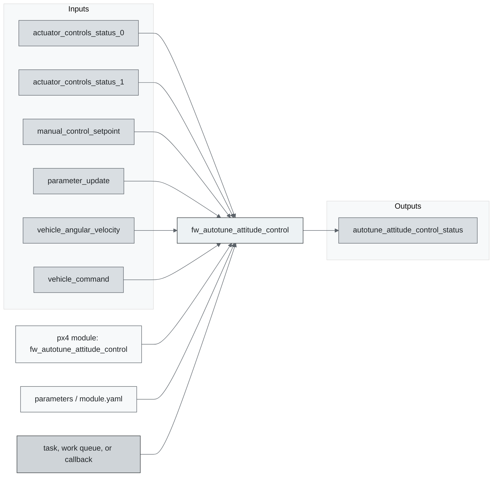
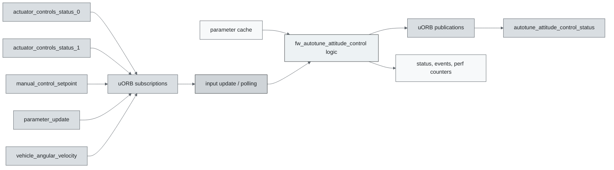
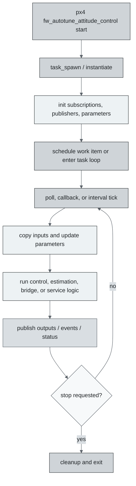
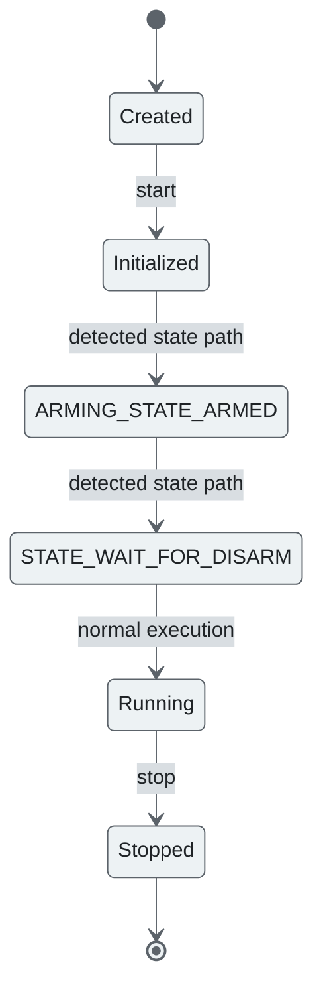
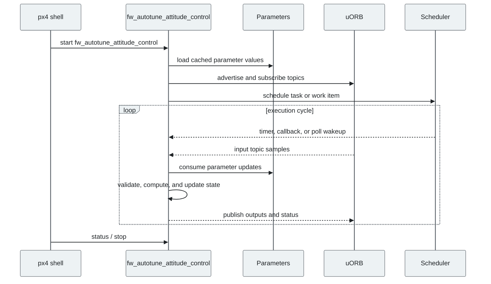
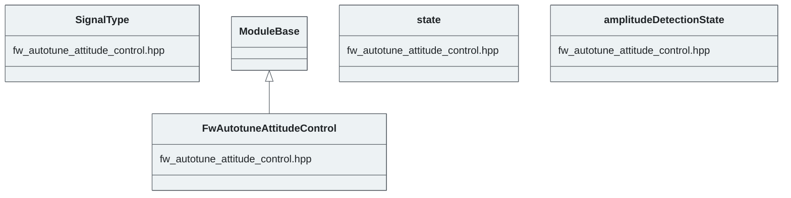

# PX4 Module Architecture: `fw_autotune_attitude_control`

- Source: `src/modules/fw_autotune_attitude_control`
- Build target: `fw_autotune_attitude_control`
- Runtime main: `fw_autotune_attitude_control`
- Build kind: `px4 module`
- Mermaid palette: `graphite` grey tone

Source-derived architecture notes for this PX4 module directory.

## Description of Module

Injects and evaluates fixed-wing attitude-control excitation to support automatic gain tuning.

### Primary Responsibilities

- Convert selected state estimates and setpoints into downstream control or actuator-facing setpoints.
- Consume runtime inputs from uORB topics such as `actuator_controls_status_0`, `actuator_controls_status_1`, `manual_control_setpoint`, `parameter_update`, `vehicle_angular_velocity`, `vehicle_command`, `vehicle_status`, `vehicle_torque_setpoint`.
- Publish outputs or status topics such as `autotune_attitude_control_status`.
- Use module configuration from `fw_autotune_attitude_control_params.yaml`.
- Implement the main behavior in classes such as `SignalType`, `FwAutotuneAttitudeControl`, `state`, `amplitudeDetectionState`.

### Runtime Behavior

- Runs work-queue callbacks on queue configurations such as `hp_default`.
- Uses uORB callback registration so new topic data can schedule execution.

## Background Theory

Autotune injects controlled excitation, estimates the axis frequency response, then derives gains from target bandwidth and phase-margin constraints.

```text
For excitation u(t) and measured response y(t):
G(jw) = FFT(y) / FFT(u)
phase_margin = pi + angle(G(jw_c))
|K(jw_c) * G(jw_c)| ~= 1

PID form:
u = Kp*e + Ki*integral(e) + Kd*de/dt
```

These equations are the study-level form of the algorithm. The implementation applies PX4-specific saturation, validity checks, parameter updates, and frame conventions around these core relationships.

### Main Interfaces

| Area | Details |
| --- | --- |
| Primary inputs | `actuator_controls_status_0`, `actuator_controls_status_1`, `manual_control_setpoint`, `parameter_update`, `vehicle_angular_velocity`, `vehicle_command`, `vehicle_status`, `vehicle_torque_setpoint` |
| Primary outputs | `autotune_attitude_control_status` |
| Referenced topics | `actuator_controls_status`, `actuator_controls_status_0`, `actuator_controls_status_1`, `autotune_attitude_control_status`, `manual_control_setpoint`, `parameter_update`, `vehicle_angular_velocity`, `vehicle_command`, `vehicle_status`, `vehicle_torque_setpoint` |
| Parameters/config | fw_autotune_attitude_control_params.yaml |
| Key classes | `SignalType`, `FwAutotuneAttitudeControl`, `state`, `amplitudeDetectionState` |

### Files

| File | Why it matters |
| --- | --- |
| fw_autotune_attitude_control.cpp | Entry point, start command, or module lifecycle code |
| CMakeLists.txt | Build, parameter, or module configuration |
| fw_autotune_attitude_control_params.yaml | Build, parameter, or module configuration |
| fw_autotune_attitude_control.hpp | Defines `SignalType` class |

## Architecture Overview

This page is generated from the module source tree and shows the stable architecture surfaces: build entry point, scheduling shape, uORB data interfaces, parameter/configuration surfaces, and C++ types found in the module.



## Build and Entry Points

| Field | Value |
| --- | --- |
| Module path | src/modules/fw_autotune_attitude_control |
| Build kind | px4 module |
| Build target | fw_autotune_attitude_control |
| Runtime main | fw_autotune_attitude_control |
| Stack main | Not specified |
| Module config | fw_autotune_attitude_control_params.yaml |
| Detected sources | 1 |
| Detected headers | 1 |
| Detected configs | 2 |

### CMake Dependencies

- `hysteresis`
- `mathlib`
- `px4_work_queue`
- `SystemIdentification`

### Nested Module Targets

- No nested module targets detected.

## Data Flow



### uORB Topics

| Topic | Detected direction |
| --- | --- |
| actuator_controls_status | referenced |
| actuator_controls_status_0 | subscribed |
| actuator_controls_status_1 | subscribed |
| autotune_attitude_control_status | published |
| manual_control_setpoint | subscribed |
| parameter_update | subscribed |
| vehicle_angular_velocity | subscribed |
| vehicle_command | subscribed |
| vehicle_status | subscribed |
| vehicle_torque_setpoint | subscribed |

## Execution Flow



The common PX4 module lifecycle is command entry, object construction or task spawn, parameter loading, topic setup, scheduled execution, publication, status reporting, and stop/cleanup. Modules that use `ModuleBase`, `ScheduledWorkItem`, polling loops, or bridge callbacks still fit this lifecycle with different scheduling triggers.

## State Machine



### Detected State-Like Symbols

- `ARMING_STATE_ARMED`
- `STATE_WAIT_FOR_DISARM`

## Sequence Diagram



## Class Diagram



### Detected Classes

| Class | Base | File |
| --- | --- | --- |
| SignalType |  | fw_autotune_attitude_control.hpp |
| FwAutotuneAttitudeControl | ModuleBase | fw_autotune_attitude_control.hpp |
| state |  | fw_autotune_attitude_control.hpp |
| amplitudeDetectionState |  | fw_autotune_attitude_control.hpp |

### Detected Enums

- `Axes`
- `SignalType`
- `amplitudeDetectionState`
- `state`

## Parameters and Configuration

- No parameters detected.

## Source Map

| File | Kind |
| --- | --- |
| CMakeLists.txt | build |
| fw_autotune_attitude_control.cpp | source |
| fw_autotune_attitude_control.hpp | header |
| fw_autotune_attitude_control_params.yaml | config |

## Review Notes

- The diagrams are generated from static source inventory and should be used as a study map, not as a formal proof of every runtime branch.
- Topic direction is inferred from nearby source context such as `Subscription`, `Publication`, `orb_subscribe`, and `publish` usage.
- When a module has no explicit state enum, the state diagram shows the standard PX4 module lifecycle.
