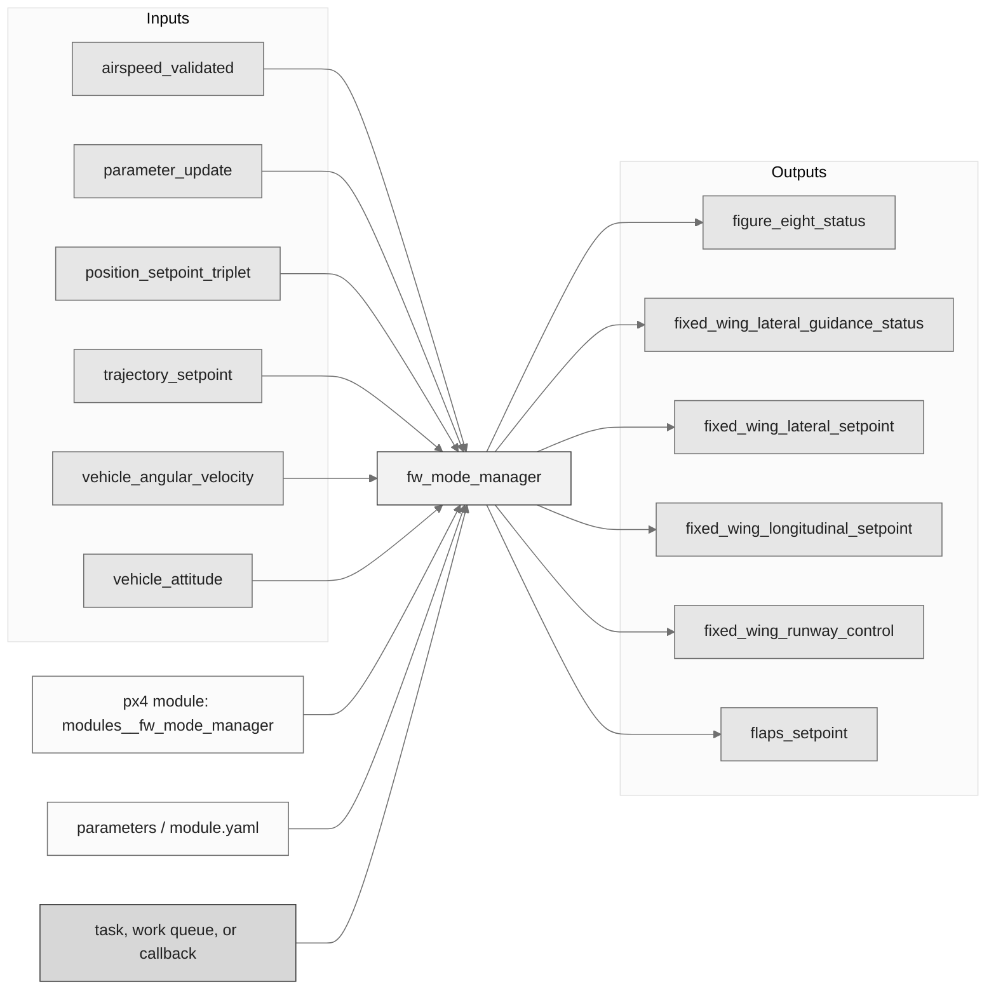
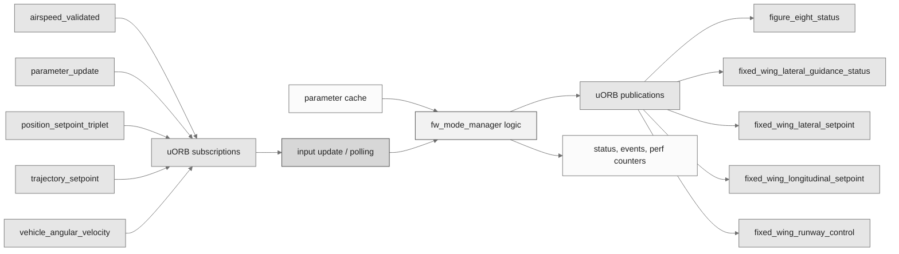
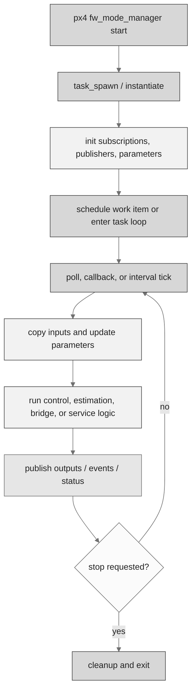
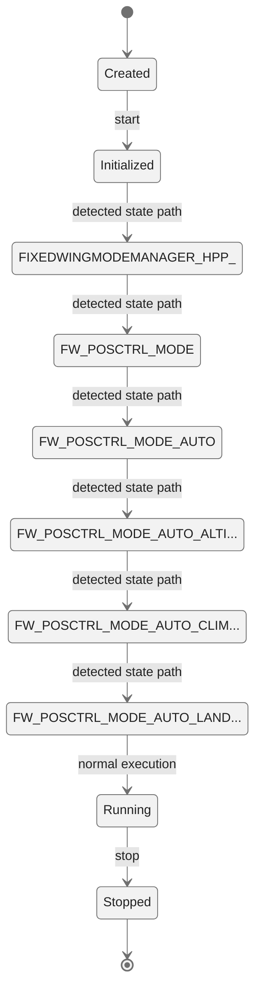
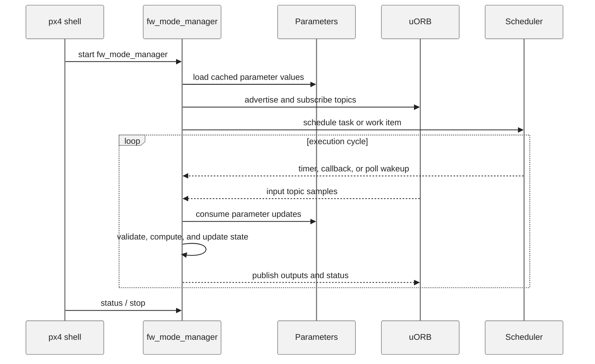
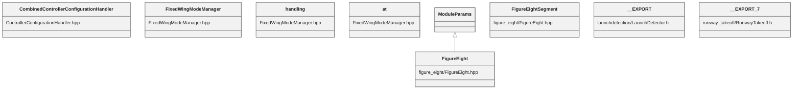

# PX4 Module Architecture: `fw_mode_manager`

- Source: `src/modules/fw_mode_manager`
- Build target: `modules__fw_mode_manager`
- Runtime main: `fw_mode_manager`
- Build kind: `px4 module`
- Mermaid palette: `ash` grey tone

Source-derived architecture notes for this PX4 module directory.

## Architecture Overview

This page is generated from the module source tree and shows the stable architecture surfaces: build entry point, scheduling shape, uORB data interfaces, parameter/configuration surfaces, and C++ types found in the module.

## Build and Entry Points

| Field | Value |
| --- | --- |
| Module path | src/modules/fw_mode_manager |
| Build kind | px4 module |
| Build target | modules__fw_mode_manager |
| Runtime main | fw_mode_manager |
| Stack main | Not specified |
| Module config | fw_mode_manager_params.yaml |
| Detected sources | 5 |
| Detected headers | 5 |
| Detected configs | 7 |

### CMake Dependencies

- `${POSCONTROL_DEPENDENCIES}`

### Nested Module Targets

- No nested module targets detected.

## Data Flow

### uORB Topics

| Topic | Detected direction |
| --- | --- |
| airspeed_validated | subscribed |
| figure_eight_status | published |
| fixed_wing_lateral_guidance_status | published |
| fixed_wing_lateral_setpoint | published |
| fixed_wing_longitudinal_setpoint | published |
| fixed_wing_runway_control | published |
| flaps_setpoint | published |
| landing_gear | published |
| lateral_control_configuration | published |
| launch_detection_status | published |
| longitudinal_control_configuration | published |
| normalized_unsigned_setpoint | referenced |
| orbit_status | published |
| parameter_update | subscribed |
| position_controller_landing_status | published |
| position_setpoint_triplet | subscribed |
| spoilers_setpoint | published |
| trajectory_setpoint | subscribed |
| vehicle_angular_velocity | subscribed |
| vehicle_attitude | subscribed |
| vehicle_attitude_setpoint | subscribed |
| vehicle_command | subscribed |
| vehicle_control_mode | subscribed |
| vehicle_global_position | subscribed |
| vehicle_land_detected | subscribed |
| vehicle_local_position | subscribed |
| vehicle_local_position_setpoint | published |
| vehicle_status | subscribed |
| wind | subscribed |

## Execution Flow

The common PX4 module lifecycle is command entry, object construction or task spawn, parameter loading, topic setup, scheduled execution, publication, status reporting, and stop/cleanup. Modules that use `ModuleBase`, `ScheduledWorkItem`, polling loops, or bridge callbacks still fit this lifecycle with different scheduling triggers.

## State Machine

### Detected State-Like Symbols

- `FIXEDWINGMODEMANAGER_HPP_`
- `FW_POSCTRL_MODE`
- `FW_POSCTRL_MODE_AUTO`
- `FW_POSCTRL_MODE_AUTO_ALTITUDE`
- `FW_POSCTRL_MODE_AUTO_CLIMBRATE`
- `FW_POSCTRL_MODE_AUTO_LANDING_CIRCULAR`
- `FW_POSCTRL_MODE_AUTO_LANDING_STRAIGHT`
- `FW_POSCTRL_MODE_AUTO_PATH`
- `FW_POSCTRL_MODE_AUTO_TAKEOFF`
- `FW_POSCTRL_MODE_AUTO_TAKEOFF_NO_NAV`
- `FW_POSCTRL_MODE_MANUAL_ALTITUDE`
- `FW_POSCTRL_MODE_MANUAL_POSITION`
- `FW_POSCTRL_MODE_OTHER`
- `FW_POSCTRL_MODE_TRANSITION_TO_HOVER_HEADING_HOLD`
- `FW_POSCTRL_MODE_TRANSITION_TO_HOVER_LINE_FOLLOW`
- `NAVIGATION_STATE_AUTO_MISSION`
- `NAVIGATION_STATE_EXTERNAL1`
- `NAVIGATION_STATE_EXTERNAL8`
- `NAVIGATION_STATE_GUIDED_COURSE`

## Sequence Diagram

## Class Diagram

### Detected Classes

| Class | Base | File |
| --- | --- | --- |
| CombinedControllerConfigurationHandler |  | ControllerConfigurationHandler.hpp |
| FixedWingModeManager |  | FixedWingModeManager.hpp |
| handling |  | FixedWingModeManager.hpp |
| at |  | FixedWingModeManager.hpp |
| FigureEight | ModuleParams | figure_eight/FigureEight.hpp |
| FigureEightSegment |  | figure_eight/FigureEight.hpp |
| __EXPORT |  | launchdetection/LaunchDetector.h |
| __EXPORT |  | runway_takeoff/RunwayTakeoff.h |

### Detected Enums

- `FW_POSCTRL_MODE`
- `FigureEightSegment`
- `LandingNudgingOption`
- `RunwayTakeoffState`
- `StickConfig`
- `TerrainEstimateUseOnLanding`

## Parameters and Configuration

- No parameters detected.

## Source Map

| File | Kind |
| --- | --- |
| CMakeLists.txt | build |
| ControllerConfigurationHandler.cpp | source |
| ControllerConfigurationHandler.hpp | header |
| FixedWingModeManager.cpp | source |
| FixedWingModeManager.hpp | header |
| figure_eight/CMakeLists.txt | build |
| figure_eight/FigureEight.cpp | source |
| figure_eight/FigureEight.hpp | header |
| fw_mode_manager_params.yaml | config |
| launchdetection/CMakeLists.txt | build |
| launchdetection/LaunchDetector.cpp | source |
| launchdetection/LaunchDetector.h | header |
| launchdetection/launchdetection_params.yaml | config |
| runway_takeoff/CMakeLists.txt | build |
| runway_takeoff/RunwayTakeoff.cpp | source |
| runway_takeoff/RunwayTakeoff.h | header |
| runway_takeoff/runway_takeoff_params.yaml | config |

## Review Notes

- The diagrams are generated from static source inventory and should be used as a study map, not as a formal proof of every runtime branch.
- Topic direction is inferred from nearby source context such as `Subscription`, `Publication`, `orb_subscribe`, and `publish` usage.
- When a module has no explicit state enum, the state diagram shows the standard PX4 module lifecycle.
