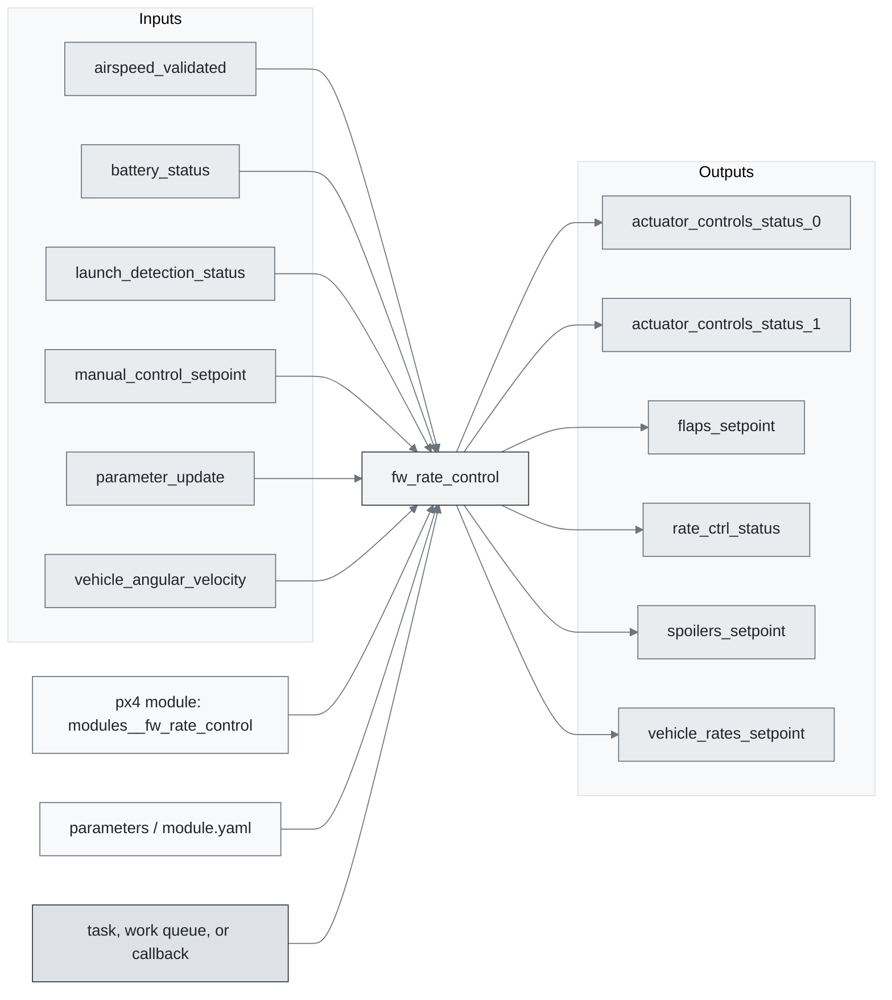
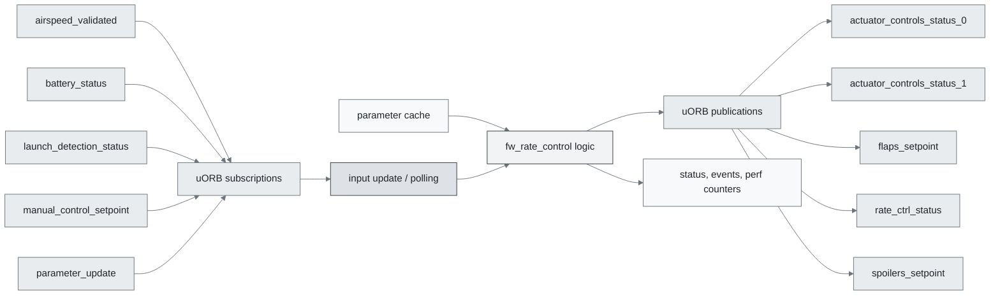
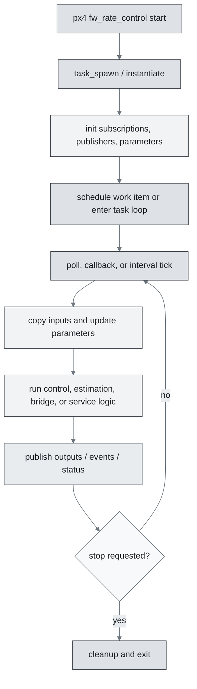
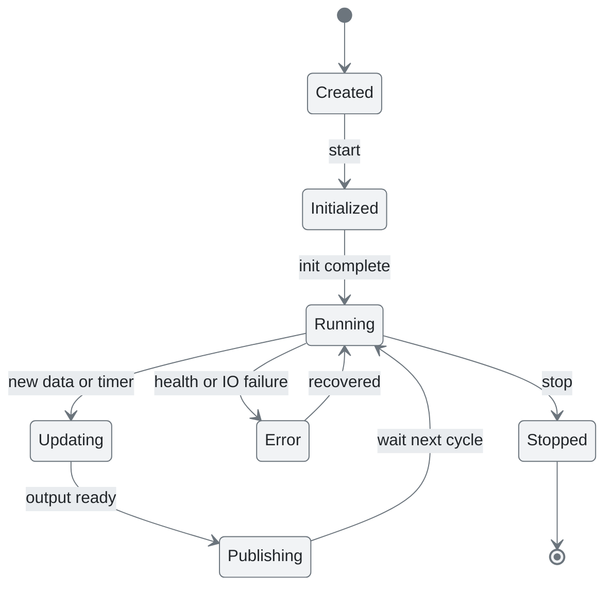
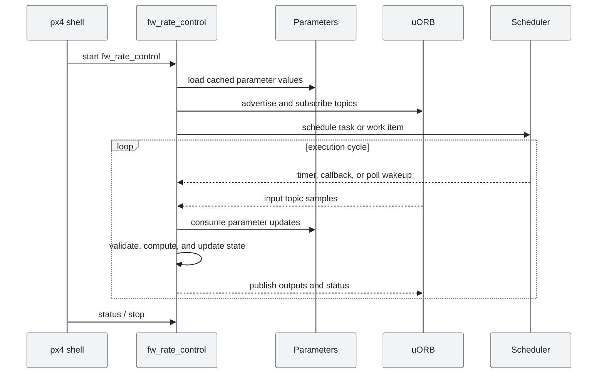
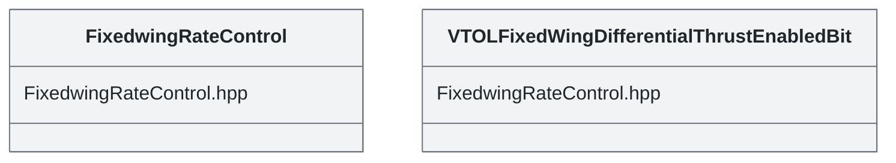

# PX4 Module Architecture: `fw_rate_control`

- Source: `src/modules/fw_rate_control`
- Build target: `modules__fw_rate_control`
- Runtime main: `fw_rate_control`
- Build kind: `px4 module`
- Mermaid palette: `mist` grey tone

Source-derived architecture notes for this PX4 module directory.

## Architecture Overview

This page is generated from the module source tree and shows the stable architecture surfaces: build entry point, scheduling shape, uORB data interfaces, parameter/configuration surfaces, and C++ types found in the module.

## Build and Entry Points

| Field | Value |
| --- | --- |
| Module path | src/modules/fw_rate_control |
| Build kind | px4 module |
| Build target | modules__fw_rate_control |
| Runtime main | fw_rate_control |
| Stack main | Not specified |
| Module config | fw_rate_control_params.yaml |
| Detected sources | 1 |
| Detected headers | 1 |
| Detected configs | 2 |

### CMake Dependencies

- `px4_work_queue`
- `RateControl`
- `SlewRate`

### Nested Module Targets

- No nested module targets detected.

## Data Flow

### uORB Topics

| Topic | Detected direction |
| --- | --- |
| actuator_controls_status | referenced |
| actuator_controls_status_0 | published |
| actuator_controls_status_1 | published |
| airspeed_validated | subscribed |
| battery_status | subscribed |
| control_allocator_status | referenced |
| flaps_setpoint | published |
| launch_detection_status | subscribed |
| manual_control_setpoint | subscribed |
| normalized_unsigned_setpoint | referenced |
| parameter_update | subscribed |
| rate_ctrl_status | published |
| spoilers_setpoint | published |
| vehicle_angular_velocity | subscribed |
| vehicle_control_mode | subscribed |
| vehicle_land_detected | subscribed |
| vehicle_rates_setpoint | subscribed, published |
| vehicle_status | subscribed |
| vehicle_thrust_setpoint | published |
| vehicle_thrust_setpoint_virtual_fw | published |
| vehicle_torque_setpoint | published |
| vehicle_torque_setpoint_virtual_fw | published |

## Execution Flow

The common PX4 module lifecycle is command entry, object construction or task spawn, parameter loading, topic setup, scheduled execution, publication, status reporting, and stop/cleanup. Modules that use `ModuleBase`, `ScheduledWorkItem`, polling loops, or bridge callbacks still fit this lifecycle with different scheduling triggers.

## State Machine

### Detected State-Like Symbols

- No state-like symbols detected.

## Sequence Diagram

## Class Diagram

### Detected Classes

| Class | Base | File |
| --- | --- | --- |
| FixedwingRateControl |  | FixedwingRateControl.hpp |
| VTOLFixedWingDifferentialThrustEnabledBit |  | FixedwingRateControl.hpp |

### Detected Enums

- `VTOLFixedWingDifferentialThrustEnabledBit`
- `for`

## Parameters and Configuration

- No parameters detected.

## Source Map

| File | Kind |
| --- | --- |
| CMakeLists.txt | build |
| FixedwingRateControl.cpp | source |
| FixedwingRateControl.hpp | header |
| fw_rate_control_params.yaml | config |

## Review Notes

- The diagrams are generated from static source inventory and should be used as a study map, not as a formal proof of every runtime branch.
- Topic direction is inferred from nearby source context such as `Subscription`, `Publication`, `orb_subscribe`, and `publish` usage.
- When a module has no explicit state enum, the state diagram shows the standard PX4 module lifecycle.
