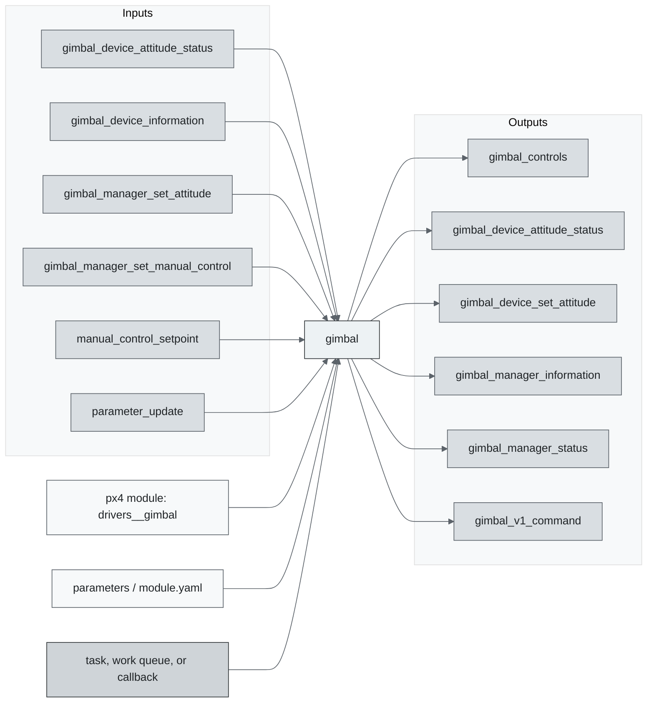
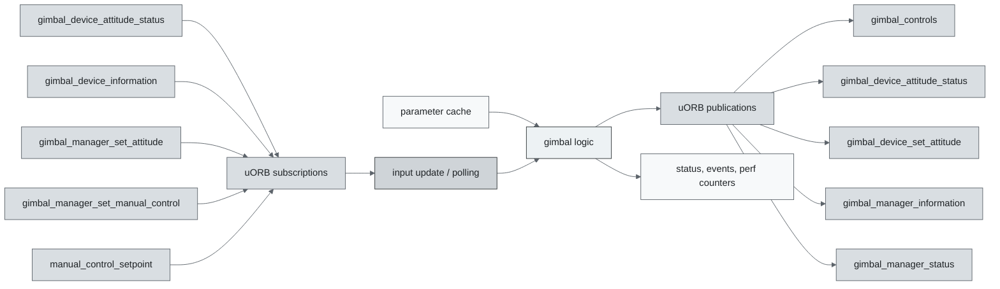
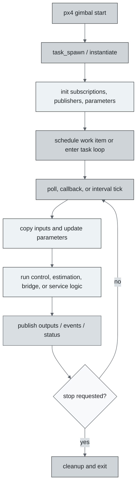
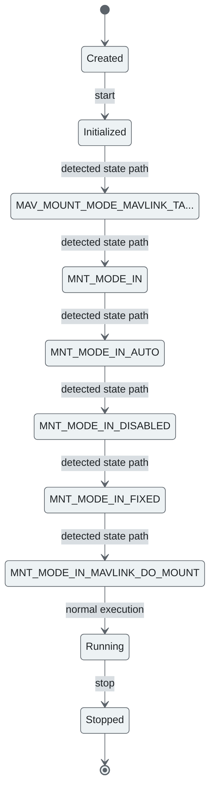
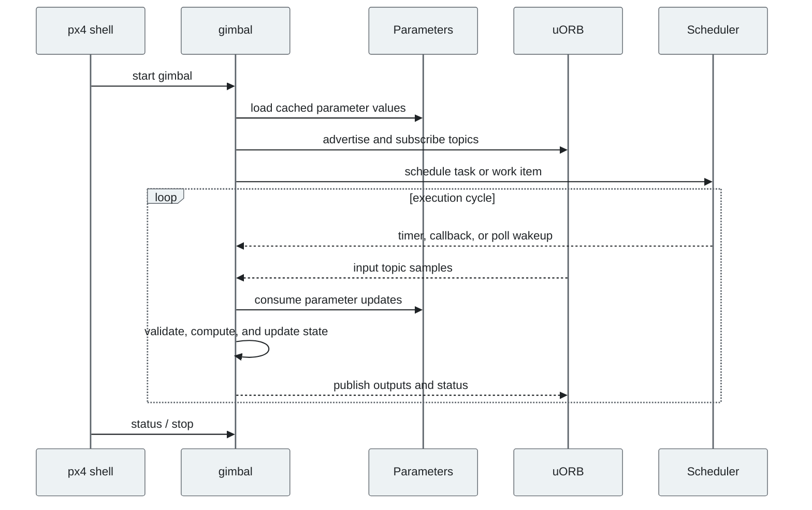
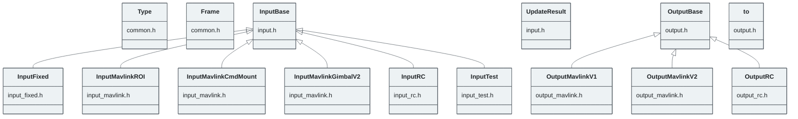

# PX4 Module Architecture: `gimbal`

- Source: `src/modules/gimbal`
- Build target: `drivers__gimbal`
- Runtime main: `gimbal`
- Build kind: `px4 module`
- Mermaid palette: `graphite` grey tone

Mount/gimbal Gimbal control driver. It maps several different input methods (eg. RC or MAVLink) to a configured output (eg. AUX channels or MAVLink). Documentation how to use it is on the [gimbal_control](../advanced/gimbal_control.md) page. Test the output by setting a angles (all omitted axes are set to 0): $ gimbal test pitch -45 yaw 30

## Description of Module

Manages gimbal control commands, gimbal device status, and mount orientation setpoints.

### Primary Responsibilities

- Consume runtime inputs from uORB topics such as `gimbal_device_attitude_status`, `gimbal_device_information`, `gimbal_manager_set_attitude`, `gimbal_manager_set_manual_control`, `manual_control_setpoint`, `parameter_update`, `position_setpoint_triplet`, `vehicle_attitude`, ... 4 more.
- Publish outputs or status topics such as `gimbal_controls`, `gimbal_device_attitude_status`, `gimbal_device_set_attitude`, `gimbal_manager_information`, `gimbal_manager_status`, `gimbal_v1_command`, `mount_orientation`, `vehicle_command`, ... 1 more.
- Use module configuration from `gimbal_params.yaml`.
- Implement the main behavior in classes such as `Type`, `Frame`, `InputBase`, `UpdateResult`, `InputFixed`, `InputMavlinkROI`, ... 9 more.

### Runtime Behavior

- Creates a dedicated PX4 task/thread with `px4_task_spawn_cmd()`.
- Waits on file descriptors or uORB subscriptions with `px4_poll()`.

## Background Theory

Gimbal control is primarily a frame-transform problem: a requested pointing attitude is converted through vehicle, mount, and gimbal frames before actuator commands are produced.

```text
R_world_gimbal_sp = R_world_vehicle * R_vehicle_mount * R_mount_gimbal_sp
q_err = inverse(q_gimbal) * q_gimbal_sp
rate_sp = K_att * sign(q_err.w) * q_err.xyz
actuator_cmd = map_axis(rate_sp or angle_sp)
```

These equations are the study-level form of the algorithm. The implementation applies PX4-specific saturation, validity checks, parameter updates, and frame conventions around these core relationships.

### Main Interfaces

| Area | Details |
| --- | --- |
| Primary inputs | `gimbal_device_attitude_status`, `gimbal_device_information`, `gimbal_manager_set_attitude`, `gimbal_manager_set_manual_control`, `manual_control_setpoint`, `parameter_update`, `position_setpoint_triplet`, `vehicle_attitude`, `vehicle_command`, `vehicle_global_position`, ... 2 more |
| Primary outputs | `gimbal_controls`, `gimbal_device_attitude_status`, `gimbal_device_set_attitude`, `gimbal_manager_information`, `gimbal_manager_status`, `gimbal_v1_command`, `mount_orientation`, `vehicle_command`, `vehicle_command_ack` |
| Referenced topics | `gimbal_controls`, `gimbal_device_attitude_status`, `gimbal_device_information`, `gimbal_device_set_attitude`, `gimbal_manager_information`, `gimbal_manager_set_attitude`, `gimbal_manager_set_manual_control`, `gimbal_manager_status`, `gimbal_v1_command`, `manual_control_setpoint`, ... 9 more |
| Parameters/config | gimbal_params.yaml |
| Key classes | `Type`, `Frame`, `InputBase`, `UpdateResult`, `InputFixed`, `InputMavlinkROI`, `InputMavlinkCmdMount`, `InputMavlinkGimbalV2`, `InputRC`, `InputTest`, ... 5 more |

### Files

| File | Why it matters |
| --- | --- |
| gimbal.cpp | Entry point, start command, or module lifecycle code |
| CMakeLists.txt | Build, parameter, or module configuration |
| gimbal_params.yaml | Build, parameter, or module configuration |
| common.h | Defines `Type` class |
| input.h | Defines `InputBase` class |

## Architecture Overview

This page is generated from the module source tree and shows the stable architecture surfaces: build entry point, scheduling shape, uORB data interfaces, parameter/configuration surfaces, and C++ types found in the module.



## Build and Entry Points

| Field | Value |
| --- | --- |
| Module path | src/modules/gimbal |
| Build kind | px4 module |
| Build target | drivers__gimbal |
| Runtime main | gimbal |
| Stack main | Not specified |
| Module config | gimbal_params.yaml |
| Detected sources | 9 |
| Detected headers | 10 |
| Detected configs | 2 |

### CMake Dependencies

- `geo`

### Nested Module Targets

- No nested module targets detected.

## Data Flow



### uORB Topics

| Topic | Detected direction |
| --- | --- |
| gimbal_controls | published |
| gimbal_device_attitude_status | subscribed, published |
| gimbal_device_information | subscribed |
| gimbal_device_set_attitude | published |
| gimbal_manager_information | published |
| gimbal_manager_set_attitude | subscribed |
| gimbal_manager_set_manual_control | subscribed |
| gimbal_manager_status | published |
| gimbal_v1_command | published |
| manual_control_setpoint | subscribed |
| mount_orientation | published |
| parameter_update | subscribed |
| position_setpoint_triplet | subscribed |
| vehicle_attitude | subscribed |
| vehicle_command | subscribed, published |
| vehicle_command_ack | published |
| vehicle_global_position | subscribed |
| vehicle_land_detected | subscribed |
| vehicle_roi | subscribed |

## Execution Flow



The common PX4 module lifecycle is command entry, object construction or task spawn, parameter loading, topic setup, scheduled execution, publication, status reporting, and stop/cleanup. Modules that use `ModuleBase`, `ScheduledWorkItem`, polling loops, or bridge callbacks still fit this lifecycle with different scheduling triggers.

## State Machine



### Detected State-Like Symbols

- `MAV_MOUNT_MODE_MAVLINK_TARGETING`
- `MNT_MODE_IN`
- `MNT_MODE_IN_AUTO`
- `MNT_MODE_IN_DISABLED`
- `MNT_MODE_IN_FIXED`
- `MNT_MODE_IN_MAVLINK_DO_MOUNT`
- `MNT_MODE_IN_MAVLINK_ROI`
- `MNT_MODE_IN_MAVLINK_V2`
- `MNT_MODE_IN_RC`
- `MNT_MODE_OUT`
- `MNT_MODE_OUT_AUX`
- `MNT_MODE_OUT_MAVLINK_V1`
- `MNT_MODE_OUT_MAVLINK_V2`
- `MNT_RC_IN_MODE`
- `VEHICLE_MOUNT_MODE_GPS_POINT`
- `VEHICLE_MOUNT_MODE_MAVLINK_TARGETING`
- `VEHICLE_MOUNT_MODE_NEUTRAL`
- `VEHICLE_MOUNT_MODE_RC_TARGETING`
- `VEHICLE_MOUNT_MODE_RETRACT`

## Sequence Diagram



## Class Diagram



### Detected Classes

| Class | Base | File |
| --- | --- | --- |
| Type |  | common.h |
| Frame |  | common.h |
| InputBase |  | input.h |
| UpdateResult |  | input.h |
| InputFixed | InputBase | input_fixed.h |
| InputMavlinkROI | InputBase | input_mavlink.h |
| InputMavlinkCmdMount | InputBase | input_mavlink.h |
| InputMavlinkGimbalV2 | InputBase | input_mavlink.h |
| InputRC | InputBase | input_rc.h |
| InputTest | InputBase | input_test.h |
| OutputBase |  | output.h |
| to |  | output.h |
| OutputMavlinkV1 | OutputBase | output_mavlink.h |
| OutputMavlinkV2 | OutputBase | output_mavlink.h |
| OutputRC | OutputBase | output_rc.h |

### Detected Enums

- `Frame`
- `MntDoStabilize`
- `MntModeIn`
- `MntModeOut`
- `Type`
- `UpdateResult`

## Parameters and Configuration

- No parameters detected.

## Source Map

| File | Kind |
| --- | --- |
| CMakeLists.txt | build |
| common.h | header |
| gimbal.cpp | source |
| gimbal_params.h | header |
| gimbal_params.yaml | config |
| input.cpp | source |
| input.h | header |
| input_fixed.cpp | source |
| input_fixed.h | header |
| input_mavlink.cpp | source |
| input_mavlink.h | header |
| input_rc.cpp | source |
| input_rc.h | header |
| input_test.cpp | source |
| input_test.h | header |
| output.cpp | source |
| output.h | header |
| output_mavlink.cpp | source |
| output_mavlink.h | header |
| output_rc.cpp | source |
| output_rc.h | header |

## Review Notes

- The diagrams are generated from static source inventory and should be used as a study map, not as a formal proof of every runtime branch.
- Topic direction is inferred from nearby source context such as `Subscription`, `Publication`, `orb_subscribe`, and `publish` usage.
- When a module has no explicit state enum, the state diagram shows the standard PX4 module lifecycle.
