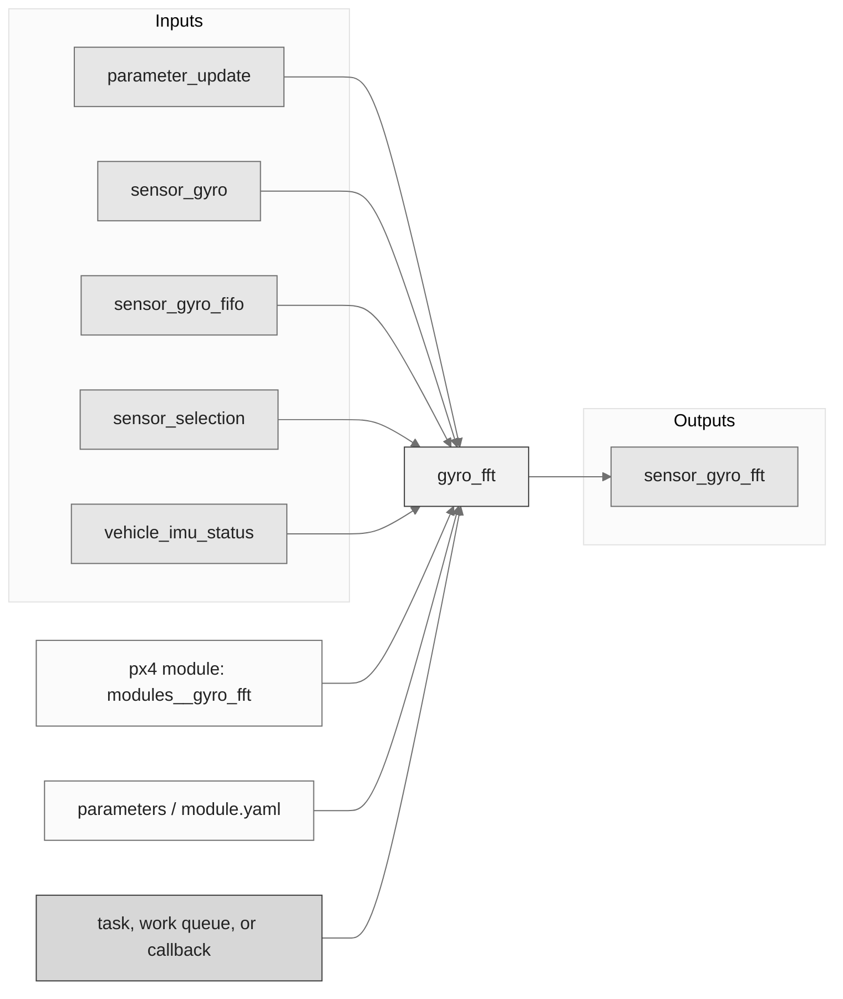
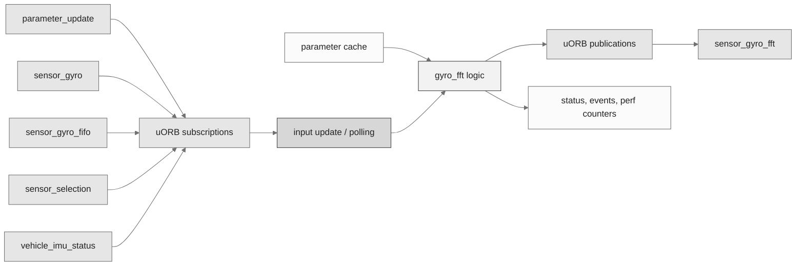
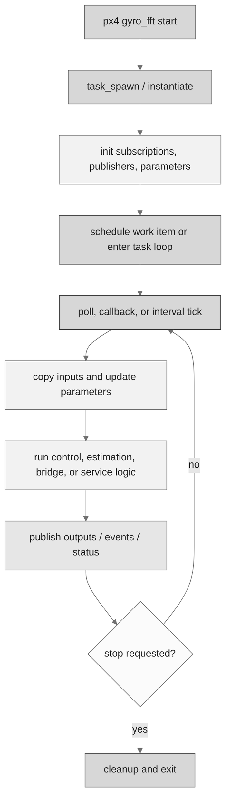
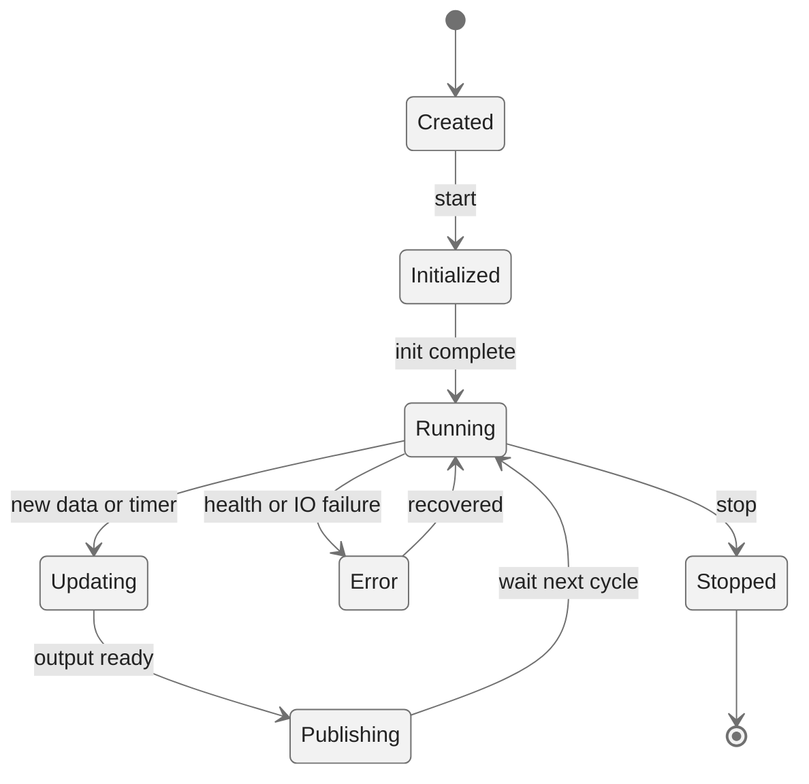
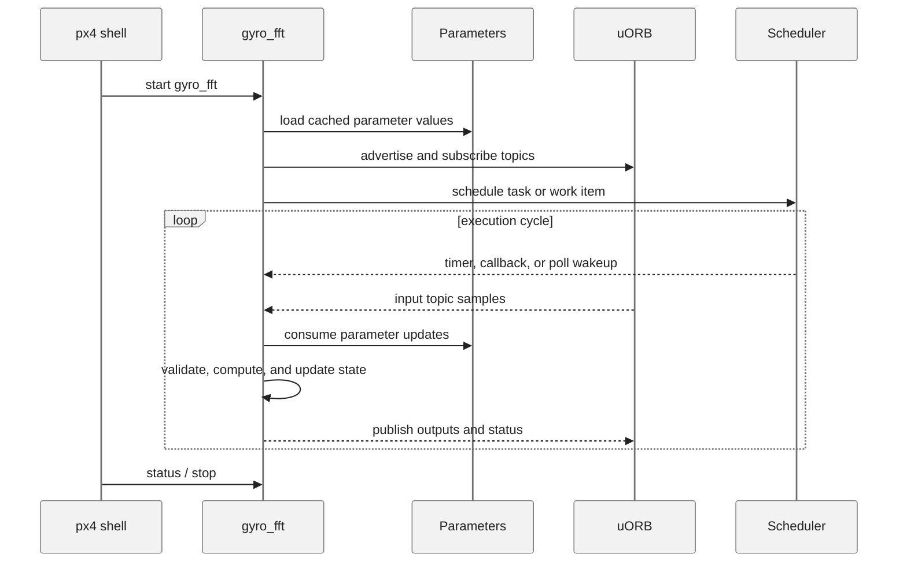
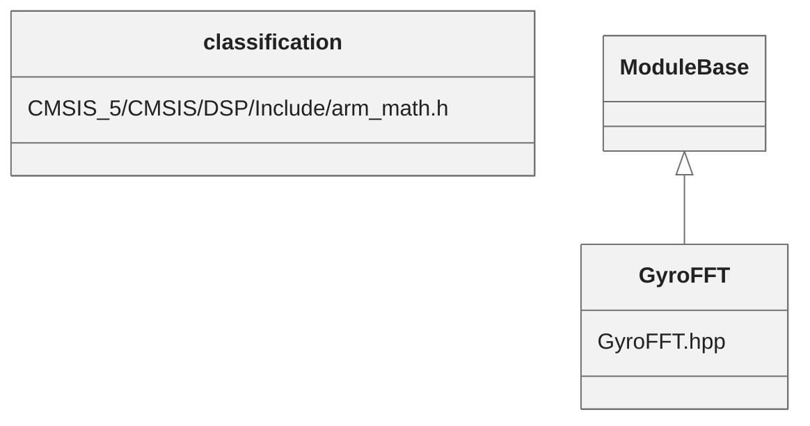

# PX4 Module Architecture: `gyro_fft`

- Source: `src/modules/gyro_fft`
- Build target: `modules__gyro_fft`
- Runtime main: `gyro_fft`
- Build kind: `px4 module`
- Mermaid palette: `ash` grey tone

Source-derived architecture notes for this PX4 module directory.

## Description of Module

Analyzes gyro vibration content using FFT processing and publishes diagnostic vibration information.

### Primary Responsibilities

- Consume runtime inputs from uORB topics such as `parameter_update`, `sensor_gyro`, `sensor_gyro_fifo`, `sensor_selection`, `vehicle_imu_status`.
- Publish outputs or status topics such as `sensor_gyro_fft`.
- Use module configuration from `parameters.yaml`.
- Implement the main behavior in classes such as `classification`, `GyroFFT`.

### Runtime Behavior

- Runs work-queue callbacks on queue configurations such as `hp_default`.
- Uses uORB callback registration so new topic data can schedule execution.
- Uses explicit work-item scheduling through immediate, delayed, or interval scheduling calls.

## Background Theory

Gyro FFT estimates vibration frequency content. Peaks in the spectrum can be used to tune or drive notch filtering.

```text
Windowed samples: x_w[n] = w[n] * x[n]
DFT: X[k] = sum_{n=0}^{N-1} x_w[n] * exp(-j*2*pi*k*n/N)
Power: P[k] = |X[k]|^2
f_peak = argmax_k P[k] * sample_rate / N
Notch: H(s) = (s^2 + w0^2) / (s^2 + (w0/Q)*s + w0^2)
```

These equations are the study-level form of the algorithm. The implementation applies PX4-specific saturation, validity checks, parameter updates, and frame conventions around these core relationships.

### Main Interfaces

| Area | Details |
| --- | --- |
| Primary inputs | `parameter_update`, `sensor_gyro`, `sensor_gyro_fifo`, `sensor_selection`, `vehicle_imu_status` |
| Primary outputs | `sensor_gyro_fft` |
| Referenced topics | `parameter_update`, `sensor_gyro`, `sensor_gyro_fft`, `sensor_gyro_fifo`, `sensor_selection`, `vehicle_imu_status` |
| Parameters/config | parameters.yaml |
| Key classes | `classification`, `GyroFFT` |

### Files

| File | Why it matters |
| --- | --- |
| GyroFFT.cpp | Entry point, start command, or module lifecycle code |
| CMakeLists.txt | Build, parameter, or module configuration |
| parameters.yaml | Build, parameter, or module configuration |
| CMSIS_5/CMSIS/DSP/Include/arm_math.h | Defines `classification` class |
| GyroFFT.hpp | Defines `GyroFFT` class |

## Architecture Overview

This page is generated from the module source tree and shows the stable architecture surfaces: build entry point, scheduling shape, uORB data interfaces, parameter/configuration surfaces, and C++ types found in the module.



## Build and Entry Points

| Field | Value |
| --- | --- |
| Module path | src/modules/gyro_fft |
| Build kind | px4 module |
| Build target | modules__gyro_fft |
| Runtime main | gyro_fft |
| Stack main | 4096 |
| Module config | parameters.yaml |
| Detected sources | 10 |
| Detected headers | 6 |
| Detected configs | 2 |

### CMake Dependencies

- `px4_work_queue`

### Nested Module Targets

- No nested module targets detected.

## Data Flow



### uORB Topics

| Topic | Detected direction |
| --- | --- |
| parameter_update | subscribed |
| sensor_gyro | subscribed |
| sensor_gyro_fft | published |
| sensor_gyro_fifo | subscribed |
| sensor_selection | subscribed |
| vehicle_imu_status | subscribed |

## Execution Flow



The common PX4 module lifecycle is command entry, object construction or task spawn, parameter loading, topic setup, scheduled execution, publication, status reporting, and stop/cleanup. Modules that use `ModuleBase`, `ScheduledWorkItem`, polling loops, or bridge callbacks still fit this lifecycle with different scheduling triggers.

## State Machine



### Detected State-Like Symbols

- No state-like symbols detected.

## Sequence Diagram



## Class Diagram



### Detected Classes

| Class | Base | File |
| --- | --- | --- |
| classification |  | CMSIS_5/CMSIS/DSP/Include/arm_math.h |
| GyroFFT | ModuleBase | GyroFFT.hpp |

### Detected Enums

- No enums detected.

## Parameters and Configuration

- No parameters detected.

## Source Map

| File | Kind |
| --- | --- |
| CMSIS_5/CMSIS/Core/Include/cmsis_compiler.h | header |
| CMSIS_5/CMSIS/Core/Include/cmsis_gcc.h | header |
| CMSIS_5/CMSIS/DSP/Include/arm_common_tables.h | header |
| CMSIS_5/CMSIS/DSP/Include/arm_const_structs.h | header |
| CMSIS_5/CMSIS/DSP/Include/arm_math.h | header |
| CMSIS_5/CMSIS/DSP/Source/BasicMathFunctions/arm_mult_q15.c | source |
| CMSIS_5/CMSIS/DSP/Source/CommonTables/arm_common_tables.c | source |
| CMSIS_5/CMSIS/DSP/Source/CommonTables/arm_const_structs.c | source |
| CMSIS_5/CMSIS/DSP/Source/SupportFunctions/arm_float_to_q15.c | source |
| CMSIS_5/CMSIS/DSP/Source/TransformFunctions/arm_bitreversal2.c | source |
| CMSIS_5/CMSIS/DSP/Source/TransformFunctions/arm_cfft_q15.c | source |
| CMSIS_5/CMSIS/DSP/Source/TransformFunctions/arm_cfft_radix4_q15.c | source |
| CMSIS_5/CMSIS/DSP/Source/TransformFunctions/arm_rfft_init_q15.c | source |
| CMSIS_5/CMSIS/DSP/Source/TransformFunctions/arm_rfft_q15.c | source |
| CMakeLists.txt | build |
| GyroFFT.cpp | source |
| GyroFFT.hpp | header |
| parameters.yaml | config |

## Review Notes

- The diagrams are generated from static source inventory and should be used as a study map, not as a formal proof of every runtime branch.
- Topic direction is inferred from nearby source context such as `Subscription`, `Publication`, `orb_subscribe`, and `publish` usage.
- When a module has no explicit state enum, the state diagram shows the standard PX4 module lifecycle.
