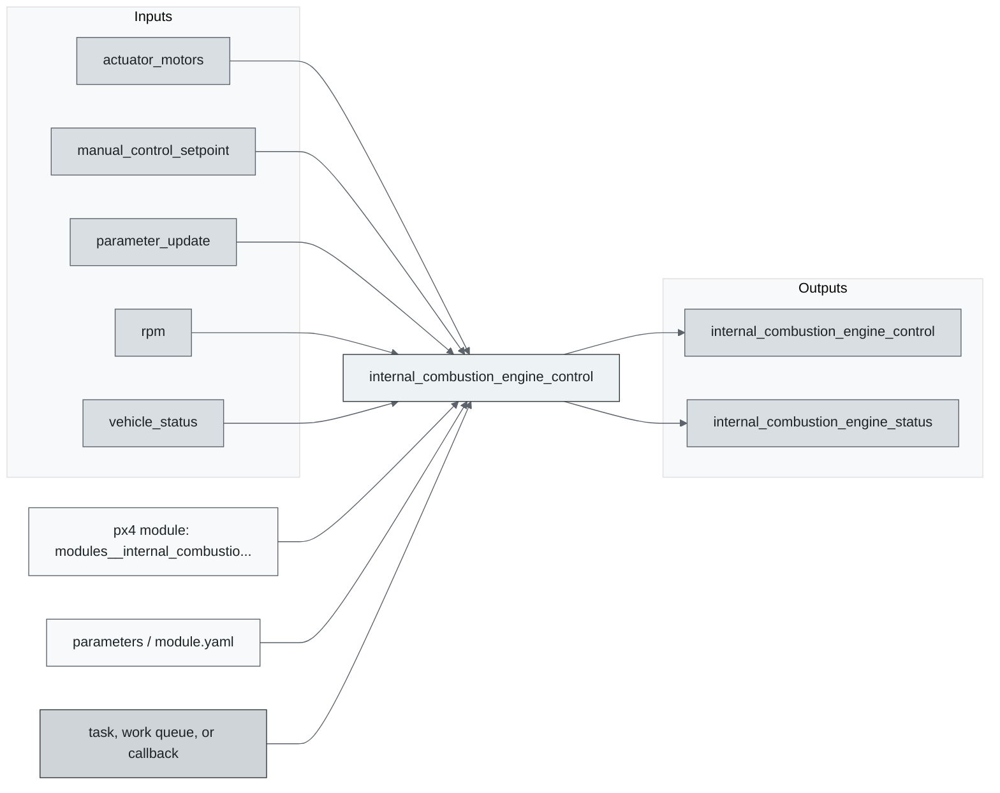
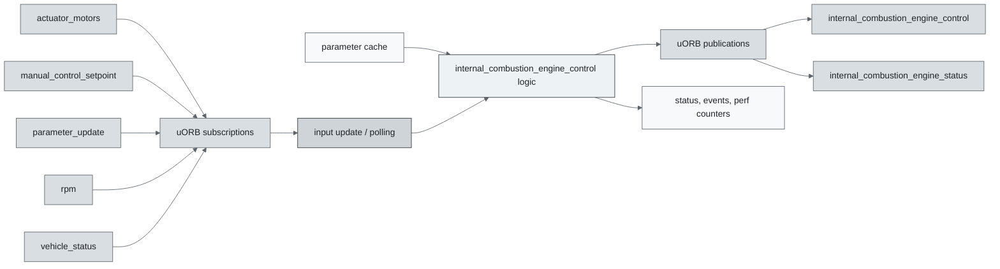
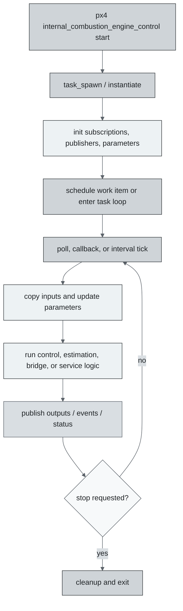
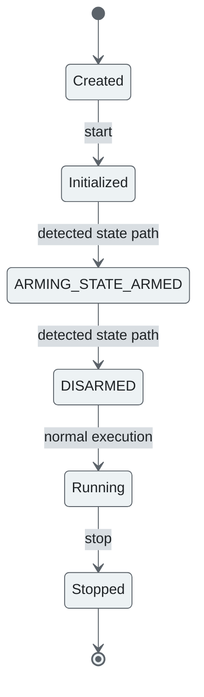
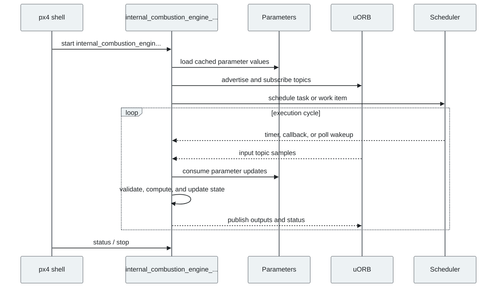
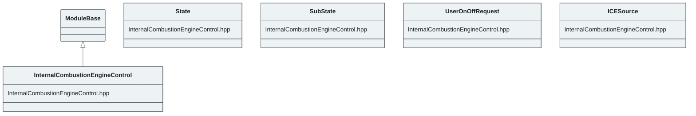

# PX4 Module Architecture: `internal_combustion_engine_control`

- Source: `src/modules/internal_combustion_engine_control`
- Build target: `modules__internal_combustion_engine_control`
- Runtime main: `internal_combustion_engine_control`
- Build kind: `px4 module`
- Mermaid palette: `graphite` grey tone

Architecture notes for the Internal Combustion Engine Control module.

## Architecture Overview

This page is generated from the module source tree and shows the stable architecture surfaces: build entry point, scheduling shape, uORB data interfaces, parameter/configuration surfaces, and C++ types found in the module.

## Build and Entry Points

| Field | Value |
| --- | --- |
| Module path | src/modules/internal_combustion_engine_control |
| Build kind | px4 module |
| Build target | modules__internal_combustion_engine_control |
| Runtime main | internal_combustion_engine_control |
| Stack main | Not specified |
| Module config | module.yaml |
| Detected sources | 1 |
| Detected headers | 1 |
| Detected configs | 2 |

### CMake Dependencies

- `px4_work_queue`
- `SlewRate`

### Nested Module Targets

- No nested module targets detected.

## Data Flow

### uORB Topics

| Topic | Detected direction |
| --- | --- |
| actuator_motors | subscribed |
| internal_combustion_engine_control | published |
| internal_combustion_engine_status | published |
| manual_control_setpoint | subscribed |
| parameter_update | subscribed |
| rpm | subscribed |
| vehicle_status | subscribed |

## Execution Flow

The common PX4 module lifecycle is command entry, object construction or task spawn, parameter loading, topic setup, scheduled execution, publication, status reporting, and stop/cleanup. Modules that use `ModuleBase`, `ScheduledWorkItem`, polling loops, or bridge callbacks still fit this lifecycle with different scheduling triggers.

## State Machine

### Detected State-Like Symbols

- `ARMING_STATE_ARMED`
- `DISARMED`

## Sequence Diagram

## Class Diagram

### Detected Classes

| Class | Base | File |
| --- | --- | --- |
| InternalCombustionEngineControl | ModuleBase | InternalCombustionEngineControl.hpp |
| State |  | InternalCombustionEngineControl.hpp |
| SubState |  | InternalCombustionEngineControl.hpp |
| UserOnOffRequest |  | InternalCombustionEngineControl.hpp |
| ICESource |  | InternalCombustionEngineControl.hpp |

### Detected Enums

- `ICESource`
- `State`
- `SubState`
- `UserOnOffRequest`

## Parameters and Configuration

- No parameters detected.

## Source Map

| File | Kind |
| --- | --- |
| CMakeLists.txt | build |
| InternalCombustionEngineControl.cpp | source |
| InternalCombustionEngineControl.hpp | header |
| module.yaml | config |

## Review Notes

- The diagrams are generated from static source inventory and should be used as a study map, not as a formal proof of every runtime branch.
- Topic direction is inferred from nearby source context such as `Subscription`, `Publication`, `orb_subscribe`, and `publish` usage.
- When a module has no explicit state enum, the state diagram shows the standard PX4 module lifecycle.
