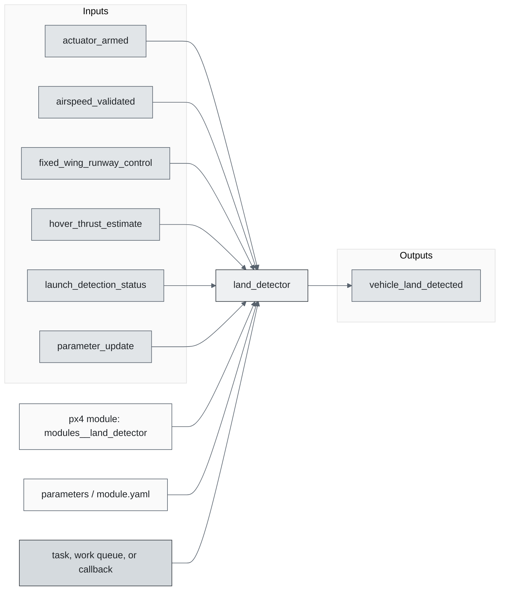
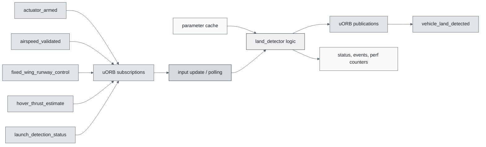
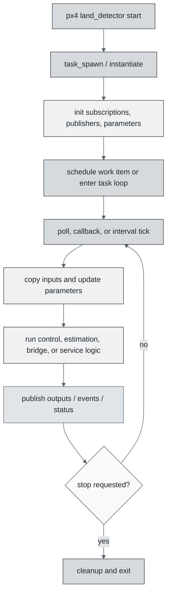
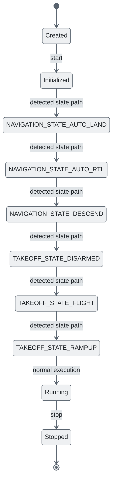
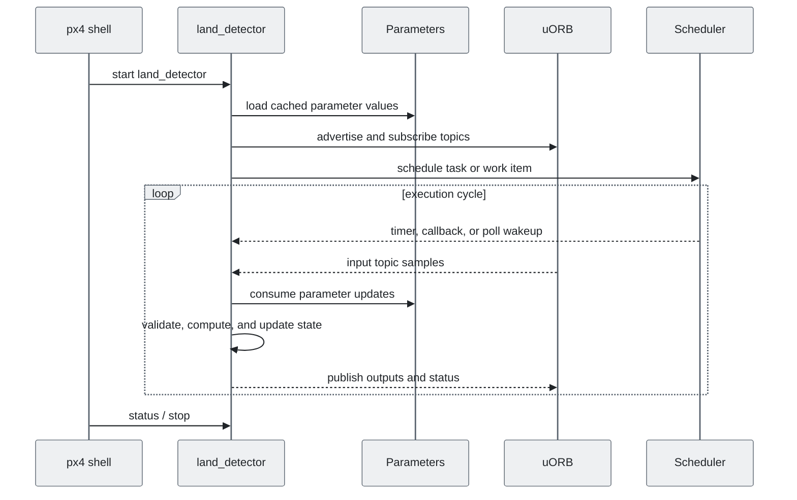
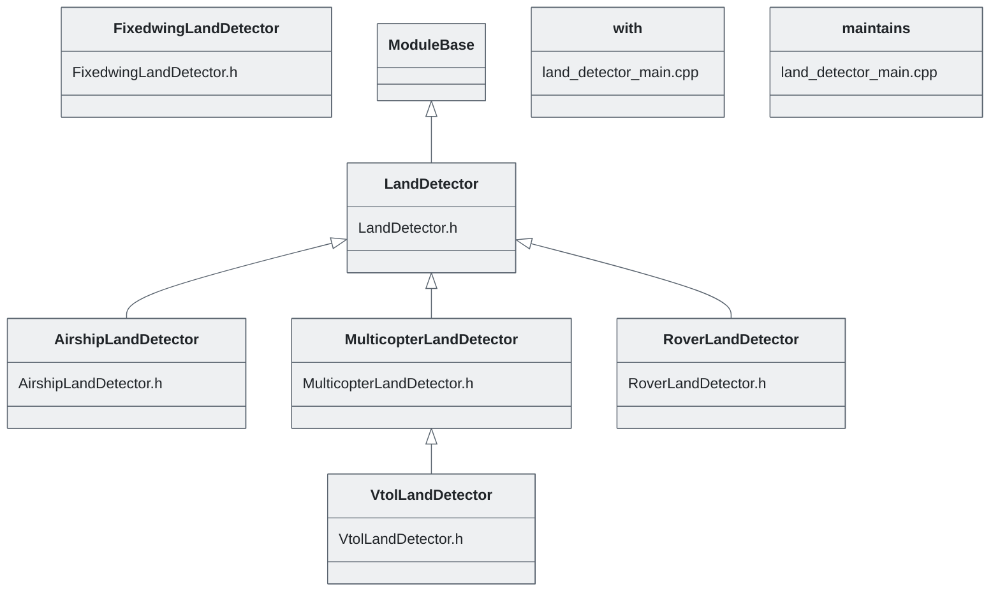

# PX4 Module Architecture: `land_detector`

- Source: `src/modules/land_detector`
- Build target: `modules__land_detector`
- Runtime main: `land_detector`
- Build kind: `px4 module`
- Mermaid palette: `slate` grey tone

Source-derived architecture notes for this PX4 module directory.

## Architecture Overview

This page is generated from the module source tree and shows the stable architecture surfaces: build entry point, scheduling shape, uORB data interfaces, parameter/configuration surfaces, and C++ types found in the module.

## Build and Entry Points

| Field | Value |
| --- | --- |
| Module path | src/modules/land_detector |
| Build kind | px4 module |
| Build target | modules__land_detector |
| Runtime main | land_detector |
| Stack main | Not specified |
| Module config | land_detector_params.yaml |
| Detected sources | 7 |
| Detected headers | 6 |
| Detected configs | 4 |

### CMake Dependencies

- `hysteresis`

### Nested Module Targets

- No nested module targets detected.

## Data Flow

### uORB Topics

| Topic | Detected direction |
| --- | --- |
| actuator_armed | subscribed |
| airspeed_validated | subscribed |
| fixed_wing_runway_control | subscribed |
| hover_thrust_estimate | subscribed |
| launch_detection_status | subscribed |
| parameter_update | subscribed |
| position_setpoint_triplet | subscribed |
| sensor_selection | subscribed |
| takeoff_status | subscribed |
| trajectory_setpoint | subscribed |
| vehicle_acceleration | subscribed |
| vehicle_angular_velocity | subscribed |
| vehicle_control_mode | subscribed |
| vehicle_global_position | subscribed |
| vehicle_imu_status | subscribed |
| vehicle_land_detected | published |
| vehicle_local_position | subscribed |
| vehicle_status | subscribed |
| vehicle_thrust_setpoint | subscribed |

## Execution Flow

The common PX4 module lifecycle is command entry, object construction or task spawn, parameter loading, topic setup, scheduled execution, publication, status reporting, and stop/cleanup. Modules that use `ModuleBase`, `ScheduledWorkItem`, polling loops, or bridge callbacks still fit this lifecycle with different scheduling triggers.

## State Machine

### Detected State-Like Symbols

- `NAVIGATION_STATE_AUTO_LAND`
- `NAVIGATION_STATE_AUTO_RTL`
- `NAVIGATION_STATE_DESCEND`
- `TAKEOFF_STATE_DISARMED`
- `TAKEOFF_STATE_FLIGHT`
- `TAKEOFF_STATE_RAMPUP`

## Sequence Diagram

## Class Diagram

### Detected Classes

| Class | Base | File |
| --- | --- | --- |
| AirshipLandDetector | LandDetector | AirshipLandDetector.h |
| FixedwingLandDetector |  | FixedwingLandDetector.h |
| LandDetector | ModuleBase | LandDetector.h |
| MulticopterLandDetector | LandDetector | MulticopterLandDetector.h |
| RoverLandDetector | LandDetector | RoverLandDetector.h |
| VtolLandDetector | MulticopterLandDetector | VtolLandDetector.h |
| with |  | land_detector_main.cpp |
| maintains |  | land_detector_main.cpp |

### Detected Enums

- No enums detected.

## Parameters and Configuration

- No parameters detected.

## Source Map

| File | Kind |
| --- | --- |
| AirshipLandDetector.cpp | source |
| AirshipLandDetector.h | header |
| CMakeLists.txt | build |
| FixedwingLandDetector.cpp | source |
| FixedwingLandDetector.h | header |
| LandDetector.cpp | source |
| LandDetector.h | header |
| MulticopterLandDetector.cpp | source |
| MulticopterLandDetector.h | header |
| RoverLandDetector.cpp | source |
| RoverLandDetector.h | header |
| VtolLandDetector.cpp | source |
| VtolLandDetector.h | header |
| land_detector_main.cpp | source |
| land_detector_params.yaml | config |
| land_detector_params_fw.yaml | config |
| land_detector_params_mc.yaml | config |

## Review Notes

- The diagrams are generated from static source inventory and should be used as a study map, not as a formal proof of every runtime branch.
- Topic direction is inferred from nearby source context such as `Subscription`, `Publication`, `orb_subscribe`, and `publish` usage.
- When a module has no explicit state enum, the state diagram shows the standard PX4 module lifecycle.
