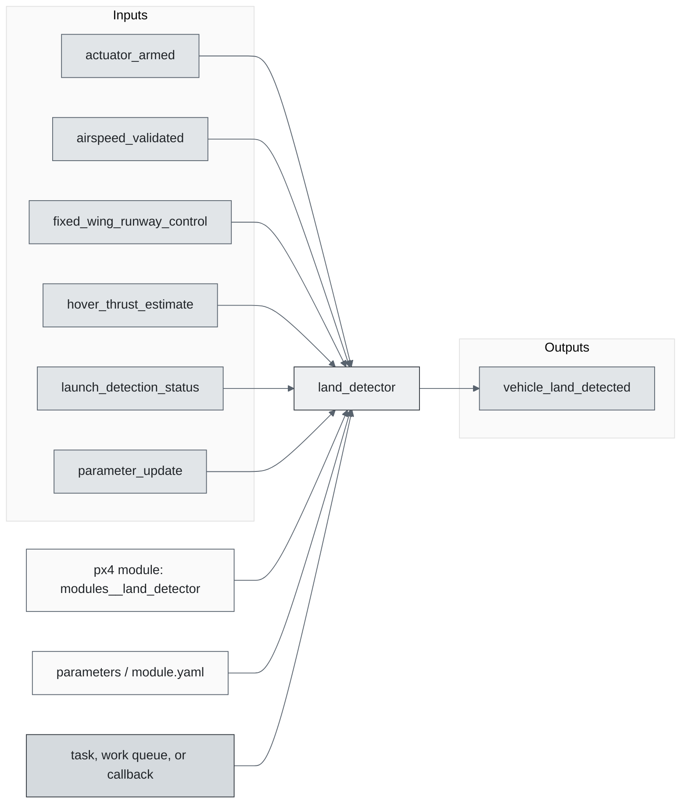
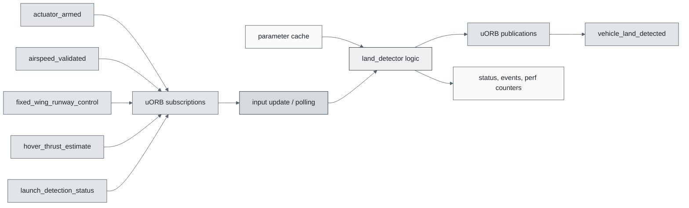
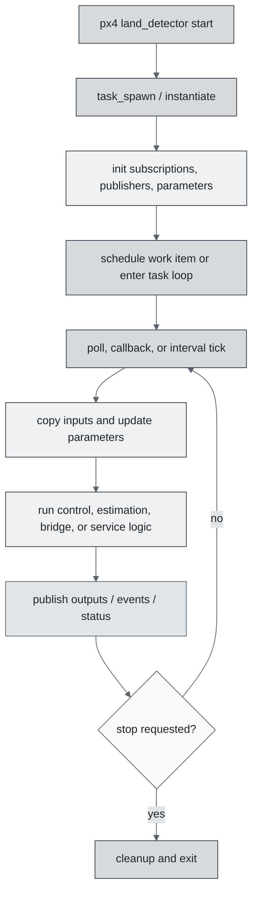
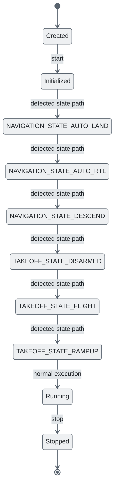
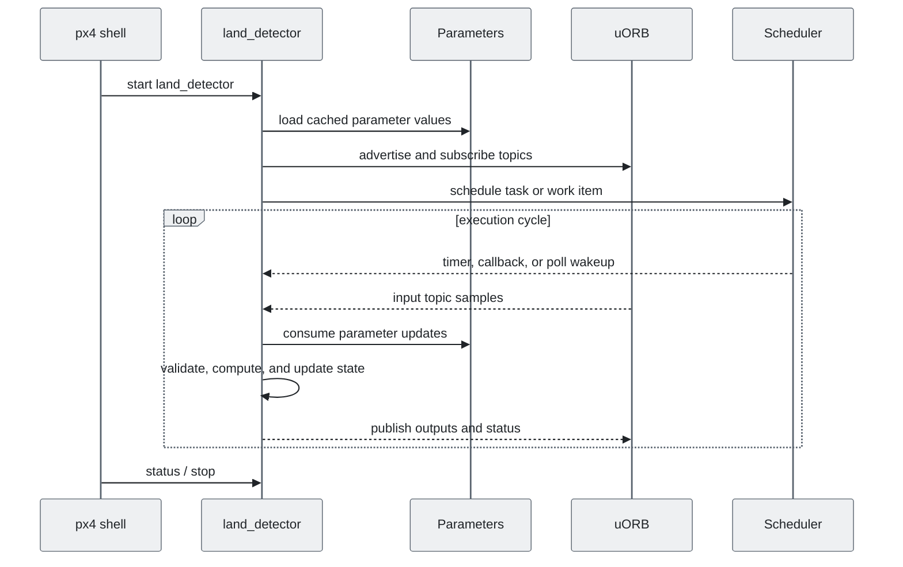
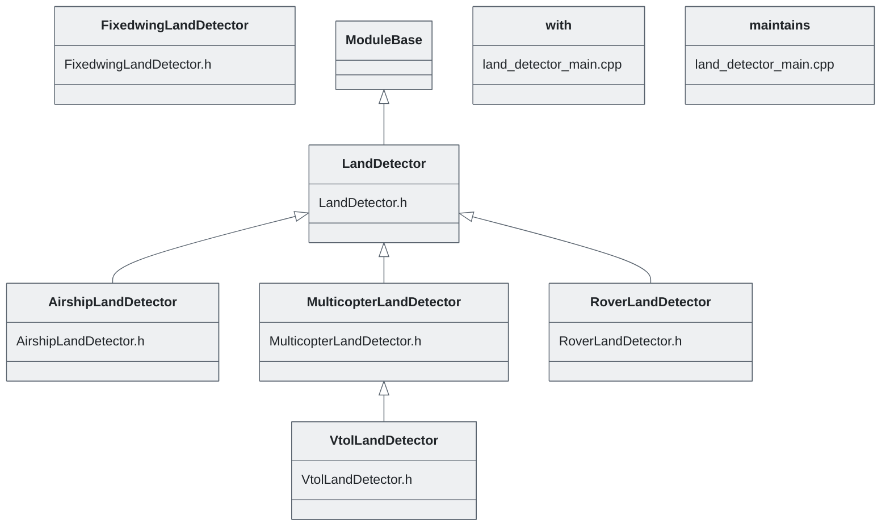

# PX4 Module Architecture: `land_detector`

- Source: `src/modules/land_detector`
- Build target: `modules__land_detector`
- Runtime main: `land_detector`
- Build kind: `px4 module`
- Mermaid palette: `slate` grey tone

Module to detect the freefall and landed state of the vehicle, and publishing the `vehicle_land_detected` topic. Each vehicle type (multirotor, fixedwing, vtol, ...) provides its own algorithm, taking into account various states, such as commanded thrust, arming state and vehicle motion. Every type is implemented in its own class with a common base class. The base class maintains a state (landed, maybe_landed, ground_contact). Each possible state is implemented in the derived classes. A hysteresis and a fixed prior

## Description of Module

Determines whether the vehicle is landed, maybe landed, or airborne for failsafe and controller behavior.

### Primary Responsibilities

- Consume runtime inputs from uORB topics such as `actuator_armed`, `airspeed_validated`, `fixed_wing_runway_control`, `hover_thrust_estimate`, `launch_detection_status`, `parameter_update`, `position_setpoint_triplet`, `sensor_selection`, ... 10 more.
- Publish outputs or status topics such as `vehicle_land_detected`.
- Use module configuration from `land_detector_params.yaml`.
- Implement the main behavior in classes such as `AirshipLandDetector`, `FixedwingLandDetector`, `LandDetector`, `MulticopterLandDetector`, `RoverLandDetector`, `VtolLandDetector`, ... 2 more.

### Runtime Behavior

- Runs work-queue callbacks on queue configurations such as `nav_and_controllers`.
- Uses uORB callback registration so new topic data can schedule execution.
- Uses explicit work-item scheduling through immediate, delayed, or interval scheduling calls.

## Background Theory

Land detection is a threshold and hysteresis classifier over motion, thrust, and timing conditions.

```text
low_motion = |v_z| < v_z_thr and |omega| < omega_thr
low_thrust = thrust < thrust_thr
maybe_landed = low_motion and low_thrust for T_maybe
landed = maybe_landed and no_takeoff_intent for T_landed
freefall = |accel| < accel_thr for T_freefall
```

These equations are the study-level form of the algorithm. The implementation applies PX4-specific saturation, validity checks, parameter updates, and frame conventions around these core relationships.

### Main Interfaces

| Area | Details |
| --- | --- |
| Primary inputs | `actuator_armed`, `airspeed_validated`, `fixed_wing_runway_control`, `hover_thrust_estimate`, `launch_detection_status`, `parameter_update`, `position_setpoint_triplet`, `sensor_selection`, `takeoff_status`, `trajectory_setpoint`, ... 8 more |
| Primary outputs | `vehicle_land_detected` |
| Referenced topics | `actuator_armed`, `airspeed_validated`, `fixed_wing_runway_control`, `hover_thrust_estimate`, `launch_detection_status`, `parameter_update`, `position_setpoint_triplet`, `sensor_selection`, `takeoff_status`, `trajectory_setpoint`, ... 9 more |
| Parameters/config | land_detector_params.yaml |
| Key classes | `AirshipLandDetector`, `FixedwingLandDetector`, `LandDetector`, `MulticopterLandDetector`, `RoverLandDetector`, `VtolLandDetector`, `with`, `maintains` |

### Files

| File | Why it matters |
| --- | --- |
| LandDetector.cpp | Entry point, start command, or module lifecycle code |
| land_detector_main.cpp | Entry point, start command, or module lifecycle code |
| CMakeLists.txt | Build, parameter, or module configuration |
| land_detector_params.yaml | Build, parameter, or module configuration |
| land_detector_params_fw.yaml | Build, parameter, or module configuration |
| land_detector_params_mc.yaml | Build, parameter, or module configuration |
| AirshipLandDetector.h | Defines `AirshipLandDetector` class |
| FixedwingLandDetector.h | Defines `FixedwingLandDetector` class |

## Architecture Overview

This page is generated from the module source tree and shows the stable architecture surfaces: build entry point, scheduling shape, uORB data interfaces, parameter/configuration surfaces, and C++ types found in the module.



## Build and Entry Points

| Field | Value |
| --- | --- |
| Module path | src/modules/land_detector |
| Build kind | px4 module |
| Build target | modules__land_detector |
| Runtime main | land_detector |
| Stack main | Not specified |
| Module config | land_detector_params.yaml |
| Detected sources | 7 |
| Detected headers | 6 |
| Detected configs | 4 |

### CMake Dependencies

- `hysteresis`

### Nested Module Targets

- No nested module targets detected.

## Data Flow



### uORB Topics

| Topic | Detected direction |
| --- | --- |
| actuator_armed | subscribed |
| airspeed_validated | subscribed |
| fixed_wing_runway_control | subscribed |
| hover_thrust_estimate | subscribed |
| launch_detection_status | subscribed |
| parameter_update | subscribed |
| position_setpoint_triplet | subscribed |
| sensor_selection | subscribed |
| takeoff_status | subscribed |
| trajectory_setpoint | subscribed |
| vehicle_acceleration | subscribed |
| vehicle_angular_velocity | subscribed |
| vehicle_control_mode | subscribed |
| vehicle_global_position | subscribed |
| vehicle_imu_status | subscribed |
| vehicle_land_detected | published |
| vehicle_local_position | subscribed |
| vehicle_status | subscribed |
| vehicle_thrust_setpoint | subscribed |

## Execution Flow



The common PX4 module lifecycle is command entry, object construction or task spawn, parameter loading, topic setup, scheduled execution, publication, status reporting, and stop/cleanup. Modules that use `ModuleBase`, `ScheduledWorkItem`, polling loops, or bridge callbacks still fit this lifecycle with different scheduling triggers.

## State Machine



### Detected State-Like Symbols

- `NAVIGATION_STATE_AUTO_LAND`
- `NAVIGATION_STATE_AUTO_RTL`
- `NAVIGATION_STATE_DESCEND`
- `TAKEOFF_STATE_DISARMED`
- `TAKEOFF_STATE_FLIGHT`
- `TAKEOFF_STATE_RAMPUP`

## Sequence Diagram



## Class Diagram



### Detected Classes

| Class | Base | File |
| --- | --- | --- |
| AirshipLandDetector | LandDetector | AirshipLandDetector.h |
| FixedwingLandDetector |  | FixedwingLandDetector.h |
| LandDetector | ModuleBase | LandDetector.h |
| MulticopterLandDetector | LandDetector | MulticopterLandDetector.h |
| RoverLandDetector | LandDetector | RoverLandDetector.h |
| VtolLandDetector | MulticopterLandDetector | VtolLandDetector.h |
| with |  | land_detector_main.cpp |
| maintains |  | land_detector_main.cpp |

### Detected Enums

- No enums detected.

## Parameters and Configuration

- No parameters detected.

## Source Map

| File | Kind |
| --- | --- |
| AirshipLandDetector.cpp | source |
| AirshipLandDetector.h | header |
| CMakeLists.txt | build |
| FixedwingLandDetector.cpp | source |
| FixedwingLandDetector.h | header |
| LandDetector.cpp | source |
| LandDetector.h | header |
| MulticopterLandDetector.cpp | source |
| MulticopterLandDetector.h | header |
| RoverLandDetector.cpp | source |
| RoverLandDetector.h | header |
| VtolLandDetector.cpp | source |
| VtolLandDetector.h | header |
| land_detector_main.cpp | source |
| land_detector_params.yaml | config |
| land_detector_params_fw.yaml | config |
| land_detector_params_mc.yaml | config |

## Review Notes

- The diagrams are generated from static source inventory and should be used as a study map, not as a formal proof of every runtime branch.
- Topic direction is inferred from nearby source context such as `Subscription`, `Publication`, `orb_subscribe`, and `publish` usage.
- When a module has no explicit state enum, the state diagram shows the standard PX4 module lifecycle.
