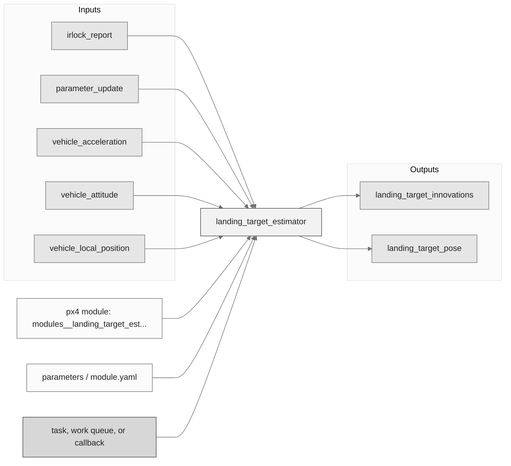
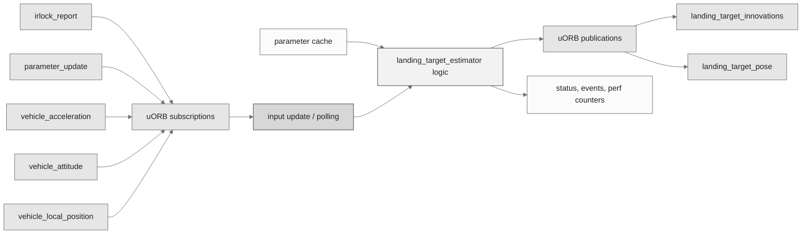
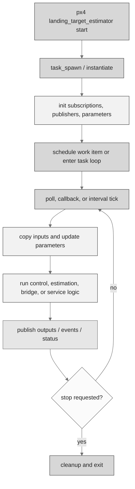
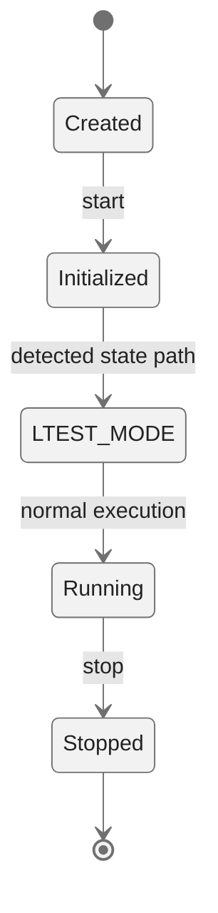
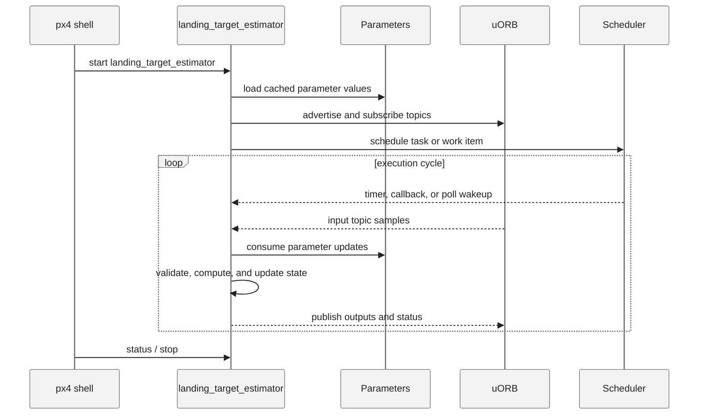
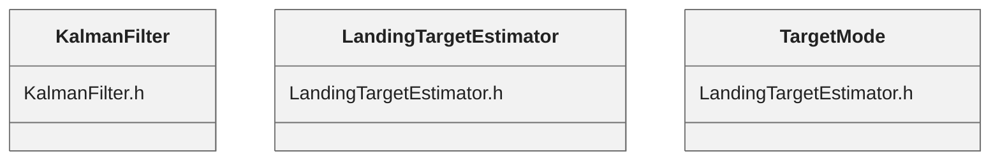

# PX4 Module Architecture: `landing_target_estimator`

- Source: `src/modules/landing_target_estimator`
- Build target: `modules__landing_target_estimator`
- Runtime main: `landing_target_estimator`
- Build kind: `px4 module`
- Mermaid palette: `ash` grey tone

Source-derived architecture notes for this PX4 module directory.

## Description of Module

Estimates relative landing-target position from target observations and vehicle state.

### Primary Responsibilities

- Fuse, filter, or validate measurements into estimated state outputs for other modules.
- Consume runtime inputs from uORB topics such as `irlock_report`, `parameter_update`, `vehicle_acceleration`, `vehicle_attitude`, `vehicle_local_position`.
- Publish outputs or status topics such as `landing_target_innovations`, `landing_target_pose`.
- Use module configuration from `landing_target_estimator_params.yaml`.
- Implement the main behavior in classes such as `KalmanFilter`, `LandingTargetEstimator`, `TargetMode`.

### Runtime Behavior

- Creates a dedicated PX4 task/thread with `px4_task_spawn_cmd()`.

## Background Theory

The landing target estimator turns a relative sensor observation into a target position in the navigation frame and filters it over time.

```text
p_target_ned = p_vehicle_ned + R_body_to_ned * p_target_body
innovation = z_target - H*x
K = P*H^T * inverse(H*P*H^T + R)
x = x + K*innovation
P = (I - K*H)*P
```

These equations are the study-level form of the algorithm. The implementation applies PX4-specific saturation, validity checks, parameter updates, and frame conventions around these core relationships.

### Main Interfaces

| Area | Details |
| --- | --- |
| Primary inputs | `irlock_report`, `parameter_update`, `vehicle_acceleration`, `vehicle_attitude`, `vehicle_local_position` |
| Primary outputs | `landing_target_innovations`, `landing_target_pose` |
| Referenced topics | `irlock_report`, `landing_target_innovations`, `landing_target_pose`, `parameter_update`, `vehicle_acceleration`, `vehicle_attitude`, `vehicle_local_position` |
| Parameters/config | landing_target_estimator_params.yaml |
| Key classes | `KalmanFilter`, `LandingTargetEstimator`, `TargetMode` |

### Files

| File | Why it matters |
| --- | --- |
| landing_target_estimator_main.cpp | Entry point, start command, or module lifecycle code |
| CMakeLists.txt | Build, parameter, or module configuration |
| landing_target_estimator_params.yaml | Build, parameter, or module configuration |
| KalmanFilter.h | Defines `KalmanFilter` class |
| LandingTargetEstimator.h | Defines `LandingTargetEstimator` class |

## Architecture Overview

This page is generated from the module source tree and shows the stable architecture surfaces: build entry point, scheduling shape, uORB data interfaces, parameter/configuration surfaces, and C++ types found in the module.



## Build and Entry Points

| Field | Value |
| --- | --- |
| Module path | src/modules/landing_target_estimator |
| Build kind | px4 module |
| Build target | modules__landing_target_estimator |
| Runtime main | landing_target_estimator |
| Stack main | Not specified |
| Module config | landing_target_estimator_params.yaml |
| Detected sources | 3 |
| Detected headers | 2 |
| Detected configs | 2 |

### CMake Dependencies

- No explicit CMake dependencies detected.

### Nested Module Targets

- No nested module targets detected.

## Data Flow



### uORB Topics

| Topic | Detected direction |
| --- | --- |
| irlock_report | subscribed |
| landing_target_innovations | published |
| landing_target_pose | published |
| parameter_update | subscribed |
| vehicle_acceleration | subscribed |
| vehicle_attitude | subscribed |
| vehicle_local_position | subscribed |

## Execution Flow



The common PX4 module lifecycle is command entry, object construction or task spawn, parameter loading, topic setup, scheduled execution, publication, status reporting, and stop/cleanup. Modules that use `ModuleBase`, `ScheduledWorkItem`, polling loops, or bridge callbacks still fit this lifecycle with different scheduling triggers.

## State Machine



### Detected State-Like Symbols

- `LTEST_MODE`

## Sequence Diagram



## Class Diagram



### Detected Classes

| Class | Base | File |
| --- | --- | --- |
| KalmanFilter |  | KalmanFilter.h |
| LandingTargetEstimator |  | LandingTargetEstimator.h |
| TargetMode |  | LandingTargetEstimator.h |

### Detected Enums

- `Rotation`
- `TargetMode`

## Parameters and Configuration

- No parameters detected.

## Source Map

| File | Kind |
| --- | --- |
| CMakeLists.txt | build |
| KalmanFilter.cpp | source |
| KalmanFilter.h | header |
| LandingTargetEstimator.cpp | source |
| LandingTargetEstimator.h | header |
| landing_target_estimator_main.cpp | source |
| landing_target_estimator_params.yaml | config |

## Review Notes

- The diagrams are generated from static source inventory and should be used as a study map, not as a formal proof of every runtime branch.
- Topic direction is inferred from nearby source context such as `Subscription`, `Publication`, `orb_subscribe`, and `publish` usage.
- When a module has no explicit state enum, the state diagram shows the standard PX4 module lifecycle.
