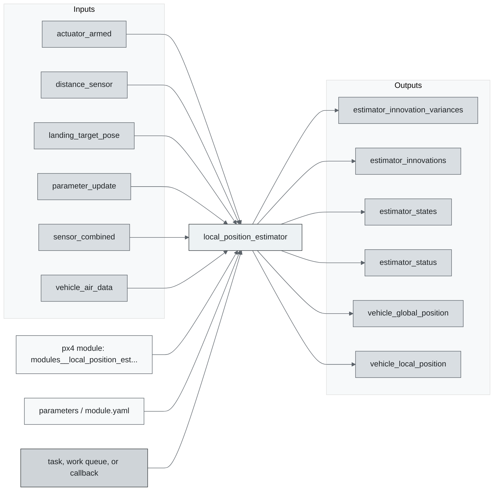
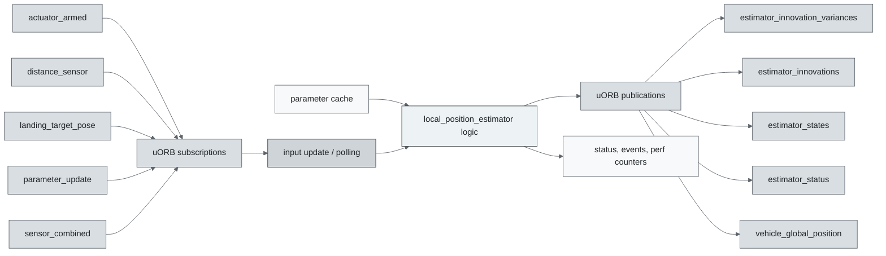
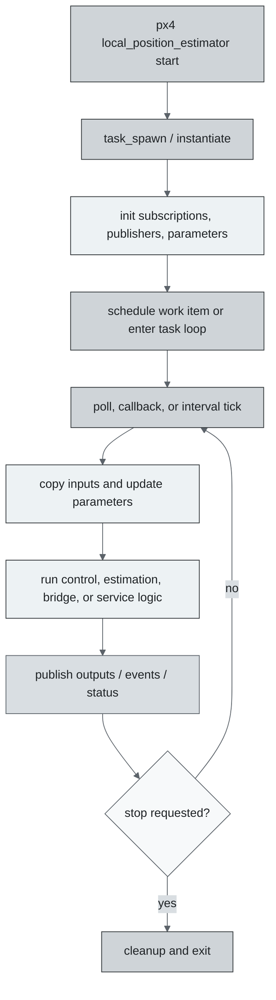
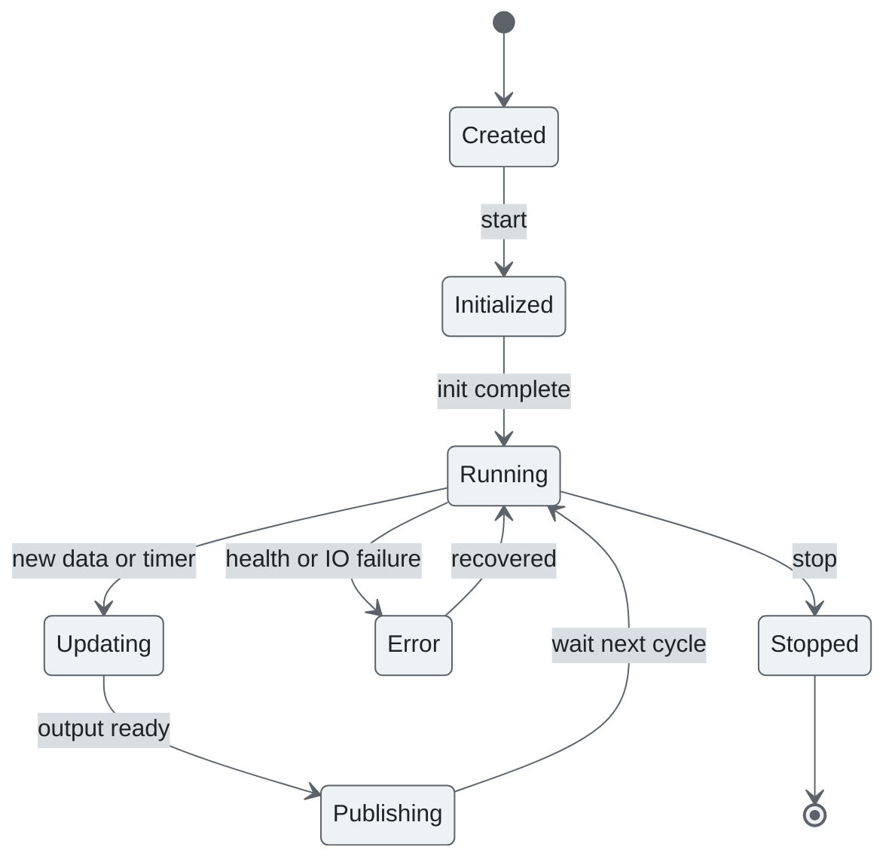
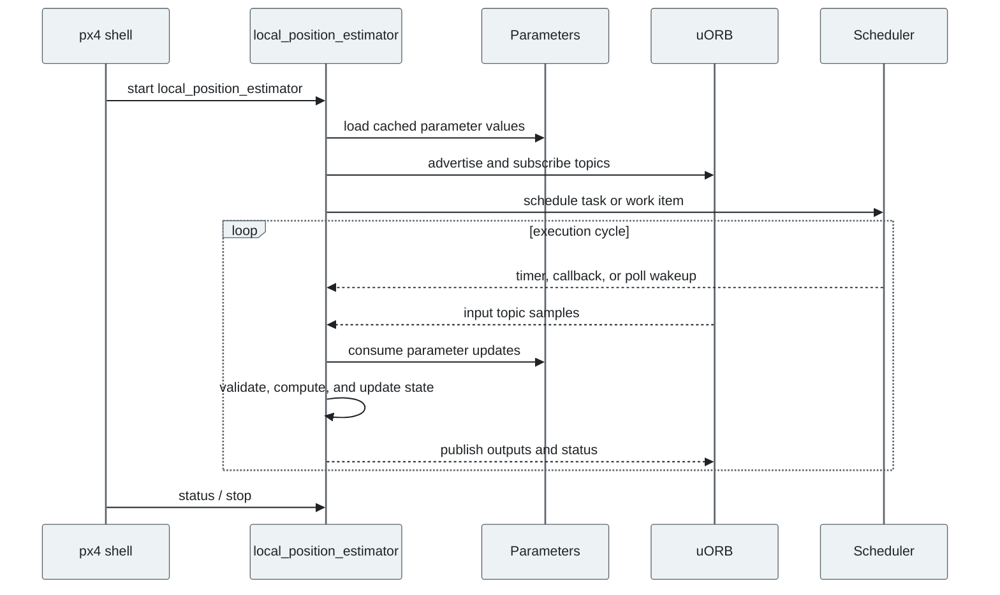
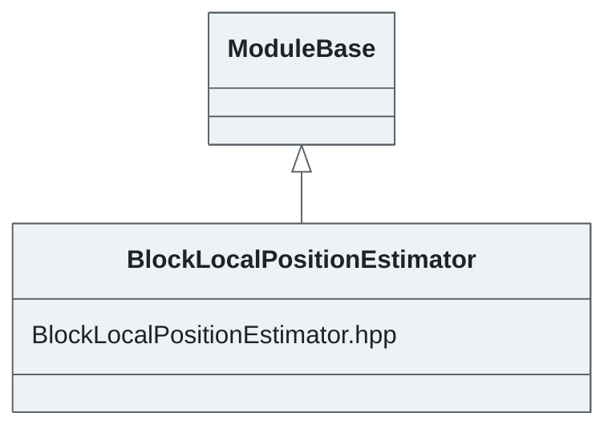

# PX4 Module Architecture: `local_position_estimator`

- Source: `src/modules/local_position_estimator`
- Build target: `modules__local_position_estimator`
- Runtime main: `local_position_estimator`
- Build kind: `px4 module`
- Mermaid palette: `graphite` grey tone

Source-derived architecture notes for this PX4 module directory.

## Architecture Overview

This page is generated from the module source tree and shows the stable architecture surfaces: build entry point, scheduling shape, uORB data interfaces, parameter/configuration surfaces, and C++ types found in the module.

## Build and Entry Points

| Field | Value |
| --- | --- |
| Module path | src/modules/local_position_estimator |
| Build kind | px4 module |
| Build target | modules__local_position_estimator |
| Runtime main | local_position_estimator |
| Stack main | 5700 |
| Module config | params.yaml |
| Detected sources | 10 |
| Detected headers | 1 |
| Detected configs | 2 |

### CMake Dependencies

- `controllib`
- `geo`
- `px4_work_queue`

### Nested Module Targets

- No nested module targets detected.

## Data Flow

### uORB Topics

| Topic | Detected direction |
| --- | --- |
| actuator_armed | subscribed |
| distance_sensor | subscribed |
| estimator_innovation_variances | published |
| estimator_innovations | published |
| estimator_states | published |
| estimator_status | published |
| landing_target_pose | subscribed |
| parameter_update | subscribed |
| sensor_combined | subscribed |
| sensor_gps | referenced |
| vehicle_air_data | subscribed |
| vehicle_angular_velocity | subscribed |
| vehicle_attitude | subscribed |
| vehicle_attitude_setpoint | referenced |
| vehicle_command | subscribed |
| vehicle_control_mode | referenced |
| vehicle_global_position | published |
| vehicle_gps_position | subscribed |
| vehicle_land_detected | subscribed |
| vehicle_local_position | subscribed, published |
| vehicle_mocap_odometry | subscribed |
| vehicle_odometry | published |
| vehicle_optical_flow | subscribed |
| vehicle_status | referenced |
| vehicle_visual_odometry | subscribed |

## Execution Flow

The common PX4 module lifecycle is command entry, object construction or task spawn, parameter loading, topic setup, scheduled execution, publication, status reporting, and stop/cleanup. Modules that use `ModuleBase`, `ScheduledWorkItem`, polling loops, or bridge callbacks still fit this lifecycle with different scheduling triggers.

## State Machine

### Detected State-Like Symbols

- No state-like symbols detected.

## Sequence Diagram

## Class Diagram

### Detected Classes

| Class | Base | File |
| --- | --- | --- |
| BlockLocalPositionEstimator | ModuleBase | BlockLocalPositionEstimator.hpp |

### Detected Enums

- `estimate_t`
- `sensor_t`

## Parameters and Configuration

- No parameters detected.

## Source Map

| File | Kind |
| --- | --- |
| BlockLocalPositionEstimator.cpp | source |
| BlockLocalPositionEstimator.hpp | header |
| CMakeLists.txt | build |
| params.yaml | config |
| sensors/baro.cpp | source |
| sensors/flow.cpp | source |
| sensors/gps.cpp | source |
| sensors/land.cpp | source |
| sensors/landing_target.cpp | source |
| sensors/lidar.cpp | source |
| sensors/mocap.cpp | source |
| sensors/sonar.cpp | source |
| sensors/vision.cpp | source |

## Review Notes

- The diagrams are generated from static source inventory and should be used as a study map, not as a formal proof of every runtime branch.
- Topic direction is inferred from nearby source context such as `Subscription`, `Publication`, `orb_subscribe`, and `publish` usage.
- When a module has no explicit state enum, the state diagram shows the standard PX4 module lifecycle.
