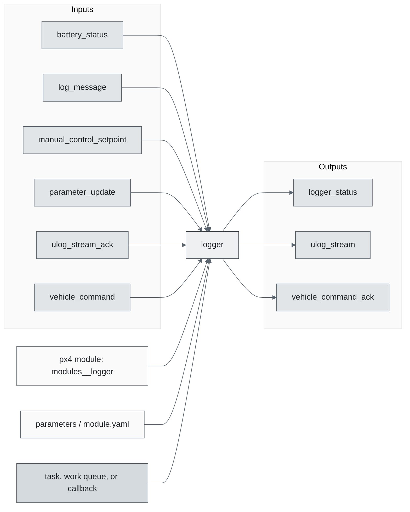
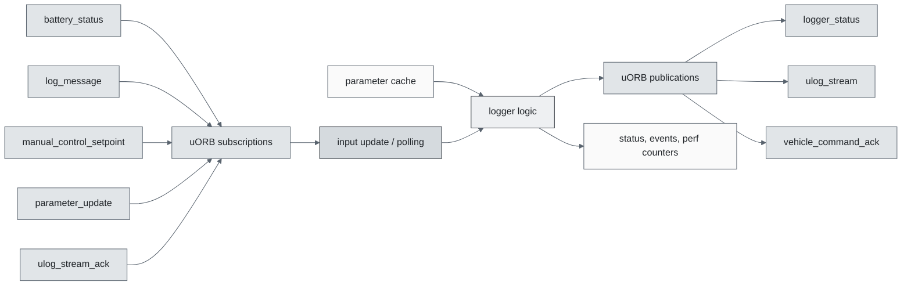
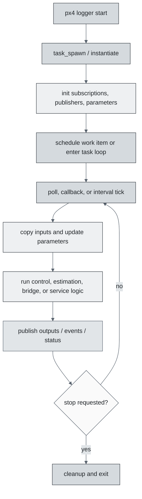
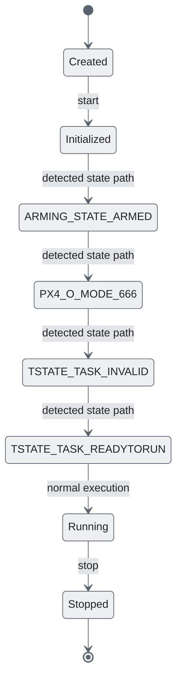
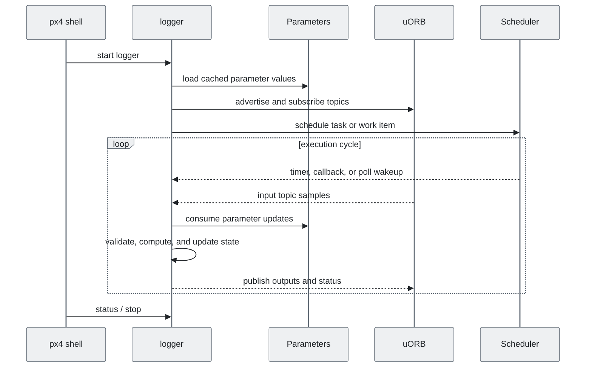

# PX4 Module Architecture: `logger`

- Source: `src/modules/logger`
- Build target: `modules__logger`
- Runtime main: `logger`
- Build kind: `px4 module`
- Mermaid palette: `slate` grey tone

Architecture notes for the logger module.

## Architecture Overview

This page is generated from the module source tree and shows the stable architecture surfaces: build entry point, scheduling shape, uORB data interfaces, parameter/configuration surfaces, and C++ types found in the module.

## Build and Entry Points

| Field | Value |
| --- | --- |
| Module path | src/modules/logger |
| Build kind | px4 module |
| Build target | modules__logger |
| Runtime main | logger |
| Stack main | 2500 |
| Module config | module.yaml |
| Detected sources | 10 |
| Detected headers | 9 |
| Detected configs | 3 |

### CMake Dependencies

- `version`
- `component_general_json`

### Nested Module Targets

- No nested module targets detected.

## Data Flow

### uORB Topics

| Topic | Detected direction |
| --- | --- |
| battery_status | subscribed |
| log_message | subscribed |
| logger_status | published |
| manual_control_setpoint | subscribed |
| parameter_update | subscribed |
| uORBTopics | referenced |
| ulog_stream | published |
| ulog_stream_ack | subscribed |
| vehicle_command | subscribed |
| vehicle_command_ack | published |
| vehicle_status | subscribed |

## Execution Flow

The common PX4 module lifecycle is command entry, object construction or task spawn, parameter loading, topic setup, scheduled execution, publication, status reporting, and stop/cleanup. Modules that use `ModuleBase`, `ScheduledWorkItem`, polling loops, or bridge callbacks still fit this lifecycle with different scheduling triggers.

## State Machine

### Detected State-Like Symbols

- `ARMING_STATE_ARMED`
- `PX4_O_MODE_666`
- `TSTATE_TASK_INVALID`
- `TSTATE_TASK_READYTORUN`

## Sequence Diagram

## Class Diagram

```mermaid
%%{init: {"theme":"base","themeVariables":{"primaryColor":"#eef0f2","secondaryColor":"#e1e5e8","tertiaryColor":"#fafafa","primaryBorderColor":"#59636e","primaryTextColor":"#202428","lineColor":"#59636e","fontFamily":"Inter, Arial, sans-serif"}}}%%
classDiagram
  class LogWriter
  LogWriter : log_writer.h
  class LogType
  LogType : log_writer_file.h
  class LogWriterFile
  LogWriterFile : log_writer_file.h
  class LogFileBuffer
  LogFileBuffer : log_writer_file.h
  class LogWriterMavlink
  LogWriterMavlink : log_writer_mavlink.h
  class SDLogProfileMask
  SDLogProfileMask : logged_topics.h
  class MissionLogType
  MissionLogType : logged_topics.h
  class LoggedTopics
  LoggedTopics : logged_topics.h
  class Logger
  Logger : logger.h
  class ModuleBase
  ModuleBase <|-- Logger
  class LogMode
  LogMode : logger.h
  class PrintLoadReason
  PrintLoadReason : logger.h
  class ULogMessageType
  ULogMessageType : messages.h
  class ulog_parameter_default_type_t
  ulog_parameter_default_type_t : messages.h
```

### Detected Classes

| Class | Base | File |
| --- | --- | --- |
| LogWriter |  | log_writer.h |
| LogType |  | log_writer_file.h |
| LogWriterFile |  | log_writer_file.h |
| LogFileBuffer |  | log_writer_file.h |
| LogWriterMavlink |  | log_writer_mavlink.h |
| SDLogProfileMask |  | logged_topics.h |
| MissionLogType |  | logged_topics.h |
| LoggedTopics |  | logged_topics.h |
| Logger | ModuleBase | logger.h |
| LogMode |  | logger.h |
| PrintLoadReason |  | logger.h |
| ULogMessageType |  | messages.h |
| ulog_parameter_default_type_t |  | messages.h |

### Detected Enums

- `LogMode`
- `LogType`
- `MissionLogType`
- `PrintLoadReason`
- `SDLogProfileMask`
- `ULogMessageType`
- `ulog_parameter_default_type_t`
- `values`

## Parameters and Configuration

- No parameters detected.

## Source Map

| File | Kind |
| --- | --- |
| CMakeLists.txt | build |
| ULogMessagesTest.cpp | source |
| log_writer.cpp | source |
| log_writer.h | header |
| log_writer_file.cpp | source |
| log_writer_file.h | header |
| log_writer_mavlink.cpp | source |
| log_writer_mavlink.h | header |
| logged_topics.cpp | source |
| logged_topics.h | header |
| logger.cpp | source |
| logger.h | header |
| loggerUtilTest.cpp | source |
| messages.h | header |
| module.yaml | config |
| module_params_crypto.yaml | config |
| util.cpp | source |
| util.h | header |
| util_parse.cpp | source |
| util_parse.h | header |
| watchdog.cpp | source |
| watchdog.h | header |

## Review Notes

- The diagrams are generated from static source inventory and should be used as a study map, not as a formal proof of every runtime branch.
- Topic direction is inferred from nearby source context such as `Subscription`, `Publication`, `orb_subscribe`, and `publish` usage.
- When a module has no explicit state enum, the state diagram shows the standard PX4 module lifecycle.
