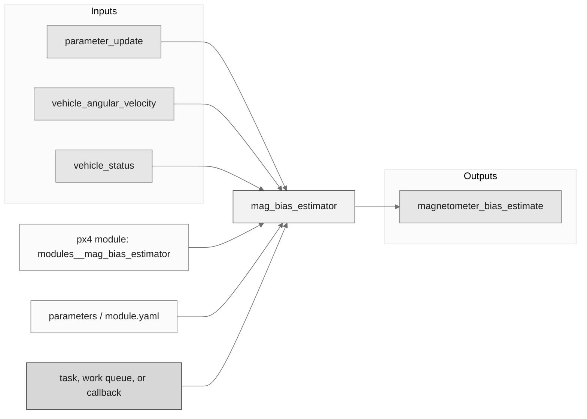
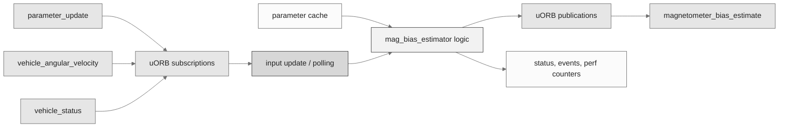
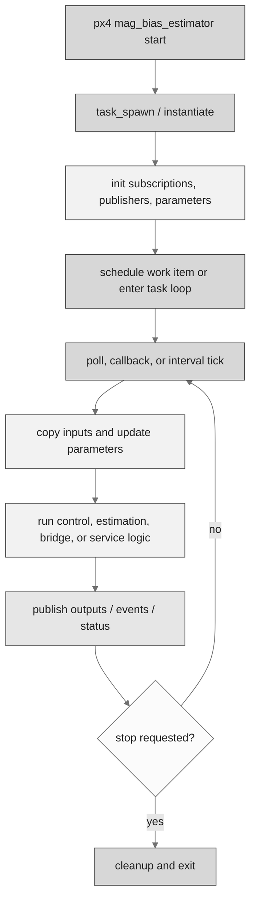
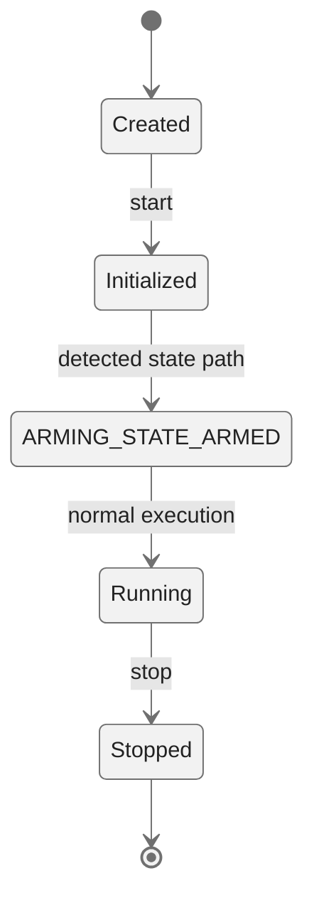
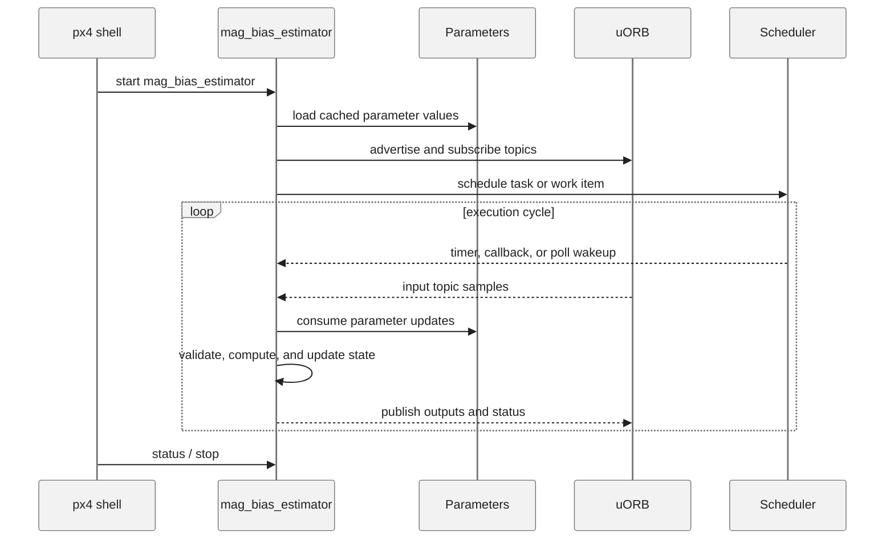
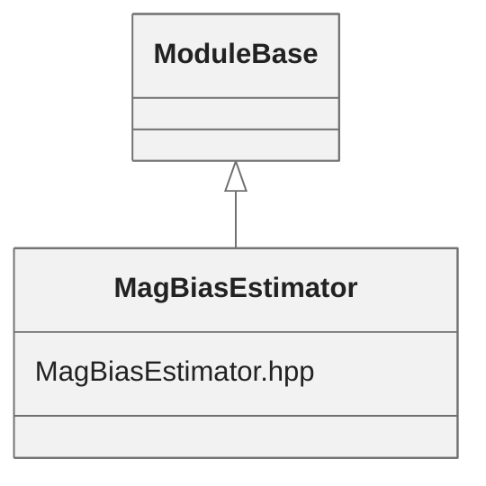

# PX4 Module Architecture: `mag_bias_estimator`

- Source: `src/modules/mag_bias_estimator`
- Build target: `modules__mag_bias_estimator`
- Runtime main: `mag_bias_estimator`
- Build kind: `px4 module`
- Mermaid palette: `ash` grey tone

Online magnetometer bias estimator.

## Description of Module

Estimates magnetometer bias and publishes bias corrections for estimator use.

### Primary Responsibilities

- Fuse, filter, or validate measurements into estimated state outputs for other modules.
- Consume runtime inputs from uORB topics such as `parameter_update`, `vehicle_angular_velocity`, `vehicle_status`.
- Publish outputs or status topics such as `magnetometer_bias_estimate`.
- Use module configuration from `params.yaml`.
- Implement the main behavior in classes such as `MagBiasEstimator`.

### Runtime Behavior

- Runs work-queue callbacks on queue configurations such as `lp_default`.
- Uses explicit work-item scheduling through immediate, delayed, or interval scheduling calls.

## Background Theory

Magnetic bias estimation compares measured magnetic field with the field predicted from attitude and world magnetic model.

```text
m_pred_body = R_ned_to_body * m_world
innovation = m_meas_body - (m_pred_body + bias)
bias[k] = bias[k-1] + K_bias * innovation
P_bias[k] = (I - K_bias*H) * P_bias[k-1]
```

These equations are the study-level form of the algorithm. The implementation applies PX4-specific saturation, validity checks, parameter updates, and frame conventions around these core relationships.

### Main Interfaces

| Area | Details |
| --- | --- |
| Primary inputs | `parameter_update`, `vehicle_angular_velocity`, `vehicle_status` |
| Primary outputs | `magnetometer_bias_estimate` |
| Referenced topics | `magnetometer_bias_estimate`, `parameter_update`, `sensor_mag`, `vehicle_angular_velocity`, `vehicle_status` |
| Parameters/config | params.yaml |
| Key classes | `MagBiasEstimator` |

### Files

| File | Why it matters |
| --- | --- |
| MagBiasEstimator.cpp | Entry point, start command, or module lifecycle code |
| CMakeLists.txt | Build, parameter, or module configuration |
| params.yaml | Build, parameter, or module configuration |
| MagBiasEstimator.hpp | Defines `MagBiasEstimator` class |

## Architecture Overview

This page is generated from the module source tree and shows the stable architecture surfaces: build entry point, scheduling shape, uORB data interfaces, parameter/configuration surfaces, and C++ types found in the module.



## Build and Entry Points

| Field | Value |
| --- | --- |
| Module path | src/modules/mag_bias_estimator |
| Build kind | px4 module |
| Build target | modules__mag_bias_estimator |
| Runtime main | mag_bias_estimator |
| Stack main | Not specified |
| Module config | params.yaml |
| Detected sources | 1 |
| Detected headers | 1 |
| Detected configs | 2 |

### CMake Dependencies

- `px4_work_queue`

### Nested Module Targets

- No nested module targets detected.

## Data Flow



### uORB Topics

| Topic | Detected direction |
| --- | --- |
| magnetometer_bias_estimate | published |
| parameter_update | subscribed |
| sensor_mag | referenced |
| vehicle_angular_velocity | subscribed |
| vehicle_status | subscribed |

## Execution Flow



The common PX4 module lifecycle is command entry, object construction or task spawn, parameter loading, topic setup, scheduled execution, publication, status reporting, and stop/cleanup. Modules that use `ModuleBase`, `ScheduledWorkItem`, polling loops, or bridge callbacks still fit this lifecycle with different scheduling triggers.

## State Machine



### Detected State-Like Symbols

- `ARMING_STATE_ARMED`

## Sequence Diagram



## Class Diagram



### Detected Classes

| Class | Base | File |
| --- | --- | --- |
| MagBiasEstimator | ModuleBase | MagBiasEstimator.hpp |

### Detected Enums

- No enums detected.

## Parameters and Configuration

- No parameters detected.

## Source Map

| File | Kind |
| --- | --- |
| CMakeLists.txt | build |
| MagBiasEstimator.cpp | source |
| MagBiasEstimator.hpp | header |
| params.yaml | config |

## Review Notes

- The diagrams are generated from static source inventory and should be used as a study map, not as a formal proof of every runtime branch.
- Topic direction is inferred from nearby source context such as `Subscription`, `Publication`, `orb_subscribe`, and `publish` usage.
- When a module has no explicit state enum, the state diagram shows the standard PX4 module lifecycle.
