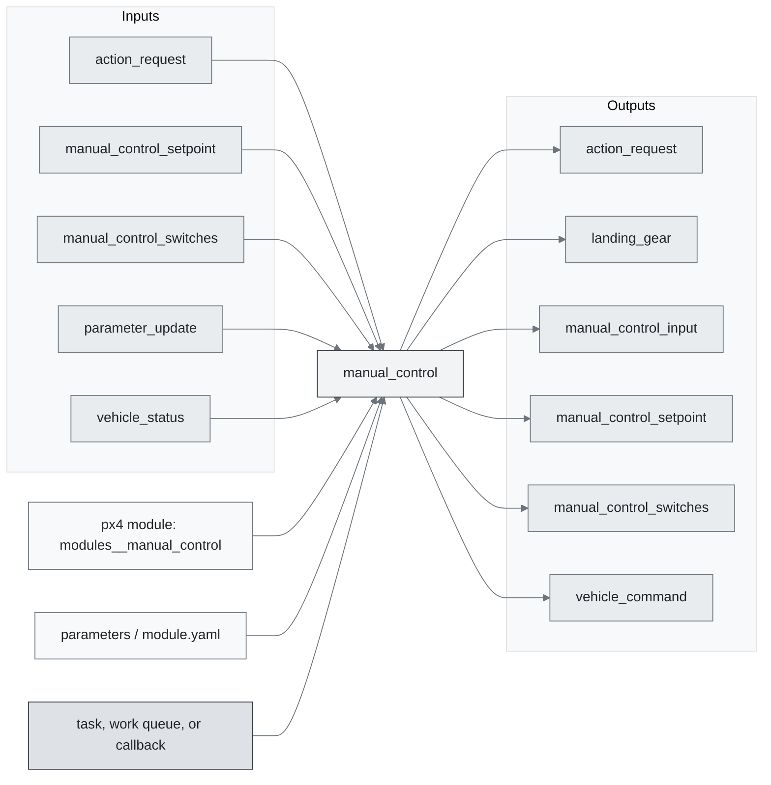
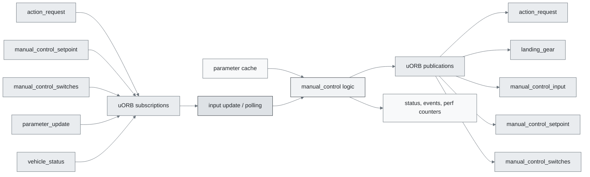
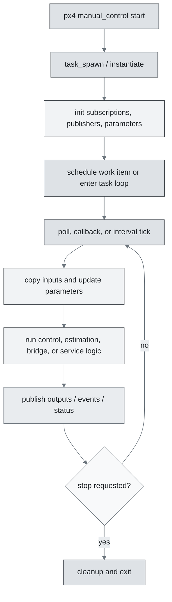
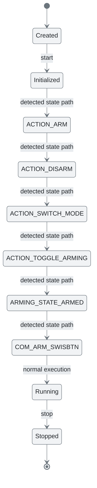
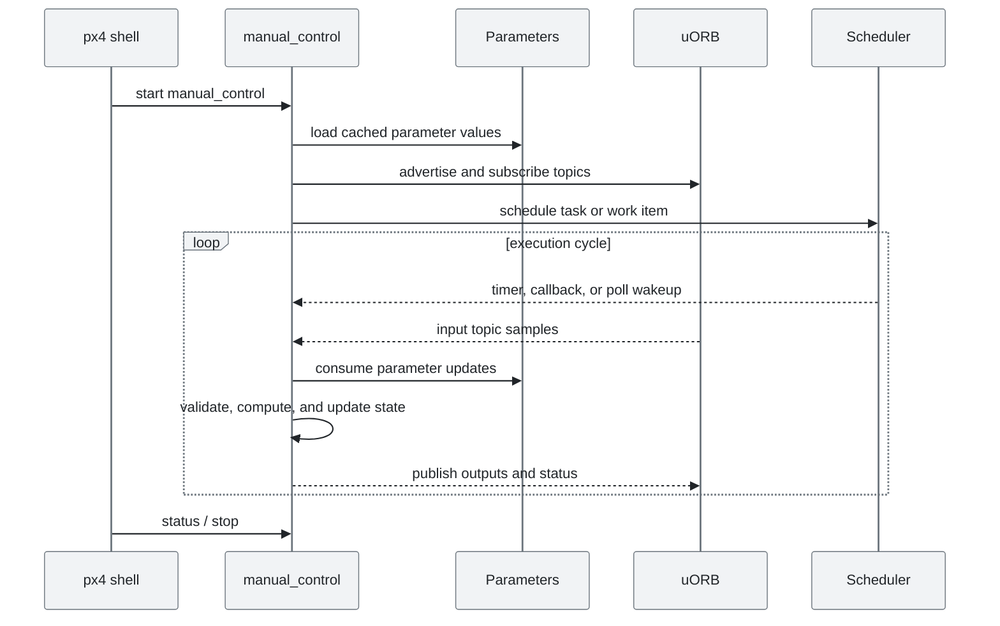
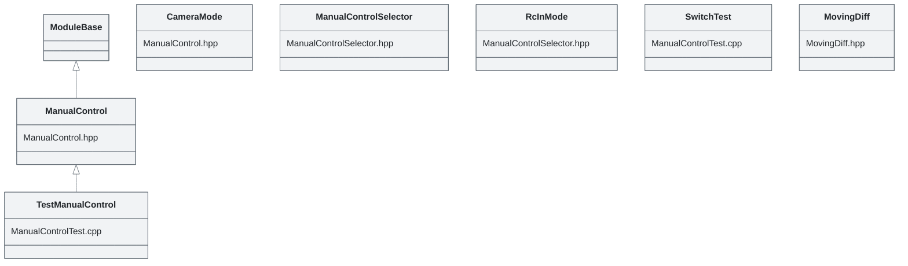

# PX4 Module Architecture: `manual_control`

- Source: `src/modules/manual_control`
- Build target: `modules__manual_control`
- Runtime main: `manual_control`
- Build kind: `px4 module`
- Mermaid palette: `mist` grey tone

Source-derived architecture notes for this PX4 module directory.

## Architecture Overview

This page is generated from the module source tree and shows the stable architecture surfaces: build entry point, scheduling shape, uORB data interfaces, parameter/configuration surfaces, and C++ types found in the module.

## Build and Entry Points

| Field | Value |
| --- | --- |
| Module path | src/modules/manual_control |
| Build kind | px4 module |
| Build target | modules__manual_control |
| Runtime main | manual_control |
| Stack main | Not specified |
| Module config | manual_control_params.yaml |
| Detected sources | 5 |
| Detected headers | 3 |
| Detected configs | 2 |

### CMake Dependencies

- `hysteresis`
- `px4_work_queue`

### Nested Module Targets

- No nested module targets detected.

## Data Flow

### uORB Topics

| Topic | Detected direction |
| --- | --- |
| action_request | subscribed, published |
| landing_gear | published |
| manual_control_input | published |
| manual_control_setpoint | subscribed, published |
| manual_control_switches | subscribed, published |
| parameter_update | subscribed |
| vehicle_command | published |
| vehicle_status | subscribed, published |

## Execution Flow

The common PX4 module lifecycle is command entry, object construction or task spawn, parameter loading, topic setup, scheduled execution, publication, status reporting, and stop/cleanup. Modules that use `ModuleBase`, `ScheduledWorkItem`, polling loops, or bridge callbacks still fit this lifecycle with different scheduling triggers.

## State Machine

### Detected State-Like Symbols

- `ACTION_ARM`
- `ACTION_DISARM`
- `ACTION_SWITCH_MODE`
- `ACTION_TOGGLE_ARMING`
- `ARMING_STATE_ARMED`
- `COM_ARM_SWISBTN`
- `COM_FLTMODE`
- `COM_FLTMODE1`
- `COM_FLTMODE2`
- `COM_FLTMODE3`
- `COM_FLTMODE4`
- `COM_FLTMODE5`
- `COM_FLTMODE6`
- `COM_RC_IN_MODE`
- `MAN_ARM_GESTURE`
- `MC_AIRMODE`
- `NAVIGATION_STATE_ACRO`
- `NAVIGATION_STATE_ALTCTL`
- `NAVIGATION_STATE_ALTITUDE_CRUISE`
- `NAVIGATION_STATE_AUTO_FOLLOW_TARGET`
- `NAVIGATION_STATE_AUTO_LAND`
- `NAVIGATION_STATE_AUTO_LOITER`
- `NAVIGATION_STATE_AUTO_MISSION`
- `NAVIGATION_STATE_AUTO_PRECLAND`
- `NAVIGATION_STATE_AUTO_RTL`
- `NAVIGATION_STATE_AUTO_TAKEOFF`
- `NAVIGATION_STATE_AUTO_VTOL_TAKEOFF`
- `NAVIGATION_STATE_EXTERNAL1`
- `NAVIGATION_STATE_EXTERNAL2`
- `NAVIGATION_STATE_EXTERNAL3`
- `NAVIGATION_STATE_EXTERNAL4`
- `NAVIGATION_STATE_EXTERNAL5`
- `NAVIGATION_STATE_EXTERNAL6`
- `NAVIGATION_STATE_EXTERNAL7`
- `NAVIGATION_STATE_EXTERNAL8`
- `NAVIGATION_STATE_MANUAL`
- `NAVIGATION_STATE_OFFBOARD`
- `NAVIGATION_STATE_ORBIT`
- `NAVIGATION_STATE_POSCTL`
- `NAVIGATION_STATE_POSITION_SLOW`
- ... 4 more

## Sequence Diagram

## Class Diagram

### Detected Classes

| Class | Base | File |
| --- | --- | --- |
| ManualControl | ModuleBase | ManualControl.hpp |
| CameraMode |  | ManualControl.hpp |
| ManualControlSelector |  | ManualControlSelector.hpp |
| RcInMode |  | ManualControlSelector.hpp |
| TestManualControl | ManualControl | ManualControlTest.cpp |
| SwitchTest |  | ManualControlTest.cpp |
| MovingDiff |  | MovingDiff.hpp |

### Detected Enums

- `CameraMode`
- `RcInMode`

## Parameters and Configuration

- No parameters detected.

## Source Map

| File | Kind |
| --- | --- |
| CMakeLists.txt | build |
| ManualControl.cpp | source |
| ManualControl.hpp | header |
| ManualControlSelector.cpp | source |
| ManualControlSelector.hpp | header |
| ManualControlSelectorTest.cpp | source |
| ManualControlTest.cpp | source |
| MovingDiff.hpp | header |
| MovingDiffTest.cpp | source |
| manual_control_params.yaml | config |

## Review Notes

- The diagrams are generated from static source inventory and should be used as a study map, not as a formal proof of every runtime branch.
- Topic direction is inferred from nearby source context such as `Subscription`, `Publication`, `orb_subscribe`, and `publish` usage.
- When a module has no explicit state enum, the state diagram shows the standard PX4 module lifecycle.
