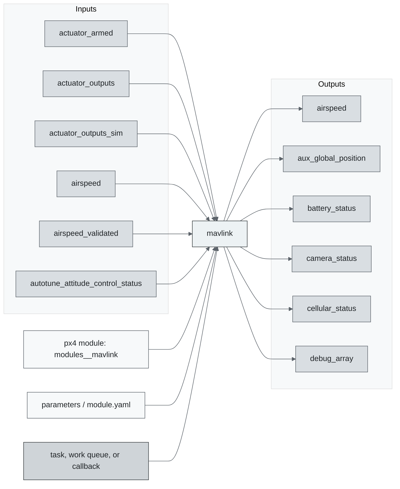
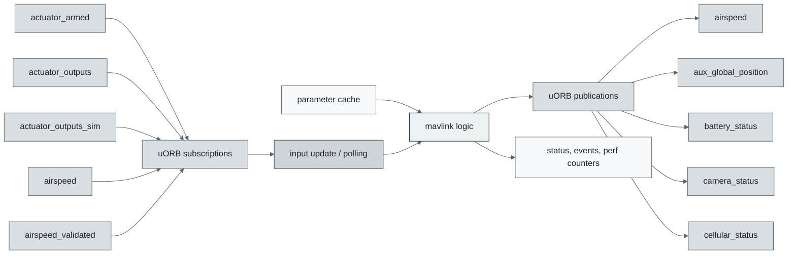
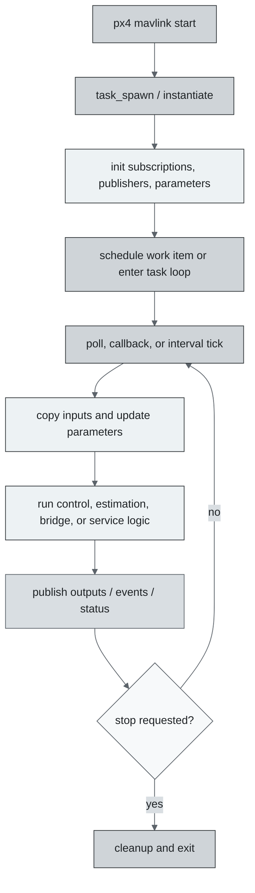
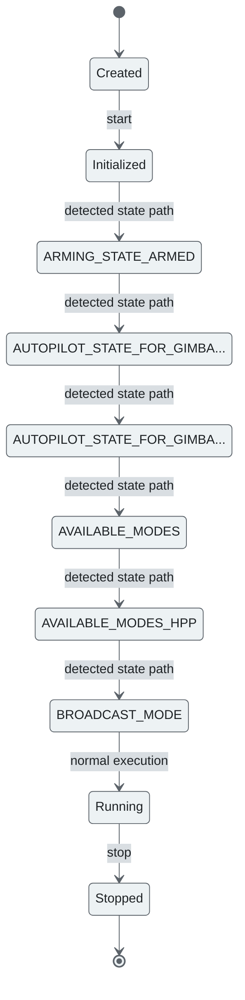
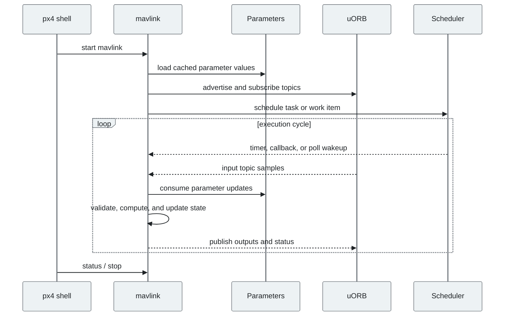

# PX4 Module Architecture: `mavlink`

- Source: `src/modules/mavlink`
- Build target: `modules__mavlink`
- Runtime main: `mavlink`
- Build kind: `px4 module`
- Mermaid palette: `graphite` grey tone

Architecture notes for the MAVLink module.

## Description of Module

Implements MAVLink telemetry, command, mission, parameter, and shell communication links.

### Primary Responsibilities

- Translate between PX4 uORB data and an external transport or companion-computer interface.
- Consume runtime inputs from uORB topics such as `actuator_armed`, `actuator_outputs`, `actuator_outputs_sim`, `airspeed`, `airspeed_validated`, `autotune_attitude_control_status`, `battery_status`, `camera_capture`, ... 77 more.
- Publish outputs or status topics such as `airspeed`, `aux_global_position`, `battery_status`, `camera_status`, `cellular_status`, `debug_array`, `debug_key_value`, `debug_value`, ... 56 more.
- Use parameters or module configuration entries such as `MAV_S_FORWARD`, `MAV_S_MODE`.
- Implement the main behavior in classes such as `MavlinkStatustextHandler`, `access`, `MsgMap`, `_T`, `MavlinkCommandSender`, `Mavlink`, ... 127 more.

### Runtime Behavior

- Creates a dedicated PX4 task/thread with `px4_task_spawn_cmd()`.
- Uses a `run()` loop style module body for repeated execution.
- Creates an additional pthread helper context.

## Background Theory

No dedicated mathematical model was identified in the generated source scan. This module is best understood through its PX4 state handling, uORB message flow, scheduling, and configuration surfaces described below.

### Main Interfaces

| Area | Details |
| --- | --- |
| Primary inputs | `actuator_armed`, `actuator_outputs`, `actuator_outputs_sim`, `airspeed`, `airspeed_validated`, `autotune_attitude_control_status`, `battery_status`, `camera_capture`, `camera_status`, `camera_trigger`, ... 75 more |
| Primary outputs | `airspeed`, `aux_global_position`, `battery_status`, `camera_status`, `cellular_status`, `debug_array`, `debug_key_value`, `debug_value`, `debug_vect`, `differential_pressure`, ... 54 more |
| Referenced topics | `actuator_armed`, `actuator_outputs`, `actuator_outputs_sim`, `airspeed`, `airspeed_validated`, `autotune_attitude_control_status`, `aux_global_position`, `battery_info`, `battery_status`, `camera_capture`, ... 123 more |
| Parameters/config | `MAV_S_FORWARD`, `MAV_S_MODE` |
| Key classes | `MavlinkStatustextHandler`, `access`, `MsgMap`, `_T`, `MavlinkCommandSender`, `Mavlink`, `EventBuffer`, `SendProtocol`, `and`, `Mavlink`, ... 123 more |

### Files

| File | Why it matters |
| --- | --- |
| mavlink_events.cpp | Entry point, start command, or module lifecycle code |
| mavlink_ftp.cpp | Entry point, start command, or module lifecycle code |
| mavlink_log_handler.cpp | Entry point, start command, or module lifecycle code |
| mavlink_main.cpp | Entry point, start command, or module lifecycle code |
| mavlink_messages.cpp | Entry point, start command, or module lifecycle code |
| CMakeLists.txt | Build, parameter, or module configuration |
| mavlink/.github/dependabot.yml | Build, parameter, or module configuration |
| MavlinkStatustextHandler.hpp | Defines `MavlinkStatustextHandler` class |

## Architecture Overview

This page is generated from the module source tree and shows the stable architecture surfaces: build entry point, scheduling shape, uORB data interfaces, parameter/configuration surfaces, and C++ types found in the module.

## Build and Entry Points

| Field | Value |
| --- | --- |
| Module path | src/modules/mavlink |
| Build kind | px4 module |
| Build target | modules__mavlink |
| Runtime main | mavlink |
| Stack main | Not specified |
| Module config | module.yaml |
| Detected sources | 23 |
| Detected headers | 132 |
| Detected configs | 16 |

### CMake Dependencies

- `adsb`
- `airspeed`
- `component_general_json`
- `dataman_client`
- `drivers_accelerometer`
- `drivers_gyroscope`
- `drivers_magnetometer`
- `conversion`
- `gnss`
- `sensor_calibration`
- `geo`
- `mavlink_c`
- `timesync`
- `tunes`
- `variable_length_ringbuffer`
- `version`
- `UNITY_BUILD`

### Nested Module Targets

- No nested module targets detected.

## Data Flow

### uORB Topics

| Topic | Detected direction |
| --- | --- |
| actuator_armed | subscribed |
| actuator_outputs | subscribed |
| actuator_outputs_sim | subscribed |
| airspeed | subscribed, published |
| airspeed_validated | subscribed |
| autotune_attitude_control_status | subscribed |
| aux_global_position | published |
| battery_info | referenced |
| battery_status | subscribed, published |
| camera_capture | subscribed |
| camera_status | subscribed, published |
| camera_trigger | subscribed |
| cellular_status | published |
| cpuload | subscribed |
| debug_array | subscribed, published |
| debug_key_value | subscribed, published |
| debug_value | subscribed, published |
| debug_vect | subscribed, published |
| differential_pressure | subscribed, published |
| distance_sensor | published |
| dronecan_node_status | referenced |
| esc_eeprom_read | subscribed |
| esc_eeprom_write | published |
| esc_serial_passthru | published |
| esc_status | referenced |
| estimator_fusion_control | subscribed |
| estimator_selector_status | subscribed |
| estimator_sensor_bias | subscribed |
| estimator_status | subscribed |
| event | subscribed, published |
| failsafe_flags | subscribed |
| failure_detector_status | subscribed |
| fiducial_marker_pos_report | published |
| fiducial_marker_yaw_report | published |
| figure_eight_status | referenced |
| follow_target | published |
| fuel_tank_status | subscribed |
| fw_virtual_attitude_setpoint | published |
| generator_status | published |
| geofence_result | subscribed |
| gimbal_device_attitude_status | subscribed, published |
| gimbal_device_information | subscribed, published |
| gimbal_device_set_attitude | subscribed |
| gimbal_manager_information | subscribed |
| gimbal_manager_set_attitude | published |
| gimbal_manager_set_manual_control | published |
| gimbal_manager_status | subscribed |
| gimbal_v1_command | subscribed |
| ... 85 more topics | omitted |

## Execution Flow

The common PX4 module lifecycle is command entry, object construction or task spawn, parameter loading, topic setup, scheduled execution, publication, status reporting, and stop/cleanup. Modules that use `ModuleBase`, `ScheduledWorkItem`, polling loops, or bridge callbacks still fit this lifecycle with different scheduling triggers.

## State Machine

### Detected State-Like Symbols

- `ARMING_STATE_ARMED`
- `AUTOPILOT_STATE_FOR_GIMBAL_DEVICE`
- `AUTOPILOT_STATE_FOR_GIMBAL_DEVICE_HPP`
- `AVAILABLE_MODES`
- `AVAILABLE_MODES_HPP`
- `BROADCAST_MODE`
- `BROADCAST_MODE_MULTICAST`
- `BROADCAST_MODE_OFF`
- `BROADCAST_MODE_ON`
- `COMPONENT_MODE_EXECUTOR_START`
- `CURRENT_MODE`
- `CURRENT_MODE_HPP`
- `DEFINE_GET_PX4_CUSTOM_MODE`
- `DM_KEY_FENCE_POINTS_STATE`
- `DM_KEY_MISSION_STATE`
- `DM_KEY_SAFE_POINTS_STATE`
- `EXTENDED_SYS_STATE`
- `EXTENDED_SYS_STATE_HPP`
- `FLOW_CONTROL_MODE`
- `HIL_STATE_OFF`
- `HIL_STATE_ON`
- `HIL_STATE_QUATERNION`
- `HIL_STATE_QUATERNION_HPP`
- `MAVLINK_MODE`
- `MAVLINK_MODE_CONFIG`
- `MAVLINK_MODE_COUNT`
- `MAVLINK_MODE_CUSTOM`
- `MAVLINK_MODE_DISTANCE_SENSOR`
- `MAVLINK_MODE_EXTVISION`
- `MAVLINK_MODE_EXTVISIONMIN`
- `MAVLINK_MODE_GIMBAL`
- `MAVLINK_MODE_IRIDIUM`
- `MAVLINK_MODE_LOW_BANDWIDTH`
- `MAVLINK_MODE_MAGIC`
- `MAVLINK_MODE_MINIMAL`
- `MAVLINK_MODE_NORMAL`
- `MAVLINK_MODE_ONBOARD`
- `MAVLINK_MODE_ONBOARD_LOW_BANDWIDTH`
- `MAVLINK_MODE_OSD`
- `MAVLINK_MODE_UAVIONIX`
- ... 133 more

## Sequence Diagram

## Class Diagram

```mermaid
%%{init: {"theme":"base","themeVariables":{"primaryColor":"#edf2f4","secondaryColor":"#d9dee2","tertiaryColor":"#f7f9fa","primaryBorderColor":"#5c636a","primaryTextColor":"#1f2326","lineColor":"#5c636a","fontFamily":"Inter, Arial, sans-serif"}}}%%
classDiagram
  class MavlinkStatustextHandler
  MavlinkStatustextHandler : MavlinkStatustextHandler.hpp
  class access
  access : mavlink/pymavlink/generator/CPP11/include_v2.0/mess...
  class MsgMap
  MsgMap : mavlink/pymavlink/generator/CPP11/include_v2.0/msgm...
  class _T
  _T : mavlink/pymavlink/generator/CPP11/include_v2.0/msgm...
  class MavlinkCommandSender
  MavlinkCommandSender : mavlink_command_sender.h
  class Mavlink
  Mavlink : mavlink_events.h
  class EventBuffer
  EventBuffer : mavlink_events.h
  class SendProtocol
  SendProtocol : mavlink_events.h
  class and
  and : mavlink_events.h
  class Mavlink_9
  Mavlink_9 : mavlink_ftp.h
  class MavlinkFTP
  MavlinkFTP : mavlink_ftp.h
  class Mavlink_11
  Mavlink_11 : mavlink_log_handler.h
  class MavlinkLogHandler
  MavlinkLogHandler : mavlink_log_handler.h
  class LogHandlerState
  LogHandlerState : mavlink_log_handler.h
  class Protocol
  Protocol : mavlink_main.h
  class Mavlink_15
  Mavlink_15 : mavlink_main.h
```

### Detected Classes

| Class | Base | File |
| --- | --- | --- |
| MavlinkStatustextHandler |  | MavlinkStatustextHandler.hpp |
| access |  | mavlink/pymavlink/generator/CPP11/include_v2.0/message.hpp |
| MsgMap |  | mavlink/pymavlink/generator/CPP11/include_v2.0/msgmap.hpp |
| _T |  | mavlink/pymavlink/generator/CPP11/include_v2.0/msgmap.hpp |
| MavlinkCommandSender |  | mavlink_command_sender.h |
| Mavlink |  | mavlink_events.h |
| EventBuffer |  | mavlink_events.h |
| SendProtocol |  | mavlink_events.h |
| and |  | mavlink_events.h |
| Mavlink |  | mavlink_ftp.h |
| MavlinkFTP |  | mavlink_ftp.h |
| Mavlink |  | mavlink_log_handler.h |
| MavlinkLogHandler |  | mavlink_log_handler.h |
| LogHandlerState |  | mavlink_log_handler.h |
| Protocol |  | mavlink_main.h |
| Mavlink |  | mavlink_main.h |
| StreamListItem |  | mavlink_messages.h |
| T |  | mavlink_messages.h |
| Mavlink |  | mavlink_mission.h |
| MavlinkMissionManager |  | mavlink_mission.h |
| Dataman |  | mavlink_mission.h |
| Mavlink |  | mavlink_parameters.h |
| MavlinkParametersManager |  | mavlink_parameters.h |
| MavlinkRateLimiter |  | mavlink_rate_limiter.h |
| ... 109 more |  |  |

### Detected Enums

- `BROADCAST_MODE`
- `ErrorCode`
- `FLOW_CONTROL_MODE`
- `LogHandlerState`
- `MAVLINK_DATA_STREAM_TYPE`
- `MAVLINK_MODE`
- `MAVLINK_WPM_CODES`
- `MAVLINK_WPM_STATES`
- `MAV_ACTION`
- `MAV_AUTOPILOT_TYPE`
- `MAV_CLASS`
- `MAV_COMPONENT`
- `MAV_FRAME`
- `MAV_MISSION_TYPE`
- `MAV_MODE`
- `MAV_NAV`
- `MAV_STATE`
- `MAV_TYPE`
- `MISSION_MODE`
- `MISSION_STATE`
- `Mode`
- `Opcode`
- `Protocol`
- `SensorSource`
- `SetupSigningResult`
- `TargetAbsoluteSensorCapability`
- `and`

## Parameters and Configuration

- `MAV_S_FORWARD`
- `MAV_S_MODE`

## Source Map

| File | Kind |
| --- | --- |
| CMakeLists.txt | build |
| MavlinkStatustextHandler.cpp | source |
| MavlinkStatustextHandler.hpp | header |
| MavlinkStatustextHandlerTest.cpp | source |
| mavlink.c | source |
| mavlink/.github/dependabot.yml | config |
| mavlink/.github/stale.yml | config |
| mavlink/.github/workflows/check_api_break.yml | config |
| mavlink/.github/workflows/docs_build_and_deploy.yml | config |
| mavlink/.github/workflows/fetch_dialect_ardupilotmega.yml | config |
| mavlink/.github/workflows/test_and_deploy.yml | config |
| mavlink/CMakeLists.txt | build |
| mavlink/README.md | readme |
| mavlink/doc/README.md | readme |
| mavlink/examples/c/CMakeLists.txt | build |
| mavlink/examples/c/README.md | readme |
| mavlink/examples/c/udp_example.c | source |
| mavlink/pymavlink/.github/dependabot.yml | config |
| mavlink/pymavlink/.github/workflows/pylint.yml | config |
| mavlink/pymavlink/.github/workflows/python-publish.yml | config |
| mavlink/pymavlink/.github/workflows/test.yml | config |
| mavlink/pymavlink/.github/workflows/test_branch_conventions.yml | config |
| mavlink/pymavlink/README.md | readme |
| mavlink/pymavlink/dfindexer/dfindexer.c | source |
| mavlink/pymavlink/dfindexer/dfindexer.h | header |
| mavlink/pymavlink/examples/README.md | readme |
| mavlink/pymavlink/generator/C/include_v0.9/checksum.h | header |
| mavlink/pymavlink/generator/C/include_v0.9/mavlink_helpers.h | header |
| mavlink/pymavlink/generator/C/include_v0.9/mavlink_types.h | header |
| mavlink/pymavlink/generator/C/include_v0.9/protocol.h | header |
| mavlink/pymavlink/generator/C/include_v1.0/checksum.h | header |
| mavlink/pymavlink/generator/C/include_v1.0/mavlink_conversions.h | header |
| mavlink/pymavlink/generator/C/include_v1.0/mavlink_helpers.h | header |
| mavlink/pymavlink/generator/C/include_v1.0/mavlink_types.h | header |
| mavlink/pymavlink/generator/C/include_v1.0/protocol.h | header |
| mavlink/pymavlink/generator/C/include_v2.0/checksum.h | header |
| mavlink/pymavlink/generator/C/include_v2.0/mavlink_conversions.h | header |
| mavlink/pymavlink/generator/C/include_v2.0/mavlink_get_info.h | header |
| mavlink/pymavlink/generator/C/include_v2.0/mavlink_helpers.h | header |
| mavlink/pymavlink/generator/C/include_v2.0/mavlink_sha256.h | header |
| ... 144 more files | omitted |

## Review Notes

- The diagrams are generated from static source inventory and should be used as a study map, not as a formal proof of every runtime branch.
- Topic direction is inferred from nearby source context such as `Subscription`, `Publication`, `orb_subscribe`, and `publish` usage.
- When a module has no explicit state enum, the state diagram shows the standard PX4 module lifecycle.
