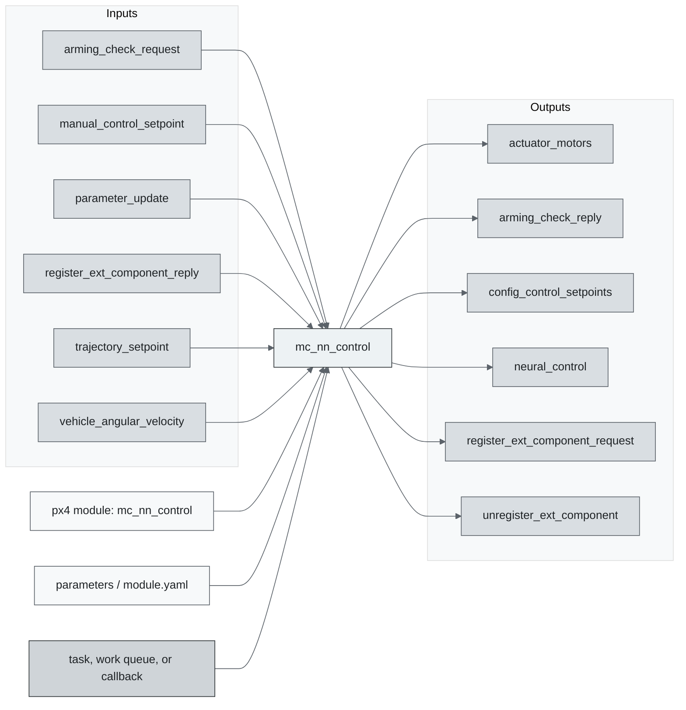
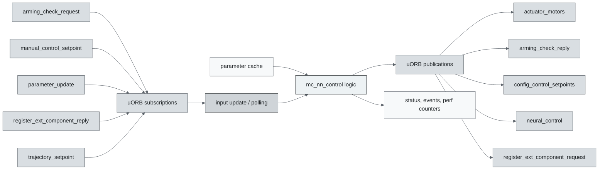
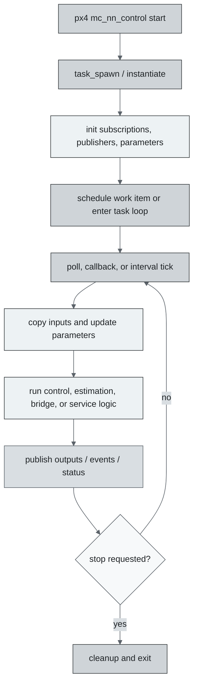
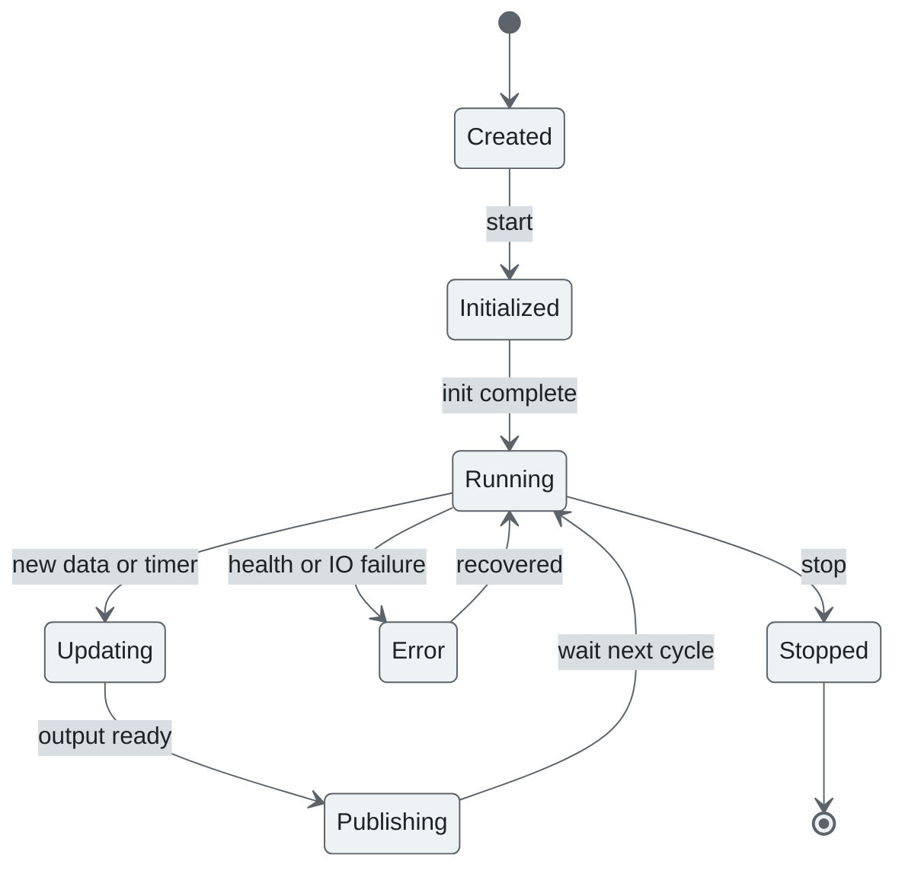
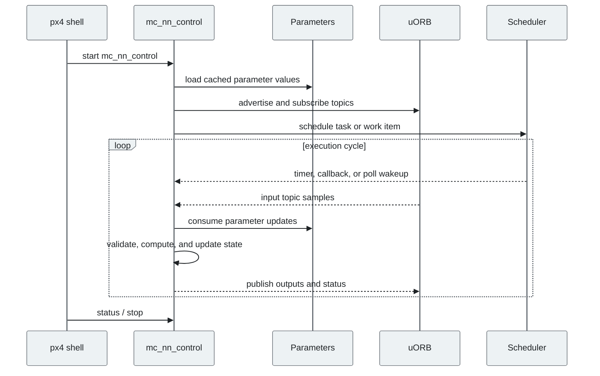
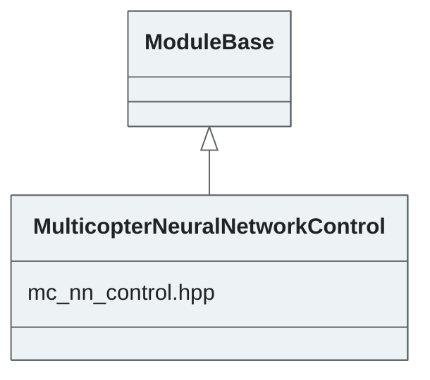

# PX4 Module Architecture: `mc_nn_control`

- Source: `src/modules/mc_nn_control`
- Build target: `mc_nn_control`
- Runtime main: `mc_nn_control`
- Build kind: `px4 module`
- Mermaid palette: `graphite` grey tone

Multicopter Neural Network Control module. This module is an end-to-end neural network control system for multicopters. It takes in 15 input values and outputs 4 control actions. Inputs: [pos_err(3), att(6), vel(3), ang_vel(3)] Outputs: [Actuator motors(4)]

## Description of Module

Runs an experimental neural-network multicopter control path.

### Primary Responsibilities

- Convert selected state estimates and setpoints into downstream control or actuator-facing setpoints.
- Consume runtime inputs from uORB topics such as `arming_check_request`, `manual_control_setpoint`, `parameter_update`, `register_ext_component_reply`, `trajectory_setpoint`, `vehicle_angular_velocity`, `vehicle_attitude`, `vehicle_local_position`, ... 1 more.
- Publish outputs or status topics such as `actuator_motors`, `arming_check_reply`, `config_control_setpoints`, `neural_control`, `register_ext_component_request`, `unregister_ext_component`.
- Use module configuration from `mc_nn_control_params.yaml`.
- Implement the main behavior in classes such as `MulticopterNeuralNetworkControl`.

### Runtime Behavior

- Runs work-queue callbacks on queue configurations such as `nav_and_controllers`.
- Uses uORB callback registration so new topic data can schedule execution.

## Background Theory

The neural-network controller evaluates a learned policy. Its math is feed-forward inference from normalized state features to actuator or setpoint outputs.

```text
a_0 = normalize(observation)
for layer l:
  a_l = activation(W_l * a_{l-1} + b_l)
output = denormalize(a_L)
command = constrain(output, command_min, command_max)
```

These equations are the study-level form of the algorithm. The implementation applies PX4-specific saturation, validity checks, parameter updates, and frame conventions around these core relationships.

### Main Interfaces

| Area | Details |
| --- | --- |
| Primary inputs | `arming_check_request`, `manual_control_setpoint`, `parameter_update`, `register_ext_component_reply`, `trajectory_setpoint`, `vehicle_angular_velocity`, `vehicle_attitude`, `vehicle_local_position`, `vehicle_status` |
| Primary outputs | `actuator_motors`, `arming_check_reply`, `config_control_setpoints`, `neural_control`, `register_ext_component_request`, `unregister_ext_component` |
| Referenced topics | `actuator_motors`, `arming_check_reply`, `arming_check_request`, `config_control_setpoints`, `manual_control_setpoint`, `neural_control`, `parameter_update`, `register_ext_component_reply`, `register_ext_component_request`, `trajectory_setpoint`, ... 6 more |
| Parameters/config | mc_nn_control_params.yaml |
| Key classes | `MulticopterNeuralNetworkControl` |

### Files

| File | Why it matters |
| --- | --- |
| mc_nn_control.cpp | Entry point, start command, or module lifecycle code |
| CMakeLists.txt | Build, parameter, or module configuration |
| mc_nn_control_params.yaml | Build, parameter, or module configuration |
| mc_nn_control.hpp | Defines `MulticopterNeuralNetworkControl` class |

## Architecture Overview

This page is generated from the module source tree and shows the stable architecture surfaces: build entry point, scheduling shape, uORB data interfaces, parameter/configuration surfaces, and C++ types found in the module.



## Build and Entry Points

| Field | Value |
| --- | --- |
| Module path | src/modules/mc_nn_control |
| Build kind | px4 module |
| Build target | mc_nn_control |
| Runtime main | mc_nn_control |
| Stack main | Not specified |
| Module config | mc_nn_control_params.yaml |
| Detected sources | 2 |
| Detected headers | 2 |
| Detected configs | 2 |

### CMake Dependencies

- `tensorflow_lite_micro`
- `px4_work_queue`
- `mathlib`

### Nested Module Targets

- No nested module targets detected.

## Data Flow



### uORB Topics

| Topic | Detected direction |
| --- | --- |
| actuator_motors | published |
| arming_check_reply | published |
| arming_check_request | subscribed |
| config_control_setpoints | published |
| manual_control_setpoint | subscribed |
| neural_control | published |
| parameter_update | subscribed |
| register_ext_component_reply | subscribed |
| register_ext_component_request | published |
| trajectory_setpoint | subscribed |
| unregister_ext_component | published |
| vehicle_angular_velocity | subscribed |
| vehicle_attitude | subscribed |
| vehicle_control_mode | referenced |
| vehicle_local_position | subscribed |
| vehicle_status | subscribed |

## Execution Flow



The common PX4 module lifecycle is command entry, object construction or task spawn, parameter loading, topic setup, scheduled execution, publication, status reporting, and stop/cleanup. Modules that use `ModuleBase`, `ScheduledWorkItem`, polling loops, or bridge callbacks still fit this lifecycle with different scheduling triggers.

## State Machine



### Detected State-Like Symbols

- No state-like symbols detected.

## Sequence Diagram



## Class Diagram



### Detected Classes

| Class | Base | File |
| --- | --- | --- |
| MulticopterNeuralNetworkControl | ModuleBase | mc_nn_control.hpp |

### Detected Enums

- No enums detected.

## Parameters and Configuration

- No parameters detected.

## Source Map

| File | Kind |
| --- | --- |
| CMakeLists.txt | build |
| control_net.cpp | source |
| control_net.hpp | header |
| mc_nn_control.cpp | source |
| mc_nn_control.hpp | header |
| mc_nn_control_params.yaml | config |

## Review Notes

- The diagrams are generated from static source inventory and should be used as a study map, not as a formal proof of every runtime branch.
- Topic direction is inferred from nearby source context such as `Subscription`, `Publication`, `orb_subscribe`, and `publish` usage.
- When a module has no explicit state enum, the state diagram shows the standard PX4 module lifecycle.
