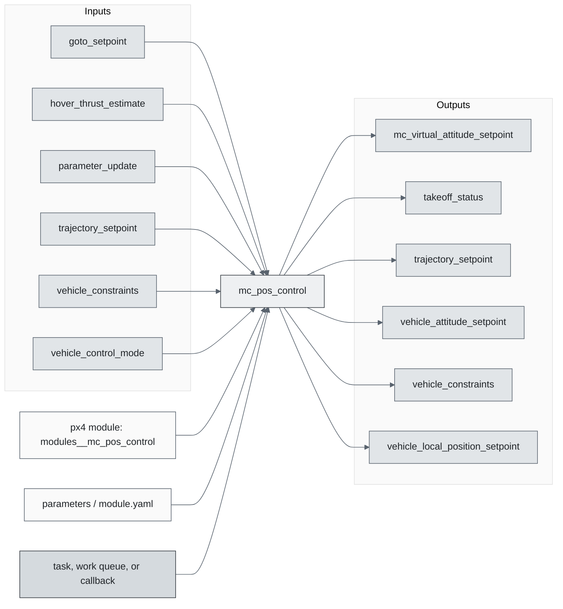
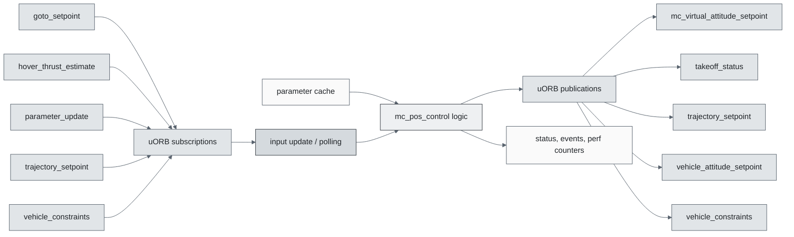
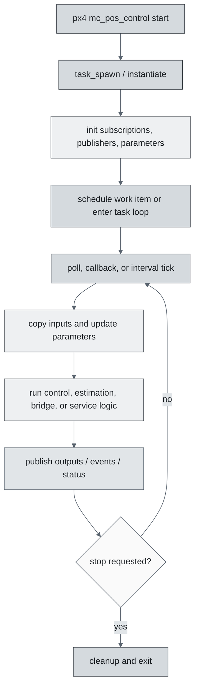
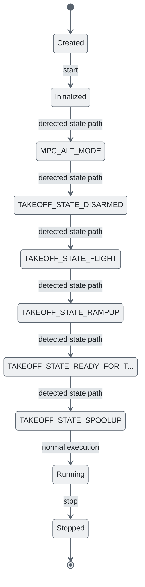
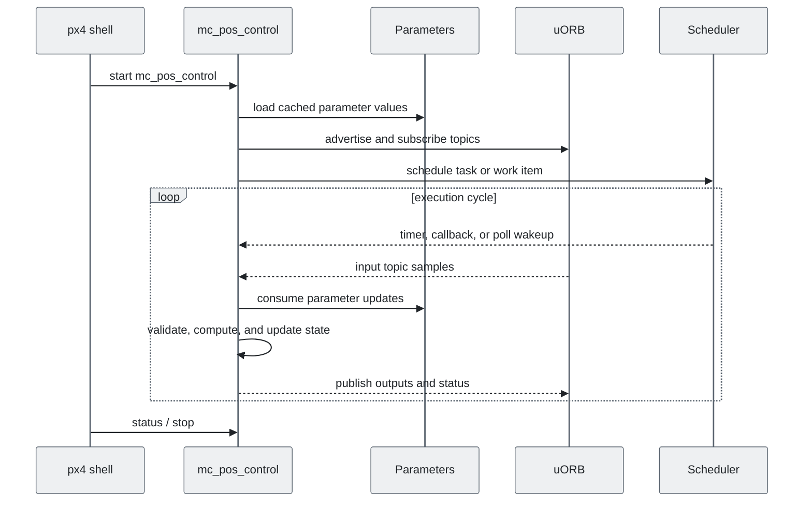

# PX4 Module Architecture: `mc_pos_control`

- Source: `src/modules/mc_pos_control`
- Build target: `modules__mc_pos_control`
- Runtime main: `mc_pos_control`
- Build kind: `px4 module`
- Mermaid palette: `slate` grey tone

Source-derived architecture notes for this PX4 module directory.

## Architecture Overview

This page is generated from the module source tree and shows the stable architecture surfaces: build entry point, scheduling shape, uORB data interfaces, parameter/configuration surfaces, and C++ types found in the module.

## Build and Entry Points

| Field | Value |
| --- | --- |
| Module path | src/modules/mc_pos_control |
| Build kind | px4 module |
| Build target | modules__mc_pos_control |
| Runtime main | mc_pos_control |
| Stack main | Not specified |
| Module config | multicopter_altitude_mode_params.yaml |
| Detected sources | 8 |
| Detected headers | 5 |
| Detected configs | 14 |

### CMake Dependencies

- `GotoControl`
- `PositionControl`
- `Takeoff`
- `controllib`
- `geo`
- `SlewRate`

### Nested Module Targets

- No nested module targets detected.

## Data Flow

### uORB Topics

| Topic | Detected direction |
| --- | --- |
| goto_setpoint | subscribed |
| hover_thrust_estimate | subscribed |
| mc_virtual_attitude_setpoint | published |
| parameter_update | subscribed |
| takeoff_status | published |
| trajectory_setpoint | subscribed, published |
| vehicle_attitude_setpoint | published |
| vehicle_constraints | subscribed, published |
| vehicle_control_mode | subscribed |
| vehicle_land_detected | subscribed |
| vehicle_local_position | subscribed |
| vehicle_local_position_setpoint | published |

## Execution Flow

The common PX4 module lifecycle is command entry, object construction or task spawn, parameter loading, topic setup, scheduled execution, publication, status reporting, and stop/cleanup. Modules that use `ModuleBase`, `ScheduledWorkItem`, polling loops, or bridge callbacks still fit this lifecycle with different scheduling triggers.

## State Machine

### Detected State-Like Symbols

- `MPC_ALT_MODE`
- `TAKEOFF_STATE_DISARMED`
- `TAKEOFF_STATE_FLIGHT`
- `TAKEOFF_STATE_RAMPUP`
- `TAKEOFF_STATE_READY_FOR_TAKEOFF`
- `TAKEOFF_STATE_SPOOLUP`

## Sequence Diagram

## Class Diagram

```mermaid
%%{init: {"theme":"base","themeVariables":{"primaryColor":"#eef0f2","secondaryColor":"#e1e5e8","tertiaryColor":"#fafafa","primaryBorderColor":"#59636e","primaryTextColor":"#202428","lineColor":"#59636e","fontFamily":"Inter, Arial, sans-serif"}}}%%
classDiagram
  class which
  which : GotoControl/GotoControl.hpp
  class GotoControl
  GotoControl : GotoControl/GotoControl.hpp
  class MulticopterPositionControl
  MulticopterPositionControl : MulticopterPositionControl.hpp
  class ModuleBase
  ModuleBase <|-- MulticopterPositionControl
  class contains
  contains : PositionControl/PositionControl.hpp
  class PositionControl
  PositionControl : PositionControl/PositionControl.hpp
  class PositionControlBasicTest
  PositionControlBasicTest : PositionControl/PositionControlTest.cpp
  class PositionControlBasicDirectionTest
  PositionControlBasicDirectionTest : PositionControl/PositionControlTest.cpp
  class PositionControlBasicTest
  PositionControlBasicTest <|-- PositionControlBasicDirectionTest
  class handling
  handling : Takeoff/Takeoff.hpp
  class TakeoffState
  TakeoffState : Takeoff/Takeoff.hpp
  class TakeoffHandling
  TakeoffHandling : Takeoff/Takeoff.hpp
```

### Detected Classes

| Class | Base | File |
| --- | --- | --- |
| which |  | GotoControl/GotoControl.hpp |
| GotoControl |  | GotoControl/GotoControl.hpp |
| MulticopterPositionControl | ModuleBase | MulticopterPositionControl.hpp |
| contains |  | PositionControl/PositionControl.hpp |
| PositionControl |  | PositionControl/PositionControl.hpp |
| PositionControlBasicTest |  | PositionControl/PositionControlTest.cpp |
| PositionControlBasicDirectionTest | PositionControlBasicTest | PositionControl/PositionControlTest.cpp |
| handling |  | Takeoff/Takeoff.hpp |
| TakeoffState |  | Takeoff/Takeoff.hpp |
| TakeoffHandling |  | Takeoff/Takeoff.hpp |

### Detected Enums

- `TakeoffState`

## Parameters and Configuration

- No parameters detected.

## Source Map

| File | Kind |
| --- | --- |
| CMakeLists.txt | build |
| GotoControl/CMakeLists.txt | build |
| GotoControl/GotoControl.cpp | source |
| GotoControl/GotoControl.hpp | header |
| MulticopterPositionControl.cpp | source |
| MulticopterPositionControl.hpp | header |
| PositionControl/CMakeLists.txt | build |
| PositionControl/ControlMath.cpp | source |
| PositionControl/ControlMath.hpp | header |
| PositionControl/ControlMathTest.cpp | source |
| PositionControl/PositionControl.cpp | source |
| PositionControl/PositionControl.hpp | header |
| PositionControl/PositionControlTest.cpp | source |
| Takeoff/CMakeLists.txt | build |
| Takeoff/Takeoff.cpp | source |
| Takeoff/Takeoff.hpp | header |
| Takeoff/TakeoffTest.cpp | source |
| multicopter_altitude_mode_params.yaml | config |
| multicopter_autonomous_params.yaml | config |
| multicopter_nudging_params.yaml | config |
| multicopter_position_control_gain_params.yaml | config |
| multicopter_position_control_limits_params.yaml | config |
| multicopter_position_control_params.yaml | config |
| multicopter_position_mode_params.yaml | config |
| multicopter_responsiveness_params.yaml | config |
| multicopter_stabilized_mode_params.yaml | config |
| multicopter_takeoff_land_params.yaml | config |

## Review Notes

- The diagrams are generated from static source inventory and should be used as a study map, not as a formal proof of every runtime branch.
- Topic direction is inferred from nearby source context such as `Subscription`, `Publication`, `orb_subscribe`, and `publish` usage.
- When a module has no explicit state enum, the state diagram shows the standard PX4 module lifecycle.
