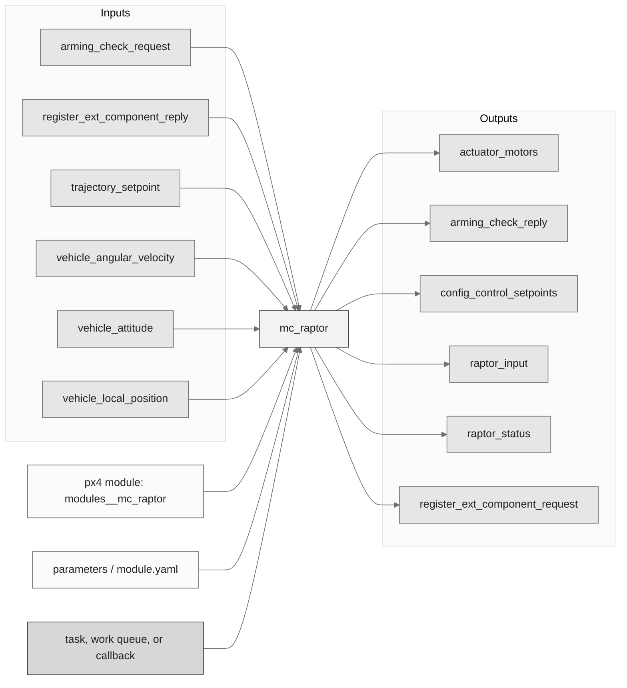
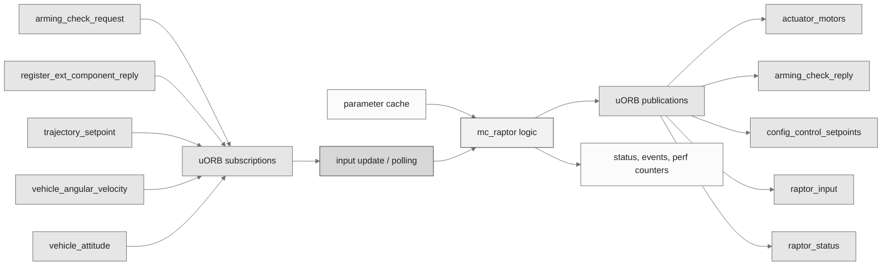
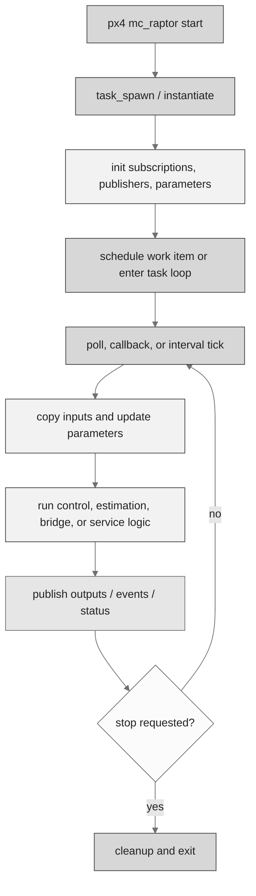
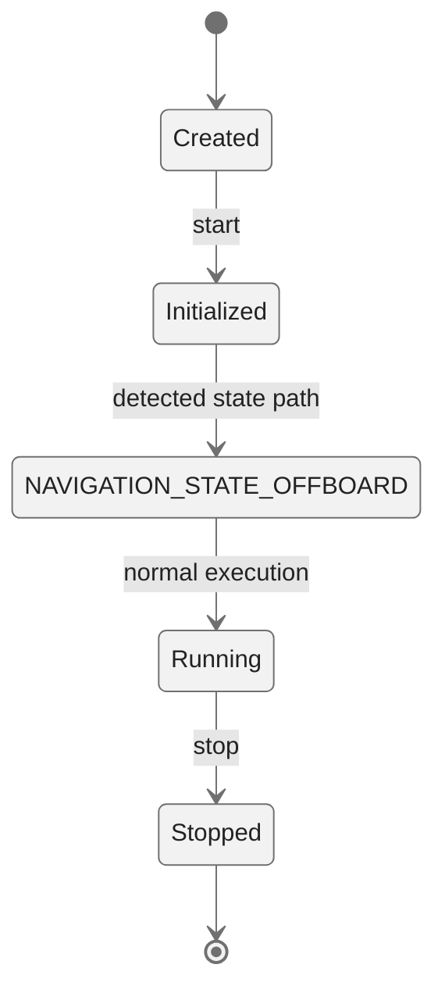
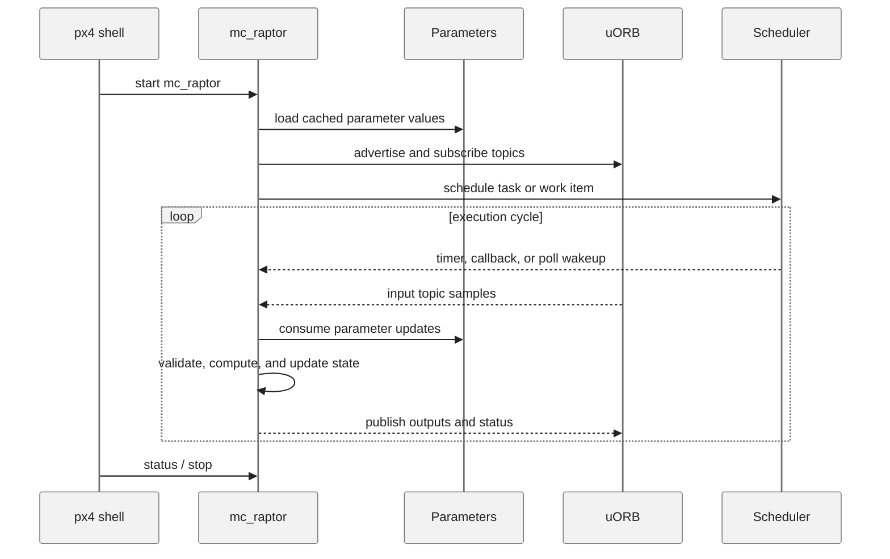
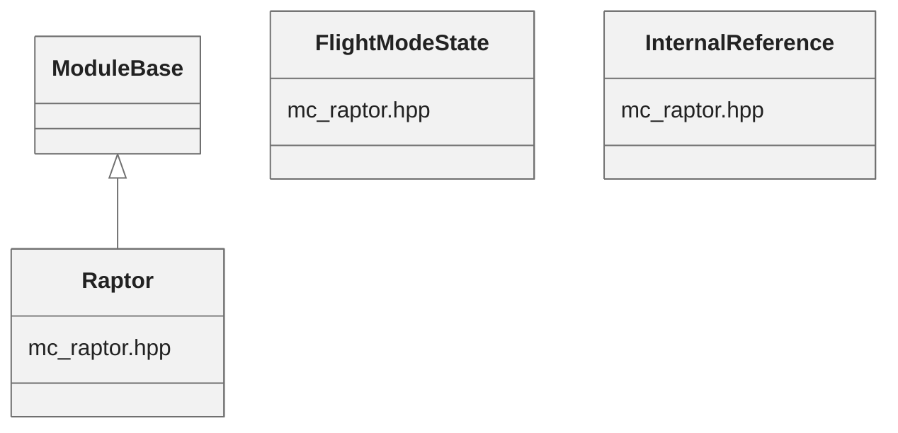

# PX4 Module Architecture: `mc_raptor`

- Source: `src/modules/mc_raptor`
- Build target: `modules__mc_raptor`
- Runtime main: `mc_raptor`
- Build kind: `px4 module`
- Mermaid palette: `ash` grey tone

Architecture notes for the mc_raptor module.

## Architecture Overview

This page is generated from the module source tree and shows the stable architecture surfaces: build entry point, scheduling shape, uORB data interfaces, parameter/configuration surfaces, and C++ types found in the module.

## Build and Entry Points

| Field | Value |
| --- | --- |
| Module path | src/modules/mc_raptor |
| Build kind | px4 module |
| Build target | modules__mc_raptor |
| Runtime main | mc_raptor |
| Stack main | 4000 |
| Module config | module.yaml |
| Detected sources | 1 |
| Detected headers | 5 |
| Detected configs | 2 |

### CMake Dependencies

- `px4_work_queue`
- `rl_tools`
- `git_raptor_blob`

### Nested Module Targets

- No nested module targets detected.

## Data Flow

### uORB Topics

| Topic | Detected direction |
| --- | --- |
| actuator_motors | published |
| arming_check_reply | published |
| arming_check_request | subscribed |
| config_control_setpoints | published |
| raptor_input | published |
| raptor_status | published |
| register_ext_component_reply | subscribed |
| register_ext_component_request | published |
| trajectory_setpoint | subscribed |
| tune_control | published |
| unregister_ext_component | published |
| vehicle_angular_velocity | subscribed |
| vehicle_attitude | subscribed |
| vehicle_control_mode | referenced |
| vehicle_local_position | subscribed |
| vehicle_odometry | referenced |
| vehicle_status | subscribed |

## Execution Flow

The common PX4 module lifecycle is command entry, object construction or task spawn, parameter loading, topic setup, scheduled execution, publication, status reporting, and stop/cleanup. Modules that use `ModuleBase`, `ScheduledWorkItem`, polling loops, or bridge callbacks still fit this lifecycle with different scheduling triggers.

## State Machine

### Detected State-Like Symbols

- `NAVIGATION_STATE_OFFBOARD`

## Sequence Diagram

## Class Diagram

### Detected Classes

| Class | Base | File |
| --- | --- | --- |
| Raptor | ModuleBase | mc_raptor.hpp |
| FlightModeState |  | mc_raptor.hpp |
| InternalReference |  | mc_raptor.hpp |

### Detected Enums

- `FlightModeState`
- `InternalReference`
- `values`

## Parameters and Configuration

- `MC_RAPTOR_ENABLE`
- `MC_RAPTOR_INTREF`
- `MC_RAPTOR_OFFB`
- `MC_RAPTOR_VERBOS`

## Source Map

| File | Kind |
| --- | --- |
| CMakeLists.txt | build |
| README.md | readme |
| blob/benchmark.h | header |
| blob/policy.h | header |
| mc_raptor.cpp | source |
| mc_raptor.hpp | header |
| module.yaml | config |
| trajectories/lissajous.hpp | header |
| trajectories/trajectory.hpp | header |

## Review Notes

- The diagrams are generated from static source inventory and should be used as a study map, not as a formal proof of every runtime branch.
- Topic direction is inferred from nearby source context such as `Subscription`, `Publication`, `orb_subscribe`, and `publish` usage.
- When a module has no explicit state enum, the state diagram shows the standard PX4 module lifecycle.
