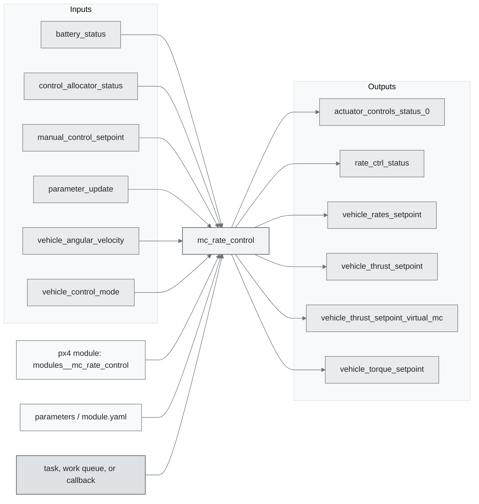
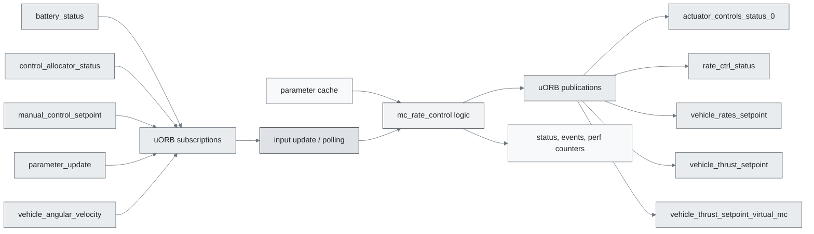
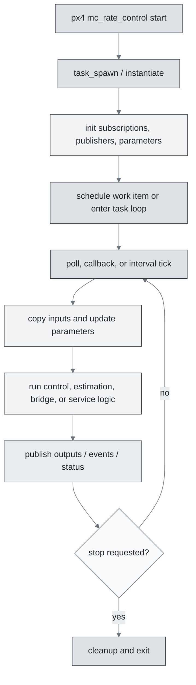
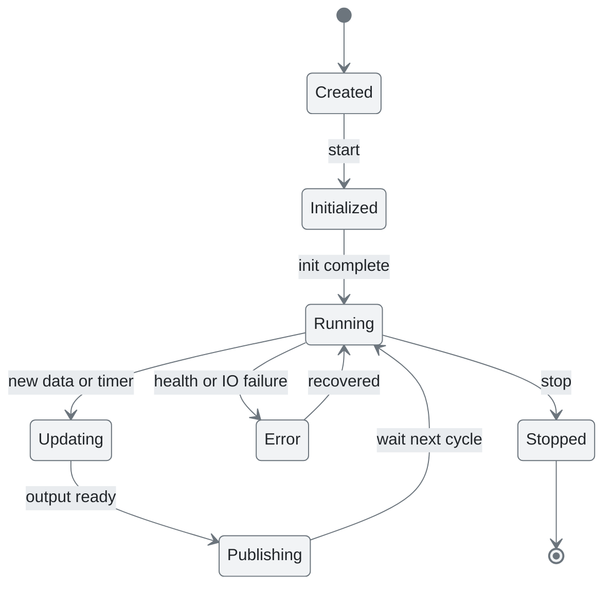
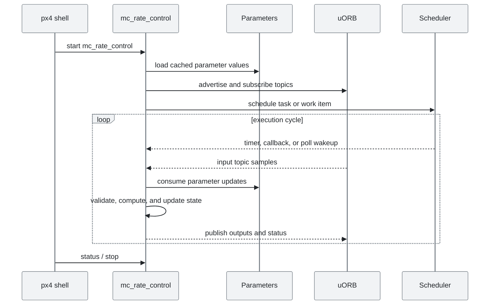
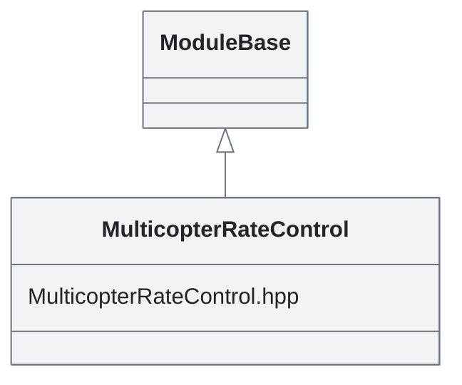

# PX4 Module Architecture: `mc_rate_control`

- Source: `src/modules/mc_rate_control`
- Build target: `modules__mc_rate_control`
- Runtime main: `mc_rate_control`
- Build kind: `px4 module`
- Mermaid palette: `mist` grey tone

This implements the multicopter rate controller. It takes rate setpoints (in acro mode via `manual_control_setpoint` topic) as inputs and outputs actuator control messages. The controller has a PID loop for angular rate error.

## Description of Module

Runs the high-rate multicopter body-rate controller and publishes torque and thrust setpoints.

### Primary Responsibilities

- Convert selected state estimates and setpoints into downstream control or actuator-facing setpoints.
- Consume runtime inputs from uORB topics such as `battery_status`, `control_allocator_status`, `manual_control_setpoint`, `parameter_update`, `vehicle_angular_velocity`, `vehicle_control_mode`, `vehicle_land_detected`, `vehicle_rates_setpoint`, ... 1 more.
- Publish outputs or status topics such as `actuator_controls_status_0`, `rate_ctrl_status`, `vehicle_rates_setpoint`, `vehicle_thrust_setpoint`, `vehicle_thrust_setpoint_virtual_mc`, `vehicle_torque_setpoint`, `vehicle_torque_setpoint_virtual_mc`.
- Use module configuration from `mc_acro_params.yaml`.
- Implement the main behavior in classes such as `MulticopterRateControl`.

### Runtime Behavior

- Runs work-queue callbacks on queue configurations such as `rate_ctrl`.
- Uses uORB callback registration so new topic data can schedule execution.

## Background Theory

Multicopter rate control is a high-rate PID loop on body angular velocity. It outputs body torque setpoints.

```text
e_rate = rate_sp - rate_body
I[k] = constrain(I[k-1] + e_rate*dt, -I_max, I_max)
D = -gyro_rate_derivative
torque_sp = K * (P*e_rate + I_gain*I + D_gain*D) + FF*rate_sp
torque_sp = constrain(torque_sp, torque_min, torque_max)
```

These equations are the study-level form of the algorithm. The implementation applies PX4-specific saturation, validity checks, parameter updates, and frame conventions around these core relationships.

### Main Interfaces

| Area | Details |
| --- | --- |
| Primary inputs | `battery_status`, `control_allocator_status`, `manual_control_setpoint`, `parameter_update`, `vehicle_angular_velocity`, `vehicle_control_mode`, `vehicle_land_detected`, `vehicle_rates_setpoint`, `vehicle_status` |
| Primary outputs | `actuator_controls_status_0`, `rate_ctrl_status`, `vehicle_rates_setpoint`, `vehicle_thrust_setpoint`, `vehicle_thrust_setpoint_virtual_mc`, `vehicle_torque_setpoint`, `vehicle_torque_setpoint_virtual_mc` |
| Referenced topics | `actuator_controls_status`, `actuator_controls_status_0`, `battery_status`, `control_allocator_status`, `manual_control_setpoint`, `parameter_update`, `rate_ctrl_status`, `vehicle_angular_velocity`, `vehicle_control_mode`, `vehicle_land_detected`, ... 6 more |
| Parameters/config | mc_acro_params.yaml |
| Key classes | `MulticopterRateControl` |

### Files

| File | Why it matters |
| --- | --- |
| MulticopterRateControl.cpp | Entry point, start command, or module lifecycle code |
| CMakeLists.txt | Build, parameter, or module configuration |
| mc_acro_params.yaml | Build, parameter, or module configuration |
| mc_rate_control_params.yaml | Build, parameter, or module configuration |
| MulticopterRateControl.hpp | Defines `MulticopterRateControl` class |

## Architecture Overview

This page is generated from the module source tree and shows the stable architecture surfaces: build entry point, scheduling shape, uORB data interfaces, parameter/configuration surfaces, and C++ types found in the module.



## Build and Entry Points

| Field | Value |
| --- | --- |
| Module path | src/modules/mc_rate_control |
| Build kind | px4 module |
| Build target | modules__mc_rate_control |
| Runtime main | mc_rate_control |
| Stack main | Not specified |
| Module config | mc_acro_params.yaml |
| Detected sources | 1 |
| Detected headers | 1 |
| Detected configs | 3 |

### CMake Dependencies

- `circuit_breaker`
- `mathlib`
- `RateControl`
- `px4_work_queue`

### Nested Module Targets

- No nested module targets detected.

## Data Flow



### uORB Topics

| Topic | Detected direction |
| --- | --- |
| actuator_controls_status | referenced |
| actuator_controls_status_0 | published |
| battery_status | subscribed |
| control_allocator_status | subscribed |
| manual_control_setpoint | subscribed |
| parameter_update | subscribed |
| rate_ctrl_status | published |
| vehicle_angular_velocity | subscribed |
| vehicle_control_mode | subscribed |
| vehicle_land_detected | subscribed |
| vehicle_rates_setpoint | subscribed, published |
| vehicle_status | subscribed |
| vehicle_thrust_setpoint | published |
| vehicle_thrust_setpoint_virtual_mc | published |
| vehicle_torque_setpoint | published |
| vehicle_torque_setpoint_virtual_mc | published |

## Execution Flow



The common PX4 module lifecycle is command entry, object construction or task spawn, parameter loading, topic setup, scheduled execution, publication, status reporting, and stop/cleanup. Modules that use `ModuleBase`, `ScheduledWorkItem`, polling loops, or bridge callbacks still fit this lifecycle with different scheduling triggers.

## State Machine



### Detected State-Like Symbols

- No state-like symbols detected.

## Sequence Diagram



## Class Diagram



### Detected Classes

| Class | Base | File |
| --- | --- | --- |
| MulticopterRateControl | ModuleBase | MulticopterRateControl.hpp |

### Detected Enums

- No enums detected.

## Parameters and Configuration

- No parameters detected.

## Source Map

| File | Kind |
| --- | --- |
| CMakeLists.txt | build |
| MulticopterRateControl.cpp | source |
| MulticopterRateControl.hpp | header |
| mc_acro_params.yaml | config |
| mc_rate_control_params.yaml | config |

## Review Notes

- The diagrams are generated from static source inventory and should be used as a study map, not as a formal proof of every runtime branch.
- Topic direction is inferred from nearby source context such as `Subscription`, `Publication`, `orb_subscribe`, and `publish` usage.
- When a module has no explicit state enum, the state diagram shows the standard PX4 module lifecycle.
