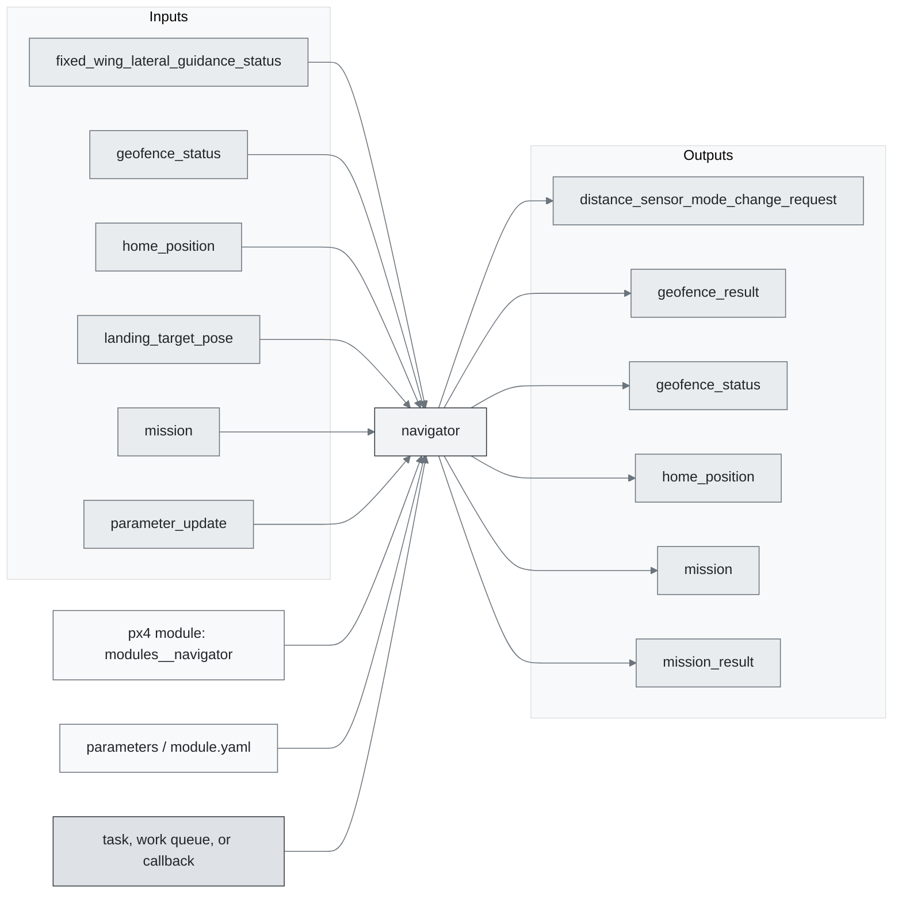
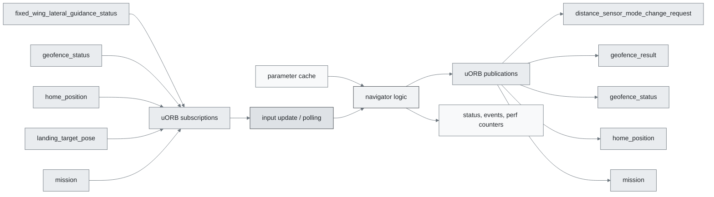
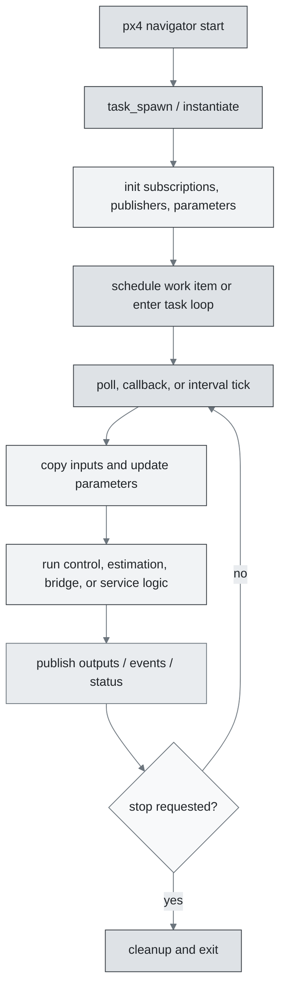
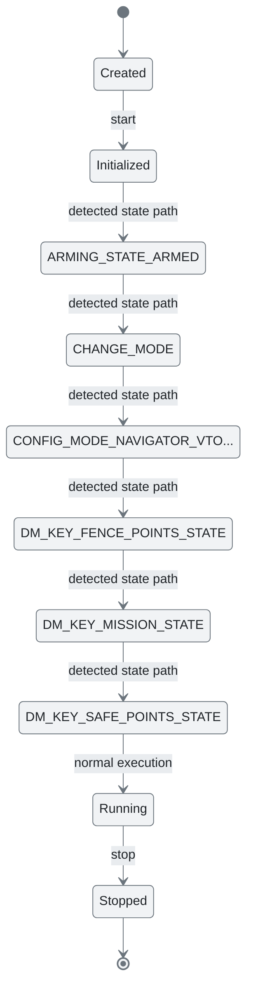
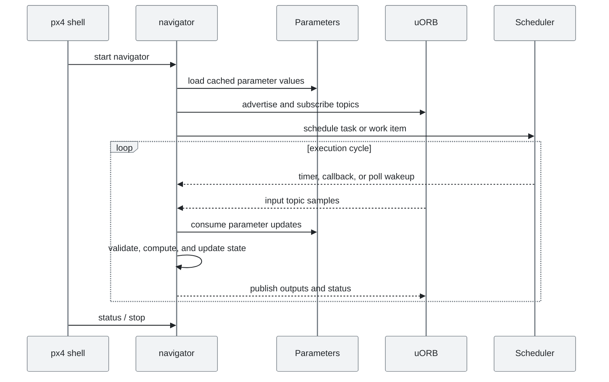
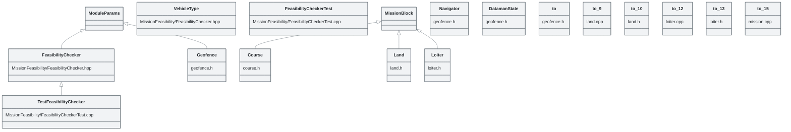

# PX4 Module Architecture: `navigator`

- Source: `src/modules/navigator`
- Build target: `modules__navigator`
- Runtime main: `navigator`
- Build kind: `px4 module`
- Mermaid palette: `mist` grey tone

Source-derived architecture notes for this PX4 module directory.

## Architecture Overview

This page is generated from the module source tree and shows the stable architecture surfaces: build entry point, scheduling shape, uORB data interfaces, parameter/configuration surfaces, and C++ types found in the module.

## Build and Entry Points

| Field | Value |
| --- | --- |
| Module path | src/modules/navigator |
| Build kind | px4 module |
| Build target | modules__navigator |
| Runtime main | navigator |
| Stack main | Not specified |
| Module config | geofence_params.yaml |
| Detected sources | 20 |
| Detected headers | 23 |
| Detected configs | 8 |

### CMake Dependencies

- `dataman_client`
- `geo`
- `adsb`
- `motion_planning`
- `mission_feasibility_checker`
- `rtl_time_estimator`

### Nested Module Targets

- No nested module targets detected.

## Data Flow

### uORB Topics

| Topic | Detected direction |
| --- | --- |
| distance_sensor_mode_change_request | published |
| fixed_wing_lateral_guidance_status | subscribed |
| geofence_result | published |
| geofence_status | subscribed, published |
| gimbal_manager_set_attitude | referenced |
| home_position | subscribed, published |
| landing_target_pose | subscribed |
| mission | subscribed, published |
| mission_result | published |
| mode_completed | published |
| navigator_mission_item | referenced |
| navigator_status | published |
| parameter_update | subscribed |
| position_controller_landing_status | subscribed |
| position_controller_status | subscribed |
| position_setpoint | referenced |
| position_setpoint_triplet | published |
| prec_land_status | published |
| rtl_status | subscribed, published |
| rtl_time_estimate | published |
| sensor_gps | referenced |
| telemetry_status | referenced |
| transponder_report | subscribed |
| vehicle_command | subscribed, published |
| vehicle_command_ack | published |
| vehicle_global_position | subscribed, published |
| vehicle_gps_position | subscribed |
| vehicle_land_detected | subscribed, published |
| vehicle_local_position | subscribed |
| vehicle_roi | published |
| vehicle_status | subscribed, published |
| vte_orientation | subscribed |
| vtol_vehicle_status | referenced |
| wind | subscribed |

## Execution Flow

The common PX4 module lifecycle is command entry, object construction or task spawn, parameter loading, topic setup, scheduled execution, publication, status reporting, and stop/cleanup. Modules that use `ModuleBase`, `ScheduledWorkItem`, polling loops, or bridge callbacks still fit this lifecycle with different scheduling triggers.

## State Machine

### Detected State-Like Symbols

- `ARMING_STATE_ARMED`
- `CHANGE_MODE`
- `CONFIG_MODE_NAVIGATOR_VTOL_TAKEOFF`
- `DM_KEY_FENCE_POINTS_STATE`
- `DM_KEY_MISSION_STATE`
- `DM_KEY_SAFE_POINTS_STATE`
- `FW_POSCTRL_MODE_AUTO`
- `MAV_CMD_DO_SET_MODE`
- `NAVIGATION_STATE_ACRO`
- `NAVIGATION_STATE_ALTCTL`
- `NAVIGATION_STATE_ALTITUDE_CRUISE`
- `NAVIGATION_STATE_AUTO_LAND`
- `NAVIGATION_STATE_AUTO_LOITER`
- `NAVIGATION_STATE_AUTO_MISSION`
- `NAVIGATION_STATE_AUTO_PRECLAND`
- `NAVIGATION_STATE_AUTO_RTL`
- `NAVIGATION_STATE_AUTO_TAKEOFF`
- `NAVIGATION_STATE_AUTO_VTOL_TAKEOFF`
- `NAVIGATION_STATE_DESCEND`
- `NAVIGATION_STATE_GUIDED_COURSE`
- `NAVIGATION_STATE_MANUAL`
- `NAVIGATION_STATE_OFFBOARD`
- `NAVIGATION_STATE_POSCTL`
- `NAVIGATION_STATE_STAB`
- `NAVIGATION_STATE_TERMINATION`
- `NAVIGATOR_MODE_ARRAY_SIZE`
- `NAV_CMD_COMPONENT_ARM_DISARM`
- `NAV_CMD_SET_CAMERA_MODE`
- `PREC_LAND_STATE_DESCEND`
- `PREC_LAND_STATE_DONE`
- `PREC_LAND_STATE_FALLBACK`
- `PREC_LAND_STATE_FINAL`
- `PREC_LAND_STATE_HORIZONTAL`
- `PREC_LAND_STATE_SEARCH`
- `PREC_LAND_STATE_START`
- `PREC_LAND_STATE_STOPPED`
- `VEHICLE_VTOL_STATE_FW`
- `VEHICLE_VTOL_STATE_MC`

## Sequence Diagram

## Class Diagram

### Detected Classes

| Class | Base | File |
| --- | --- | --- |
| FeasibilityChecker | ModuleParams | MissionFeasibility/FeasibilityChecker.hpp |
| VehicleType |  | MissionFeasibility/FeasibilityChecker.hpp |
| FeasibilityCheckerTest |  | MissionFeasibility/FeasibilityCheckerTest.cpp |
| TestFeasibilityChecker | FeasibilityChecker | MissionFeasibility/FeasibilityCheckerTest.cpp |
| Course | MissionBlock | course.h |
| Navigator |  | geofence.h |
| Geofence | ModuleParams | geofence.h |
| DatamanState |  | geofence.h |
| to |  | geofence.h |
| to |  | land.cpp |
| to |  | land.h |
| Land | MissionBlock | land.h |
| to |  | loiter.cpp |
| to |  | loiter.h |
| Loiter | MissionBlock | loiter.h |
| to |  | mission.cpp |
| that |  | mission.h |
| gets |  | mission.h |
| Navigator |  | mission.h |
| Mission | MissionBase | mission.h |
| that |  | mission_base.cpp |
| attributes |  | mission_base.cpp |
| that |  | mission_base.h |
| Navigator |  | mission_base.h |
| ... 49 more |  |  |

### Detected Enums

- `DatamanState`
- `DestinationType`
- `HeadingMode`
- `MissionTraversalType`
- `MissionType`
- `NAV_CMD`
- `NAV_FRAME`
- `ORIGIN`
- `PrecLandMode`
- `PrecLandState`
- `RTLState`
- `RtlType`
- `VehicleType`
- `WorkItemType`
- `definitions`
- `fw_takeoff_state`
- `values`
- `vtol_takeoff_state`

## Parameters and Configuration

- No parameters detected.

## Source Map

| File | Kind |
| --- | --- |
| CMakeLists.txt | build |
| MissionFeasibility/CMakeLists.txt | build |
| MissionFeasibility/FeasibilityChecker.cpp | source |
| MissionFeasibility/FeasibilityChecker.hpp | header |
| MissionFeasibility/FeasibilityCheckerTest.cpp | source |
| course.cpp | source |
| course.h | header |
| geofence.cpp | source |
| geofence.h | header |
| geofence_params.yaml | config |
| land.cpp | source |
| land.h | header |
| loiter.cpp | source |
| loiter.h | header |
| mission.cpp | source |
| mission.h | header |
| mission_base.cpp | source |
| mission_base.h | header |
| mission_block.cpp | source |
| mission_block.h | header |
| mission_feasibility_checker.cpp | source |
| mission_feasibility_checker.h | header |
| mission_item_utils.h | header |
| mission_params.yaml | config |
| navigation.h | header |
| navigator.h | header |
| navigator_main.cpp | source |
| navigator_mode.cpp | source |
| navigator_mode.h | header |
| navigator_params.yaml | config |
| precland.cpp | source |
| precland.h | header |
| precland_params.yaml | config |
| rtl.cpp | source |
| rtl.h | header |
| rtl_base.h | header |
| rtl_direct.cpp | source |
| rtl_direct.h | header |
| rtl_direct_mission_land.cpp | source |
| rtl_direct_mission_land.h | header |
| ... 11 more files | omitted |

## Review Notes

- The diagrams are generated from static source inventory and should be used as a study map, not as a formal proof of every runtime branch.
- Topic direction is inferred from nearby source context such as `Subscription`, `Publication`, `orb_subscribe`, and `publish` usage.
- When a module has no explicit state enum, the state diagram shows the standard PX4 module lifecycle.
