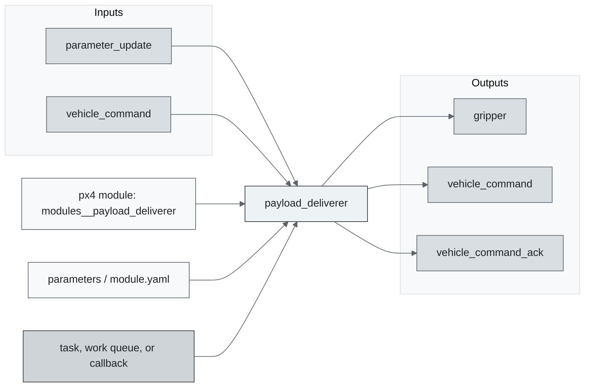
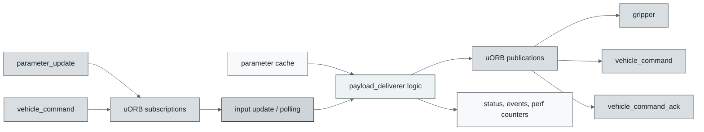
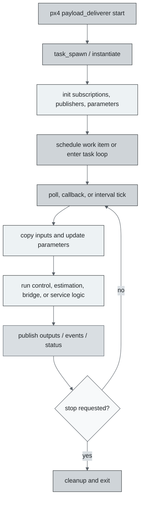
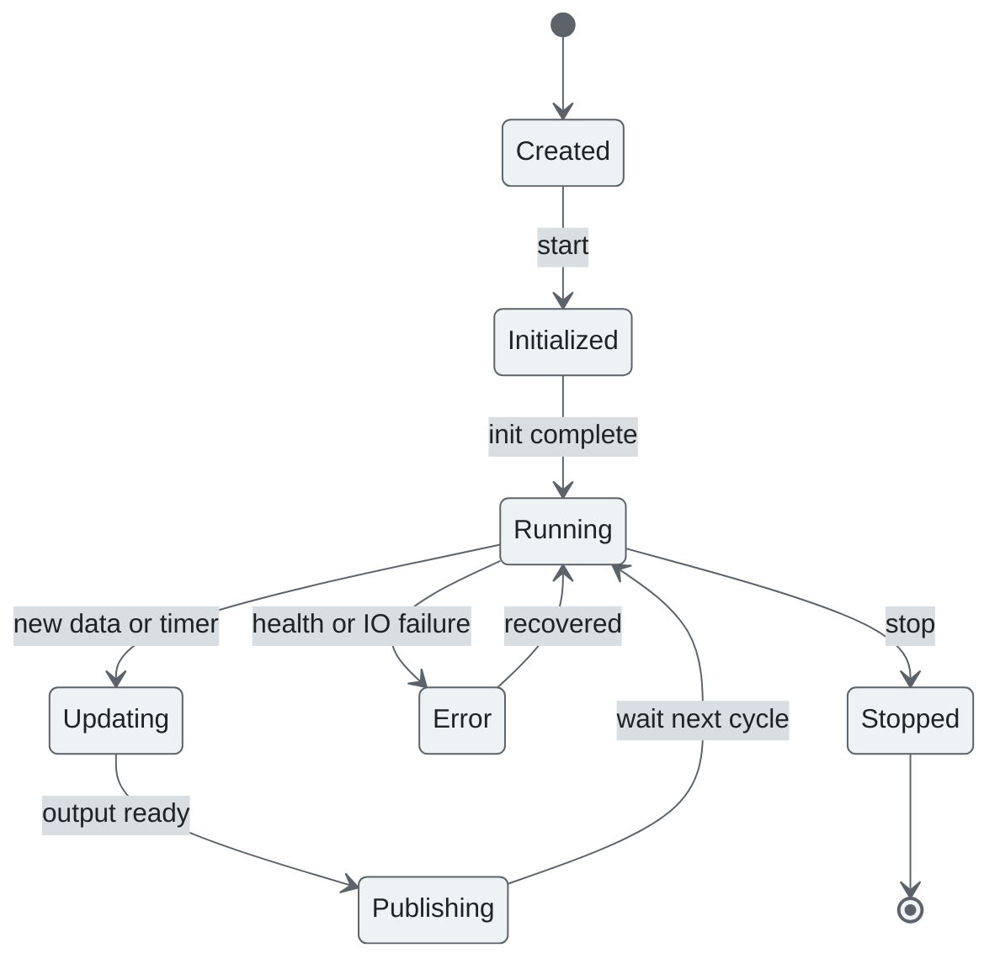
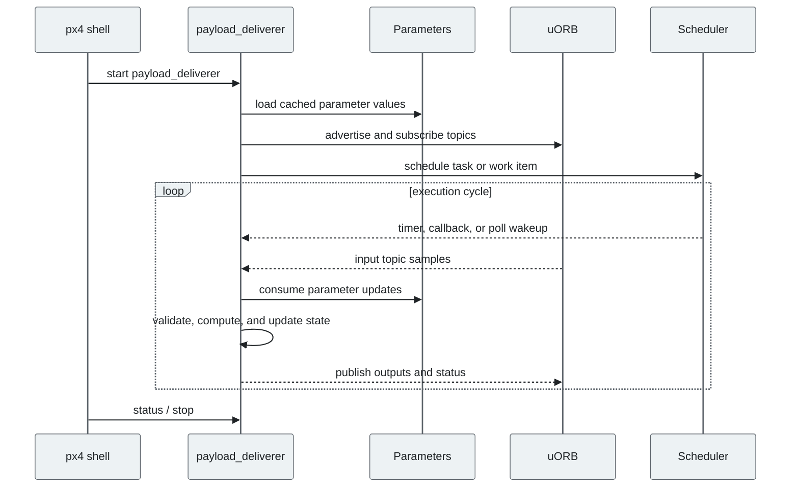
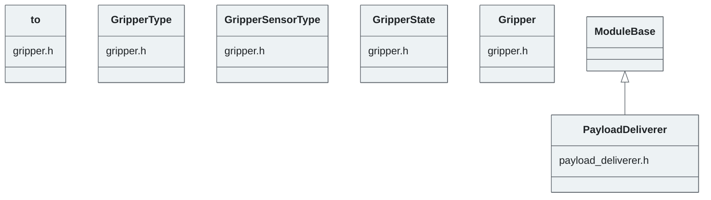

# PX4 Module Architecture: `payload_deliverer`

- Source: `src/modules/payload_deliverer`
- Build target: `modules__payload_deliverer`
- Runtime main: `payload_deliverer`
- Build kind: `px4 module`
- Mermaid palette: `graphite` grey tone

Architecture notes for the payload_deliverer module.

## Architecture Overview

This page is generated from the module source tree and shows the stable architecture surfaces: build entry point, scheduling shape, uORB data interfaces, parameter/configuration surfaces, and C++ types found in the module.

## Build and Entry Points

| Field | Value |
| --- | --- |
| Module path | src/modules/payload_deliverer |
| Build kind | px4 module |
| Build target | modules__payload_deliverer |
| Runtime main | payload_deliverer |
| Stack main | Not specified |
| Module config | module.yaml |
| Detected sources | 2 |
| Detected headers | 2 |
| Detected configs | 2 |

### CMake Dependencies

- `px4_work_queue`

### Nested Module Targets

- No nested module targets detected.

## Data Flow

### uORB Topics

| Topic | Detected direction |
| --- | --- |
| gripper | published |
| parameter_update | subscribed |
| vehicle_command | subscribed, published |
| vehicle_command_ack | published |

## Execution Flow

The common PX4 module lifecycle is command entry, object construction or task spawn, parameter loading, topic setup, scheduled execution, publication, status reporting, and stop/cleanup. Modules that use `ModuleBase`, `ScheduledWorkItem`, polling loops, or bridge callbacks still fit this lifecycle with different scheduling triggers.

## State Machine

### Detected State-Like Symbols

- No state-like symbols detected.

## Sequence Diagram

## Class Diagram

### Detected Classes

| Class | Base | File |
| --- | --- | --- |
| to |  | gripper.h |
| GripperType |  | gripper.h |
| GripperSensorType |  | gripper.h |
| GripperState |  | gripper.h |
| Gripper |  | gripper.h |
| PayloadDeliverer | ModuleBase | payload_deliverer.h |

### Detected Enums

- `GripperSensorType`
- `GripperState`
- `GripperType`

## Parameters and Configuration

- `PD_GRIPPER_TO`
- `PD_GRIPPER_TYPE`

## Source Map

| File | Kind |
| --- | --- |
| CMakeLists.txt | build |
| gripper.cpp | source |
| gripper.h | header |
| module.yaml | config |
| payload_deliverer.cpp | source |
| payload_deliverer.h | header |

## Review Notes

- The diagrams are generated from static source inventory and should be used as a study map, not as a formal proof of every runtime branch.
- Topic direction is inferred from nearby source context such as `Subscription`, `Publication`, `orb_subscribe`, and `publish` usage.
- When a module has no explicit state enum, the state diagram shows the standard PX4 module lifecycle.
