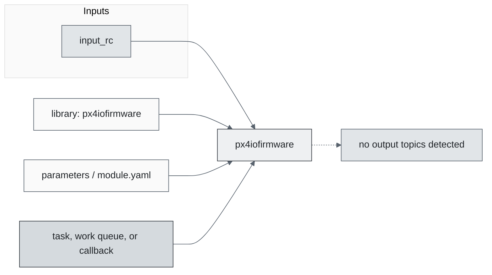
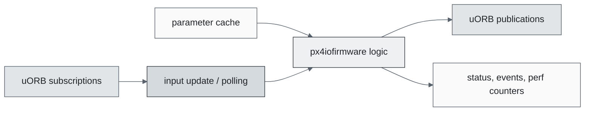
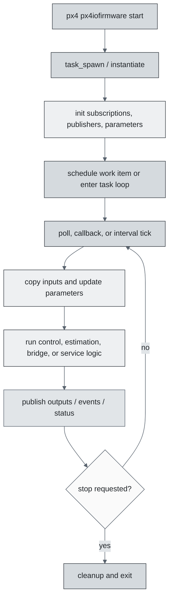
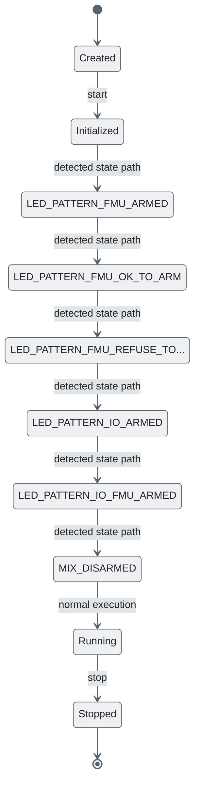
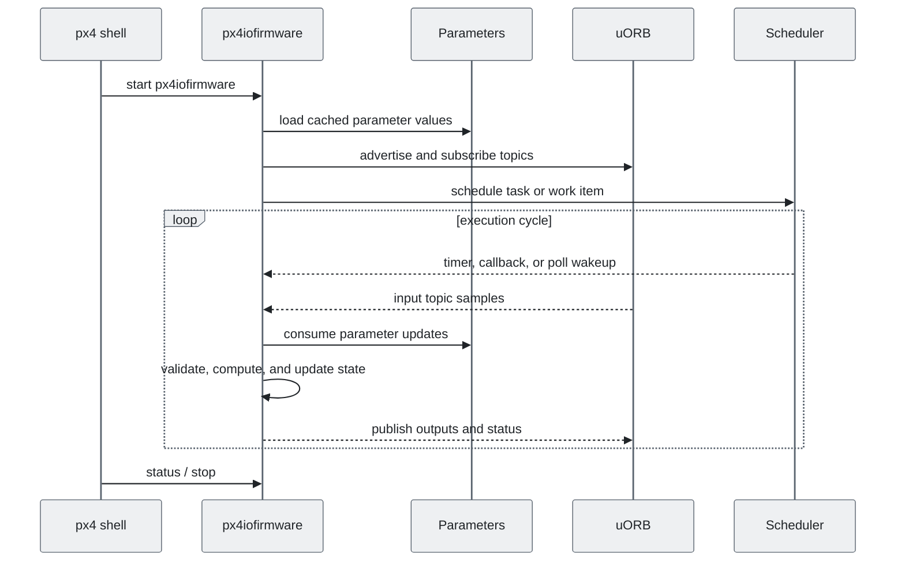
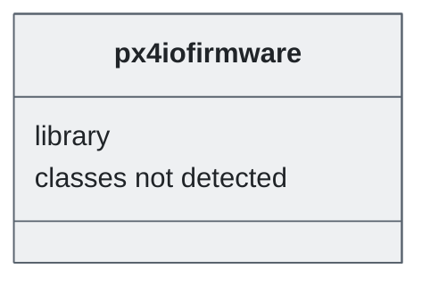

# PX4 Module Architecture: `px4iofirmware`

- Source: `src/modules/px4iofirmware`
- Build target: `px4iofirmware`
- Runtime main: `px4iofirmware`
- Build kind: `library`
- Mermaid palette: `slate` grey tone

Source-derived architecture notes for this PX4 module directory.

## Description of Module

Builds PX4IO firmware support code for the IO co-processor path.

### Primary Responsibilities

- Reference uORB topics such as `input_rc`.
- Do not publish directly detected uORB outputs from this module directory.
- Implement behavior mostly in C/C++ source functions rather than detected C++ classes.

### Runtime Behavior

- Scheduling style was not explicit in the detected source inventory; inspect the entry source for runtime details.

## Background Theory

No dedicated mathematical model was identified in the generated source scan. This module is best understood through its PX4 state handling, uORB message flow, scheduling, and configuration surfaces described below.

### Main Interfaces

| Area | Details |
| --- | --- |
| Primary inputs | none detected |
| Primary outputs | none detected |
| Referenced topics | `input_rc` |
| Parameters/config | none detected |
| Key classes | none detected |

### Files

| File | Why it matters |
| --- | --- |
| CMakeLists.txt | Build, parameter, or module configuration |

## Architecture Overview

This page is generated from the module source tree and shows the stable architecture surfaces: build entry point, scheduling shape, uORB data interfaces, parameter/configuration surfaces, and C++ types found in the module.

## Build and Entry Points

| Field | Value |
| --- | --- |
| Module path | src/modules/px4iofirmware |
| Build kind | library |
| Build target | px4iofirmware |
| Runtime main | px4iofirmware |
| Stack main | Not specified |
| Module config | Not specified |
| Detected sources | 7 |
| Detected headers | 2 |
| Detected configs | 1 |

### CMake Dependencies

- No explicit CMake dependencies detected.

### Nested Module Targets

- No nested module targets detected.

## Data Flow

### uORB Topics

| Topic | Detected direction |
| --- | --- |
| input_rc | referenced |

## Execution Flow

The common PX4 module lifecycle is command entry, object construction or task spawn, parameter loading, topic setup, scheduled execution, publication, status reporting, and stop/cleanup. Modules that use `ModuleBase`, `ScheduledWorkItem`, polling loops, or bridge callbacks still fit this lifecycle with different scheduling triggers.

## State Machine

### Detected State-Like Symbols

- `LED_PATTERN_FMU_ARMED`
- `LED_PATTERN_FMU_OK_TO_ARM`
- `LED_PATTERN_FMU_REFUSE_TO_ARM`
- `LED_PATTERN_IO_ARMED`
- `LED_PATTERN_IO_FMU_ARMED`
- `MIX_DISARMED`
- `MIX_FAILSAFE`
- `PX4IO_PAGE_DISARMED_PWM`
- `PX4IO_PAGE_FAILSAFE_PWM`
- `PX4IO_P_RAW_RC_FLAGS_FAILSAFE`
- `PX4IO_P_SETUP_ARMING`
- `PX4IO_P_SETUP_ARMING_FAILSAFE_CUSTOM`
- `PX4IO_P_SETUP_ARMING_FMU_ARMED`
- `PX4IO_P_SETUP_ARMING_FMU_PREARMED`
- `PX4IO_P_SETUP_ARMING_IO_ARM_OK`
- `PX4IO_P_SETUP_ARMING_LOCKDOWN`
- `PX4IO_P_SETUP_ARMING_TERMINATION`
- `PX4IO_P_SETUP_ARMING_TERMINATION_FAILSAFE`
- `PX4IO_P_SETUP_ARMING_VALID`
- `PX4IO_P_STATUS_ALARMS`
- `PX4IO_P_STATUS_ALARMS_PWM_ERROR`
- `PX4IO_P_STATUS_ALARMS_RC_LOST`
- `PX4IO_P_STATUS_FLAGS_ARM_SYNC`
- `PX4IO_P_STATUS_FLAGS_FAILSAFE`
- `PX4IO_P_STATUS_FLAGS_OUTPUTS_ARMED`

## Sequence Diagram

## Class Diagram

### Detected Classes

| Class | Base | File |
| --- | --- | --- |
| None detected. | None detected. | None detected. |

### Detected Enums

- `mixer_source`

## Parameters and Configuration

- No parameters detected.

## Source Map

| File | Kind |
| --- | --- |
| CMakeLists.txt | build |
| adc.cpp | source |
| controls.cpp | source |
| mixer.cpp | source |
| protocol.h | header |
| px4io.cpp | source |
| px4io.h | header |
| registers.c | source |
| safety_button.cpp | source |
| serial.cpp | source |

## Review Notes

- The diagrams are generated from static source inventory and should be used as a study map, not as a formal proof of every runtime branch.
- Topic direction is inferred from nearby source context such as `Subscription`, `Publication`, `orb_subscribe`, and `publish` usage.
- When a module has no explicit state enum, the state diagram shows the standard PX4 module lifecycle.
