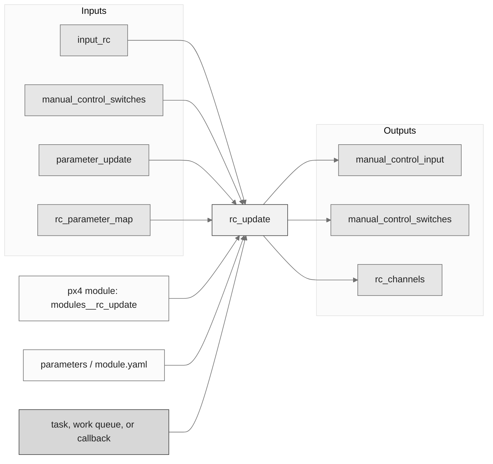
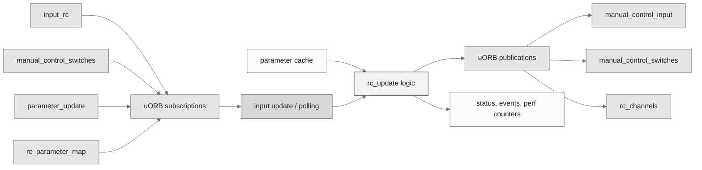
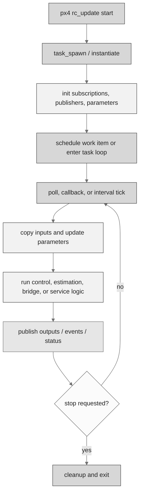
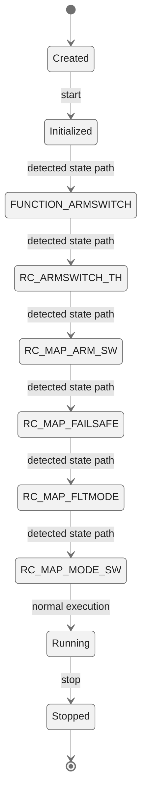
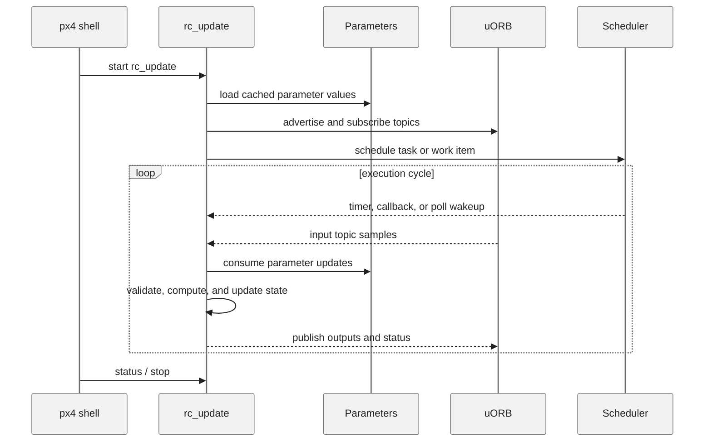
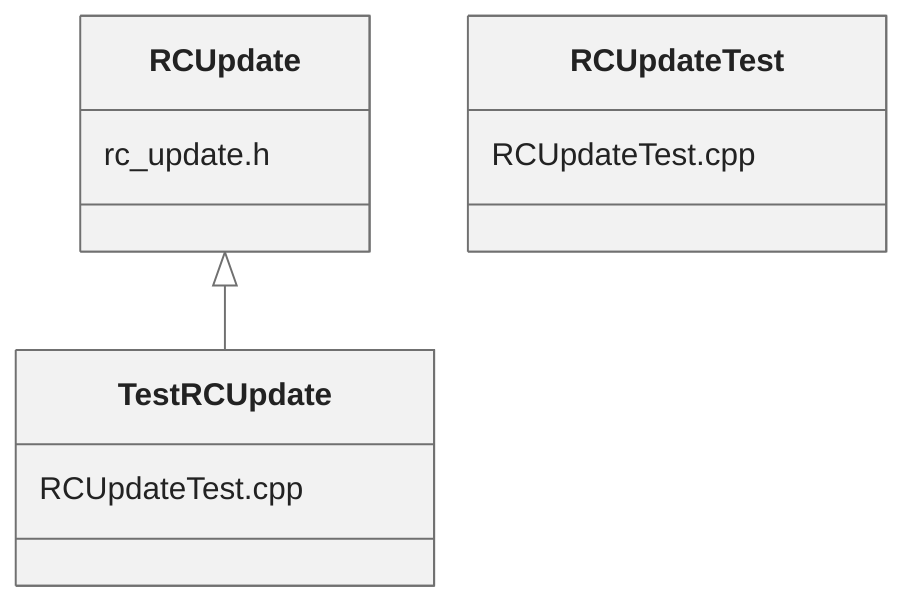

# PX4 Module Architecture: `rc_update`

- Source: `src/modules/rc_update`
- Build target: `modules__rc_update`
- Runtime main: `rc_update`
- Build kind: `px4 module`
- Mermaid palette: `ash` grey tone

The rc_update module handles RC channel mapping: read the raw input channels (`input_rc`), then apply the calibration, map the RC channels to the configured channels & mode switches and then publish as `rc_channels` and `manual_control_input`. To reduce control latency, the module is scheduled on input_rc publications.

## Description of Module

Converts raw RC input into calibrated manual-control input topics.

### Primary Responsibilities

- Consume runtime inputs from uORB topics such as `input_rc`, `manual_control_switches`, `parameter_update`, `rc_parameter_map`.
- Publish outputs or status topics such as `manual_control_input`, `manual_control_switches`, `rc_channels`.
- Use module configuration from `params.yaml`.
- Implement the main behavior in classes such as `TestRCUpdate`, `RCUpdateTest`, `RCUpdate`.

### Runtime Behavior

- Runs work-queue callbacks on queue configurations such as `hp_default`.
- Uses uORB callback registration so new topic data can schedule execution.

## Background Theory

No dedicated mathematical model was identified in the generated source scan. This module is best understood through its PX4 state handling, uORB message flow, scheduling, and configuration surfaces described below.

### Main Interfaces

| Area | Details |
| --- | --- |
| Primary inputs | `input_rc`, `manual_control_switches`, `parameter_update`, `rc_parameter_map` |
| Primary outputs | `manual_control_input`, `manual_control_switches`, `rc_channels` |
| Referenced topics | `input_rc`, `manual_control_input`, `manual_control_setpoint`, `manual_control_switches`, `parameter_update`, `rc_channels`, `rc_parameter_map` |
| Parameters/config | params.yaml |
| Key classes | `TestRCUpdate`, `RCUpdateTest`, `RCUpdate` |

### Files

| File | Why it matters |
| --- | --- |
| rc_update.cpp | Entry point, start command, or module lifecycle code |
| CMakeLists.txt | Build, parameter, or module configuration |
| params.yaml | Build, parameter, or module configuration |
| params_deprecated.yaml | Build, parameter, or module configuration |
| RCUpdateTest.cpp | Defines `TestRCUpdate` class |
| rc_update.h | Defines `RCUpdate` class |

## Architecture Overview

This page is generated from the module source tree and shows the stable architecture surfaces: build entry point, scheduling shape, uORB data interfaces, parameter/configuration surfaces, and C++ types found in the module.

## Build and Entry Points

| Field | Value |
| --- | --- |
| Module path | src/modules/rc_update |
| Build kind | px4 module |
| Build target | modules__rc_update |
| Runtime main | rc_update |
| Stack main | Not specified |
| Module config | params.yaml |
| Detected sources | 2 |
| Detected headers | 1 |
| Detected configs | 3 |

### CMake Dependencies

- `hysteresis`
- `mathlib`
- `px4_work_queue`

### Nested Module Targets

- No nested module targets detected.

## Data Flow

### uORB Topics

| Topic | Detected direction |
| --- | --- |
| input_rc | subscribed |
| manual_control_input | published |
| manual_control_setpoint | referenced |
| manual_control_switches | subscribed, published |
| parameter_update | subscribed |
| rc_channels | published |
| rc_parameter_map | subscribed |

## Execution Flow

The common PX4 module lifecycle is command entry, object construction or task spawn, parameter loading, topic setup, scheduled execution, publication, status reporting, and stop/cleanup. Modules that use `ModuleBase`, `ScheduledWorkItem`, polling loops, or bridge callbacks still fit this lifecycle with different scheduling triggers.

## State Machine

### Detected State-Like Symbols

- `FUNCTION_ARMSWITCH`
- `RC_ARMSWITCH_TH`
- `RC_MAP_ARM_SW`
- `RC_MAP_FAILSAFE`
- `RC_MAP_FLTMODE`
- `RC_MAP_MODE_SW`

## Sequence Diagram

## Class Diagram

### Detected Classes

| Class | Base | File |
| --- | --- | --- |
| TestRCUpdate | RCUpdate | RCUpdateTest.cpp |
| RCUpdateTest |  | RCUpdateTest.cpp |
| RCUpdate |  | rc_update.h |

### Detected Enums

- No enums detected.

## Parameters and Configuration

- No parameters detected.

## Source Map

| File | Kind |
| --- | --- |
| CMakeLists.txt | build |
| RCUpdateTest.cpp | source |
| params.yaml | config |
| params_deprecated.yaml | config |
| rc_update.cpp | source |
| rc_update.h | header |

## Review Notes

- The diagrams are generated from static source inventory and should be used as a study map, not as a formal proof of every runtime branch.
- Topic direction is inferred from nearby source context such as `Subscription`, `Publication`, `orb_subscribe`, and `publish` usage.
- When a module has no explicit state enum, the state diagram shows the standard PX4 module lifecycle.
