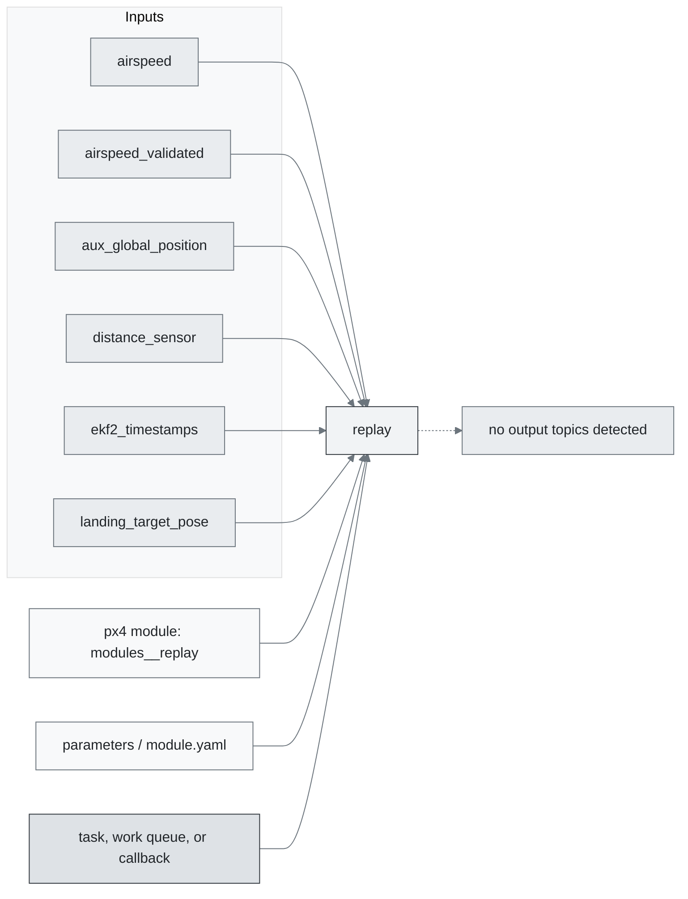
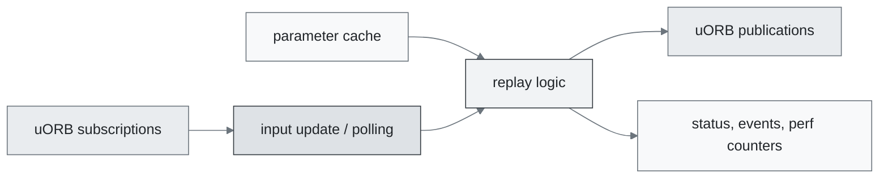
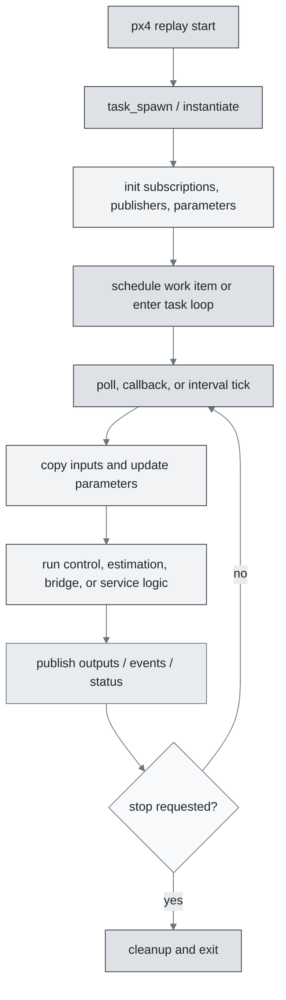
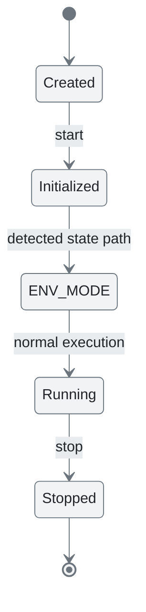
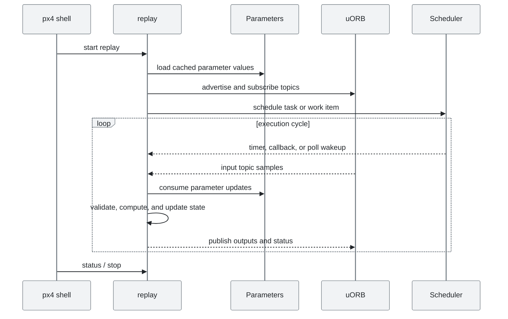
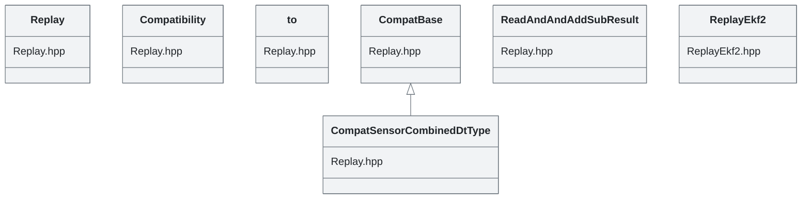

# PX4 Module Architecture: `replay`

- Source: `src/modules/replay`
- Build target: `modules__replay`
- Runtime main: `replay`
- Build kind: `px4 module`
- Mermaid palette: `mist` grey tone

Source-derived architecture notes for this PX4 module directory.

## Architecture Overview

This page is generated from the module source tree and shows the stable architecture surfaces: build entry point, scheduling shape, uORB data interfaces, parameter/configuration surfaces, and C++ types found in the module.

## Build and Entry Points

| Field | Value |
| --- | --- |
| Module path | src/modules/replay |
| Build kind | px4 module |
| Build target | modules__replay |
| Runtime main | replay |
| Stack main | Not specified |
| Module config | Not specified |
| Detected sources | 3 |
| Detected headers | 3 |
| Detected configs | 1 |

### CMake Dependencies

- No explicit CMake dependencies detected.

### Nested Module Targets

- No nested module targets detected.

## Data Flow

### uORB Topics

| Topic | Detected direction |
| --- | --- |
| airspeed | referenced |
| airspeed_validated | referenced |
| aux_global_position | referenced |
| distance_sensor | referenced |
| ekf2_timestamps | referenced |
| landing_target_pose | referenced |
| ranging_beacon | referenced |
| sensor_combined | referenced |
| sensor_gps | referenced |
| uORBTopics | referenced |
| vehicle_air_data | referenced |
| vehicle_attitude | referenced |
| vehicle_attitude_groundtruth | referenced |
| vehicle_global_position | referenced |
| vehicle_global_position_groundtruth | referenced |
| vehicle_gps_position | referenced |
| vehicle_land_detected | referenced |
| vehicle_local_position | referenced |
| vehicle_local_position_groundtruth | referenced |
| vehicle_magnetometer | referenced |
| vehicle_odometry | referenced |
| vehicle_optical_flow | referenced |
| vehicle_status | referenced |
| vehicle_visual_odometry | referenced |

## Execution Flow

The common PX4 module lifecycle is command entry, object construction or task spawn, parameter loading, topic setup, scheduled execution, publication, status reporting, and stop/cleanup. Modules that use `ModuleBase`, `ScheduledWorkItem`, polling loops, or bridge callbacks still fit this lifecycle with different scheduling triggers.

## State Machine

### Detected State-Like Symbols

- `ENV_MODE`

## Sequence Diagram

## Class Diagram

### Detected Classes

| Class | Base | File |
| --- | --- | --- |
| Replay |  | Replay.hpp |
| Compatibility |  | Replay.hpp |
| to |  | Replay.hpp |
| CompatBase |  | Replay.hpp |
| CompatSensorCombinedDtType | CompatBase | Replay.hpp |
| ReadAndAndAddSubResult |  | Replay.hpp |
| ReplayEkf2 |  | ReplayEkf2.hpp |

### Detected Enums

- `ReadAndAndAddSubResult`

## Parameters and Configuration

- No parameters detected.

## Source Map

| File | Kind |
| --- | --- |
| CMakeLists.txt | build |
| Replay.cpp | source |
| Replay.hpp | header |
| ReplayEkf2.cpp | source |
| ReplayEkf2.hpp | header |
| definitions.hpp | header |
| replay_main.cpp | source |

## Review Notes

- The diagrams are generated from static source inventory and should be used as a study map, not as a formal proof of every runtime branch.
- Topic direction is inferred from nearby source context such as `Subscription`, `Publication`, `orb_subscribe`, and `publish` usage.
- When a module has no explicit state enum, the state diagram shows the standard PX4 module lifecycle.
