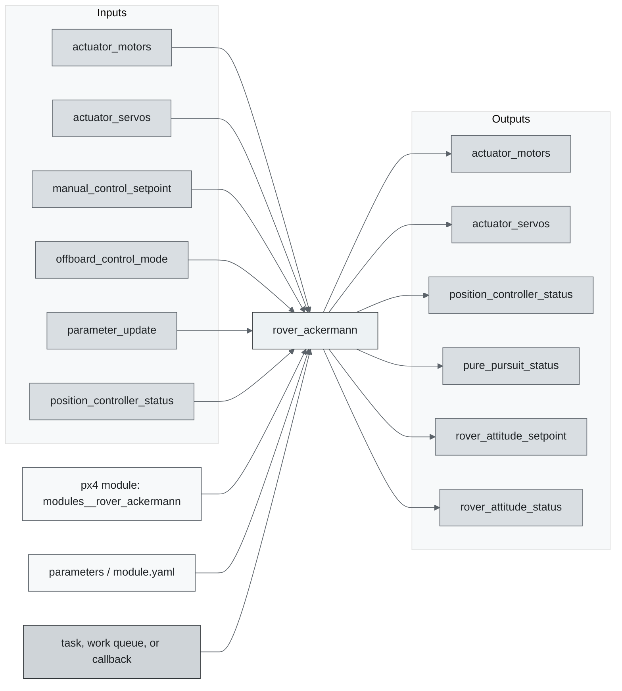
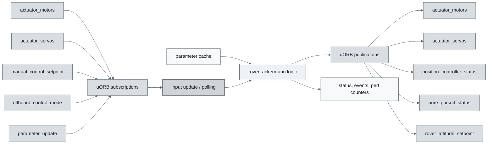
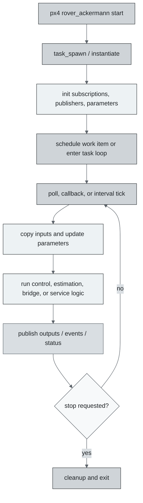
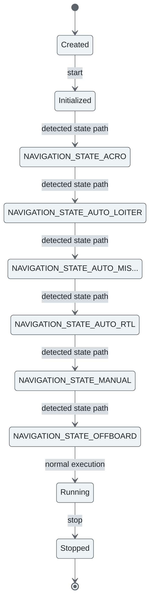
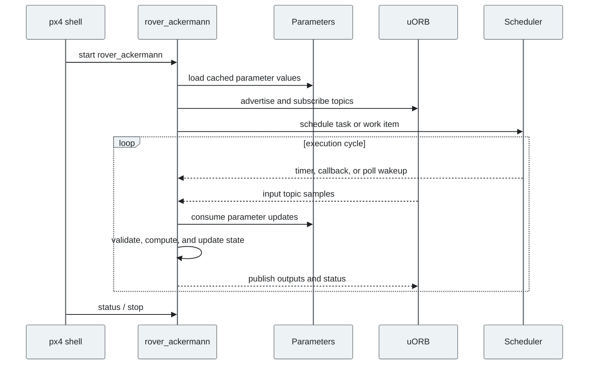

# PX4 Module Architecture: `rover_ackermann`

- Source: `src/modules/rover_ackermann`
- Build target: `modules__rover_ackermann`
- Runtime main: `rover_ackermann`
- Build kind: `px4 module`
- Mermaid palette: `graphite` grey tone

Architecture notes for the Rover Ackermann module.

## Description of Module

Controls Ackermann-steered rover motion from rover setpoints to actuator commands.

### Primary Responsibilities

- Consume runtime inputs from uORB topics such as `actuator_motors`, `actuator_servos`, `manual_control_setpoint`, `offboard_control_mode`, `parameter_update`, `position_controller_status`, `position_setpoint_triplet`, `rover_attitude_setpoint`, ... 11 more.
- Publish outputs or status topics such as `actuator_motors`, `actuator_servos`, `position_controller_status`, `pure_pursuit_status`, `rover_attitude_setpoint`, `rover_attitude_status`, `rover_position_setpoint`, `rover_rate_setpoint`, ... 5 more.
- Use module configuration from `module.yaml`.
- Implement the main behavior in classes such as `AckermannActControl`, `AckermannAttControl`, `AckermannAutoMode`, `AckermannManualMode`, `AckermannOffboardMode`, `AckermannPosControl`, ... 3 more.

### Runtime Behavior

- Runs work-queue callbacks on queue configurations such as `rate_ctrl`.
- Uses explicit work-item scheduling through immediate, delayed, or interval scheduling calls.

## Background Theory

Ackermann rover control uses car-like planar kinematics. Steering angle is related to path curvature and yaw rate by the wheelbase.

```text
curvature = yaw_rate_sp / max(speed_sp, epsilon)
steering_angle = atan(wheelbase * curvature)
yaw_rate = speed / wheelbase * tan(steering_angle)
throttle = K_speed * (speed_sp - speed) + feedforward(speed_sp)
```

These equations are the study-level form of the algorithm. The implementation applies PX4-specific saturation, validity checks, parameter updates, and frame conventions around these core relationships.

### Main Interfaces

| Area | Details |
| --- | --- |
| Primary inputs | `actuator_motors`, `actuator_servos`, `manual_control_setpoint`, `offboard_control_mode`, `parameter_update`, `position_controller_status`, `position_setpoint_triplet`, `rover_attitude_setpoint`, `rover_position_setpoint`, `rover_rate_setpoint`, ... 9 more |
| Primary outputs | `actuator_motors`, `actuator_servos`, `position_controller_status`, `pure_pursuit_status`, `rover_attitude_setpoint`, `rover_attitude_status`, `rover_position_setpoint`, `rover_rate_setpoint`, `rover_rate_status`, `rover_speed_setpoint`, ... 3 more |
| Referenced topics | `actuator_motors`, `actuator_servos`, `manual_control_setpoint`, `offboard_control_mode`, `parameter_update`, `position_controller_status`, `position_setpoint_triplet`, `pure_pursuit_status`, `rover_attitude_setpoint`, `rover_attitude_status`, ... 13 more |
| Parameters/config | module.yaml |
| Key classes | `AckermannActControl`, `AckermannAttControl`, `AckermannAutoMode`, `AckermannManualMode`, `AckermannOffboardMode`, `AckermannPosControl`, `AckermannRateControl`, `AckermannSpeedControl`, `RoverAckermann` |

### Files

| File | Why it matters |
| --- | --- |
| RoverAckermann.cpp | Entry point, start command, or module lifecycle code |
| AckermannActControl/CMakeLists.txt | Build, parameter, or module configuration |
| AckermannAttControl/CMakeLists.txt | Build, parameter, or module configuration |
| AckermannDriveModes/AckermannAutoMode/CMakeLists.txt | Build, parameter, or module configuration |
| AckermannDriveModes/AckermannManualMode/CMakeLists.txt | Build, parameter, or module configuration |
| AckermannDriveModes/AckermannOffboardMode/CMakeLists.txt | Build, parameter, or module configuration |
| AckermannDriveModes/CMakeLists.txt | Build, parameter, or module configuration |
| AckermannActControl/AckermannActControl.hpp | Defines `AckermannActControl` class |

## Architecture Overview

This page is generated from the module source tree and shows the stable architecture surfaces: build entry point, scheduling shape, uORB data interfaces, parameter/configuration surfaces, and C++ types found in the module.



## Build and Entry Points

| Field | Value |
| --- | --- |
| Module path | src/modules/rover_ackermann |
| Build kind | px4 module |
| Build target | modules__rover_ackermann |
| Runtime main | rover_ackermann |
| Stack main | Not specified |
| Module config | module.yaml |
| Detected sources | 9 |
| Detected headers | 9 |
| Detected configs | 11 |

### CMake Dependencies

- `AckermannActControl`
- `AckermannRateControl`
- `AckermannAttControl`
- `AckermannSpeedControl`
- `AckermannPosControl`
- `AckermannAutoMode`
- `AckermannManualMode`
- `AckermannOffboardMode`
- `px4_work_queue`
- `rover_control`
- `pure_pursuit`

### Nested Module Targets

- No nested module targets detected.

## Data Flow



### uORB Topics

| Topic | Detected direction |
| --- | --- |
| actuator_motors | subscribed, published |
| actuator_servos | subscribed, published |
| manual_control_setpoint | subscribed |
| offboard_control_mode | subscribed |
| parameter_update | subscribed |
| position_controller_status | subscribed, published |
| position_setpoint_triplet | subscribed |
| pure_pursuit_status | published |
| rover_attitude_setpoint | subscribed, published |
| rover_attitude_status | published |
| rover_position_setpoint | subscribed, published |
| rover_rate_setpoint | subscribed, published |
| rover_rate_status | published |
| rover_speed_setpoint | subscribed, published |
| rover_speed_status | published |
| rover_steering_setpoint | subscribed, published |
| rover_throttle_setpoint | subscribed, published |
| trajectory_setpoint | subscribed |
| vehicle_angular_velocity | subscribed |
| vehicle_attitude | subscribed |
| vehicle_control_mode | subscribed |
| vehicle_local_position | subscribed |
| vehicle_status | subscribed |

## Execution Flow



The common PX4 module lifecycle is command entry, object construction or task spawn, parameter loading, topic setup, scheduled execution, publication, status reporting, and stop/cleanup. Modules that use `ModuleBase`, `ScheduledWorkItem`, polling loops, or bridge callbacks still fit this lifecycle with different scheduling triggers.

## State Machine



### Detected State-Like Symbols

- `NAVIGATION_STATE_ACRO`
- `NAVIGATION_STATE_AUTO_LOITER`
- `NAVIGATION_STATE_AUTO_MISSION`
- `NAVIGATION_STATE_AUTO_RTL`
- `NAVIGATION_STATE_MANUAL`
- `NAVIGATION_STATE_OFFBOARD`
- `NAVIGATION_STATE_POSCTL`
- `NAVIGATION_STATE_STAB`

## Sequence Diagram



## Class Diagram

```mermaid
%%{init: {"theme":"base","themeVariables":{"primaryColor":"#edf2f4","secondaryColor":"#d9dee2","tertiaryColor":"#f7f9fa","primaryBorderColor":"#5c636a","primaryTextColor":"#1f2326","lineColor":"#5c636a","fontFamily":"Inter, Arial, sans-serif"}}}%%
classDiagram
  class AckermannActControl
  AckermannActControl : AckermannActControl/AckermannActControl.hpp
  class ModuleParams
  ModuleParams <|-- AckermannActControl
  class AckermannAttControl
  AckermannAttControl : AckermannAttControl/AckermannAttControl.hpp
  class ModuleParams
  ModuleParams <|-- AckermannAttControl
  class AckermannAutoMode
  AckermannAutoMode : AckermannDriveModes/AckermannAutoMode/AckermannAuto...
  class ModuleParams
  ModuleParams <|-- AckermannAutoMode
  class AckermannManualMode
  AckermannManualMode : AckermannDriveModes/AckermannManualMode/AckermannMa...
  class ModuleParams
  ModuleParams <|-- AckermannManualMode
  class AckermannOffboardMode
  AckermannOffboardMode : AckermannDriveModes/AckermannOffboardMode/Ackermann...
  class ModuleParams
  ModuleParams <|-- AckermannOffboardMode
  class AckermannPosControl
  AckermannPosControl : AckermannPosControl/AckermannPosControl.hpp
  class ModuleParams
  ModuleParams <|-- AckermannPosControl
  class AckermannRateControl
  AckermannRateControl : AckermannRateControl/AckermannRateControl.hpp
  class ModuleParams
  ModuleParams <|-- AckermannRateControl
  class AckermannSpeedControl
  AckermannSpeedControl : AckermannSpeedControl/AckermannSpeedControl.hpp
  class ModuleParams
  ModuleParams <|-- AckermannSpeedControl
  class RoverAckermann
  RoverAckermann : RoverAckermann.hpp
  class ModuleBase
  ModuleBase <|-- RoverAckermann
```



### Detected Classes

| Class | Base | File |
| --- | --- | --- |
| AckermannActControl | ModuleParams | AckermannActControl/AckermannActControl.hpp |
| AckermannAttControl | ModuleParams | AckermannAttControl/AckermannAttControl.hpp |
| AckermannAutoMode | ModuleParams | AckermannDriveModes/AckermannAutoMode/AckermannAutoMode.hpp |
| AckermannManualMode | ModuleParams | AckermannDriveModes/AckermannManualMode/AckermannManualMode.hpp |
| AckermannOffboardMode | ModuleParams | AckermannDriveModes/AckermannOffboardMode/AckermannOffboardMode.hpp |
| AckermannPosControl | ModuleParams | AckermannPosControl/AckermannPosControl.hpp |
| AckermannRateControl | ModuleParams | AckermannRateControl/AckermannRateControl.hpp |
| AckermannSpeedControl | ModuleParams | AckermannSpeedControl/AckermannSpeedControl.hpp |
| RoverAckermann | ModuleBase | RoverAckermann.hpp |

### Detected Enums

- No enums detected.

## Parameters and Configuration

- No parameters detected.

## Source Map

| File | Kind |
| --- | --- |
| AckermannActControl/AckermannActControl.cpp | source |
| AckermannActControl/AckermannActControl.hpp | header |
| AckermannActControl/CMakeLists.txt | build |
| AckermannAttControl/AckermannAttControl.cpp | source |
| AckermannAttControl/AckermannAttControl.hpp | header |
| AckermannAttControl/CMakeLists.txt | build |
| AckermannDriveModes/AckermannAutoMode/AckermannAutoMode.cpp | source |
| AckermannDriveModes/AckermannAutoMode/AckermannAutoMode.hpp | header |
| AckermannDriveModes/AckermannAutoMode/CMakeLists.txt | build |
| AckermannDriveModes/AckermannManualMode/AckermannManualMode.cpp | source |
| AckermannDriveModes/AckermannManualMode/AckermannManualMode.hpp | header |
| AckermannDriveModes/AckermannManualMode/CMakeLists.txt | build |
| AckermannDriveModes/AckermannOffboardMode/AckermannOffboardMode.cpp | source |
| AckermannDriveModes/AckermannOffboardMode/AckermannOffboardMode.hpp | header |
| AckermannDriveModes/AckermannOffboardMode/CMakeLists.txt | build |
| AckermannDriveModes/CMakeLists.txt | build |
| AckermannPosControl/AckermannPosControl.cpp | source |
| AckermannPosControl/AckermannPosControl.hpp | header |
| AckermannPosControl/CMakeLists.txt | build |
| AckermannRateControl/AckermannRateControl.cpp | source |
| AckermannRateControl/AckermannRateControl.hpp | header |
| AckermannRateControl/CMakeLists.txt | build |
| AckermannSpeedControl/AckermannSpeedControl.cpp | source |
| AckermannSpeedControl/AckermannSpeedControl.hpp | header |
| AckermannSpeedControl/CMakeLists.txt | build |
| CMakeLists.txt | build |
| RoverAckermann.cpp | source |
| RoverAckermann.hpp | header |
| module.yaml | config |

## Review Notes

- The diagrams are generated from static source inventory and should be used as a study map, not as a formal proof of every runtime branch.
- Topic direction is inferred from nearby source context such as `Subscription`, `Publication`, `orb_subscribe`, and `publish` usage.
- When a module has no explicit state enum, the state diagram shows the standard PX4 module lifecycle.
