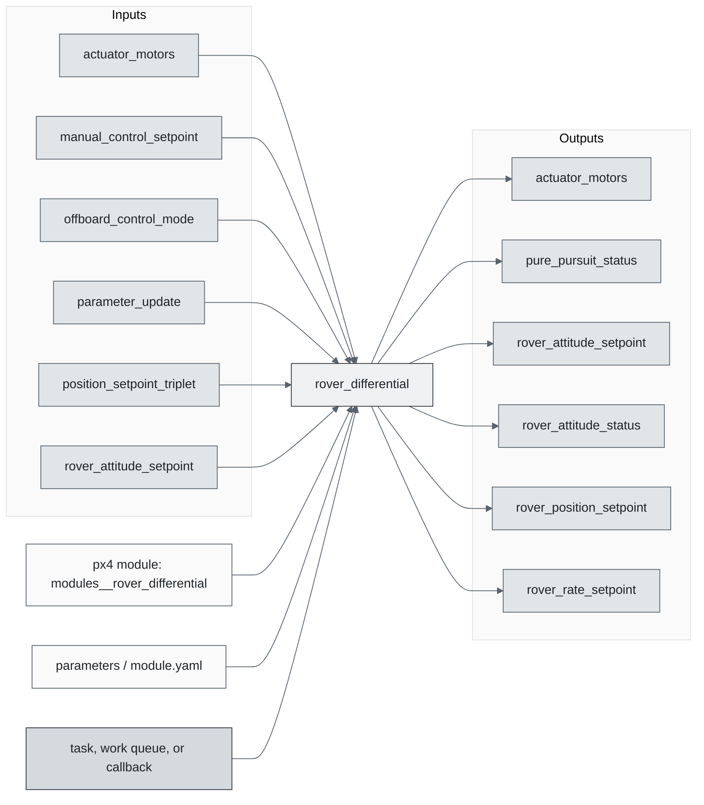
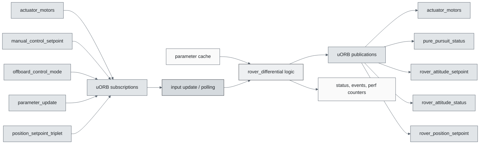
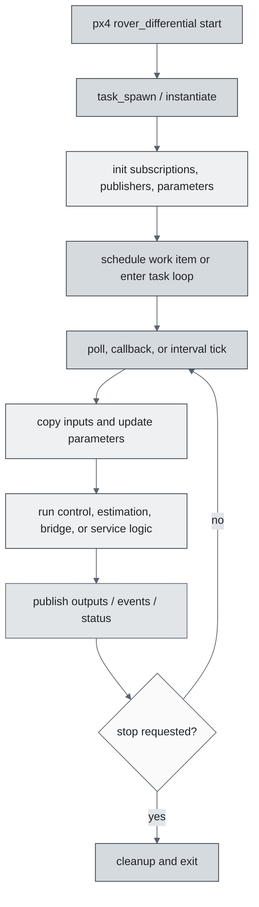
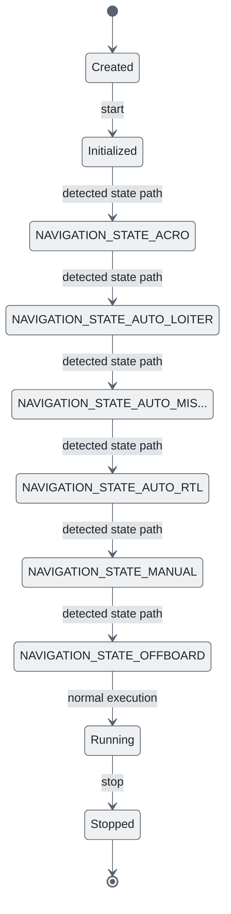
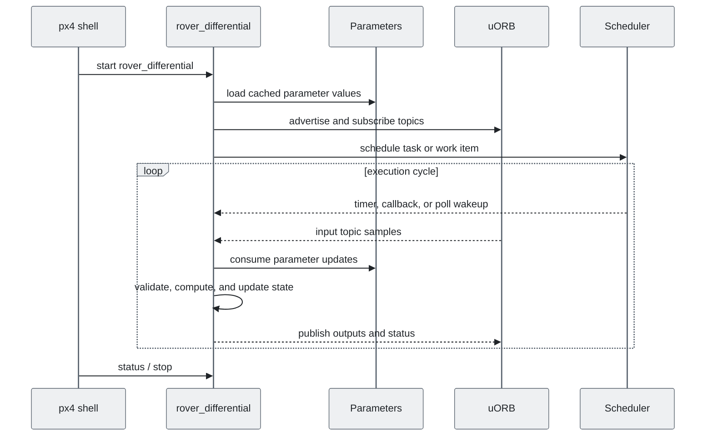

# PX4 Module Architecture: `rover_differential`

- Source: `src/modules/rover_differential`
- Build target: `modules__rover_differential`
- Runtime main: `rover_differential`
- Build kind: `px4 module`
- Mermaid palette: `slate` grey tone

Architecture notes for the Rover Differential module.

## Architecture Overview

This page is generated from the module source tree and shows the stable architecture surfaces: build entry point, scheduling shape, uORB data interfaces, parameter/configuration surfaces, and C++ types found in the module.

## Build and Entry Points

| Field | Value |
| --- | --- |
| Module path | src/modules/rover_differential |
| Build kind | px4 module |
| Build target | modules__rover_differential |
| Runtime main | rover_differential |
| Stack main | Not specified |
| Module config | module.yaml |
| Detected sources | 9 |
| Detected headers | 9 |
| Detected configs | 11 |

### CMake Dependencies

- `DifferentialActControl`
- `DifferentialRateControl`
- `DifferentialAttControl`
- `DifferentialSpeedControl`
- `DifferentialPosControl`
- `DifferentialAutoMode`
- `DifferentialManualMode`
- `DifferentialOffboardMode`
- `px4_work_queue`
- `rover_control`
- `pure_pursuit`

### Nested Module Targets

- No nested module targets detected.

## Data Flow

### uORB Topics

| Topic | Detected direction |
| --- | --- |
| actuator_motors | subscribed, published |
| manual_control_setpoint | subscribed |
| offboard_control_mode | subscribed |
| parameter_update | subscribed |
| position_setpoint_triplet | subscribed |
| pure_pursuit_status | published |
| rover_attitude_setpoint | subscribed, published |
| rover_attitude_status | published |
| rover_position_setpoint | subscribed, published |
| rover_rate_setpoint | subscribed, published |
| rover_rate_status | published |
| rover_speed_setpoint | subscribed, published |
| rover_speed_status | published |
| rover_steering_setpoint | subscribed, published |
| rover_throttle_setpoint | subscribed, published |
| trajectory_setpoint | subscribed |
| vehicle_angular_velocity | subscribed |
| vehicle_attitude | subscribed |
| vehicle_control_mode | subscribed |
| vehicle_local_position | subscribed |
| vehicle_status | subscribed |

## Execution Flow

The common PX4 module lifecycle is command entry, object construction or task spawn, parameter loading, topic setup, scheduled execution, publication, status reporting, and stop/cleanup. Modules that use `ModuleBase`, `ScheduledWorkItem`, polling loops, or bridge callbacks still fit this lifecycle with different scheduling triggers.

## State Machine

### Detected State-Like Symbols

- `NAVIGATION_STATE_ACRO`
- `NAVIGATION_STATE_AUTO_LOITER`
- `NAVIGATION_STATE_AUTO_MISSION`
- `NAVIGATION_STATE_AUTO_RTL`
- `NAVIGATION_STATE_MANUAL`
- `NAVIGATION_STATE_OFFBOARD`
- `NAVIGATION_STATE_POSCTL`
- `NAVIGATION_STATE_STAB`

## Sequence Diagram

## Class Diagram

```mermaid
%%{init: {"theme":"base","themeVariables":{"primaryColor":"#eef0f2","secondaryColor":"#e1e5e8","tertiaryColor":"#fafafa","primaryBorderColor":"#59636e","primaryTextColor":"#202428","lineColor":"#59636e","fontFamily":"Inter, Arial, sans-serif"}}}%%
classDiagram
  class DifferentialActControl
  DifferentialActControl : DifferentialActControl/DifferentialActControl.hpp
  class ModuleParams
  ModuleParams <|-- DifferentialActControl
  class DifferentialAttControl
  DifferentialAttControl : DifferentialAttControl/DifferentialAttControl.hpp
  class ModuleParams
  ModuleParams <|-- DifferentialAttControl
  class DifferentialAutoMode
  DifferentialAutoMode : DifferentialDriveModes/DifferentialAutoMode/Differe...
  class ModuleParams
  ModuleParams <|-- DifferentialAutoMode
  class DifferentialManualMode
  DifferentialManualMode : DifferentialDriveModes/DifferentialManualMode/Diffe...
  class ModuleParams
  ModuleParams <|-- DifferentialManualMode
  class DifferentialOffboardMode
  DifferentialOffboardMode : DifferentialDriveModes/DifferentialOffboardMode/Dif...
  class ModuleParams
  ModuleParams <|-- DifferentialOffboardMode
  class DrivingState
  DrivingState : DifferentialPosControl/DifferentialPosControl.hpp
  class DifferentialPosControl
  DifferentialPosControl : DifferentialPosControl/DifferentialPosControl.hpp
  class ModuleParams
  ModuleParams <|-- DifferentialPosControl
  class DifferentialRateControl
  DifferentialRateControl : DifferentialRateControl/DifferentialRateControl.hpp
  class ModuleParams
  ModuleParams <|-- DifferentialRateControl
  class DifferentialSpeedControl
  DifferentialSpeedControl : DifferentialSpeedControl/DifferentialSpeedControl.hpp
  class ModuleParams
  ModuleParams <|-- DifferentialSpeedControl
  class RoverDifferential
  RoverDifferential : RoverDifferential.hpp
  class ModuleBase
  ModuleBase <|-- RoverDifferential
```

### Detected Classes

| Class | Base | File |
| --- | --- | --- |
| DifferentialActControl | ModuleParams | DifferentialActControl/DifferentialActControl.hpp |
| DifferentialAttControl | ModuleParams | DifferentialAttControl/DifferentialAttControl.hpp |
| DifferentialAutoMode | ModuleParams | DifferentialDriveModes/DifferentialAutoMode/DifferentialAutoMode.hpp |
| DifferentialManualMode | ModuleParams | DifferentialDriveModes/DifferentialManualMode/DifferentialManualMode.hpp |
| DifferentialOffboardMode | ModuleParams | DifferentialDriveModes/DifferentialOffboardMode/DifferentialOffboardMode.hpp |
| DrivingState |  | DifferentialPosControl/DifferentialPosControl.hpp |
| DifferentialPosControl | ModuleParams | DifferentialPosControl/DifferentialPosControl.hpp |
| DifferentialRateControl | ModuleParams | DifferentialRateControl/DifferentialRateControl.hpp |
| DifferentialSpeedControl | ModuleParams | DifferentialSpeedControl/DifferentialSpeedControl.hpp |
| RoverDifferential | ModuleBase | RoverDifferential.hpp |

### Detected Enums

- `DrivingState`

## Parameters and Configuration

- No parameters detected.

## Source Map

| File | Kind |
| --- | --- |
| CMakeLists.txt | build |
| DifferentialActControl/CMakeLists.txt | build |
| DifferentialActControl/DifferentialActControl.cpp | source |
| DifferentialActControl/DifferentialActControl.hpp | header |
| DifferentialAttControl/CMakeLists.txt | build |
| DifferentialAttControl/DifferentialAttControl.cpp | source |
| DifferentialAttControl/DifferentialAttControl.hpp | header |
| DifferentialDriveModes/CMakeLists.txt | build |
| DifferentialDriveModes/DifferentialAutoMode/CMakeLists.txt | build |
| DifferentialDriveModes/DifferentialAutoMode/DifferentialAutoMode.cpp | source |
| DifferentialDriveModes/DifferentialAutoMode/DifferentialAutoMode.hpp | header |
| DifferentialDriveModes/DifferentialManualMode/CMakeLists.txt | build |
| DifferentialDriveModes/DifferentialManualMode/DifferentialManualMode.cpp | source |
| DifferentialDriveModes/DifferentialManualMode/DifferentialManualMode.hpp | header |
| DifferentialDriveModes/DifferentialOffboardMode/CMakeLists.txt | build |
| DifferentialDriveModes/DifferentialOffboardMode/DifferentialOffboardMode.cpp | source |
| DifferentialDriveModes/DifferentialOffboardMode/DifferentialOffboardMode.hpp | header |
| DifferentialPosControl/CMakeLists.txt | build |
| DifferentialPosControl/DifferentialPosControl.cpp | source |
| DifferentialPosControl/DifferentialPosControl.hpp | header |
| DifferentialRateControl/CMakeLists.txt | build |
| DifferentialRateControl/DifferentialRateControl.cpp | source |
| DifferentialRateControl/DifferentialRateControl.hpp | header |
| DifferentialSpeedControl/CMakeLists.txt | build |
| DifferentialSpeedControl/DifferentialSpeedControl.cpp | source |
| DifferentialSpeedControl/DifferentialSpeedControl.hpp | header |
| RoverDifferential.cpp | source |
| RoverDifferential.hpp | header |
| module.yaml | config |

## Review Notes

- The diagrams are generated from static source inventory and should be used as a study map, not as a formal proof of every runtime branch.
- Topic direction is inferred from nearby source context such as `Subscription`, `Publication`, `orb_subscribe`, and `publish` usage.
- When a module has no explicit state enum, the state diagram shows the standard PX4 module lifecycle.
