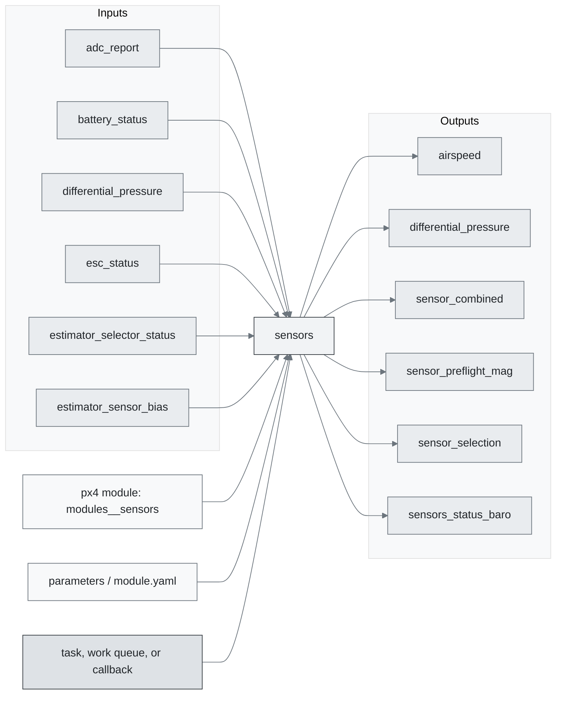
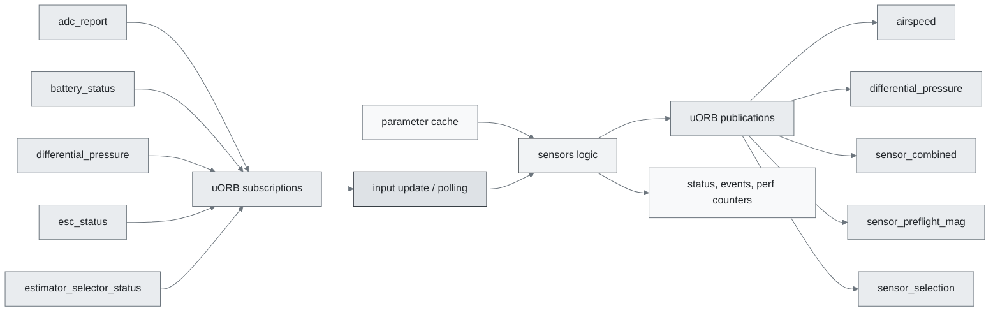
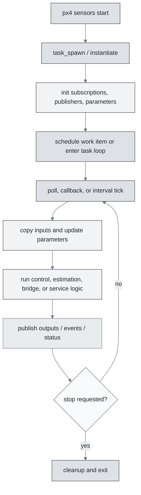
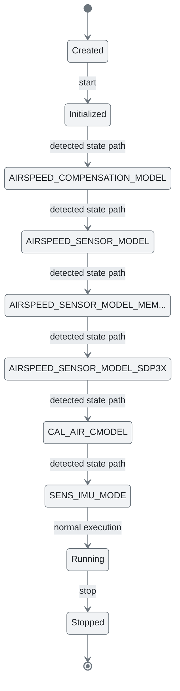
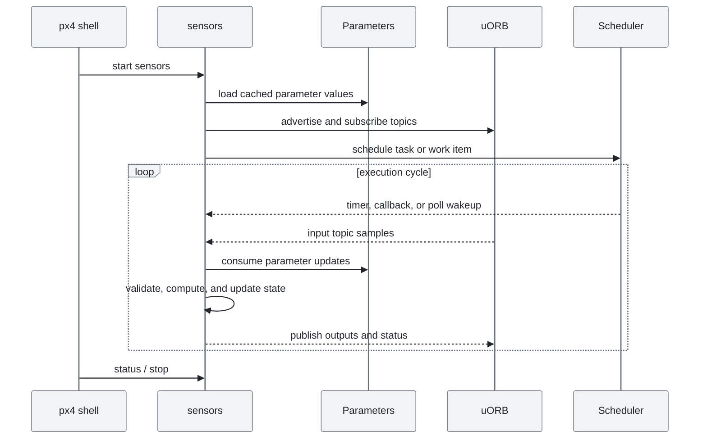

# PX4 Module Architecture: `sensors`

- Source: `src/modules/sensors`
- Build target: `modules__sensors`
- Runtime main: `sensors`
- Build kind: `px4 module`
- Mermaid palette: `mist` grey tone

Architecture notes for the sensors module.

## Architecture Overview

This page is generated from the module source tree and shows the stable architecture surfaces: build entry point, scheduling shape, uORB data interfaces, parameter/configuration surfaces, and C++ types found in the module.

## Build and Entry Points

| Field | Value |
| --- | --- |
| Module path | src/modules/sensors |
| Build kind | px4 module |
| Build target | modules__sensors |
| Runtime main | sensors |
| Stack main | Not specified |
| Module config | module.yaml |
| Detected sources | 14 |
| Detected headers | 15 |
| Detected configs | 18 |

### CMake Dependencies

- `conversion`
- `data_validator`
- `mathlib`
- `sensor_calibration`
- `vehicle_imu`

### Nested Module Targets

- No nested module targets detected.

## Data Flow

### uORB Topics

| Topic | Detected direction |
| --- | --- |
| adc_report | subscribed |
| airspeed | published |
| battery_status | subscribed |
| differential_pressure | subscribed, published |
| distance_sensor | referenced |
| esc_status | subscribed |
| estimator_selector_status | subscribed |
| estimator_sensor_bias | subscribed |
| estimator_status_flags | subscribed |
| magnetometer_bias_estimate | subscribed |
| parameter_update | subscribed |
| pps_capture | subscribed |
| sensor_accel | subscribed |
| sensor_baro | referenced |
| sensor_combined | published |
| sensor_gps | referenced |
| sensor_gyro | subscribed |
| sensor_gyro_fft | subscribed |
| sensor_gyro_fifo | subscribed |
| sensor_mag | subscribed |
| sensor_optical_flow | subscribed |
| sensor_preflight_mag | published |
| sensor_selection | subscribed, published |
| sensors_status | referenced |
| sensors_status_baro | published |
| sensors_status_imu | published |
| sensors_status_mag | published |
| vehicle_acceleration | published |
| vehicle_air_data | subscribed, published |
| vehicle_angular_velocity | published |
| vehicle_attitude | subscribed |
| vehicle_control_mode | subscribed |
| vehicle_gps_position | subscribed, published |
| vehicle_imu | subscribed, published |
| vehicle_imu_status | subscribed, published |
| vehicle_magnetometer | referenced |
| vehicle_optical_flow | published |
| vehicle_optical_flow_vel | published |
| vehicle_thrust_setpoint | subscribed |

## Execution Flow

The common PX4 module lifecycle is command entry, object construction or task spawn, parameter loading, topic setup, scheduled execution, publication, status reporting, and stop/cleanup. Modules that use `ModuleBase`, `ScheduledWorkItem`, polling loops, or bridge callbacks still fit this lifecycle with different scheduling triggers.

## State Machine

### Detected State-Like Symbols

- `AIRSPEED_COMPENSATION_MODEL`
- `AIRSPEED_SENSOR_MODEL`
- `AIRSPEED_SENSOR_MODEL_MEMBRANE`
- `AIRSPEED_SENSOR_MODEL_SDP3X`
- `CAL_AIR_CMODEL`
- `SENS_IMU_MODE`
- `SENS_MAG_MODE`
- `SYS_FAC_CAL_MODE`

## Sequence Diagram

## Class Diagram

```mermaid
%%{init: {"theme":"base","themeVariables":{"primaryColor":"#f1f3f5","secondaryColor":"#e9ecef","tertiaryColor":"#f8f9fa","primaryBorderColor":"#6c757d","primaryTextColor":"#212529","lineColor":"#6c757d","fontFamily":"Inter, Arial, sans-serif"}}}%%
classDiagram
  class Integrator
  Integrator : Integrator.hpp
  class IntegratorConing
  IntegratorConing : Integrator.hpp
  class Integrator
  Integrator <|-- IntegratorConing
  class to
  to : data_validator/DataValidator.cpp
  class to_3
  to_3 : data_validator/DataValidator.hpp
  class DataValidator
  DataValidator : data_validator/DataValidator.hpp
  class DataValidatorGroup
  DataValidatorGroup : data_validator/DataValidatorGroup.hpp
  class to_6
  to_6 : data_validator/DataValidatorGroup.hpp
  class Sensors
  Sensors : sensors.hpp
  class ModuleBase
  ModuleBase <|-- Sensors
  class VehicleAcceleration
  VehicleAcceleration : vehicle_acceleration/VehicleAcceleration.hpp
  class ModuleParams
  ModuleParams <|-- VehicleAcceleration
  class VehicleAirData
  VehicleAirData : vehicle_air_data/VehicleAirData.hpp
  class ModuleParams
  ModuleParams <|-- VehicleAirData
  class VehicleAngularVelocity
  VehicleAngularVelocity : vehicle_angular_velocity/VehicleAngularVelocity.hpp
  class ModuleParams
  ModuleParams <|-- VehicleAngularVelocity
  class PpsTimeSync
  PpsTimeSync : vehicle_gps_position/PpsTimeSync.hpp
  class VehicleGPSPosition
  VehicleGPSPosition : vehicle_gps_position/VehicleGPSPosition.hpp
  class ModuleParams
  ModuleParams <|-- VehicleGPSPosition
  class GpsBlending
  GpsBlending : vehicle_gps_position/gps_blending.hpp
  class GpsBlendingTest
  GpsBlendingTest : vehicle_gps_position/gps_blending_test.cpp
  class VehicleIMU
  VehicleIMU : vehicle_imu/VehicleIMU.hpp
  class ModuleParams
  ModuleParams <|-- VehicleIMU
```

### Detected Classes

| Class | Base | File |
| --- | --- | --- |
| Integrator |  | Integrator.hpp |
| IntegratorConing | Integrator | Integrator.hpp |
| to |  | data_validator/DataValidator.cpp |
| to |  | data_validator/DataValidator.hpp |
| DataValidator |  | data_validator/DataValidator.hpp |
| DataValidatorGroup |  | data_validator/DataValidatorGroup.hpp |
| to |  | data_validator/DataValidatorGroup.hpp |
| Sensors | ModuleBase | sensors.hpp |
| VehicleAcceleration | ModuleParams | vehicle_acceleration/VehicleAcceleration.hpp |
| VehicleAirData | ModuleParams | vehicle_air_data/VehicleAirData.hpp |
| VehicleAngularVelocity | ModuleParams | vehicle_angular_velocity/VehicleAngularVelocity.hpp |
| PpsTimeSync |  | vehicle_gps_position/PpsTimeSync.hpp |
| VehicleGPSPosition | ModuleParams | vehicle_gps_position/VehicleGPSPosition.hpp |
| GpsBlending |  | vehicle_gps_position/gps_blending.hpp |
| GpsBlendingTest |  | vehicle_gps_position/gps_blending_test.cpp |
| VehicleIMU | ModuleParams | vehicle_imu/VehicleIMU.hpp |
| VehicleMagnetometer | ModuleParams | vehicle_magnetometer/VehicleMagnetometer.hpp |
| MagCompensationType |  | vehicle_magnetometer/VehicleMagnetometer.hpp |
| RingBuffer |  | vehicle_optical_flow/RingBuffer.hpp |
| VehicleOpticalFlow | ModuleParams | vehicle_optical_flow/VehicleOpticalFlow.hpp |
| VotedSensorsUpdate |  | voted_sensors_update.h |

### Detected Enums

- `AIRSPEED_COMPENSATION_MODEL`
- `AIRSPEED_SENSOR_MODEL`
- `DynamicNotch`
- `MagCompensationType`
- `Rotation`
- `TemperatureSource`

## Parameters and Configuration

- `SENS_GPS_MASK`
- `SENS_GPS_PRIME`
- `SENS_GPS_TAU`

## Source Map

| File | Kind |
| --- | --- |
| CMakeLists.txt | build |
| Integrator.hpp | header |
| data_validator/CMakeLists.txt | build |
| data_validator/DataValidator.cpp | source |
| data_validator/DataValidator.hpp | header |
| data_validator/DataValidatorGroup.cpp | source |
| data_validator/DataValidatorGroup.hpp | header |
| module.yaml | config |
| sensor_params.yaml | config |
| sensor_params_flow.yaml | config |
| sensor_params_mag.yaml | config |
| sensors.cpp | source |
| sensors.hpp | header |
| vehicle_acceleration/CMakeLists.txt | build |
| vehicle_acceleration/VehicleAcceleration.cpp | source |
| vehicle_acceleration/VehicleAcceleration.hpp | header |
| vehicle_acceleration/imu_accel_parameters.yaml | config |
| vehicle_air_data/CMakeLists.txt | build |
| vehicle_air_data/VehicleAirData.cpp | source |
| vehicle_air_data/VehicleAirData.hpp | header |
| vehicle_air_data/params.yaml | config |
| vehicle_angular_velocity/CMakeLists.txt | build |
| vehicle_angular_velocity/VehicleAngularVelocity.cpp | source |
| vehicle_angular_velocity/VehicleAngularVelocity.hpp | header |
| vehicle_angular_velocity/imu_gyro_parameters.yaml | config |
| vehicle_gps_position/CMakeLists.txt | build |
| vehicle_gps_position/PpsTimeSync.cpp | source |
| vehicle_gps_position/PpsTimeSync.hpp | header |
| vehicle_gps_position/VehicleGPSPosition.cpp | source |
| vehicle_gps_position/VehicleGPSPosition.hpp | header |
| vehicle_gps_position/gps_blending.cpp | source |
| vehicle_gps_position/gps_blending.hpp | header |
| vehicle_gps_position/gps_blending_test.cpp | source |
| vehicle_gps_position/module.yaml | config |
| vehicle_imu/CMakeLists.txt | build |
| vehicle_imu/VehicleIMU.cpp | source |
| vehicle_imu/VehicleIMU.hpp | header |
| vehicle_imu/imu_parameters.yaml | config |
| vehicle_magnetometer/CMakeLists.txt | build |
| vehicle_magnetometer/VehicleMagnetometer.cpp | source |
| ... 7 more files | omitted |

## Review Notes

- The diagrams are generated from static source inventory and should be used as a study map, not as a formal proof of every runtime branch.
- Topic direction is inferred from nearby source context such as `Subscription`, `Publication`, `orb_subscribe`, and `publish` usage.
- When a module has no explicit state enum, the state diagram shows the standard PX4 module lifecycle.
