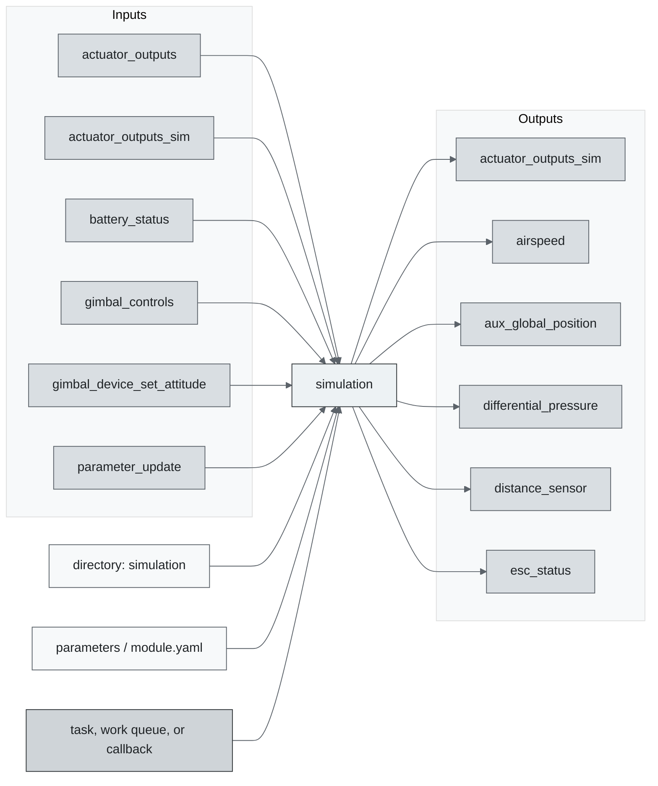
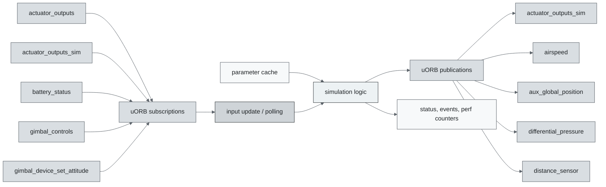
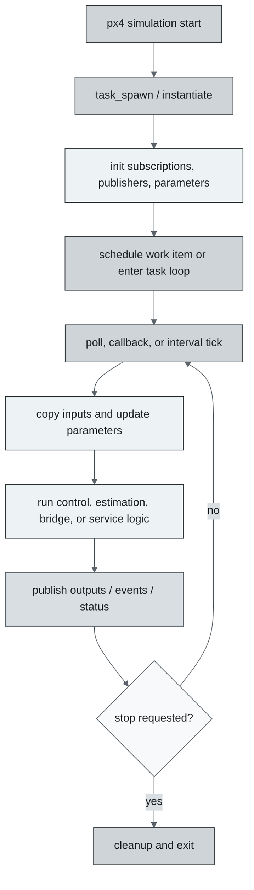
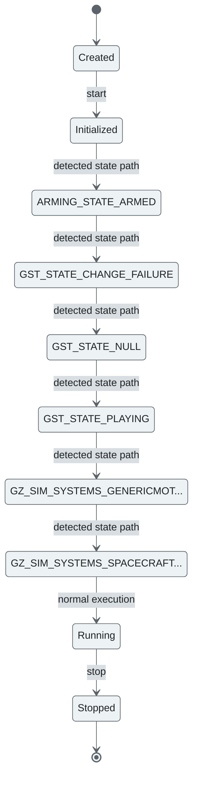
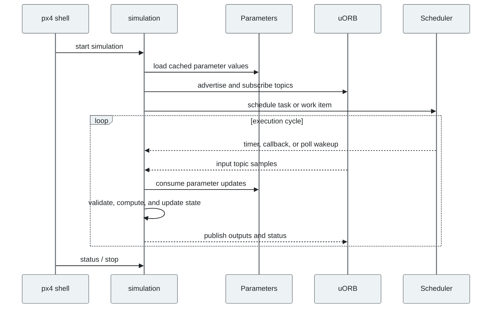

# PX4 Module Architecture: `simulation`

- Source: `src/modules/simulation`
- Build target: `simulation`
- Runtime main: `simulation`
- Build kind: `directory`
- Mermaid palette: `graphite` grey tone

Source-derived architecture notes for this PX4 module directory.

## Architecture Overview

This page is generated from the module source tree and shows the stable architecture surfaces: build entry point, scheduling shape, uORB data interfaces, parameter/configuration surfaces, and C++ types found in the module.

## Build and Entry Points

| Field | Value |
| --- | --- |
| Module path | src/modules/simulation |
| Build kind | directory |
| Build target | simulation |
| Runtime main | simulation |
| Stack main | Not specified |
| Module config | Not specified |
| Detected sources | 31 |
| Detected headers | 31 |
| Detected configs | 35 |

### CMake Dependencies

- No explicit CMake dependencies detected.

### Nested Module Targets

- `battery_simulator`
- `gz_bridge`
- `pwm_out_sim`
- `sensor_agp_sim`
- `sensor_airspeed_sim`
- `sensor_baro_sim`
- `sensor_gps_sim`
- `sensor_mag_sim`
- `simulator_mavlink`
- `simulator_sih`
- `system_power_simulator`

## Data Flow

### uORB Topics

| Topic | Detected direction |
| --- | --- |
| actuator_outputs | subscribed |
| actuator_outputs_sim | subscribed, published |
| airspeed | published |
| aux_global_position | published |
| battery_status | subscribed |
| differential_pressure | published |
| distance_sensor | published |
| esc_report | referenced |
| esc_status | published |
| fiducial_marker_pos_report | published |
| fiducial_marker_yaw_report | published |
| gimbal_controls | subscribed |
| gimbal_device_attitude_status | published |
| gimbal_device_information | published |
| gimbal_device_set_attitude | subscribed |
| input_rc | published |
| irlock_report | published |
| landing_target_pose | published |
| manual_control_setpoint | referenced |
| obstacle_distance | published |
| parameter_update | subscribed |
| ranging_beacon | published |
| rpm | published |
| sensor_gps | published |
| sensor_optical_flow | published |
| system_power | published |
| target_gnss | published |
| vehicle_angular_velocity | referenced |
| vehicle_angular_velocity_groundtruth | published |
| vehicle_attitude | subscribed |
| vehicle_attitude_groundtruth | subscribed, published |
| vehicle_command | subscribed |
| vehicle_command_ack | published |
| vehicle_global_position | referenced |
| vehicle_global_position_groundtruth | subscribed, published |
| vehicle_local_position | subscribed |
| vehicle_local_position_groundtruth | subscribed, published |
| vehicle_mocap_odometry | published |
| vehicle_odometry | referenced |
| vehicle_status | subscribed |
| vehicle_visual_odometry | published |
| wheel_encoders | published |

## Execution Flow

The common PX4 module lifecycle is command entry, object construction or task spawn, parameter loading, topic setup, scheduled execution, publication, status reporting, and stop/cleanup. Modules that use `ModuleBase`, `ScheduledWorkItem`, polling loops, or bridge callbacks still fit this lifecycle with different scheduling triggers.

## State Machine

### Detected State-Like Symbols

- `ARMING_STATE_ARMED`
- `GST_STATE_CHANGE_FAILURE`
- `GST_STATE_NULL`
- `GST_STATE_PLAYING`
- `GZ_SIM_SYSTEMS_GENERICMOTORMODEL_HPP_`
- `GZ_SIM_SYSTEMS_SPACECRAFTTHRUSTERMODEL_HH_`
- `HIL_STATE_QUATERNION`
- `MAVLINK_MSG_ID_HIL_STATE_QUATERNION`
- `MNT_MODE_OUT`
- `PWM_SIM_DISARMED_MAGIC`
- `PWM_SIM_FAILSAFE_MAGIC`
- `PX4_GZ_MODEL_NAME`
- `PX4_MODEL`
- `PX4_SIM_MODEL`

## Sequence Diagram

## Class Diagram

```mermaid
%%{init: {"theme":"base","themeVariables":{"primaryColor":"#edf2f4","secondaryColor":"#d9dee2","tertiaryColor":"#f7f9fa","primaryBorderColor":"#5c636a","primaryTextColor":"#1f2326","lineColor":"#5c636a","fontFamily":"Inter, Arial, sans-serif"}}}%%
classDiagram
  class BatterySimulator
  BatterySimulator : battery_simulator/BatterySimulator.hpp
  class ModuleBase
  ModuleBase <|-- BatterySimulator
  class GZBridge
  GZBridge : gz_bridge/GZBridge.hpp
  class ModuleBase
  ModuleBase <|-- GZBridge
  class GZGimbal
  GZGimbal : gz_bridge/GZGimbal.hpp
  class ScheduledWorkItem
  ScheduledWorkItem <|-- GZGimbal
  class GZBridge_3
  GZBridge_3 : gz_bridge/GZGimbal.hpp
  class GZMixingInterfaceESC
  GZMixingInterfaceESC : gz_bridge/GZMixingInterfaceESC.hpp
  class OutputModuleInterface
  OutputModuleInterface <|-- GZMixingInterfaceESC
  class GZBridge_5
  GZBridge_5 : gz_bridge/GZMixingInterfaceESC.hpp
  class GZMixingInterfaceServo
  GZMixingInterfaceServo : gz_bridge/GZMixingInterfaceServo.hpp
  class OutputModuleInterface
  OutputModuleInterface <|-- GZMixingInterfaceServo
  class GZBridge_7
  GZBridge_7 : gz_bridge/GZMixingInterfaceServo.hpp
  class GZMixingInterfaceWheel
  GZMixingInterfaceWheel : gz_bridge/GZMixingInterfaceWheel.hpp
  class OutputModuleInterface
  OutputModuleInterface <|-- GZMixingInterfaceWheel
  class GZBridge_9
  GZBridge_9 : gz_bridge/GZMixingInterfaceWheel.hpp
  class AirSpeed
  AirSpeed : gz_plugins/airspeed/AirSpeed.hpp
  class System
  System <|-- AirSpeed
  class gz
  gz : gz_plugins/buoyancy/BuoyancySystem.cpp
  class BuoyancyPrivate
  BuoyancyPrivate : gz_plugins/buoyancy/BuoyancySystem.hpp
  class Buoyancy
  Buoyancy : gz_plugins/buoyancy/BuoyancySystem.hpp
  class System
  System <|-- Buoyancy
  class can
  can : gz_plugins/generic_motor/GenericMotorModel.cpp
  class FirstOrderFilter
  FirstOrderFilter : gz_plugins/generic_motor/GenericMotorModel.cpp
```

### Detected Classes

| Class | Base | File |
| --- | --- | --- |
| BatterySimulator | ModuleBase | battery_simulator/BatterySimulator.hpp |
| GZBridge | ModuleBase | gz_bridge/GZBridge.hpp |
| GZGimbal | ScheduledWorkItem | gz_bridge/GZGimbal.hpp |
| GZBridge |  | gz_bridge/GZGimbal.hpp |
| GZMixingInterfaceESC | OutputModuleInterface | gz_bridge/GZMixingInterfaceESC.hpp |
| GZBridge |  | gz_bridge/GZMixingInterfaceESC.hpp |
| GZMixingInterfaceServo | OutputModuleInterface | gz_bridge/GZMixingInterfaceServo.hpp |
| GZBridge |  | gz_bridge/GZMixingInterfaceServo.hpp |
| GZMixingInterfaceWheel | OutputModuleInterface | gz_bridge/GZMixingInterfaceWheel.hpp |
| GZBridge |  | gz_bridge/GZMixingInterfaceWheel.hpp |
| AirSpeed | System | gz_plugins/airspeed/AirSpeed.hpp |
| gz |  | gz_plugins/buoyancy/BuoyancySystem.cpp |
| BuoyancyPrivate |  | gz_plugins/buoyancy/BuoyancySystem.hpp |
| Buoyancy | System | gz_plugins/buoyancy/BuoyancySystem.hpp |
| can |  | gz_plugins/generic_motor/GenericMotorModel.cpp |
| FirstOrderFilter |  | gz_plugins/generic_motor/GenericMotorModel.cpp |
| MotorType |  | gz_plugins/generic_motor/GenericMotorModel.cpp |
| ControlMethod |  | gz_plugins/generic_motor/GenericMotorModel.cpp |
| gz |  | gz_plugins/generic_motor/GenericMotorModel.cpp |
| GenericMotorModelPrivate |  | gz_plugins/generic_motor/GenericMotorModel.hpp |
| GenericMotorModel | System | gz_plugins/generic_motor/GenericMotorModel.hpp |
| CameraStream |  | gz_plugins/gstreamer/GstCameraSystem.hpp |
| GstCameraSystem | System | gz_plugins/gstreamer/GstCameraSystem.hpp |
| MotorFailureSystem | System | gz_plugins/motor_failure/MotorFailureSystem.hpp |
| ... 29 more |  |  |

### Detected Enums

- `BuoyancyType`
- `ControlMethod`
- `FailureMode`
- `InternetProtocol`
- `MotorType`
- `SensorSource`
- `TargetAbsoluteSensorCapability`
- `VehicleType`
- `type`

## Parameters and Configuration

- No parameters detected.

## Source Map

| File | Kind |
| --- | --- |
| battery_simulator/BatterySimulator.cpp | source |
| battery_simulator/BatterySimulator.hpp | header |
| battery_simulator/CMakeLists.txt | build |
| battery_simulator/battery_simulator_params.yaml | config |
| gz_bridge/CMakeLists.txt | build |
| gz_bridge/GZBridge.cpp | source |
| gz_bridge/GZBridge.hpp | header |
| gz_bridge/GZGimbal.cpp | source |
| gz_bridge/GZGimbal.hpp | header |
| gz_bridge/GZMixingInterfaceESC.cpp | source |
| gz_bridge/GZMixingInterfaceESC.hpp | header |
| gz_bridge/GZMixingInterfaceServo.cpp | source |
| gz_bridge/GZMixingInterfaceServo.hpp | header |
| gz_bridge/GZMixingInterfaceWheel.cpp | source |
| gz_bridge/GZMixingInterfaceWheel.hpp | header |
| gz_bridge/module.yaml | config |
| gz_bridge/parameters.yaml | config |
| gz_msgs/CMakeLists.txt | build |
| gz_plugins/CMakeLists.txt | build |
| gz_plugins/airspeed/AirSpeed.cpp | source |
| gz_plugins/airspeed/AirSpeed.hpp | header |
| gz_plugins/airspeed/CMakeLists.txt | build |
| gz_plugins/buoyancy/BuoyancySystem.cpp | source |
| gz_plugins/buoyancy/BuoyancySystem.hpp | header |
| gz_plugins/buoyancy/CMakeLists.txt | build |
| gz_plugins/generic_motor/CMakeLists.txt | build |
| gz_plugins/generic_motor/GenericMotorModel.cpp | source |
| gz_plugins/generic_motor/GenericMotorModel.hpp | header |
| gz_plugins/gstreamer/CMakeLists.txt | build |
| gz_plugins/gstreamer/GstCameraSystem.cpp | source |
| gz_plugins/gstreamer/GstCameraSystem.hpp | header |
| gz_plugins/gstreamer/README.md | readme |
| gz_plugins/motor_failure/CMakeLists.txt | build |
| gz_plugins/motor_failure/MotorFailureSystem.cpp | source |
| gz_plugins/motor_failure/MotorFailureSystem.hpp | header |
| gz_plugins/motor_failure/README.md | readme |
| gz_plugins/moving_platform_controller/CMakeLists.txt | build |
| gz_plugins/moving_platform_controller/MovingPlatformController.cpp | source |
| gz_plugins/moving_platform_controller/MovingPlatformController.hpp | header |
| gz_plugins/moving_platform_controller/README.md | readme |
| ... 63 more files | omitted |

## Review Notes

- The diagrams are generated from static source inventory and should be used as a study map, not as a formal proof of every runtime branch.
- Topic direction is inferred from nearby source context such as `Subscription`, `Publication`, `orb_subscribe`, and `publish` usage.
- When a module has no explicit state enum, the state diagram shows the standard PX4 module lifecycle.
