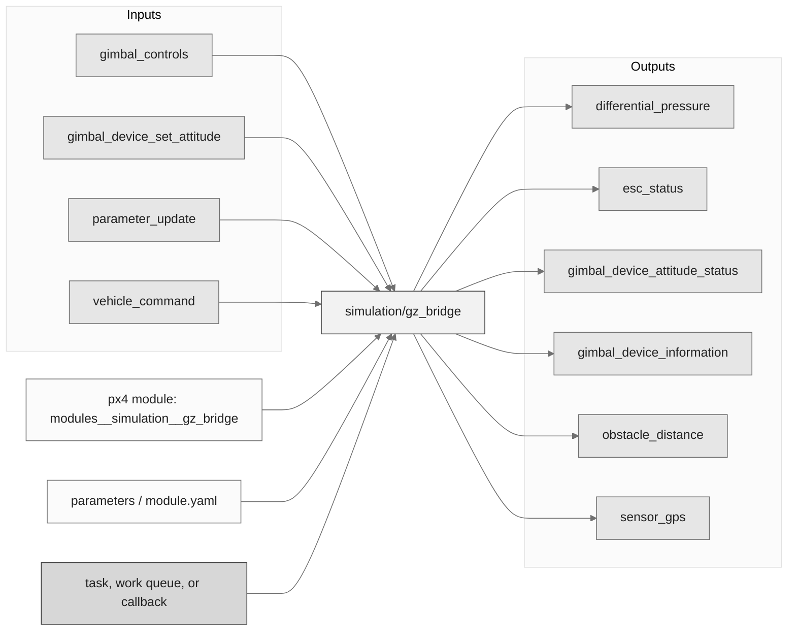
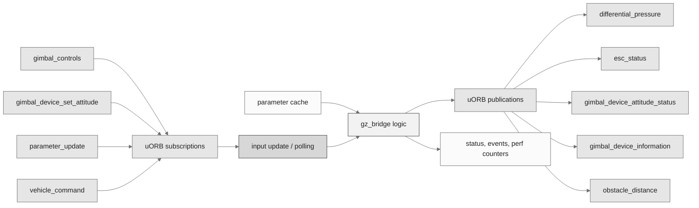
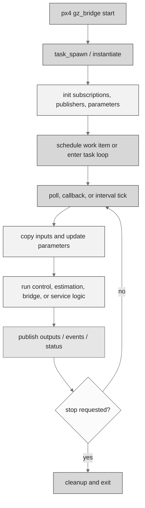
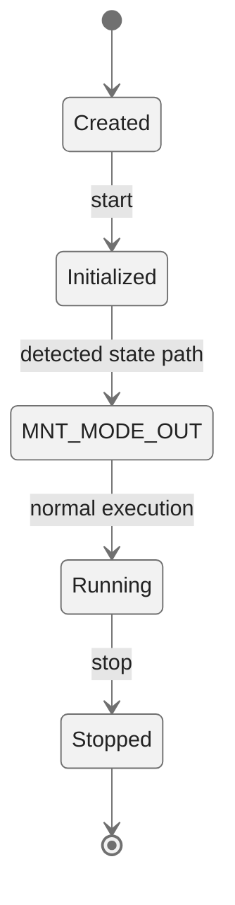
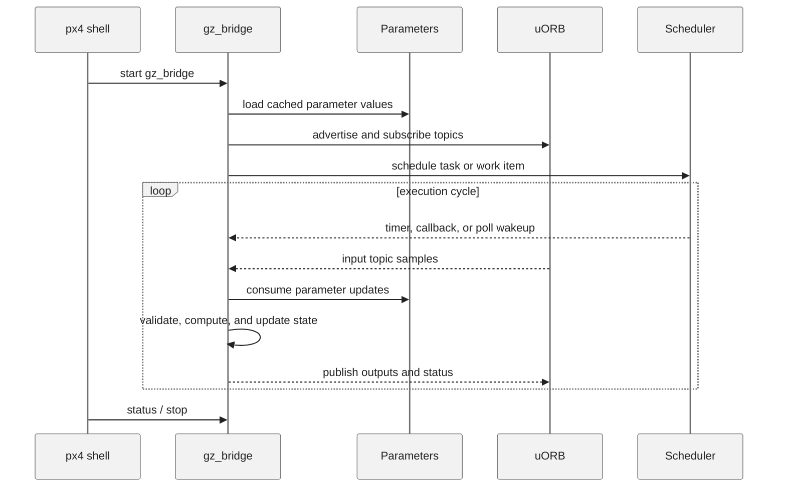
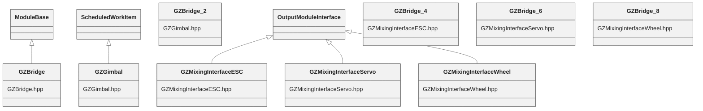

# PX4 Module Architecture: `simulation/gz_bridge`

- Source: `src/modules/simulation/gz_bridge`
- Build target: `modules__simulation__gz_bridge`
- Runtime main: `gz_bridge`
- Build kind: `px4 module`
- Mermaid palette: `ash` grey tone

Architecture notes for the SIM_GZ module.

## Architecture Overview

This page is generated from the module source tree and shows the stable architecture surfaces: build entry point, scheduling shape, uORB data interfaces, parameter/configuration surfaces, and C++ types found in the module.

## Build and Entry Points

| Field | Value |
| --- | --- |
| Module path | src/modules/simulation/gz_bridge |
| Build kind | px4 module |
| Build target | modules__simulation__gz_bridge |
| Runtime main | gz_bridge |
| Stack main | Not specified |
| Module config | module.yaml |
| Detected sources | 5 |
| Detected headers | 5 |
| Detected configs | 3 |

### CMake Dependencies

- `drivers_accelerometer`
- `drivers_gyroscope`
- `drivers_magnetometer`
- `drivers_rangefinder`
- `drivers_barometer`
- `mixer_module`
- `px4_work_queue`
- `${GZ_TRANSPORT_TARGET}`

### Nested Module Targets

- No nested module targets detected.

## Data Flow

### uORB Topics

| Topic | Detected direction |
| --- | --- |
| differential_pressure | published |
| esc_status | published |
| gimbal_controls | subscribed |
| gimbal_device_attitude_status | published |
| gimbal_device_information | published |
| gimbal_device_set_attitude | subscribed |
| obstacle_distance | published |
| parameter_update | subscribed |
| sensor_gps | published |
| sensor_optical_flow | published |
| vehicle_angular_velocity | referenced |
| vehicle_angular_velocity_groundtruth | published |
| vehicle_attitude | referenced |
| vehicle_attitude_groundtruth | published |
| vehicle_command | subscribed |
| vehicle_command_ack | published |
| vehicle_global_position | referenced |
| vehicle_global_position_groundtruth | published |
| vehicle_local_position | referenced |
| vehicle_local_position_groundtruth | published |
| vehicle_odometry | referenced |
| vehicle_visual_odometry | published |
| wheel_encoders | published |

## Execution Flow

The common PX4 module lifecycle is command entry, object construction or task spawn, parameter loading, topic setup, scheduled execution, publication, status reporting, and stop/cleanup. Modules that use `ModuleBase`, `ScheduledWorkItem`, polling loops, or bridge callbacks still fit this lifecycle with different scheduling triggers.

## State Machine

### Detected State-Like Symbols

- `MNT_MODE_OUT`

## Sequence Diagram

## Class Diagram

### Detected Classes

| Class | Base | File |
| --- | --- | --- |
| GZBridge | ModuleBase | GZBridge.hpp |
| GZGimbal | ScheduledWorkItem | GZGimbal.hpp |
| GZBridge |  | GZGimbal.hpp |
| GZMixingInterfaceESC | OutputModuleInterface | GZMixingInterfaceESC.hpp |
| GZBridge |  | GZMixingInterfaceESC.hpp |
| GZMixingInterfaceServo | OutputModuleInterface | GZMixingInterfaceServo.hpp |
| GZBridge |  | GZMixingInterfaceServo.hpp |
| GZMixingInterfaceWheel | OutputModuleInterface | GZMixingInterfaceWheel.hpp |
| GZBridge |  | GZMixingInterfaceWheel.hpp |

### Detected Enums

- No enums detected.

## Parameters and Configuration

- No parameters detected.

## Source Map

| File | Kind |
| --- | --- |
| CMakeLists.txt | build |
| GZBridge.cpp | source |
| GZBridge.hpp | header |
| GZGimbal.cpp | source |
| GZGimbal.hpp | header |
| GZMixingInterfaceESC.cpp | source |
| GZMixingInterfaceESC.hpp | header |
| GZMixingInterfaceServo.cpp | source |
| GZMixingInterfaceServo.hpp | header |
| GZMixingInterfaceWheel.cpp | source |
| GZMixingInterfaceWheel.hpp | header |
| module.yaml | config |
| parameters.yaml | config |

## Review Notes

- The diagrams are generated from static source inventory and should be used as a study map, not as a formal proof of every runtime branch.
- Topic direction is inferred from nearby source context such as `Subscription`, `Publication`, `orb_subscribe`, and `publish` usage.
- When a module has no explicit state enum, the state diagram shows the standard PX4 module lifecycle.
