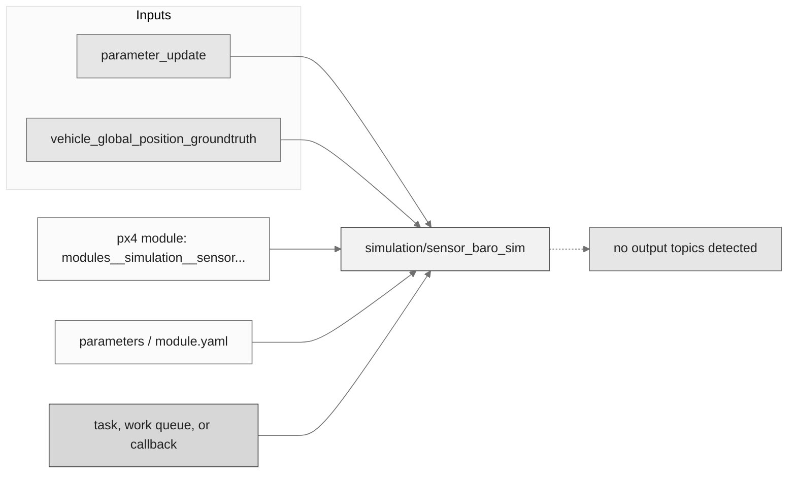
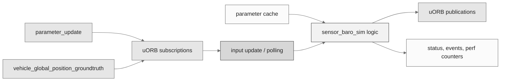
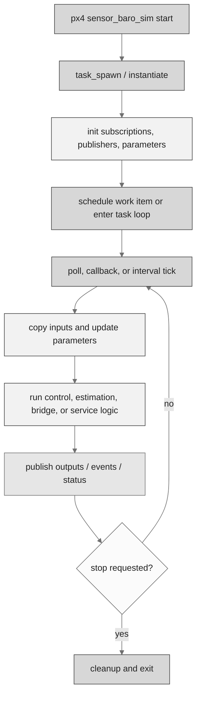
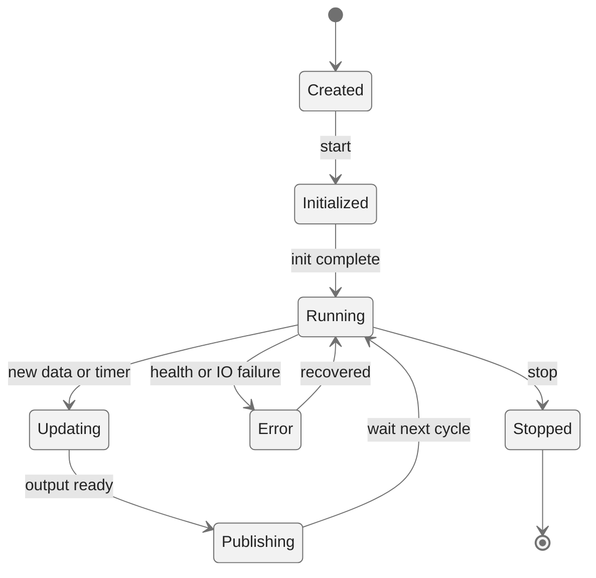
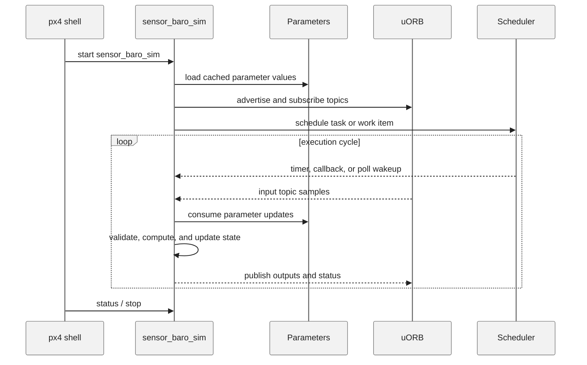
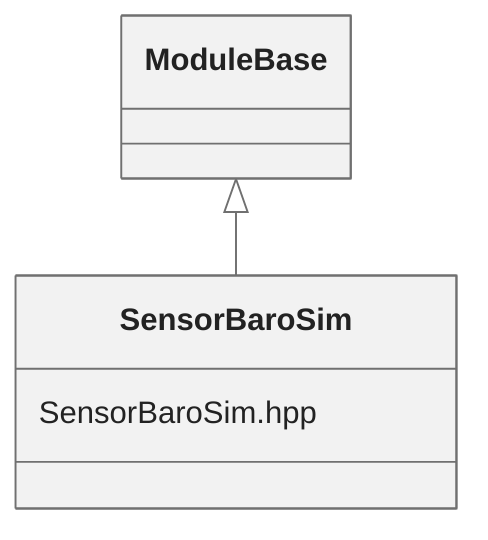

# PX4 Module Architecture: `simulation/sensor_baro_sim`

- Source: `src/modules/simulation/sensor_baro_sim`
- Build target: `modules__simulation__sensor_baro_sim`
- Runtime main: `sensor_baro_sim`
- Build kind: `px4 module`
- Mermaid palette: `ash` grey tone

Source-derived architecture notes for this PX4 module directory.

## Description of Module

Simulates barometer data for simulation workflows.

### Primary Responsibilities

- Generate simulator-facing or simulated sensor/actuator data for non-flight-hardware runs.
- Publish or condition sensor topics consumed by estimators and controllers.
- Consume runtime inputs from uORB topics such as `parameter_update`, `vehicle_global_position_groundtruth`.
- Do not publish directly detected uORB outputs from this module directory.
- Use module configuration from `parameters.yaml`.
- Implement the main behavior in classes such as `SensorBaroSim`.

### Runtime Behavior

- Runs work-queue callbacks on queue configurations such as `hp_default`.
- Uses explicit work-item scheduling through immediate, delayed, or interval scheduling calls.

## Background Theory

The barometer simulator uses the standard atmosphere relationship between altitude and pressure, then adds noise/bias.

```text
p = p0 * (1 - L*h/T0)^(g*M/(R*L))
h_est = T0/L * (1 - (p/p0)^(R*L/(g*M)))
measurement = p + bias + noise
```

These equations are the study-level form of the algorithm. The implementation applies PX4-specific saturation, validity checks, parameter updates, and frame conventions around these core relationships.

### Main Interfaces

| Area | Details |
| --- | --- |
| Primary inputs | `parameter_update`, `vehicle_global_position_groundtruth` |
| Primary outputs | none detected |
| Referenced topics | `parameter_update`, `vehicle_global_position`, `vehicle_global_position_groundtruth` |
| Parameters/config | parameters.yaml |
| Key classes | `SensorBaroSim` |

### Files

| File | Why it matters |
| --- | --- |
| SensorBaroSim.cpp | Entry point, start command, or module lifecycle code |
| CMakeLists.txt | Build, parameter, or module configuration |
| parameters.yaml | Build, parameter, or module configuration |
| SensorBaroSim.hpp | Defines `SensorBaroSim` class |

## Architecture Overview

This page is generated from the module source tree and shows the stable architecture surfaces: build entry point, scheduling shape, uORB data interfaces, parameter/configuration surfaces, and C++ types found in the module.



## Build and Entry Points

| Field | Value |
| --- | --- |
| Module path | src/modules/simulation/sensor_baro_sim |
| Build kind | px4 module |
| Build target | modules__simulation__sensor_baro_sim |
| Runtime main | sensor_baro_sim |
| Stack main | Not specified |
| Module config | parameters.yaml |
| Detected sources | 1 |
| Detected headers | 1 |
| Detected configs | 2 |

### CMake Dependencies

- `drivers_barometer`
- `geo`
- `px4_work_queue`

### Nested Module Targets

- No nested module targets detected.

## Data Flow



### uORB Topics

| Topic | Detected direction |
| --- | --- |
| parameter_update | subscribed |
| vehicle_global_position | referenced |
| vehicle_global_position_groundtruth | subscribed |

## Execution Flow



The common PX4 module lifecycle is command entry, object construction or task spawn, parameter loading, topic setup, scheduled execution, publication, status reporting, and stop/cleanup. Modules that use `ModuleBase`, `ScheduledWorkItem`, polling loops, or bridge callbacks still fit this lifecycle with different scheduling triggers.

## State Machine



### Detected State-Like Symbols

- No state-like symbols detected.

## Sequence Diagram



## Class Diagram



### Detected Classes

| Class | Base | File |
| --- | --- | --- |
| SensorBaroSim | ModuleBase | SensorBaroSim.hpp |

### Detected Enums

- No enums detected.

## Parameters and Configuration

- No parameters detected.

## Source Map

| File | Kind |
| --- | --- |
| CMakeLists.txt | build |
| SensorBaroSim.cpp | source |
| SensorBaroSim.hpp | header |
| parameters.yaml | config |

## Review Notes

- The diagrams are generated from static source inventory and should be used as a study map, not as a formal proof of every runtime branch.
- Topic direction is inferred from nearby source context such as `Subscription`, `Publication`, `orb_subscribe`, and `publish` usage.
- When a module has no explicit state enum, the state diagram shows the standard PX4 module lifecycle.
