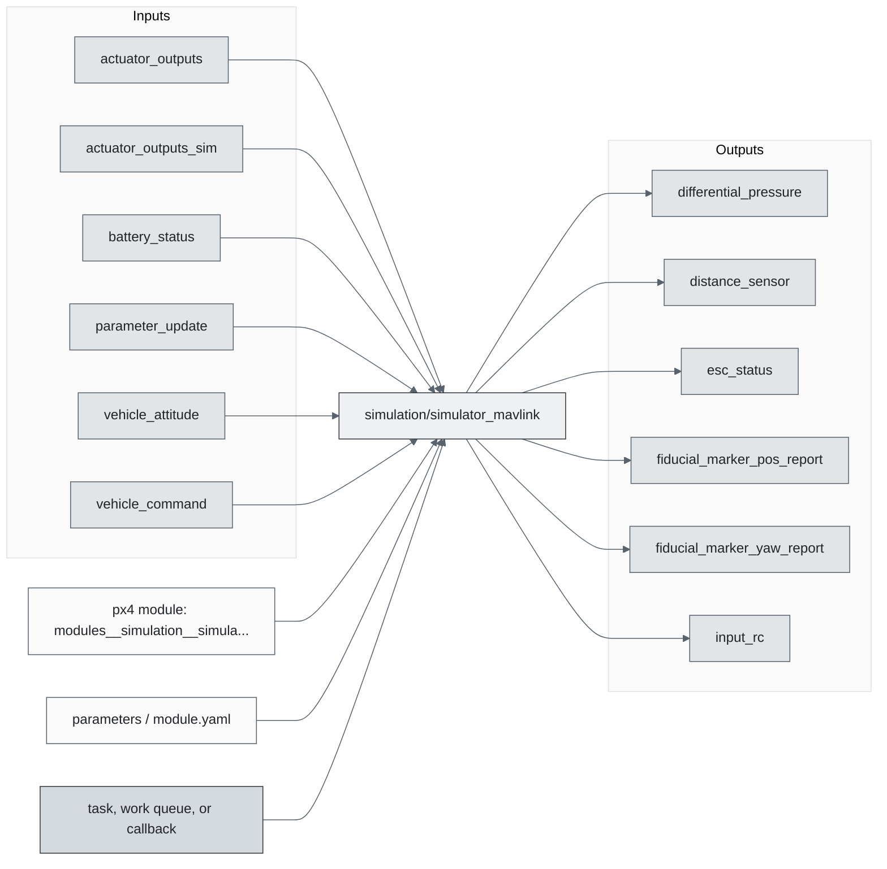
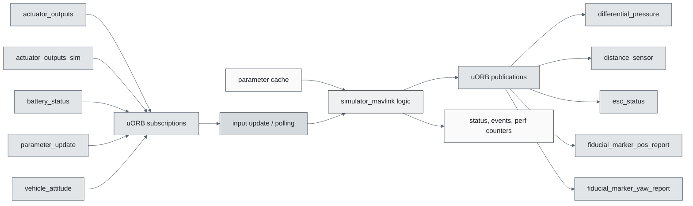
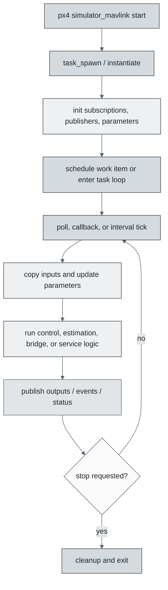
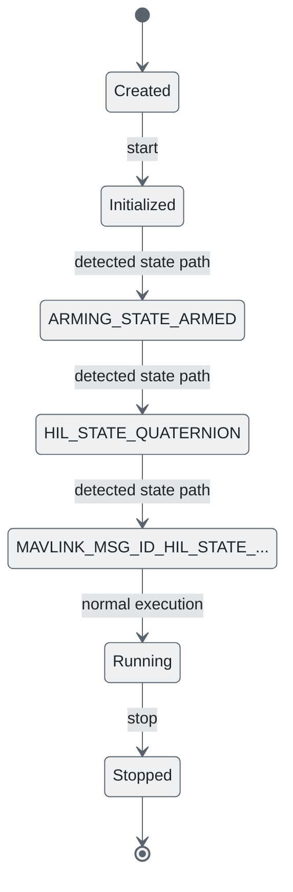
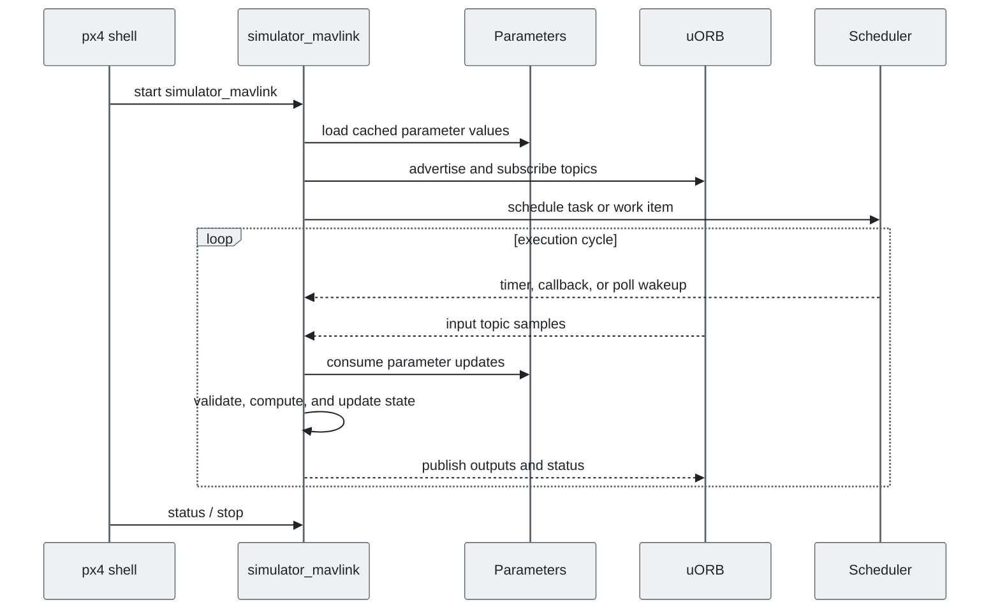
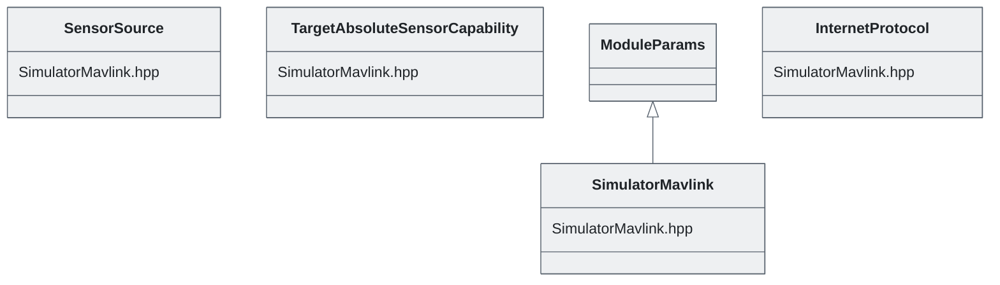

# PX4 Module Architecture: `simulation/simulator_mavlink`

- Source: `src/modules/simulation/simulator_mavlink`
- Build target: `modules__simulation__simulator_mavlink`
- Runtime main: `simulator_mavlink`
- Build kind: `px4 module`
- Mermaid palette: `slate` grey tone

Source-derived architecture notes for this PX4 module directory.

## Description of Module

Connects PX4 to a MAVLink-based simulator backend.

### Primary Responsibilities

- Generate simulator-facing or simulated sensor/actuator data for non-flight-hardware runs.
- Translate between PX4 uORB data and an external transport or companion-computer interface.
- Consume runtime inputs from uORB topics such as `actuator_outputs`, `actuator_outputs_sim`, `battery_status`, `parameter_update`, `vehicle_attitude`, `vehicle_command`, `vehicle_local_position`, `vehicle_status`.
- Publish outputs or status topics such as `differential_pressure`, `distance_sensor`, `esc_status`, `fiducial_marker_pos_report`, `fiducial_marker_yaw_report`, `input_rc`, `irlock_report`, `landing_target_pose`, ... 11 more.
- Implement the main behavior in classes such as `SensorSource`, `TargetAbsoluteSensorCapability`, `SimulatorMavlink`, `InternetProtocol`.

### Runtime Behavior

- Creates a dedicated PX4 task/thread with `px4_task_spawn_cmd()`.
- Uses a `run()` loop style module body for repeated execution.
- Waits on file descriptors or uORB subscriptions with `px4_poll()`.
- Creates an additional pthread helper context.

## Background Theory

No dedicated mathematical model was identified in the generated source scan. This module is best understood through its PX4 state handling, uORB message flow, scheduling, and configuration surfaces described below.

### Main Interfaces

| Area | Details |
| --- | --- |
| Primary inputs | `actuator_outputs`, `actuator_outputs_sim`, `battery_status`, `parameter_update`, `vehicle_attitude`, `vehicle_command`, `vehicle_local_position`, `vehicle_status` |
| Primary outputs | `differential_pressure`, `distance_sensor`, `esc_status`, `fiducial_marker_pos_report`, `fiducial_marker_yaw_report`, `input_rc`, `irlock_report`, `landing_target_pose`, `rpm`, `sensor_gps`, ... 9 more |
| Referenced topics | `actuator_outputs`, `actuator_outputs_sim`, `battery_status`, `differential_pressure`, `distance_sensor`, `esc_report`, `esc_status`, `fiducial_marker_pos_report`, `fiducial_marker_yaw_report`, `input_rc`, ... 22 more |
| Parameters/config | none detected |
| Key classes | `SensorSource`, `TargetAbsoluteSensorCapability`, `SimulatorMavlink`, `InternetProtocol` |

### Files

| File | Why it matters |
| --- | --- |
| SimulatorMavlink.cpp | Entry point, start command, or module lifecycle code |
| CMakeLists.txt | Build, parameter, or module configuration |
| SimulatorMavlink.hpp | Defines `SensorSource` class |

## Architecture Overview

This page is generated from the module source tree and shows the stable architecture surfaces: build entry point, scheduling shape, uORB data interfaces, parameter/configuration surfaces, and C++ types found in the module.

## Build and Entry Points

| Field | Value |
| --- | --- |
| Module path | src/modules/simulation/simulator_mavlink |
| Build kind | px4 module |
| Build target | modules__simulation__simulator_mavlink |
| Runtime main | simulator_mavlink |
| Stack main | Not specified |
| Module config | Not specified |
| Detected sources | 1 |
| Detected headers | 1 |
| Detected configs | 1 |

### CMake Dependencies

- `mavlink_c_generate`
- `conversion`
- `geo`
- `drivers_accelerometer`
- `drivers_barometer`
- `drivers_gyroscope`
- `drivers_magnetometer`

### Nested Module Targets

- No nested module targets detected.

## Data Flow

### uORB Topics

| Topic | Detected direction |
| --- | --- |
| actuator_outputs | subscribed |
| actuator_outputs_sim | subscribed |
| battery_status | subscribed |
| differential_pressure | published |
| distance_sensor | published |
| esc_report | referenced |
| esc_status | published |
| fiducial_marker_pos_report | published |
| fiducial_marker_yaw_report | published |
| input_rc | published |
| irlock_report | published |
| landing_target_pose | published |
| manual_control_setpoint | referenced |
| parameter_update | subscribed |
| rpm | published |
| sensor_gps | published |
| sensor_optical_flow | published |
| target_gnss | published |
| vehicle_angular_velocity | referenced |
| vehicle_angular_velocity_groundtruth | published |
| vehicle_attitude | subscribed |
| vehicle_attitude_groundtruth | published |
| vehicle_command | subscribed |
| vehicle_command_ack | published |
| vehicle_global_position | referenced |
| vehicle_global_position_groundtruth | published |
| vehicle_local_position | subscribed |
| vehicle_local_position_groundtruth | published |
| vehicle_mocap_odometry | published |
| vehicle_odometry | referenced |
| vehicle_status | subscribed |
| vehicle_visual_odometry | published |

## Execution Flow

The common PX4 module lifecycle is command entry, object construction or task spawn, parameter loading, topic setup, scheduled execution, publication, status reporting, and stop/cleanup. Modules that use `ModuleBase`, `ScheduledWorkItem`, polling loops, or bridge callbacks still fit this lifecycle with different scheduling triggers.

## State Machine

### Detected State-Like Symbols

- `ARMING_STATE_ARMED`
- `HIL_STATE_QUATERNION`
- `MAVLINK_MSG_ID_HIL_STATE_QUATERNION`

## Sequence Diagram

## Class Diagram

### Detected Classes

| Class | Base | File |
| --- | --- | --- |
| SensorSource |  | SimulatorMavlink.hpp |
| TargetAbsoluteSensorCapability |  | SimulatorMavlink.hpp |
| SimulatorMavlink | ModuleParams | SimulatorMavlink.hpp |
| InternetProtocol |  | SimulatorMavlink.hpp |

### Detected Enums

- `InternetProtocol`
- `SensorSource`
- `TargetAbsoluteSensorCapability`
- `type`

## Parameters and Configuration

- No parameters detected.

## Source Map

| File | Kind |
| --- | --- |
| CMakeLists.txt | build |
| SimulatorMavlink.cpp | source |
| SimulatorMavlink.hpp | header |

## Review Notes

- The diagrams are generated from static source inventory and should be used as a study map, not as a formal proof of every runtime branch.
- Topic direction is inferred from nearby source context such as `Subscription`, `Publication`, `orb_subscribe`, and `publish` usage.
- When a module has no explicit state enum, the state diagram shows the standard PX4 module lifecycle.
