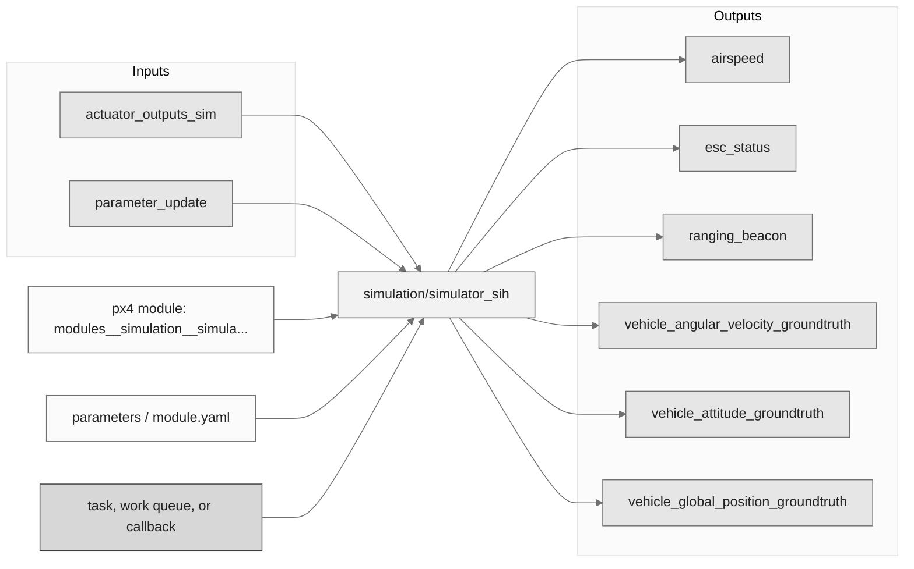
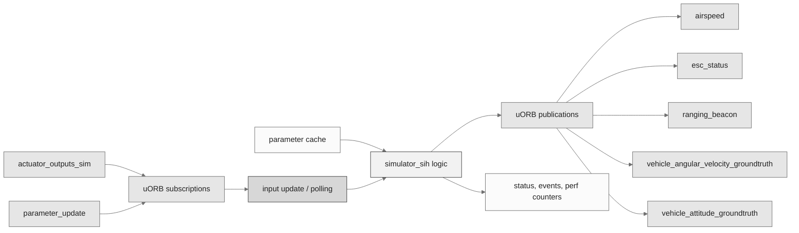
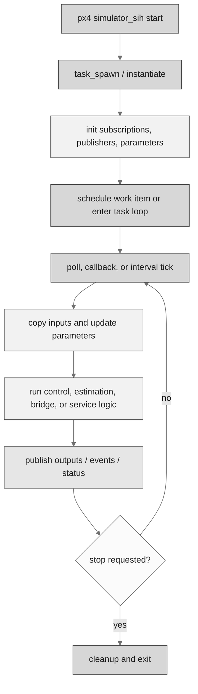
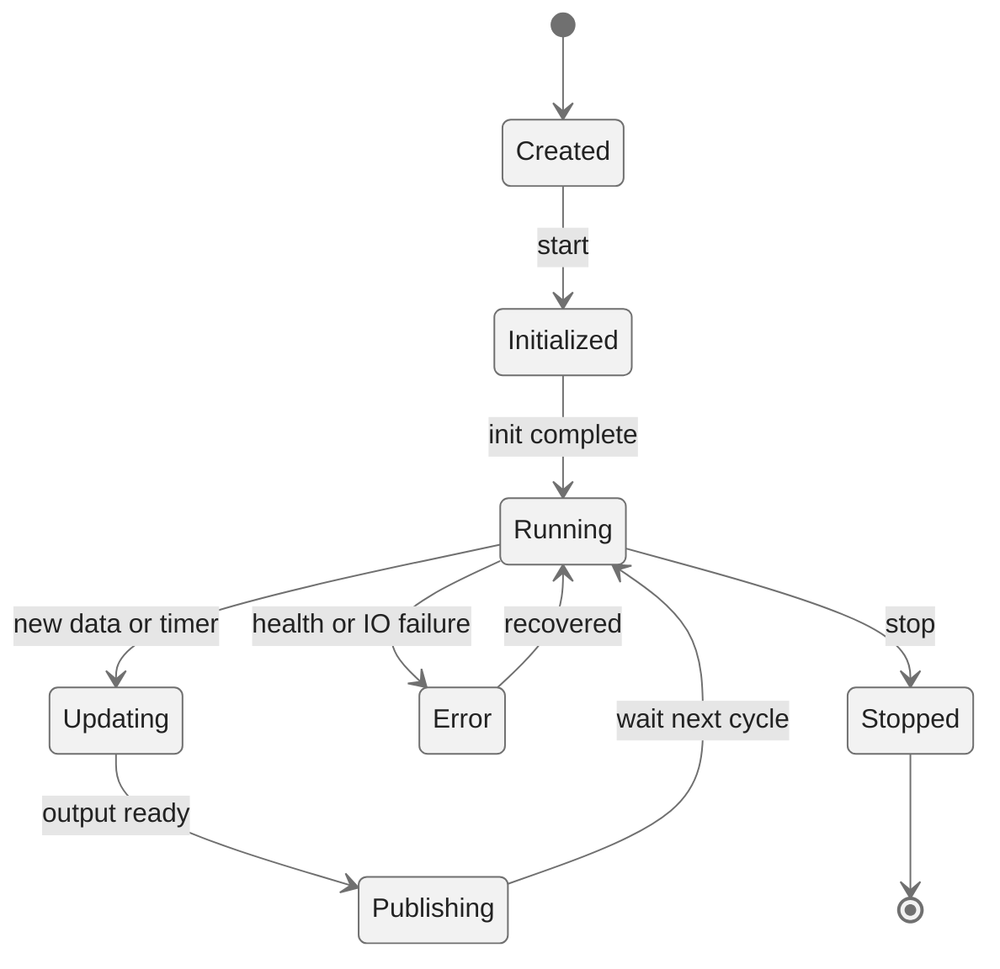
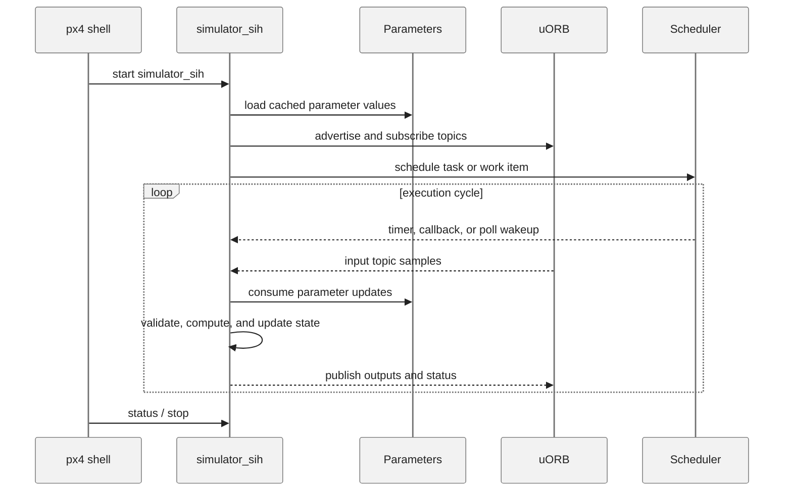
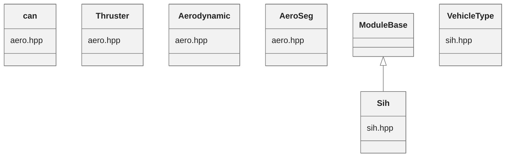

# PX4 Module Architecture: `simulation/simulator_sih`

- Source: `src/modules/simulation/simulator_sih`
- Build target: `modules__simulation__simulator_sih`
- Runtime main: `simulator_sih`
- Build kind: `px4 module`
- Mermaid palette: `ash` grey tone

This module provides a simulator for quadrotors and fixed-wings running fully inside the hardware autopilot. This simulator subscribes to "actuator_outputs" which are the actuator pwm signals given by the control allocation module. This simulator publishes the sensors signals corrupted with realistic noise in order to incorporate the state estimator in the loop. The simulator implements the equations of motion using matrix algebra. Quaternion representation is used for the attitude. Forward Euler is used for integr

## Description of Module

Runs the simple simulator-in-hardware vehicle dynamics model.

### Primary Responsibilities

- Generate simulator-facing or simulated sensor/actuator data for non-flight-hardware runs.
- Consume runtime inputs from uORB topics such as `actuator_outputs_sim`, `parameter_update`.
- Publish outputs or status topics such as `airspeed`, `esc_status`, `ranging_beacon`, `vehicle_angular_velocity_groundtruth`, `vehicle_attitude_groundtruth`, `vehicle_global_position_groundtruth`, `vehicle_local_position_groundtruth`.
- Use module configuration from `sih_params.yaml`.
- Implement the main behavior in classes such as `can`, `Thruster`, `Aerodynamic`, `AeroSeg`, `Sih`, `VehicleType`.

### Runtime Behavior

- Creates a dedicated PX4 task/thread with `px4_task_spawn_cmd()`.
- Uses a `run()` loop style module body for repeated execution.

## Background Theory

Simulation-in-hardware integrates simplified vehicle rigid-body dynamics on the flight controller.

```text
Translational dynamics:
p_dot = v
v_dot = (R_body_to_ned * force_body) / m + g_ned

Rotational dynamics:
q_dot = 0.5 * q * [0, omega_body]
I * omega_dot = torque_body - omega_body x (I * omega_body)
```

These equations are the study-level form of the algorithm. The implementation applies PX4-specific saturation, validity checks, parameter updates, and frame conventions around these core relationships.

### Main Interfaces

| Area | Details |
| --- | --- |
| Primary inputs | `actuator_outputs_sim`, `parameter_update` |
| Primary outputs | `airspeed`, `esc_status`, `ranging_beacon`, `vehicle_angular_velocity_groundtruth`, `vehicle_attitude_groundtruth`, `vehicle_global_position_groundtruth`, `vehicle_local_position_groundtruth` |
| Referenced topics | `actuator_outputs`, `actuator_outputs_sim`, `airspeed`, `distance_sensor`, `esc_status`, `parameter_update`, `ranging_beacon`, `vehicle_angular_velocity`, `vehicle_angular_velocity_groundtruth`, `vehicle_attitude`, ... 5 more |
| Parameters/config | sih_params.yaml |
| Key classes | `can`, `Thruster`, `Aerodynamic`, `AeroSeg`, `Sih`, `VehicleType` |

### Files

| File | Why it matters |
| --- | --- |
| sih.cpp | Entry point, start command, or module lifecycle code |
| CMakeLists.txt | Build, parameter, or module configuration |
| sih_params.yaml | Build, parameter, or module configuration |
| aero.hpp | Defines `can` class |

## Architecture Overview

This page is generated from the module source tree and shows the stable architecture surfaces: build entry point, scheduling shape, uORB data interfaces, parameter/configuration surfaces, and C++ types found in the module.



## Build and Entry Points

| Field | Value |
| --- | --- |
| Module path | src/modules/simulation/simulator_sih |
| Build kind | px4 module |
| Build target | modules__simulation__simulator_sih |
| Runtime main | simulator_sih |
| Stack main | Not specified |
| Module config | sih_params.yaml |
| Detected sources | 1 |
| Detected headers | 2 |
| Detected configs | 2 |

### CMake Dependencies

- `mathlib`
- `drivers_accelerometer`
- `drivers_gyroscope`
- `drivers_rangefinder`
- `geo`

### Nested Module Targets

- No nested module targets detected.

## Data Flow



### uORB Topics

| Topic | Detected direction |
| --- | --- |
| actuator_outputs | referenced |
| actuator_outputs_sim | subscribed |
| airspeed | published |
| distance_sensor | referenced |
| esc_status | published |
| parameter_update | subscribed |
| ranging_beacon | published |
| vehicle_angular_velocity | referenced |
| vehicle_angular_velocity_groundtruth | published |
| vehicle_attitude | referenced |
| vehicle_attitude_groundtruth | published |
| vehicle_global_position | referenced |
| vehicle_global_position_groundtruth | published |
| vehicle_local_position | referenced |
| vehicle_local_position_groundtruth | published |

## Execution Flow



The common PX4 module lifecycle is command entry, object construction or task spawn, parameter loading, topic setup, scheduled execution, publication, status reporting, and stop/cleanup. Modules that use `ModuleBase`, `ScheduledWorkItem`, polling loops, or bridge callbacks still fit this lifecycle with different scheduling triggers.

## State Machine



### Detected State-Like Symbols

- No state-like symbols detected.

## Sequence Diagram



## Class Diagram



### Detected Classes

| Class | Base | File |
| --- | --- | --- |
| can |  | aero.hpp |
| Thruster |  | aero.hpp |
| Aerodynamic |  | aero.hpp |
| AeroSeg |  | aero.hpp |
| Sih | ModuleBase | sih.hpp |
| VehicleType |  | sih.hpp |

### Detected Enums

- `VehicleType`

## Parameters and Configuration

- No parameters detected.

## Source Map

| File | Kind |
| --- | --- |
| CMakeLists.txt | build |
| aero.hpp | header |
| sih.cpp | source |
| sih.hpp | header |
| sih_params.yaml | config |

## Review Notes

- The diagrams are generated from static source inventory and should be used as a study map, not as a formal proof of every runtime branch.
- Topic direction is inferred from nearby source context such as `Subscription`, `Publication`, `orb_subscribe`, and `publish` usage.
- When a module has no explicit state enum, the state diagram shows the standard PX4 module lifecycle.
