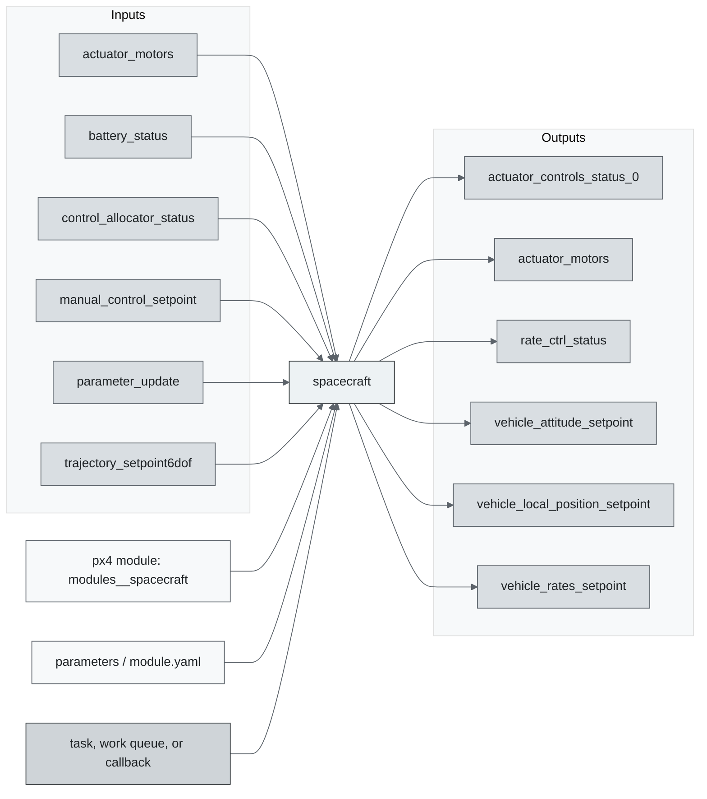
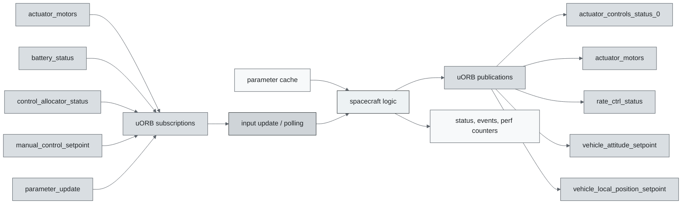
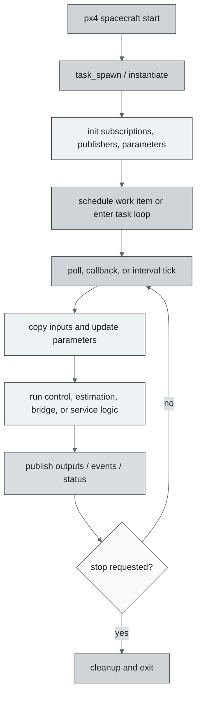
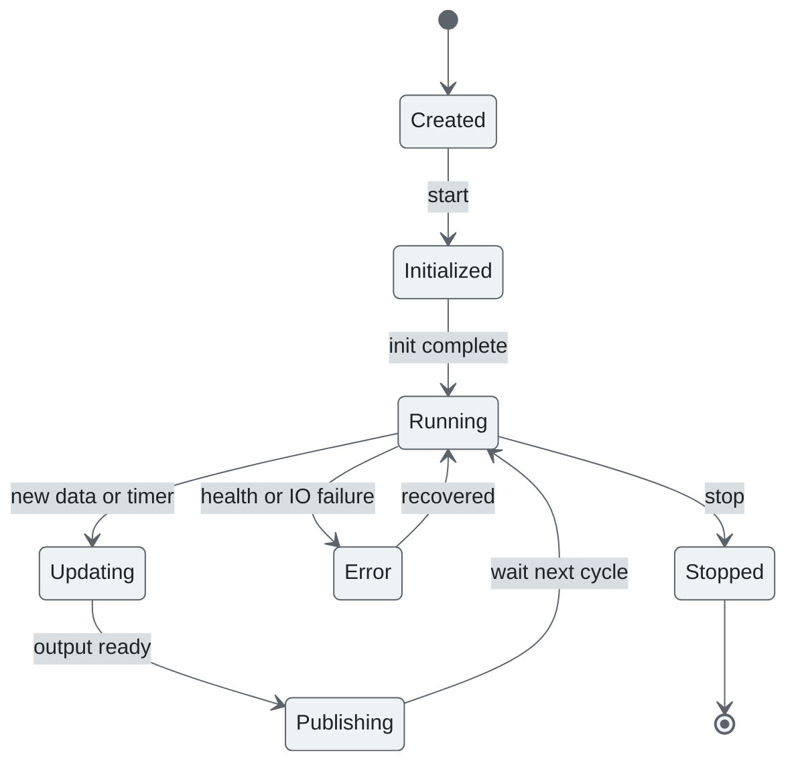
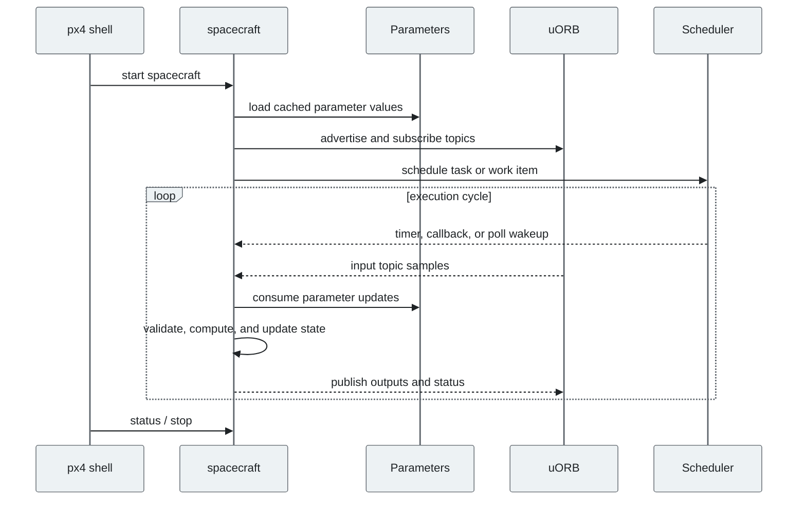

# PX4 Module Architecture: `spacecraft`

- Source: `src/modules/spacecraft`
- Build target: `modules__spacecraft`
- Runtime main: `spacecraft`
- Build kind: `px4 module`
- Mermaid palette: `graphite` grey tone

Source-derived architecture notes for this PX4 module directory.

## Architecture Overview

This page is generated from the module source tree and shows the stable architecture surfaces: build entry point, scheduling shape, uORB data interfaces, parameter/configuration surfaces, and C++ types found in the module.

## Build and Entry Points

| Field | Value |
| --- | --- |
| Module path | src/modules/spacecraft |
| Build kind | px4 module |
| Build target | modules__spacecraft |
| Runtime main | spacecraft |
| Stack main | 3000 |
| Module config | spacecraft_attitude_params.yaml |
| Detected sources | 11 |
| Detected headers | 8 |
| Detected configs | 9 |

### CMake Dependencies

- `mathlib`
- `px4_work_queue`
- `SpacecraftRateControl`
- `SpacecraftAttitudeControl`
- `SpacecraftPositionControl`

### Nested Module Targets

- No nested module targets detected.

## Data Flow

### uORB Topics

| Topic | Detected direction |
| --- | --- |
| actuator_controls_status | referenced |
| actuator_controls_status_0 | published |
| actuator_motors | subscribed, published |
| actuator_servos | referenced |
| actuator_servos_trim | referenced |
| autotune_attitude_control_status | referenced |
| battery_status | subscribed |
| control_allocator_status | subscribed |
| failure_detector_status | referenced |
| manual_control_setpoint | subscribed |
| parameter_update | subscribed |
| rate_ctrl_status | published |
| trajectory_setpoint6dof | subscribed |
| vehicle_angular_velocity | subscribed |
| vehicle_attitude | subscribed |
| vehicle_attitude_setpoint | subscribed, published |
| vehicle_control_mode | subscribed |
| vehicle_land_detected | subscribed |
| vehicle_local_position | subscribed |
| vehicle_local_position_setpoint | published |
| vehicle_rates_setpoint | subscribed, published |
| vehicle_status | subscribed |
| vehicle_thrust_setpoint | published |
| vehicle_torque_setpoint | published |

## Execution Flow

The common PX4 module lifecycle is command entry, object construction or task spawn, parameter loading, topic setup, scheduled execution, publication, status reporting, and stop/cleanup. Modules that use `ModuleBase`, `ScheduledWorkItem`, polling loops, or bridge callbacks still fit this lifecycle with different scheduling triggers.

## State Machine

### Detected State-Like Symbols

- No state-like symbols detected.

## Sequence Diagram

## Class Diagram

```mermaid
%%{init: {"theme":"base","themeVariables":{"primaryColor":"#edf2f4","secondaryColor":"#d9dee2","tertiaryColor":"#f7f9fa","primaryBorderColor":"#5c636a","primaryTextColor":"#1f2326","lineColor":"#5c636a","fontFamily":"Inter, Arial, sans-serif"}}}%%
classDiagram
  class ScAttitudeControl
  ScAttitudeControl : SpacecraftAttitudeControl/AttitudeControl/AttitudeC...
  class ScAttitudeControlConvergenceTest
  ScAttitudeControlConvergenceTest : SpacecraftAttitudeControl/AttitudeControl/ScAttitud...
  class SpacecraftAttitudeControl
  SpacecraftAttitudeControl : SpacecraftAttitudeControl/SpacecraftAttitudeControl...
  class ModuleParams
  ModuleParams <|-- SpacecraftAttitudeControl
  class SpacecraftHandler
  SpacecraftHandler : SpacecraftHandler.hpp
  class ModuleBase
  ModuleBase <|-- SpacecraftHandler
  class contains
  contains : SpacecraftPositionControl/PositionControl/PositionC...
  class ScPositionControl
  ScPositionControl : SpacecraftPositionControl/PositionControl/PositionC...
  class PositionControlBasicTest
  PositionControlBasicTest : SpacecraftPositionControl/PositionControl/ScPositio...
  class PositionControlBasicDirectionTest
  PositionControlBasicDirectionTest : SpacecraftPositionControl/PositionControl/ScPositio...
  class PositionControlBasicTest
  PositionControlBasicTest <|-- PositionControlBasicDirectionTest
  class SpacecraftPositionControl
  SpacecraftPositionControl : SpacecraftPositionControl/SpacecraftPositionControl...
  class ModuleParams
  ModuleParams <|-- SpacecraftPositionControl
  class SpacecraftRateControl
  SpacecraftRateControl : SpacecraftRateControl/SpacecraftRateControl.hpp
  class ModuleParams
  ModuleParams <|-- SpacecraftRateControl
```

### Detected Classes

| Class | Base | File |
| --- | --- | --- |
| ScAttitudeControl |  | SpacecraftAttitudeControl/AttitudeControl/AttitudeControl.hpp |
| ScAttitudeControlConvergenceTest |  | SpacecraftAttitudeControl/AttitudeControl/ScAttitudeControlTest.cpp |
| SpacecraftAttitudeControl | ModuleParams | SpacecraftAttitudeControl/SpacecraftAttitudeControl.hpp |
| SpacecraftHandler | ModuleBase | SpacecraftHandler.hpp |
| contains |  | SpacecraftPositionControl/PositionControl/PositionControl.hpp |
| ScPositionControl |  | SpacecraftPositionControl/PositionControl/PositionControl.hpp |
| PositionControlBasicTest |  | SpacecraftPositionControl/PositionControl/ScPositionControlTest.cpp |
| PositionControlBasicDirectionTest | PositionControlBasicTest | SpacecraftPositionControl/PositionControl/ScPositionControlTest.cpp |
| SpacecraftPositionControl | ModuleParams | SpacecraftPositionControl/SpacecraftPositionControl.hpp |
| SpacecraftRateControl | ModuleParams | SpacecraftRateControl/SpacecraftRateControl.hpp |

### Detected Enums

- No enums detected.

## Parameters and Configuration

- No parameters detected.

## Source Map

| File | Kind |
| --- | --- |
| CMakeLists.txt | build |
| SpacecraftAttitudeControl/AttitudeControl/AttitudeControl.cpp | source |
| SpacecraftAttitudeControl/AttitudeControl/AttitudeControl.hpp | header |
| SpacecraftAttitudeControl/AttitudeControl/AttitudeControlMath.hpp | header |
| SpacecraftAttitudeControl/AttitudeControl/CMakeLists.txt | build |
| SpacecraftAttitudeControl/AttitudeControl/ScAttitudeControlMathTest.cpp | source |
| SpacecraftAttitudeControl/AttitudeControl/ScAttitudeControlTest.cpp | source |
| SpacecraftAttitudeControl/CMakeLists.txt | build |
| SpacecraftAttitudeControl/SpacecraftAttitudeControl.cpp | source |
| SpacecraftAttitudeControl/SpacecraftAttitudeControl.hpp | header |
| SpacecraftHandler.cpp | source |
| SpacecraftHandler.hpp | header |
| SpacecraftPositionControl/CMakeLists.txt | build |
| SpacecraftPositionControl/PositionControl/CMakeLists.txt | build |
| SpacecraftPositionControl/PositionControl/ControlMath.cpp | source |
| SpacecraftPositionControl/PositionControl/ControlMath.hpp | header |
| SpacecraftPositionControl/PositionControl/PositionControl.cpp | source |
| SpacecraftPositionControl/PositionControl/PositionControl.hpp | header |
| SpacecraftPositionControl/PositionControl/ScControlMathTest.cpp | source |
| SpacecraftPositionControl/PositionControl/ScPositionControlTest.cpp | source |
| SpacecraftPositionControl/SpacecraftPositionControl.cpp | source |
| SpacecraftPositionControl/SpacecraftPositionControl.hpp | header |
| SpacecraftRateControl/CMakeLists.txt | build |
| SpacecraftRateControl/SpacecraftRateControl.cpp | source |
| SpacecraftRateControl/SpacecraftRateControl.hpp | header |
| spacecraft_attitude_params.yaml | config |
| spacecraft_position_params.yaml | config |
| spacecraft_rate_params.yaml | config |

## Review Notes

- The diagrams are generated from static source inventory and should be used as a study map, not as a formal proof of every runtime branch.
- Topic direction is inferred from nearby source context such as `Subscription`, `Publication`, `orb_subscribe`, and `publish` usage.
- When a module has no explicit state enum, the state diagram shows the standard PX4 module lifecycle.
