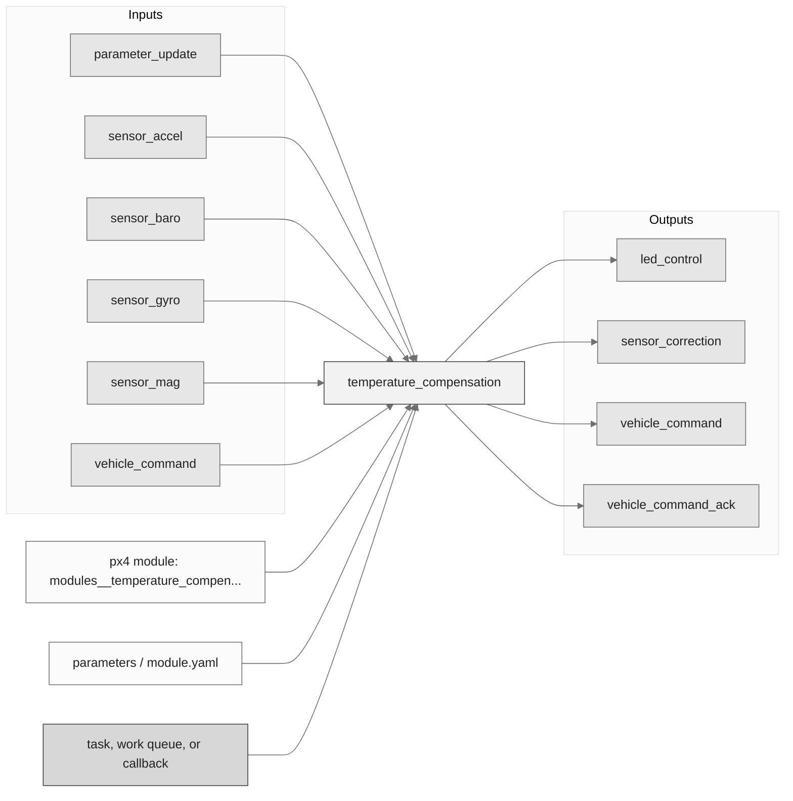
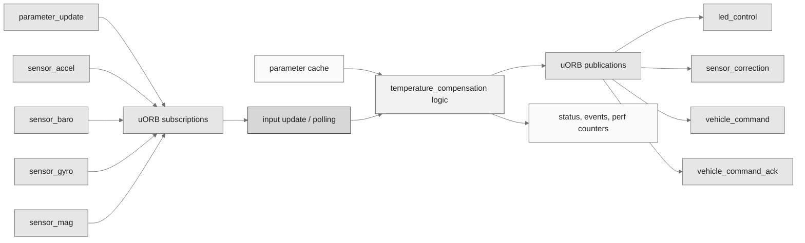
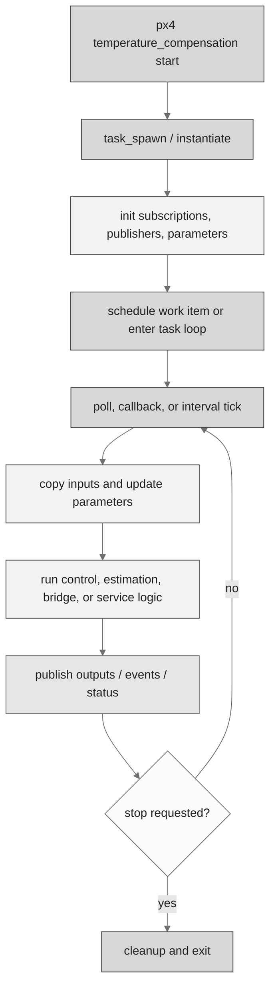
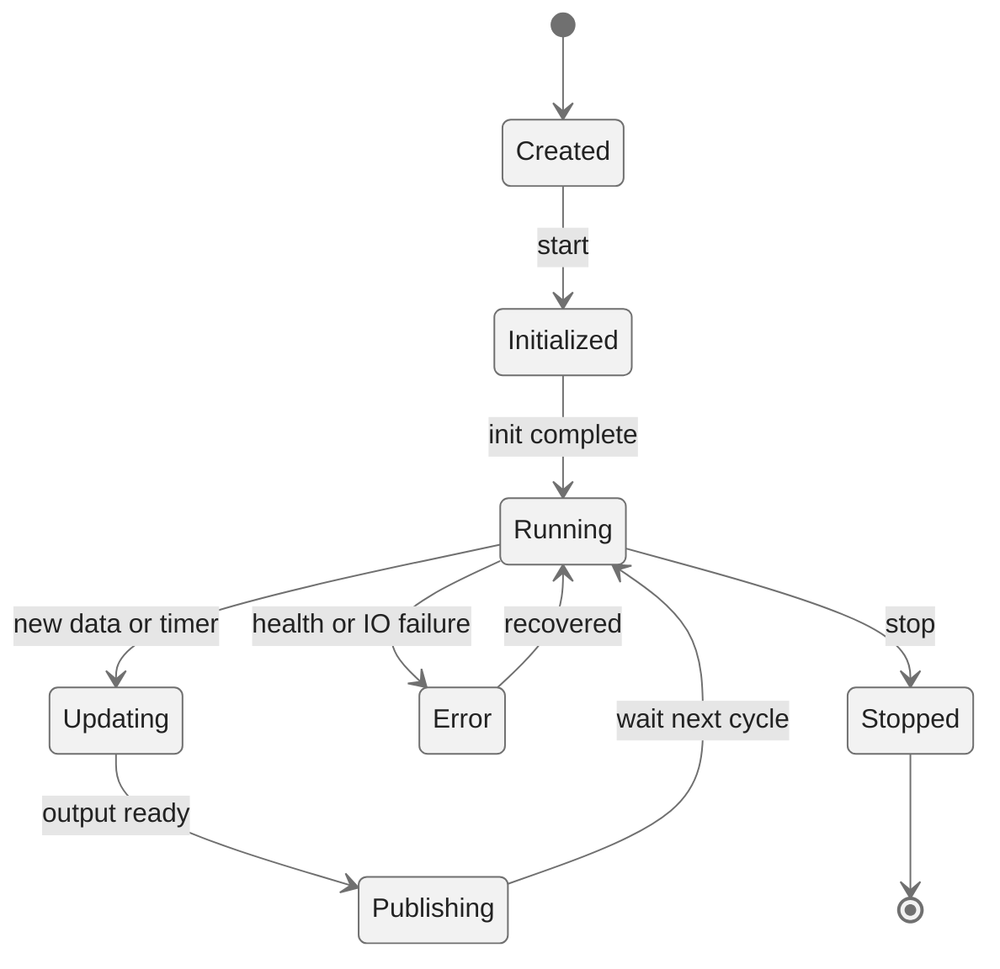
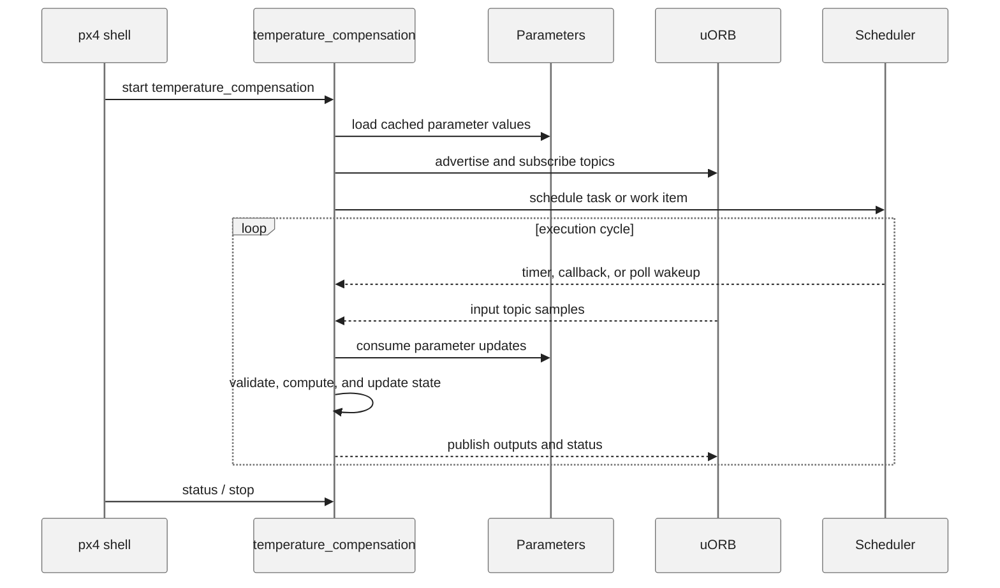

# PX4 Module Architecture: `temperature_compensation`

- Source: `src/modules/temperature_compensation`
- Build target: `modules__temperature_compensation`
- Runtime main: `temperature_compensation`
- Build kind: `px4 module`
- Mermaid palette: `ash` grey tone

The temperature compensation module allows all of the gyro(s), accel(s), and baro(s) in the system to be temperature compensated. The module monitors the data coming from the sensors and updates the associated sensor_correction topic whenever a change in temperature is detected. The module can also be configured to perform the coeffecient calculation routine at next boot, which allows the thermal calibration coeffecients to be calculated while the vehicle undergoes a temperature cycle.

## Description of Module

Applies temperature compensation data to sensor correction paths.

### Primary Responsibilities

- Consume runtime inputs from uORB topics such as `parameter_update`, `sensor_accel`, `sensor_baro`, `sensor_gyro`, `sensor_mag`, `vehicle_command`.
- Publish outputs or status topics such as `led_control`, `sensor_correction`, `vehicle_command`, `vehicle_command_ack`.
- Use module configuration from `temp_comp_params_accel.yaml`.
- Implement the main behavior in classes such as `TemperatureCompensation`, `TemperatureCompensationModule`, `TemperatureCalibrationAccel`, `TemperatureCalibrationBaro`, `TemperatureCalibrationBase`, `TemperatureCalibrationCommon`, ... 4 more.

### Runtime Behavior

- Runs work-queue callbacks on queue configurations such as `lp_default`.
- Also contains explicit task-spawn code or helper task creation in this module tree.
- Uses explicit work-item scheduling through immediate, delayed, or interval scheduling calls.
- Waits on file descriptors or uORB subscriptions with `px4_poll()`.

## Background Theory

Temperature compensation removes temperature-dependent sensor bias using fitted polynomial coefficients.

```text
bias(T) = c0 + c1*T + c2*T^2 + c3*T^3
scale(T) = s0 + s1*T + s2*T^2
x_corrected = (x_raw - bias(T)) * scale(T)
T may be filtered before evaluating the polynomial.
```

These equations are the study-level form of the algorithm. The implementation applies PX4-specific saturation, validity checks, parameter updates, and frame conventions around these core relationships.

### Main Interfaces

| Area | Details |
| --- | --- |
| Primary inputs | `parameter_update`, `sensor_accel`, `sensor_baro`, `sensor_gyro`, `sensor_mag`, `vehicle_command` |
| Primary outputs | `led_control`, `sensor_correction`, `vehicle_command`, `vehicle_command_ack` |
| Referenced topics | `led_control`, `parameter_update`, `sensor_accel`, `sensor_baro`, `sensor_correction`, `sensor_gyro`, `sensor_mag`, `vehicle_command`, `vehicle_command_ack` |
| Parameters/config | temp_comp_params_accel.yaml |
| Key classes | `TemperatureCompensation`, `TemperatureCompensationModule`, `TemperatureCalibrationAccel`, `TemperatureCalibrationBaro`, `TemperatureCalibrationBase`, `TemperatureCalibrationCommon`, `TemperatureCalibrationGyro`, `TemperatureCalibrationMag`, `polyfitter`, `TemperatureCalibration` |

### Files

| File | Why it matters |
| --- | --- |
| TemperatureCompensationModule.cpp | Entry point, start command, or module lifecycle code |
| temperature_calibration/task.cpp | Entry point, start command, or module lifecycle code |
| CMakeLists.txt | Build, parameter, or module configuration |
| temp_comp_params_accel.yaml | Build, parameter, or module configuration |
| temp_comp_params_accel_0.yaml | Build, parameter, or module configuration |
| temp_comp_params_accel_1.yaml | Build, parameter, or module configuration |
| temp_comp_params_accel_2.yaml | Build, parameter, or module configuration |
| TemperatureCompensation.h | Defines `TemperatureCompensation` class |

## Architecture Overview

This page is generated from the module source tree and shows the stable architecture surfaces: build entry point, scheduling shape, uORB data interfaces, parameter/configuration surfaces, and C++ types found in the module.



## Build and Entry Points

| Field | Value |
| --- | --- |
| Module path | src/modules/temperature_compensation |
| Build kind | px4 module |
| Build target | modules__temperature_compensation |
| Runtime main | temperature_compensation |
| Stack main | Not specified |
| Module config | temp_comp_params_accel.yaml |
| Detected sources | 7 |
| Detected headers | 9 |
| Detected configs | 21 |

### CMake Dependencies

- `mathlib`

### Nested Module Targets

- No nested module targets detected.

## Data Flow



### uORB Topics

| Topic | Detected direction |
| --- | --- |
| led_control | published |
| parameter_update | subscribed |
| sensor_accel | subscribed |
| sensor_baro | subscribed |
| sensor_correction | published |
| sensor_gyro | subscribed |
| sensor_mag | subscribed |
| vehicle_command | subscribed, published |
| vehicle_command_ack | published |

## Execution Flow



The common PX4 module lifecycle is command entry, object construction or task spawn, parameter loading, topic setup, scheduled execution, publication, status reporting, and stop/cleanup. Modules that use `ModuleBase`, `ScheduledWorkItem`, polling loops, or bridge callbacks still fit this lifecycle with different scheduling triggers.

## State Machine



### Detected State-Like Symbols

- No state-like symbols detected.

## Sequence Diagram



## Class Diagram

```mermaid
%%{init: {"theme":"base","themeVariables":{"primaryColor":"#f2f2f2","secondaryColor":"#e6e6e6","tertiaryColor":"#fbfbfb","primaryBorderColor":"#707070","primaryTextColor":"#222222","lineColor":"#707070","fontFamily":"Inter, Arial, sans-serif"}}}%%
classDiagram
  class TemperatureCompensation
  TemperatureCompensation : TemperatureCompensation.h
  class TemperatureCompensationModule
  TemperatureCompensationModule : TemperatureCompensationModule.h
  class ModuleBase
  ModuleBase <|-- TemperatureCompensationModule
  class TemperatureCalibrationAccel
  TemperatureCalibrationAccel : temperature_calibration/accel.h
  class TemperatureCalibrationCommon
  TemperatureCalibrationCommon <|-- TemperatureCalibrationAccel
  class TemperatureCalibrationBaro
  TemperatureCalibrationBaro : temperature_calibration/baro.h
  class TemperatureCalibrationCommon
  TemperatureCalibrationCommon <|-- TemperatureCalibrationBaro
  class TemperatureCalibrationBase
  TemperatureCalibrationBase : temperature_calibration/common.h
  class TemperatureCalibrationCommon
  TemperatureCalibrationCommon : temperature_calibration/common.h
  class TemperatureCalibrationGyro
  TemperatureCalibrationGyro : temperature_calibration/gyro.h
  class TemperatureCalibrationCommon
  TemperatureCalibrationCommon <|-- TemperatureCalibrationGyro
  class TemperatureCalibrationMag
  TemperatureCalibrationMag : temperature_calibration/mag.h
  class TemperatureCalibrationCommon
  TemperatureCalibrationCommon <|-- TemperatureCalibrationMag
  class polyfitter
  polyfitter : temperature_calibration/polyfit.hpp
  class TemperatureCalibration
  TemperatureCalibration : temperature_calibration/task.cpp
```



### Detected Classes

| Class | Base | File |
| --- | --- | --- |
| TemperatureCompensation |  | TemperatureCompensation.h |
| TemperatureCompensationModule | ModuleBase | TemperatureCompensationModule.h |
| TemperatureCalibrationAccel | TemperatureCalibrationCommon | temperature_calibration/accel.h |
| TemperatureCalibrationBaro | TemperatureCalibrationCommon | temperature_calibration/baro.h |
| TemperatureCalibrationBase |  | temperature_calibration/common.h |
| TemperatureCalibrationCommon |  | temperature_calibration/common.h |
| TemperatureCalibrationGyro | TemperatureCalibrationCommon | temperature_calibration/gyro.h |
| TemperatureCalibrationMag | TemperatureCalibrationCommon | temperature_calibration/mag.h |
| polyfitter |  | temperature_calibration/polyfit.hpp |
| TemperatureCalibration |  | temperature_calibration/task.cpp |

### Detected Enums

- No enums detected.

## Parameters and Configuration

- No parameters detected.

## Source Map

| File | Kind |
| --- | --- |
| CMakeLists.txt | build |
| TemperatureCompensation.cpp | source |
| TemperatureCompensation.h | header |
| TemperatureCompensationModule.cpp | source |
| TemperatureCompensationModule.h | header |
| temp_comp_params_accel.yaml | config |
| temp_comp_params_accel_0.yaml | config |
| temp_comp_params_accel_1.yaml | config |
| temp_comp_params_accel_2.yaml | config |
| temp_comp_params_accel_3.yaml | config |
| temp_comp_params_baro.yaml | config |
| temp_comp_params_baro_0.yaml | config |
| temp_comp_params_baro_1.yaml | config |
| temp_comp_params_baro_2.yaml | config |
| temp_comp_params_baro_3.yaml | config |
| temp_comp_params_gyro.yaml | config |
| temp_comp_params_gyro_0.yaml | config |
| temp_comp_params_gyro_1.yaml | config |
| temp_comp_params_gyro_2.yaml | config |
| temp_comp_params_gyro_3.yaml | config |
| temp_comp_params_mag.yaml | config |
| temp_comp_params_mag_0.yaml | config |
| temp_comp_params_mag_1.yaml | config |
| temp_comp_params_mag_2.yaml | config |
| temp_comp_params_mag_3.yaml | config |
| temperature_calibration/accel.cpp | source |
| temperature_calibration/accel.h | header |
| temperature_calibration/baro.cpp | source |
| temperature_calibration/baro.h | header |
| temperature_calibration/common.h | header |
| temperature_calibration/gyro.cpp | source |
| temperature_calibration/gyro.h | header |
| temperature_calibration/mag.cpp | source |
| temperature_calibration/mag.h | header |
| temperature_calibration/polyfit.hpp | header |
| temperature_calibration/task.cpp | source |
| temperature_calibration/temperature_calibration.h | header |

## Review Notes

- The diagrams are generated from static source inventory and should be used as a study map, not as a formal proof of every runtime branch.
- Topic direction is inferred from nearby source context such as `Subscription`, `Publication`, `orb_subscribe`, and `publish` usage.
- When a module has no explicit state enum, the state diagram shows the standard PX4 module lifecycle.
