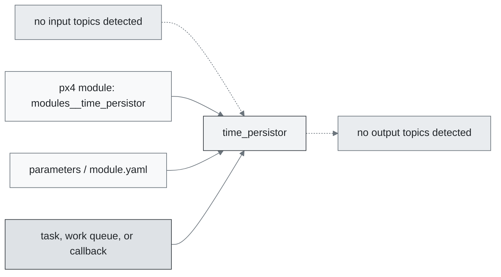
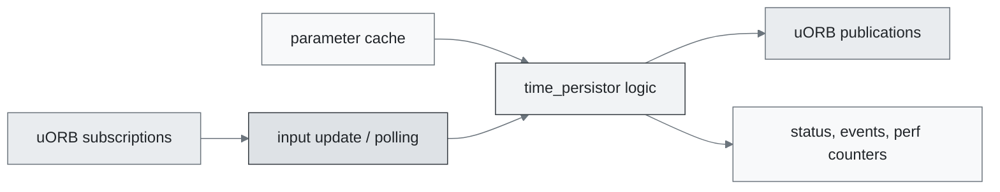
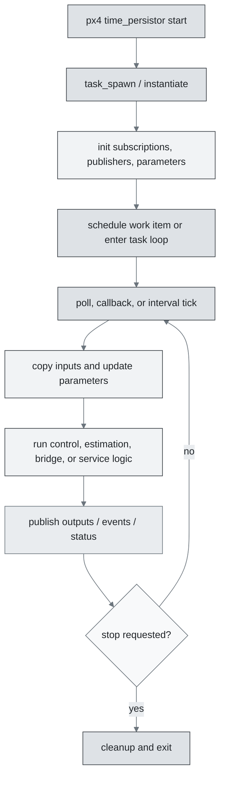
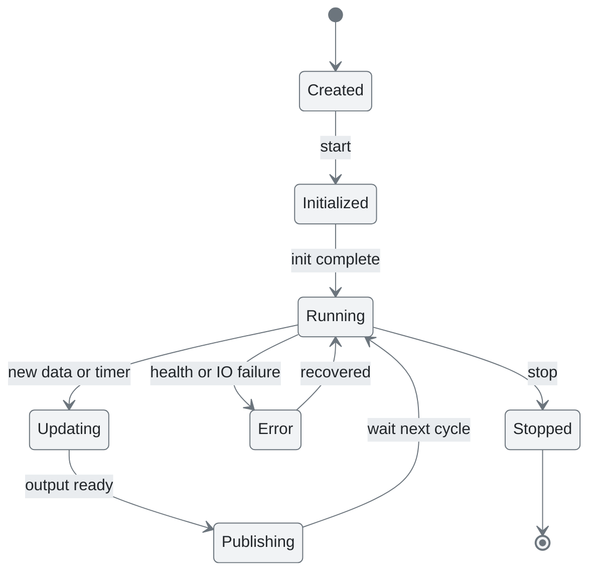
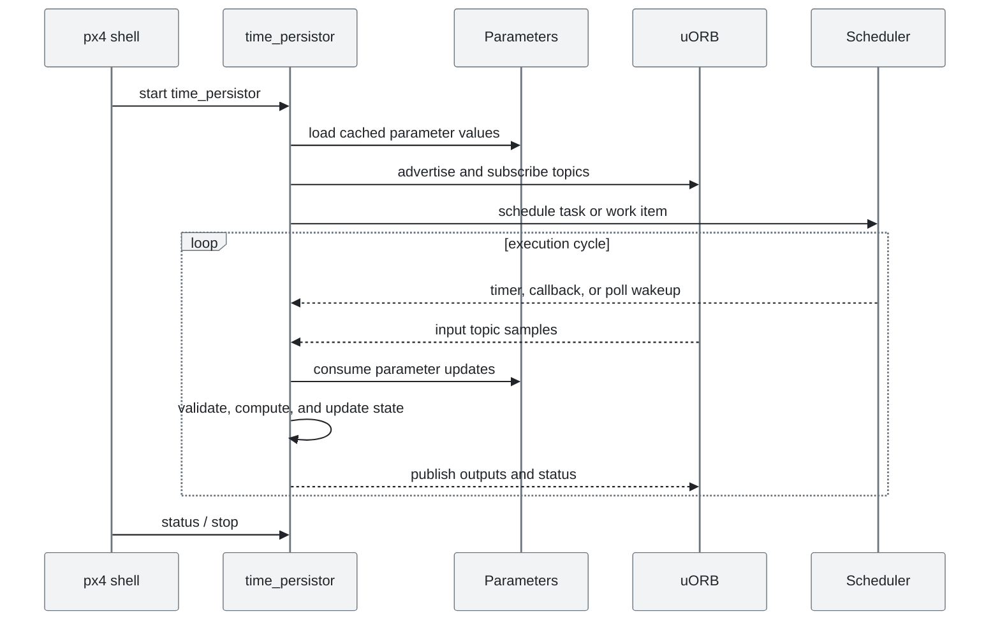
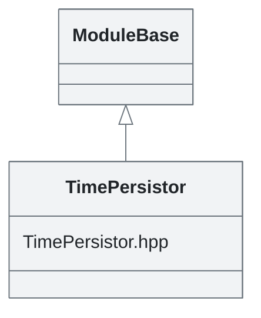

# PX4 Module Architecture: `time_persistor`

- Source: `src/modules/time_persistor`
- Build target: `modules__time_persistor`
- Runtime main: `time_persistor`
- Build kind: `px4 module`
- Mermaid palette: `mist` grey tone

Writes the RTC time cyclically to a file and reloads this value on startup. This allows monotonic time on systems that only have a software RTC (that is not battery powered). Explicitly setting the time backwards (e.g. via system_time) is still possible.

## Description of Module

Persists time information across boots when supported by the platform.

### Primary Responsibilities

- Operate without directly detected uORB topic dependencies in this source inventory.
- Do not publish directly detected uORB outputs from this module directory.
- Implement the main behavior in classes such as `TimePersistor`.

### Runtime Behavior

- Runs work-queue callbacks on queue configurations such as `lp_default`.
- Uses explicit work-item scheduling through immediate, delayed, or interval scheduling calls.

## Background Theory

No dedicated mathematical model was identified in the generated source scan. This module is best understood through its PX4 state handling, uORB message flow, scheduling, and configuration surfaces described below.

### Main Interfaces

| Area | Details |
| --- | --- |
| Primary inputs | none detected |
| Primary outputs | none detected |
| Referenced topics | none detected |
| Parameters/config | none detected |
| Key classes | `TimePersistor` |

### Files

| File | Why it matters |
| --- | --- |
| TimePersistor.cpp | Entry point, start command, or module lifecycle code |
| CMakeLists.txt | Build, parameter, or module configuration |
| TimePersistor.hpp | Defines `TimePersistor` class |

## Architecture Overview

This page is generated from the module source tree and shows the stable architecture surfaces: build entry point, scheduling shape, uORB data interfaces, parameter/configuration surfaces, and C++ types found in the module.

## Build and Entry Points

| Field | Value |
| --- | --- |
| Module path | src/modules/time_persistor |
| Build kind | px4 module |
| Build target | modules__time_persistor |
| Runtime main | time_persistor |
| Stack main | Not specified |
| Module config | Not specified |
| Detected sources | 1 |
| Detected headers | 1 |
| Detected configs | 1 |

### CMake Dependencies

- `px4_work_queue`

### Nested Module Targets

- No nested module targets detected.

## Data Flow

### uORB Topics

| Topic | Detected direction |
| --- | --- |
| None detected. | None detected. |

## Execution Flow

The common PX4 module lifecycle is command entry, object construction or task spawn, parameter loading, topic setup, scheduled execution, publication, status reporting, and stop/cleanup. Modules that use `ModuleBase`, `ScheduledWorkItem`, polling loops, or bridge callbacks still fit this lifecycle with different scheduling triggers.

## State Machine

### Detected State-Like Symbols

- No state-like symbols detected.

## Sequence Diagram

## Class Diagram

### Detected Classes

| Class | Base | File |
| --- | --- | --- |
| TimePersistor | ModuleBase | TimePersistor.hpp |

### Detected Enums

- No enums detected.

## Parameters and Configuration

- No parameters detected.

## Source Map

| File | Kind |
| --- | --- |
| CMakeLists.txt | build |
| TimePersistor.cpp | source |
| TimePersistor.hpp | header |

## Review Notes

- The diagrams are generated from static source inventory and should be used as a study map, not as a formal proof of every runtime branch.
- Topic direction is inferred from nearby source context such as `Subscription`, `Publication`, `orb_subscribe`, and `publish` usage.
- When a module has no explicit state enum, the state diagram shows the standard PX4 module lifecycle.
